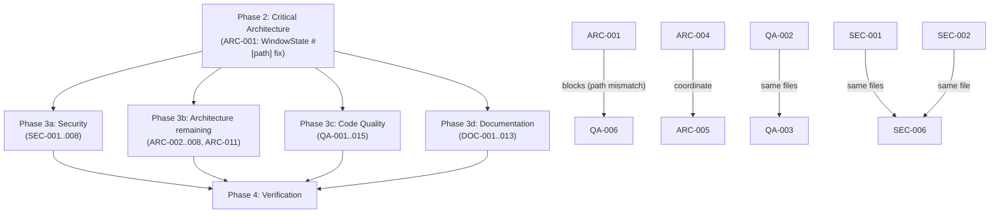

# Project Audit Report

> **Project**: par-term
> **Date**: 2026-03-25
> **Stack**: Rust 2024 Edition, wgpu (Metal/Vulkan/DX12), egui, Tokio, 14-crate workspace
> **Audited by**: Claude Code Audit System

---

## Executive Summary

par-term is a mature, well-architected GPU-accelerated terminal emulator with excellent
documentation and strong security fundamentals. The most critical finding is a cluster of
acknowledged-but-unresolved architectural debts: the `WindowState` God Object entangled
with a `#[path]` module redirect, three instances of duplicated render hot-path logic
(cursor contrast, glyph fallback), and a 630-line God method in the trigger system. Three
`CONTRIBUTING.md` factual errors (stale module paths, wrong sub-crate count, incorrect
build profile specs) will immediately block new contributors. Security is generally strong
— the highest risks are an incomplete ACP sensitive-path blocklist that leaves `~/.aws/`
and `~/.docker/` unprotected from connected AI agents, and a permission-system bug that
auto-approves `NotebookEdit` as if it were read-only. Estimated remediation effort: ~2
sprints for critical/high items, ~1 sprint for medium.

### Issue Count by Severity

| Severity | Architecture | Security | Code Quality | Documentation | Total |
|----------|:-----------:|:--------:|:------------:|:-------------:|:-----:|
| 🔴 Critical | 1 | 0 | 3 | 3 | **7** |
| 🟠 High     | 5 | 3 | 5 | 5 | **18** |
| 🟡 Medium   | 6 | 5 | 7 | 5 | **23** |
| 🔵 Low      | 6 | 6 | 5 | 5 | **22** |
| **Total**   | **18** | **14** | **20** | **18** | **70** |

---

## 🔴 Critical Issues (Resolve Immediately)

### [ARC-001] WindowState God Object Blocked by `#[path]` Module Redirect
- **Area**: Architecture
- **Location**: `src/app/window_state/mod.rs:86,157–267`
- **Description**: `WindowState` has 30+ fields and 84 separate `impl WindowState` blocks spread across ~30 files. Decomposition is blocked by `#[path = "../render_pipeline/mod.rs"]` which makes `render_pipeline` a logical child of `window_state` while living as a physical sibling on disk, causing all `super::` references in `render_pipeline/` to silently resolve to `window_state` instead of `app`.
- **Impact**: Any field extraction risks breaking module-relative path resolution invisibly. Slows every contributor's comprehension and makes the documented ARC-002 refactoring significantly harder than expected.
- **Remedy**: Resolve the `#[path]` mismatch first (Option A: physically move `src/app/render_pipeline/` into `src/app/window_state/render_pipeline/`; Option B: declare it in `src/app/mod.rs` and remove `#[path]`). Then systematically extract `TmuxSubsystem`, `SelectionSubsystem`, and `WindowInfrastructure` as documented in the file.

### [QA-001] `check_trigger_actions` God Function — 630-Line Method
- **Area**: Code Quality
- **Location**: `src/app/triggers/mod.rs:83`
- **Description**: The single public method spans the entire file (~630 lines). It handles action dispatch, security approval, split-pane setup, delayed sends, prettify relay processing, and mark-line deduplication — all inline in one match-within-a-loop mega-function.
- **Impact**: Untestable in isolation. Any change to one action path risks breaking others.
- **Remedy**: Extract `dispatch_trigger_action`, `handle_split_pane_action`, `handle_run_command_action`, and `handle_mark_line_action` as private helpers. The outer method becomes a loop calling `dispatch_trigger_action`.

### [QA-002] Cursor-Contrast Logic Duplicated Verbatim Across Two Render Paths
- **Area**: Code Quality
- **Location**: `par-term-render/src/cell_renderer/text_instance_builder.rs:36–110` and `par-term-render/src/cell_renderer/pane_render/mod.rs:569–614`
- **Description**: The `cursor_is_block_on_this_row` guard, the full `render_fg_color` calculation (including `CURSOR_BRIGHTNESS_THRESHOLD` auto-contrast branch), and surrounding `CursorStyle` import are copy-pasted identically into two separate files with subtle divergences (acknowledged as QA-002/QA-008 in TODOs).
- **Impact**: Any fix to contrast logic must be applied in two places; a bug fixed in one path may silently remain in the other.
- **Remedy**: Extract `compute_cursor_text_color(cursor, col, text_alpha) -> [f32; 4]` as a free function in `instance_buffers.rs` or a new `cursor_color.rs`. Both callers replace the block with a single call.

### [QA-003] Glyph Font-Fallback Loop Duplicated in Two Render Paths
- **Area**: Code Quality
- **Location**: `par-term-render/src/cell_renderer/text_instance_builder.rs:383–443` and `par-term-render/src/cell_renderer/pane_render/mod.rs:814–877`
- **Description**: The `excluded_fonts`/`get_or_rasterize_glyph` double-loop including the colored-emoji last-resort fallback (with `1u64 << 63` cache key trick) is copied nearly identically into both paths. Tracked as QA-006 in code but unresolved.
- **Impact**: The bit-packing invariant `((font_idx as u64) << 32) | (glyph_id as u64)` is buried in duplicated code. Any change to fallback strategy requires synchronized edits in two files.
- **Remedy**: Extract `fn resolve_glyph_with_fallback(&mut self, base_char, bold, italic, force_mono) -> Option<GlyphInfo>` onto `CellRenderer`. Remove both duplicate implementations.

### [DOC-001] CONTRIBUTING.md Stale Source Paths in Architecture Section
- **Area**: Documentation
- **Location**: `CONTRIBUTING.md:245–246,270`
- **Description**: References `src/terminal/`, `src/renderer/`, and `src/cell_renderer/` which were extracted into `par-term-terminal/src/` and `par-term-render/src/` during crate extraction. These paths do not exist.
- **Impact**: New contributors will immediately fail to navigate the codebase using the contributing guide.
- **Remedy**: Replace all three stale paths with their current workspace crate locations.

### [DOC-002] CONTRIBUTING.md Wrong Sub-Crate Count and Missing `par-term-prettifier`
- **Area**: Documentation
- **Location**: `CONTRIBUTING.md:362` and Layer 2 table
- **Description**: States "13 sub-crates" but there are 14. `par-term-prettifier` is absent from the Dependency Layers table, meaning version bump procedures will silently omit it.
- **Impact**: A contributor following the version bump procedure could publish crates with stale internal dependency versions.
- **Remedy**: Change to "14 sub-crates"; add `par-term-prettifier` to the Layer 2 row.

### [DOC-003] CONTRIBUTING.md References `src/app/input_events.rs` (File) — It's a Directory
- **Area**: Documentation
- **Location**: `CONTRIBUTING.md:351`
- **Description**: The "Adding a Keyboard Shortcut" workflow references `src/app/input_events.rs` as a single file. The actual location is `src/app/input_events/` (a directory with 6+ files).
- **Impact**: A contributor following this guide gets an immediate "file not found" error.
- **Remedy**: Replace with `src/app/input_events/keybinding_actions.rs` and note the directory structure.

---

## 🟠 High Priority Issues

### [ARC-002] `Config` Struct Has 268 Public Fields Without Sub-Struct Grouping
- **Area**: Architecture
- **Location**: `par-term-config/src/config/config_struct/mod.rs:137`
- **Description**: `Config` is a 1,677-line struct with 268 public fields. The file's own docstring catalogs 30+ candidate sub-structs not yet extracted; only 11 fields use `#[serde(flatten)]` delegation. Every crate accesses any config field directly, with no encapsulation boundary.
- **Impact**: Adding one config field requires touching the default impl, settings UI, search keywords, and test fixtures (Shotgun Surgery). Every future merge conflict risk on this file doubles.
- **Remedy**: Continue the documented extraction strategy (`#[serde(flatten)]`). Prioritize `WindowConfig`, `FontConfig`, `MouseConfig`, `KeyboardConfig`, `TabConfig`. Each is backward-compatible via flatten.

### [ARC-003] `render_pipeline` Directory/Module Hierarchy Mismatch (`#[path]` Redirect)
- **Area**: Architecture
- **Location**: `src/app/window_state/mod.rs:86`
- **Description**: `render_pipeline` is declared via `#[path = "../render_pipeline/mod.rs"]` making it a logical child of `window_state` while physically a sibling. All `super::` references in render_pipeline files silently navigate to `window_state`, not `app`. (See ARC-001 — this is the root blocker.)
- **Remedy**: Resolve before any WindowState field extraction. Move directory to match module hierarchy, or declare render_pipeline as a first-class `src/app` module.

### [ARC-004] Glyph Rasterization Logic Duplicated Across Multiple Render Files
- **Area**: Architecture
- **Location**: `par-term-render/src/cell_renderer/pane_render/mod.rs`, `text_instance_builder.rs`, `renderer/render_passes.rs`
- **Description**: `get_or_rasterize_glyph` logic is duplicated at least 3× including the font-fallback loop. Acknowledged as QA-006 in the cell renderer module comment. (Overlaps with QA-003.)
- **Remedy**: Extract into a single `CellRenderer` method as described above.

### [ARC-005] Multiple Render Crate Files Exceed 800-Line Project Threshold
- **Area**: Architecture
- **Location**: `par-term-render/src/cell_renderer/pane_render/mod.rs` (1,062 lines), `par-term-render/src/cell_renderer/mod.rs` (762), `par-term-render/src/renderer/mod.rs` (777), `par-term-render/src/renderer/rendering.rs` (730)
- **Description**: Project target is under 500 lines; refactor above 800. ARC-009 is filed with extraction candidates (`rle_merge.rs`, `powerline.rs`, `frame_timing.rs`, `resize_ops.rs`) but not yet done.
- **Remedy**: Extract the named sub-modules. These are isolated helpers with no external API impact.

### [ARC-006] `par-term-settings-ui/src/actions_tab.rs` Is 1,457 Lines — Settings UI Monolith
- **Area**: Architecture
- **Location**: `par-term-settings-ui/src/actions_tab.rs`
- **Description**: Single-file UI monolith for the actions settings tab. `show_action_edit_form` alone is ~750 lines with 5–6 nesting levels. A `clone_action` helper (~160 lines) re-implements derived `Clone` semantics, silently drifting from the actual `Clone` impl.
- **Remedy**: Delete `clone_action` (use `action.clone()` + new UUID). Extract per-action-type form functions (~60 lines each), following the existing `automation_tab/triggers_section/mod.rs` pattern.

### [SEC-001] ACP Sensitive Path Blocklist Incomplete — `~/.aws` and `~/.docker` Unprotected
- **Area**: Security
- **Location**: `par-term-acp/src/fs_ops.rs:39–52`
- **Description**: `is_sensitive_path()` blocks `~/.ssh/`, `~/.gnupg/`, and `/etc/`, but leaves `~/.aws/credentials`, `~/.config/gh/hosts.yml`, `~/.netrc`, `~/.docker/config.json` unprotected. A connected AI agent with `auto_approve` can read cloud credentials without any configured control blocking it.
- **Impact**: High — credential exfiltration vector for any connected AI agent.
- **Remedy**: Extend `is_sensitive_path` to cover `~/.aws/`, `~/.docker/`, `~/.netrc`, `~/.config/gh/`, and `~/.config/gcloud/`.

### [SEC-002] `NotebookEdit` Misclassified as Read-Only in ACP Permission System
- **Area**: Security
- **Location**: `par-term-acp/src/permissions.rs:266–267`
- **Description**: The permission auto-approval logic lists `notebookedit`/`notebook_edit` as read-only tools unconditionally auto-approved. `NotebookEdit` is a write operation in Claude Code — it modifies Jupyter notebook cells.
- **Impact**: An agent can modify any notebook without user awareness or write-path guards.
- **Remedy**: Remove `notebookedit`/`notebook_edit` from the `is_read_only` match arm; route through `is_safe_write_path` or escalate unconditionally to the UI.

### [SEC-003] ACP Agent `run_command` Loaded via User-Controlled TOML Without Integrity Check
- **Area**: Security
- **Location**: `par-term-acp/src/agents.rs:261–271`
- **Description**: Agent TOML files in `~/.config/par-term/agents/` can override embedded agents by identity string match alone — no signature or checksum verification. Any process that can write to the config directory can inject an arbitrary `run_command`.
- **Impact**: Supply-chain attack vector; a malicious package dropping a TOML file could execute arbitrary code when the AI panel opens.
- **Remedy**: Document in UI that user-config-dir agents are trusted user code. Add optional hash pinning for deployments. At minimum, warn in UI when a user-defined agent overrides a built-in identity.

### [QA-004] `execute_sequence_sync` Blocks the Event Loop with `thread::sleep`
- **Area**: Code Quality
- **Location**: `src/app/input_events/snippet_actions.rs:341–342,475,564,723,768,876`
- **Description**: `execute_sequence_sync` and `execute_repeat` are called from the event-loop thread and contain `std::thread::sleep` for inter-step delays. This stalls the GPU and blocks all input processing, freezing the window. With `u32::MAX` repeat count and no bounds check, this is also a potential config-based DoS.
- **Remedy**: Dispatch to a background thread/Tokio task; communicate completion back via `mpsc` channel. The event loop reads pending completions on each frame.

### [QA-005] Layer Violation: `par-term-config` Re-exports `par-term-emu-core-rust` Types
- **Area**: Code Quality
- **Location**: `par-term-config/src/lib.rs:99–112`
- **Description**: `par-term-config` (Layer 1 foundation crate) re-exports `AmbiguousWidth`, `NormalizationForm`, `UnicodeVersion` from `par-term-emu-core-rust`, creating an undeclared dependency on the emulation core from the config layer. The TODO comment correctly diagnoses this.
- **Remedy**: Define native mirror types in `par-term-config/src/types.rs`, add `From` impls in `par-term-terminal`, remove the re-export.

### [QA-006] `WindowState` Has 81 `impl` Blocks — Unrestricted Cross-State Access
- **Area**: Code Quality
- **Location**: `src/app/window_state/mod.rs:157` and all `impl WindowState` declarations
- **Description**: `WindowState` has 37 direct `pub(crate)` fields and 81 separate `impl` blocks across `src/app/`. Every operation (rendering, input, tabs, triggers, SSH, tmux, agents, badges, copy mode, file transfers) is an inherent method with unrestricted access to all sibling fields.
- **Remedy**: Introduce trait boundaries or sub-system coordinators. Methods operating on `AgentState`, `TriggerState`, etc. should accept those types as parameters rather than `&mut self`.

### [QA-007] `show_action_edit_form` Is a ~750-Line Function With 6-Level Nesting
- **Area**: Code Quality
- **Location**: `par-term-settings-ui/src/actions_tab.rs:511`
- **Description**: Single enormous match arm per action type, each constructing the full action struct inline. `clone_action` (~160 lines) re-implements `Clone` semantics that `CustomActionConfig` already derives.
- **Remedy**: Delete `clone_action`. Extract `show_shell_command_form`, `show_new_tab_form`, etc. as private functions (~60 lines each).

### [QA-008] `log::info!`/`log::warn!` Mixed With `crate::debug_info!` Macros (~1,000 Callsites)
- **Area**: Code Quality
- **Location**: Multiple files — `src/pane/types/pane.rs`, `src/app/triggers/mod.rs`, `src/pane/manager/creation.rs`, etc.
- **Description**: CLAUDE.md explicitly states not to use `log::` macros as they won't appear in the debug log. Despite this, ~1,000 `log::` callsites exist throughout production code including critical error paths in the trigger system, pane lifecycle, and SSH code.
- **Remedy**: Migrate all operationally important `log::error!` and `log::warn!` callsites to `crate::debug_error!`. Or formally document that both systems coexist and update CLAUDE.md.

### [DOC-004] README Config Snippet Shows Wrong Default for `tab_bar_mode`
- **Area**: Documentation
- **Location**: `README.md:1169`
- **Description**: Config example shows `tab_bar_mode: "when_multiple"` but the actual default (since v0.20.0) is `Always`. Misleads users who copy the snippet as a starting config.
- **Remedy**: Correct the value to `always` or clearly label the snippet as a customization example.

### [DOC-005] CONTRIBUTING.md Build Time Says "~30–40s" — Actual is ~1–2s
- **Area**: Documentation
- **Location**: `CONTRIBUTING.md:92,100`
- **Description**: Documents ~30–40s incremental rebuild time. `Cargo.toml` and CLAUDE.md both confirm ~1–2s rebuild with `dev-release` profile.
- **Remedy**: Update to "~1–2s (incremental)" to prevent contributors from avoiding the recommended `make build` workflow.

### [DOC-006] CONTRIBUTING.md States `dev-release` Uses "opt-level 3, thin LTO" — Wrong
- **Area**: Documentation
- **Location**: `CONTRIBUTING.md:96–100`
- **Description**: States "opt-level 3, thin LTO, 16 codegen-units". Actual `Cargo.toml` values are `opt-level = 2`, `lto = false`, `codegen-units = 16`.
- **Remedy**: Update to "opt-level 2, no LTO, 16 codegen-units".

### [DOC-007] `docs/README.md` Has No Link to `CONTRIBUTING.md`
- **Area**: Documentation
- **Location**: `docs/README.md`
- **Description**: The documentation navigation hub covers Getting Started, User Guides, Architecture, and Development, but has no entry or link pointing to `CONTRIBUTING.md`. A contributor who starts in `docs/` has no path to the contributing guide.
- **Remedy**: Add a row in the "Architecture & Development" table linking to `../CONTRIBUTING.md`.

### [DOC-008] Low Docstring Coverage in `src/app/window_state/` Sub-Modules
- **Area**: Documentation
- **Location**: `src/app/window_state/cursor_anim_state.rs`, `debug_state.rs`, `overlay_state.rs`, `update_state.rs`, `watcher_state.rs`, `agent_state.rs`
- **Description**: Each of these sub-modules shows 0–1 doc comment lines total despite being in the most-modified area per CLAUDE.md. The main `src/tab/mod.rs` has 17 doc comment lines for a complex central module.
- **Remedy**: Add `///` doc comments to public functions and significant state types in all `window_state` sub-modules.

---

## 🟡 Medium Priority Issues

### Architecture

#### [ARC-007] `Config` Passed by Clone — Silent Propagation Tax on Every New Field
- **Location**: `src/app/window_manager/mod.rs:84`, `src/app/mod.rs:76`, ~13 `config.clone()` calls
- **Description**: `Config` (268 fields) is cloned into each `WindowState`. When a setting changes, `config_propagation.rs` must manually list and forward every relevant field. Fields added to `Config` will silently fail to propagate until added to this module.
- **Remedy**: Consider `Arc<RwLock<Config>>` for shared read-only global config with per-window override diffs, or a `#[propagate]` proc-macro attribute to generate propagation code at compile time.

#### [ARC-008] Dual Logging System Creates Operational Complexity
- **Location**: `src/debug.rs`, `src/main.rs:10–21`
- **Description**: Custom `DEBUG_LEVEL`-based macros coexist with the standard `log` crate. Both write to the same file. CLAUDE.md explicitly warns which system to use, but third-party crates can only use `log`.
- **Remedy**: Migrate to `tracing` crate with `tracing-subscriber`. Both `log` and `tracing` can be unified via `tracing-log` bridge.

#### [ARC-009] Unsafe `std::mem::zeroed()` for Winit `KeyEvent` Construction
- **Location**: `src/app/input_events/snippet_actions.rs:1115–1124`
- **Description**: `std::mem::zeroed()` constructs a `winit::KeyEvent`. If winit adds a field with a non-zero required bit pattern (e.g., `NonNull`, `NonZeroU32`), this becomes undefined behavior.
- **Remedy**: File a winit issue requesting a public test constructor. Pin the winit version with a comment. Wrap in a clearly named `create_test_key_event()` helper.

#### [ARC-010] Platform-Specific `#[cfg]` Attributes Scattered in Business Logic
- **Location**: 50+ locations in `src/app/input_events/`, `src/app/mouse_events/`, `src/app/window_manager/`
- **Description**: 50 `#[cfg(target_os)]` attributes remain inline in business logic despite a `crate::platform` module intended to centralize them.
- **Remedy**: Expand `crate::platform` to cover modifier key behaviors, window title update calls, and menu logic. Route all remaining `#[cfg]` blocks through platform-specific trait implementations.

#### [ARC-011] `par-term-config` Has `wgpu` as an Optional Feature Dependency
- **Location**: `par-term-config/Cargo.toml:41–42,55`
- **Description**: The configuration crate (pure data/serialization) has an optional dep on `wgpu` (100MB+ GPU framework) to provide type conversions. Any future headless consumer must either pull in GPU deps or avoid the conversion methods.
- **Remedy**: Move wgpu type conversions into `par-term-render` which already depends on both. Config crate should contain only serialization types.

#### [ARC-012] `WindowManager::new()` Eagerly Initializes Subsystems With I/O Side Effects
- **Location**: `src/app/window_manager/mod.rs:82–138`
- **Description**: Constructor immediately initializes arrangement manager, fetches dynamic profiles, and starts DNS discovery — all before any window is created. Failures are silently swallowed with `log::warn!` and replaced by empty defaults.
- **Remedy**: Separate initialization from construction. Use `OnceLock` or async tasks for lazy init. Surface errors via the first window's toast system.

### Security

#### [SEC-004] Session Logger Password Redaction Is Heuristic and Incomplete
- **Location**: `src/session_logger/core.rs:104–142`
- **Description**: Session logging captures raw PTY I/O. Redaction patterns don't cover `GITHUB_TOKEN=`, `token=` in URLs, `Bearer ` prefixes, or `heroku auth:token` output. The module documents this as best-effort.
- **Remedy**: Add patterns for `GITHUB_TOKEN=`, `HEROKU_API_KEY=`, and `Bearer [A-Za-z0-9]`. Add a startup warning to the log file header listing known redaction limitations.

#### [SEC-005] Trigger `RunCommand` Denylist Bypassable by Design — `prompt_before_run: false` Lacks Prominent UI Warning
- **Location**: `par-term-config/src/automation.rs:443–471`
- **Description**: The denylist contains thorough documentation of its bypass vectors. When `prompt_before_run: false`, terminal output directly triggers configured commands. A crafted sequence from a malicious SSH server could exploit this.
- **Remedy**: Make `prompt_before_run: false` require explicit opt-in with a strongly-worded warning in the settings UI, not just in config documentation.

#### [SEC-006] ACP `is_safe_write_path` Residual TOCTOU — Documented but Not Mitigated at OS Level
- **Location**: `par-term-acp/src/permissions.rs:58–75`
- **Description**: Application-level mutex reduces concurrent-check races but cannot close the OS-level TOCTOU window between `canonicalize()` and the agent's actual write. Correctly documented in comments.
- **Remedy**: As defense-in-depth, consider OS-level sandbox (macOS App Sandbox, Linux Landlock) that limits writable paths at kernel level, making the permission check a secondary control.

#### [SEC-007] `resolve_shell_path()` Uses Unvalidated `$SHELL` — Missing `KNOWN_SHELLS` Check
- **Location**: `par-term-acp/src/agents.rs:131–147`
- **Description**: `resolve_shell_path()` reads `$SHELL` with no validation and passes it directly to `Command::new`. The `connect()` function in `agent.rs` correctly validates against `KNOWN_SHELLS` but `resolve_shell_path()` does not.
- **Remedy**: Apply `KNOWN_SHELLS` validation in `resolve_shell_path()`. Extract validation into a shared helper function to prevent future divergence.

#### [SEC-008] `info.log` (7.7 MB) Present at Repository Root
- **Location**: `/Users/probello/Repos/par-term/info.log`
- **Description**: A 7.7 MB log file at the repo root. `.gitignore` correctly excludes `*.log` so it's not tracked by git, but contains config paths, live run state, and a full username. Risk is accidental inclusion in archives or distributions.
- **Remedy**: Add `make clean` target that removes `*.log` files from the project root.

### Code Quality

#### [QA-009] `RowCacheEntry` Is an Empty Struct Used as a Boolean Phantom
- **Location**: `par-term-render/src/cell_renderer/types.rs:50`, `instance_buffers.rs:116`
- **Description**: `pub(crate) struct RowCacheEntry {}` contains no data. Stored as `Vec<Option<RowCacheEntry>>` where `None`/"some" represent a boolean cache state. This is a `Vec<bool>` with ceremony.
- **Remedy**: Replace with `Vec<bool>` or `bit_vec::BitVec`. If intended to carry data in the future, add a `// TODO: will hold X` comment.

#### [QA-010] `Vec<char>` Allocation Per Grapheme Per Cell Per Frame in Render Hot Path
- **Location**: `par-term-render/src/cell_renderer/pane_render/mod.rs:588`, `text_instance_builder.rs:112`
- **Description**: `let chars: Vec<char> = cell.grapheme.chars().collect()` allocates inside the per-cell inner loop — up to 10,000 allocations per frame for a 200×50 terminal.
- **Remedy**: Use `cell.grapheme.chars().next()` for `chars[0]`. Replace `chars.len() == 1` with `cell.grapheme.chars().nth(1).is_none()`. Never collect into a Vec.

#### [QA-011] `std::thread::sleep` in Background Polling Threads Wastes OS Threads
- **Location**: `src/ssh/mdns.rs:283`, `src/status_bar/system_monitor.rs:81`, `src/status_bar/git_poller.rs:73`, `par-term-config/src/watcher.rs:276–282`
- **Description**: Several background threads use `std::thread::sleep` for polling intervals, blocking their OS thread stack unnecessarily.
- **Remedy**: Migrate to `tokio::time::sleep` within async tasks on the existing runtime.

#### [QA-012] `CustomActionConfig` Duplicates 6 Common Fields Across 8 Enum Variants
- **Location**: `par-term-config/src/snippets.rs:222`
- **Description**: Every variant of `CustomActionConfig` duplicates `id`, `title`, `keybinding`, `prefix_char`, `keybinding_enabled`, `description`. Each accessor is an 8-arm match returning the same field from each variant. Adding a common field requires editing 8 struct variants and 8 accessor arms.
- **Remedy**: Extract `ActionBase { id, title, keybinding, prefix_char, keybinding_enabled, description }` and embed as `base: ActionBase` in each variant.

#### [QA-013] Orphaned `test_cr.rs` and `test_grid.rs` in Repository Root
- **Location**: `test_cr.rs`, `test_grid.rs`
- **Description**: Two standalone Rust files with `fn main()` bodies live at the repo root. They are not part of any crate, not referenced by `Cargo.toml`, and cannot be compiled in their current location.
- **Remedy**: Move to `examples/` with proper `[[example]]` entries, or delete if covered by `#[ignore]` PTY tests.

#### [QA-014] `panic!` in Embedded Agent Parse at Startup — No Compile-Time Validation
- **Location**: `par-term-acp/src/agents.rs:378`
- **Description**: `toml::from_str(...).unwrap_or_else(|e| panic!(...))` on embedded TOML baked in at compile time. An edit to an embedded `.toml` that introduces a parse error will surface as a runtime panic on first launch.
- **Remedy**: Add a `build.rs` validation step that parses all embedded agent TOML files at build time.

#### [QA-015] `panic!` Calls in Non-Test Production Code Used as Type Assertions
- **Location**: `par-term-acp/src/protocol/mod.rs:55–204`
- **Description**: Multiple `panic!("Expected AgentMessageChunk, got {:?}", other)` calls in production module code outside `#[cfg(test)]`. If the ACP protocol delivers an unexpected message variant in production, the process panics with no recovery.
- **Remedy**: Move to `#[cfg(test)]` module or refactor to return `Result<T, AcpError>`.

### Documentation

#### [DOC-009] README v0.17.0 States "28 tabs" — Current Architecture Has 14 Consolidated Tabs
- **Location**: `README.md:347`
- **Description**: The v0.17.0 section says "Complete settings UI (28 tabs, ...)". The consolidation to 14 tabs happened in v0.18.x–v0.19.x and is not noted inline.
- **Remedy**: Add parenthetical "(later consolidated to 14 tabs in subsequent releases)".

#### [DOC-010] `docs/README.md` Missing `GETTING_STARTED.md` in First Table Position
- **Location**: `docs/README.md`
- **Description**: The README opens "Start with the Getting Started guide if you are new" but that guide doesn't appear as the first table entry, making it hard to find.
- **Remedy**: Add `GETTING_STARTED.md` as the first row in the top table, or create a "Start Here" section.

#### [DOC-011] No CI/Build Status Badge in README
- **Location**: `README.md` (badge row)
- **Description**: Five badges present (version, platform, arch, downloads, license) but no build status badge. Visitors cannot assess current build health from the project landing page.
- **Remedy**: Add a GitHub Actions CI badge once confirmed stable.

#### [DOC-012] No Migration Guide for Breaking Config Changes Across Versions
- **Location**: `docs/` (missing file)
- **Description**: Several releases (0.20.0, 0.25.0–0.27.0) introduced security-gated behaviors or renamed config fields. No consolidated upgrade path document exists. The style guide references a placeholder `MIGRATION_V2.md`.
- **Remedy**: Create `docs/MIGRATION.md` documenting key breaking behavior changes between major version groups.

#### [DOC-013] `docs/DOCUMENTATION_STYLE_GUIDE.md` Prescribes Subdirectory Structure Not Followed
- **Location**: `docs/DOCUMENTATION_STYLE_GUIDE.md` (File Organization section), `docs/`
- **Description**: Style guide specifies `architecture/`, `guides/`, `api/`, `diagrams/` subdirectories. Actual layout is flat (46 `.md` files). No note acknowledges the conscious deviation.
- **Remedy**: Update style guide's File Organization section to describe the actual flat layout, or add a project-specific deviation note.

---

## 🔵 Low Priority / Improvements

### Architecture

- **[ARC-L01] `Tab::new_stub()` Suggests `pane_manager` Should Not Be `Option<PaneManager>`**: The doc comment says it is "always `Some`" but the type is `Option`. Every call site uses `.as_ref().unwrap()`. Changing to a non-optional `PaneManager` eliminates 12+ unwrap calls.
- **[ARC-L02] Makefile `checkall` Target Does Not Include `cargo deny`**: `cargo deny` runs in CI but not locally via `make checkall`, meaning license/vulnerability issues are only caught on push.
- **[ARC-L03] `rust-toolchain.toml` Hard-Pins `1.91.0` While Workspace `rust-version` Is a Minimum**: If intended to allow newer toolchains, remove or update `rust-toolchain.toml`.
- **[ARC-L04] `rodio`, `mermaid-rs-renderer`, `resvg` Are Non-Workspace Dependencies**: Three specialized deps declared directly in root `Cargo.toml` without being workspace dependencies. Consider adding to `[workspace.dependencies]` for consistency.
- **[ARC-L05] `par-term-settings-ui` Not Marked `pub(crate)` Despite Being Internal**: All consumers are the root `par-term` crate. Consider `pub(crate)` or `doc(hidden)` to prevent accidental public API growth.
- **[ARC-L06] `Config` Is Passed by Clone — No Single Source of Truth Across Windows**: (See ARC-007 for full description; at low priority, consider `Arc<RwLock<Config>>` as a longer-term refactoring.)

### Security

- **[SEC-L01] `npx -y amp-acp` — Implicit Network Fetch Without Version Pinning**: The `amp-acp` embedded agent uses `npx -y` which downloads the latest package version on first use. Prefer versioned invocations like `npx -y amp-acp@1.2.3`.
- **[SEC-L02] `unsafe std::mem::zeroed()` for Non-Trivial `winit::KeyEvent`**: Fragile pattern — if winit adds non-zero-valid fields this becomes UB. (Also listed as ARC-009; promote to security at this priority.)
- **[SEC-L03] macOS SkyLight Private Framework APIs Without Stability Guarantee**: `unsafe` calls into undocumented `SkyLight.framework` APIs. Risk is correctness on future macOS versions. Maintain version checks; add CI coverage per macOS version.
- **[SEC-L04] Trigger Process Group Not Isolated — Inherits Parent Process Group**: Triggered processes could send signals to the parent process group. Call `.process_group(0)` on Unix to isolate. Add configurable maximum runtime.
- **[SEC-L05] Session Log Files Not Encrypted at Rest**: Logs with `0o600` permissions but cleartext content. Consider optional encryption mode using system keychain. Document limitation.
- **[SEC-L06] `cargo-deny` Not Confirmed in `make ci` — Verify CI Gate**: Confirm `cargo deny check` runs as a CI gate. If absent from CI, add it.

### Code Quality

- **[QA-L01] `#[allow(dead_code)]` on `GlyphInfo::key` Without Justified Use**: Field is "stored for LRU node identity" but never read. Either use it in LRU eviction or remove it.
- **[QA-L02] `#[allow(clippy::derivable_impls)]` Without Explanation**: `trigger_state.rs:42` suppresses suggestion to use `#[derive(Default)]` with no comment.
- **[QA-L03] `to_lowercase().contains(...)` Allocates Two Strings Per Condition Evaluation**: `src/app/input_events/snippet_actions.rs:385`. Bind `output.to_lowercase()` and `pattern.to_lowercase()` to locals.
- **[QA-L04] Inline `std::collections::HashMap/HashSet` Fully Qualified in `triggers/mod.rs`**: Add `use std::collections::{HashMap, HashSet}` to module imports.
- **[QA-L05] Magic Constant `65536` for Output Capture Cap Should Be Named**: `src/app/input_events/snippet_actions.rs:646`. Define `const MAX_CAPTURE_BYTES: usize = 64 * 1024`.

### Documentation

- **[DOC-L01] `unfocused_fps` in README Config Snippet Not Found in `CONFIG_REFERENCE.md`**: Verify the actual config field name and add it to `CONFIG_REFERENCE.md` if missing.
- **[DOC-L02] `CHANGELOG.md` `[Unreleased]` Section Is Permanently Empty**: Adopt the Keep a Changelog convention for staging unreleased changes, or add a comment directing readers to the README "What's New" section.
- **[DOC-L03] Sub-Crate READMEs Not Inventoried in `docs/README.md` or `docs/API.md`**: Add a note in `docs/API.md` pointing readers to `par-term-*/README.md` files for crate-specific context.
- **[DOC-L04] `examples/README.md` Should Confirm Coverage of All Four Config Example Files**: Verify the examples README covers all four YAML files with purpose statements.
- **[DOC-L05] README "What's New" History Section Runs to ~1,100 Lines**: Consider archiving older version history to a separate `HISTORY.md` to keep the README scannable.

---

## Detailed Findings

### Architecture & Design

**Strengths**: Excellent workspace dependency centralization in `[workspace.dependencies]`. Layered crate architecture with no circular dependencies. Proactive architectural debt tracking with numbered `ARC-NNN`/`QA-NNN` identifiers inline. Well-designed mutex usage policy documented in `MUTEX_PATTERNS.md`. Robust CI pipeline covering Linux/macOS/Windows.

**Key Structural Risks**: The `WindowState` God Object (84 impl blocks, 30+ fields) compounded by the `#[path]` render_pipeline redirect is the project's most structurally fragile area. Any planned field extraction (documented as ARC-002) will silently break `super::` path resolution in render pipeline files until the directory layout is corrected first. The `Config` struct at 1,677 lines and 268 fields is a Shotgun Surgery risk for every future feature.

### Security Assessment

**Strengths**: Self-update module has exemplary security (HTTPS enforcement, SHA256 verification, domain allowlist, binary magic-byte validation). ACP file operations have layered path security with canonicalization. Session logger created with `0o600` permissions. Direct process spawning preferred over shell for ACP agents. VT sequence stripping prevents terminal injection via reflected script output. `deny.toml` blocks known-vulnerable crates.

**Highest Risk**: The incomplete ACP sensitive-path blocklist (SEC-001) is the most impactful finding — a connected AI agent with `auto_approve` can exfiltrate `~/.aws/credentials` without triggering any configured security control. The `NotebookEdit` permission misclassification (SEC-002) is a straightforward 2-line fix with immediate impact.

### Code Quality

**Strengths**: Excellent inline debt tracking with numbered issue cross-references. Sound scratch-buffer strategy for frame-level allocation minimization. Consistent `try_lock` discipline with clear event-loop reasoning. Comprehensive test infrastructure for config and automation. Strong `par-term-config` and `par-term-terminal` public API docstring coverage.

**Primary Concern**: The three critical render-path duplications (QA-002, QA-003: cursor contrast and glyph fallback) and the `check_trigger_actions` God method (QA-001) represent compounding maintenance risk in the most performance-sensitive code. All three are acknowledged in TODO comments but have accumulated across multiple releases. The `~1,000 log::` callsites mixed with the custom debug macro system create a confusing operational debugging experience.

### Documentation Review

**Strengths**: `docs/ARCHITECTURE.md` is genuinely excellent with accurate Mermaid diagrams and comprehensive coverage. `CONFIG_REFERENCE.md` documents 200+ fields with types, defaults, and migration notes. `ENVIRONMENT_VARIABLES.md` is exhaustive. Sub-crate public API docstring coverage is exemplary. `docs/README.md` is a well-organized navigation hub for 46 documentation files.

**Most Impactful Gaps**: Three factual errors in `CONTRIBUTING.md` (stale module paths, wrong crate count, wrong build profile specs) will immediately block new contributors. These are pure text edits requiring no code changes and should be fixed first.

---

## Remediation Roadmap

### Immediate Actions (Before Next Contributor Onboarding)
1. **DOC-001/002/003**: Fix three factual errors in `CONTRIBUTING.md` (stale paths, wrong crate count, wrong input_events path) — pure text edits, 30 minutes
2. **SEC-001**: Extend ACP `is_sensitive_path()` to cover `~/.aws/`, `~/.docker/`, `~/.netrc`, `~/.config/gh/` — ~10 lines of code
3. **SEC-002**: Remove `notebookedit`/`notebook_edit` from `is_read_only` match arm — 2-line fix
4. **SEC-007**: Apply `KNOWN_SHELLS` validation in `resolve_shell_path()` — 10-line fix

### Short-term (Next 1–2 Sprints)
1. **ARC-001/ARC-003**: Resolve `#[path]` render_pipeline mismatch to unblock WindowState decomposition
2. **QA-001**: Extract `check_trigger_actions` into focused helper functions
3. **QA-002/003**: Deduplicate cursor-contrast and glyph-fallback logic into shared functions
4. **QA-004**: Move event-loop-blocking `thread::sleep` in snippet actions to background tasks
5. **DOC-004/005/006**: Fix three README/CONTRIBUTING factual errors about config defaults and build specs
6. **SEC-003**: Add UI warning when user-defined agent overrides built-in identity

### Long-term (Backlog)
1. **ARC-002**: Continue `Config` struct sub-struct extraction (30+ remaining sections)
2. **ARC-005**: Extract oversized render files (`rle_merge.rs`, `powerline.rs`, `frame_timing.rs`)
3. **ARC-006/QA-007**: Split `actions_tab.rs` and delete redundant `clone_action`
4. **QA-005**: Fix `par-term-config` layer violation (remove emu-core type re-exports)
5. **QA-008**: Audit `log::` vs `crate::debug_*!` usage and establish a single logging policy
6. **QA-012**: Extract `ActionBase` struct from `CustomActionConfig` enum variants
7. **DOC-012**: Create `docs/MIGRATION.md` for breaking config changes across versions
8. **ARC-011**: Move wgpu type conversions out of `par-term-config` into `par-term-render`

---

## Positive Highlights

1. **Workspace Dependency Centralization**: The `[workspace.dependencies]` block is comprehensive and well-commented. All major shared dependencies (`tokio`, `wgpu`, `egui`, `serde`, `anyhow`) are pinned workspace-wide, eliminating version drift across 14 crates.

2. **Layered Crate Architecture**: Clean four-layer dependency graph (config → fonts/input/keybindings → render → root) with no circular dependencies. The documented layer order in `CLAUDE.md` is accurate and enforced by the build system.

3. **Proactive Architectural Debt Tracking**: Numbered `ARC-NNN`/`QA-NNN` identifiers in source comments with extraction plans and test strategies. This is rare in large Rust projects and significantly accelerates code review.

4. **Self-Update Security Model**: HTTPS enforcement, domain allowlist, SHA256 checksum verification that fails closed, and binary magic-byte validation. A model implementation for secure auto-update.

5. **Session Logger Security Defaults**: `redact_passwords: true` by default with 84+ patterns covering passwords, tokens, API keys, cloud credentials, and PGP keys. Log files created with `0o600` permissions.

6. **Architecture Documentation Excellence**: `docs/ARCHITECTURE.md` with accurate Mermaid diagrams, crate dependency graph, data flow diagrams, threading model, and GPU resource lifecycle. Supplementary deep-dive docs (`COMPOSITOR.md`, `CONCURRENCY.md`, `MUTEX_PATTERNS.md`, `STATE_LIFECYCLE.md`) are unusually detailed.

7. **Consistent Mutex Usage Policy**: `MUTEX_PATTERNS.md` clearly codifies three mutex types for three contexts. The `Tab` struct's locking table is exemplary documentation of a complex concurrent invariant. Uniform `try_lock` discipline in the event loop prevents deadlocks.

8. **Comprehensive Configuration Reference**: `CONFIG_REFERENCE.md` documents 200+ fields across 30+ groupings, each with type, default, and description. Inline migration notes for breaking changes (e.g., `minimum_contrast` scale change) prevent user confusion after upgrades.

---

## Audit Confidence

| Area | Files Reviewed | Confidence |
|------|---------------|-----------|
| Architecture | 45+ | High |
| Security | 30+ | High |
| Code Quality | 40+ | High |
| Documentation | 20+ | High |

---

## Remediation Plan

> This section is generated by the audit and consumed directly by `/fix-audit`.
> It pre-computes phase assignments and file conflicts so the fix orchestrator
> can proceed without re-analyzing the codebase.

### Phase Assignments

#### Phase 1 — Critical Security (Sequential, Blocking)

*No critical security issues identified. No Phase 1 work required.*

#### Phase 2 — Critical Architecture (Sequential, Blocking)

| ID | Title | File(s) | Severity | Blocks |
|----|-------|---------|----------|--------|
| ARC-001 | WindowState God Object + `#[path]` Redirect | `src/app/window_state/mod.rs`, `src/app/render_pipeline/` | Critical | QA-006 |

#### Phase 3 — Parallel Execution

**3a — Security (all — no Phase 1 sequencing needed)**

| ID | Title | File(s) | Severity |
|----|-------|---------|----------|
| SEC-001 | ACP sensitive path blocklist incomplete | `par-term-acp/src/fs_ops.rs` | High |
| SEC-002 | NotebookEdit misclassified as read-only | `par-term-acp/src/permissions.rs` | High |
| SEC-003 | Agent run_command via unvalidated TOML | `par-term-acp/src/agents.rs` | High |
| SEC-004 | Session logger incomplete credential patterns | `src/session_logger/core.rs` | Medium |
| SEC-005 | Trigger RunCommand denylist bypass UI | `par-term-config/src/automation.rs` | Medium |
| SEC-006 | ACP TOCTOU documentation + defense-in-depth | `par-term-acp/src/permissions.rs` | Medium |
| SEC-007 | resolve_shell_path() unvalidated $SHELL | `par-term-acp/src/agents.rs` | Medium |
| SEC-008 | info.log in repo root — add to make clean | `Makefile` | Medium |

**3b — Architecture (remaining)**

| ID | Title | File(s) | Severity |
|----|-------|---------|----------|
| ARC-002 | Config struct 268 fields — begin extraction | `par-term-config/src/config/config_struct/mod.rs` | High |
| ARC-004 | Glyph rasterization duplicated 3× | `par-term-render/src/cell_renderer/pane_render/mod.rs`, `text_instance_builder.rs` | High |
| ARC-005 | Render files exceed 800-line threshold | `par-term-render/src/cell_renderer/pane_render/mod.rs`, `renderer/mod.rs`, `renderer/rendering.rs` | High |
| ARC-006 | actions_tab.rs settings UI monolith | `par-term-settings-ui/src/actions_tab.rs` | High |
| ARC-007 | Config passed by clone — propagation tax | `src/app/window_manager/config_propagation.rs` | Medium |
| ARC-008 | Dual logging system | `src/debug.rs`, `src/main.rs` | Medium |
| ARC-011 | wgpu in par-term-config | `par-term-config/Cargo.toml` | Medium |

**3c — Code Quality (all)**

| ID | Title | File(s) | Severity |
|----|-------|---------|----------|
| QA-001 | check_trigger_actions God function | `src/app/triggers/mod.rs` | Critical |
| QA-002 | Cursor-contrast logic duplicated | `par-term-render/src/cell_renderer/text_instance_builder.rs`, `pane_render/mod.rs` | Critical |
| QA-003 | Glyph font-fallback loop duplicated | `par-term-render/src/cell_renderer/text_instance_builder.rs`, `pane_render/mod.rs` | Critical |
| QA-004 | Event loop blocked by thread::sleep | `src/app/input_events/snippet_actions.rs` | High |
| QA-005 | par-term-config layer violation | `par-term-config/src/lib.rs` | High |
| QA-007 | show_action_edit_form 750-line function | `par-term-settings-ui/src/actions_tab.rs` | High |
| QA-008 | ~1,000 log:: callsites mixed with debug macros | Multiple | High |
| QA-009 | RowCacheEntry phantom struct | `par-term-render/src/cell_renderer/types.rs` | Medium |
| QA-010 | Vec<char> allocation in render hot path | `par-term-render/src/cell_renderer/pane_render/mod.rs`, `text_instance_builder.rs` | Medium |
| QA-012 | CustomActionConfig duplicated base fields | `par-term-config/src/snippets.rs` | Medium |
| QA-013 | Orphaned test_cr.rs and test_grid.rs | `test_cr.rs`, `test_grid.rs` | Medium |
| QA-014 | panic! in embedded agent parse | `par-term-acp/src/agents.rs` | Medium |
| QA-015 | panic! in non-test production protocol code | `par-term-acp/src/protocol/mod.rs` | Medium |

**3d — Documentation (all)**

| ID | Title | File(s) | Severity |
|----|-------|---------|----------|
| DOC-001 | CONTRIBUTING.md stale source paths | `CONTRIBUTING.md` | Critical |
| DOC-002 | CONTRIBUTING.md wrong sub-crate count | `CONTRIBUTING.md` | Critical |
| DOC-003 | CONTRIBUTING.md wrong input_events path | `CONTRIBUTING.md` | Critical |
| DOC-004 | README wrong tab_bar_mode default | `README.md` | High |
| DOC-005 | CONTRIBUTING.md wrong build time | `CONTRIBUTING.md` | High |
| DOC-006 | CONTRIBUTING.md wrong build profile specs | `CONTRIBUTING.md` | High |
| DOC-007 | docs/README.md missing CONTRIBUTING link | `docs/README.md` | High |
| DOC-008 | Low docstring coverage in window_state | `src/app/window_state/` sub-modules | High |
| DOC-009 | README v0.17.0 "28 tabs" inaccurate | `README.md` | Medium |
| DOC-010 | docs/README.md missing GETTING_STARTED | `docs/README.md` | Medium |
| DOC-011 | No CI badge in README | `README.md` | Medium |
| DOC-012 | No migration guide | `docs/MIGRATION.md` (create) | Medium |
| DOC-013 | Style guide prescribes unused subdirs | `docs/DOCUMENTATION_STYLE_GUIDE.md` | Medium |

### File Conflict Map

| File | Domains | Issues | Risk |
|------|---------|--------|------|
| `src/app/window_state/mod.rs` | Architecture + Code Quality | ARC-001, QA-006 | ⚠️ Read before edit — Phase 2 must complete before QA-006 |
| `par-term-config/src/config/config_struct/mod.rs` | Architecture + Code Quality | ARC-002, QA-005 | ⚠️ Read before edit |
| `par-term-render/src/cell_renderer/pane_render/mod.rs` | Architecture + Code Quality | ARC-004, ARC-005, QA-002, QA-003, QA-010 | ⚠️ Read before edit — coordinate QA-002/003 in single PR |
| `par-term-render/src/cell_renderer/text_instance_builder.rs` | Architecture + Code Quality | ARC-004, QA-002, QA-003 | ⚠️ Read before edit — coordinate with pane_render |
| `par-term-settings-ui/src/actions_tab.rs` | Architecture + Code Quality | ARC-006, QA-007 | ⚠️ Read before edit |
| `par-term-acp/src/permissions.rs` | Security | SEC-002, SEC-006 | ⚠️ Read before edit — both modify is_read_only |
| `par-term-acp/src/agents.rs` | Security + Code Quality | SEC-003, SEC-007, QA-014 | ⚠️ Read before edit |
| `src/app/input_events/snippet_actions.rs` | Architecture + Code Quality | ARC-009/SEC-L02, QA-004 | ⚠️ Read before edit |
| `CONTRIBUTING.md` | Documentation | DOC-001, DOC-002, DOC-003, DOC-005, DOC-006 | ⚠️ Read before edit — 5 fixes in one file |
| `README.md` | Documentation | DOC-004, DOC-009, DOC-011 | ⚠️ Read before edit |
| `docs/README.md` | Documentation | DOC-007, DOC-010 | ⚠️ Read before edit |

### Blocking Relationships

- ARC-001 → QA-006: ARC-001 must resolve the `#[path]` redirect before any WindowState field extraction; until the directory layout matches the module hierarchy, `super::` in render_pipeline files resolves to `window_state` — moving fields risks silent path breakage
- ARC-004/QA-003 → ARC-005: Deduplicating the glyph fallback loop should precede splitting `pane_render/mod.rs`; otherwise the duplicated logic propagates into the new extracted file
- QA-002 + QA-003: These two render-path deduplication tasks both touch `pane_render/mod.rs` and `text_instance_builder.rs`; they must be coordinated in a single PR to avoid merge conflicts
- SEC-001 + SEC-006: Both fix `par-term-acp/src/fs_ops.rs` and `permissions.rs`; review together to avoid inconsistency between the two blocklists
- SEC-002 + SEC-006: Both modify `par-term-acp/src/permissions.rs`; apply in sequence
- ARC-002 → QA-012: Config sub-struct extraction should precede extracting `ActionBase` from `CustomActionConfig` to avoid double-churn on the settings pipeline
- DOC-001 + DOC-002 + DOC-003 + DOC-005 + DOC-006: All five are fixes to `CONTRIBUTING.md`; apply as a single commit

### Dependency Diagram

