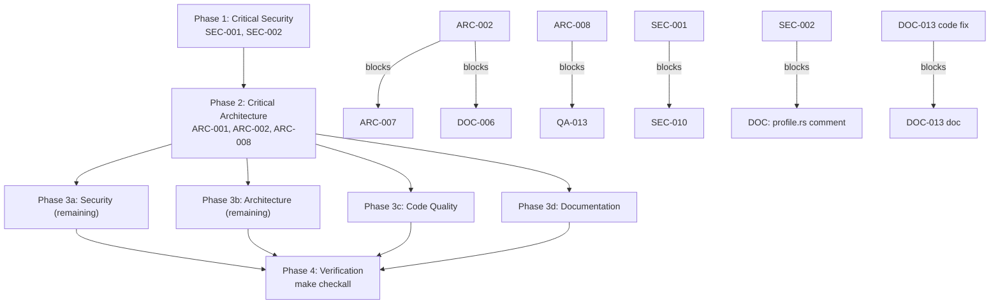

# Project Audit Report

> **Project**: par-term (GPU-accelerated terminal emulator)
> **Date**: 2026-06-25
> **Stack**: Rust (Edition 2024, MSRV 1.95), 14-crate Cargo workspace, wgpu/egui rendering, tokio async PTY
> **Audited by**: Claude Code Audit System

---

## Executive Summary

par-term is a mature, well-engineered codebase: clippy-clean across all 14 crates, ~1,400 tests, exemplary in-code issue tracking (ARC/QA/SEC tickets cross-referenced to source), strong concurrency documentation, and a sophisticated three-tier build profile. Overall health is **Good**. The most critical findings are two immediately-exploitable security gaps in the AI-agent surface: `write_file_safe` skips the sensitive-path blocklist (an agent with `bypassPermissions` can overwrite `~/.ssh/authorized_keys`), and `ssh_extra_args` permits full SSH flag injection. Remediating the six critical issues is roughly a half-day of focused work; the broader structural debt (root-crate monolith, `WindowState` god object, three `par-term-config` files exceeding the project's own 800-line threshold) is well-understood and already has documented migration plans. A genuine strength: every known architectural issue is already named, ticketed, and accompanied by an actionable plan in the source itself.

### Issue Count by Severity

| Severity | Architecture | Security | Code Quality | Documentation | Total |
|----------|:-----------:|:--------:|:------------:|:-------------:|:-----:|
| 🔴 Critical | 2 | 2 | 1 | 1 | **6** |
| 🟠 High     | 5 | 7 | 4 | 5 | **21** |
| 🟡 Medium   | 7 | 7 | 10 | 8 | **32** |
| 🔵 Low      | 5 | 7 | 7 | 7 | **26** |
| **Total**   | **19** | **23** | **22** | **21** | **85** |

---

## 🔴 Critical Issues (Resolve Immediately)

### [SEC-001] `write_file_safe` Bypasses Sensitive-Path Blocklist
- **Area**: Security
- **Location**: `par-term-acp/src/fs_ops.rs:153`
- **Description**: All three ACP read operations call `check_path_allowed()` (lines 121, 182, 236) which blocks `~/.ssh/`, `~/.gnupg/`, `~/.aws/`, etc. The write path does only an `is_absolute()` check and omits `check_path_allowed()` entirely.
- **Impact**: An AI agent running with `bypassPermissions: true` can call `fs/write_file` on `~/.ssh/authorized_keys` and gain persistent SSH access — no exploit chain required.
- **Remedy**: Add `check_path_allowed(path)?;` as the first validation in `write_file_safe`, after the `is_absolute()` check and before `create_dir_all`.

### [SEC-002] `ssh_extra_args` Enables Full SSH Flag Injection
- **Area**: Security
- **Location**: `par-term-config/src/profile_types/profile.rs:465-466`
- **Description**: `ssh_extra_args` is a free-form string tokenized with `split_whitespace()` and inserted directly into the SSH argv with no validation. The field's own doc comment demonstrates the attack (`-o StrictHostKeyChecking=no`).
- **Impact**: A profile YAML can set `-o ProxyCommand=...` (arbitrary local command execution), `-o UserKnownHostsFile=/dev/null` (silent MITM), or `-A` (agent forwarding pivot).
- **Remedy**: Tokenize with `shell_words::split` (already a workspace dep) and reject a blocklist of flags (`-A -D -R -L -W -w`) and options (`ProxyCommand`, `LocalCommand`, `StrictHostKeyChecking`, `UserKnownHostsFile`).

### [ARC-001] Root Crate Monolith — Compile-Time Bottleneck
- **Area**: Architecture
- **Location**: `src/lib.rs` (root crate ~72,700 lines / 317 files)
- **Description**: Every change to the root crate recompiles all 317 files. 13 self-contained UI dialog modules (all implementing `OverlayComponent`) remain top-level despite being prime extraction candidates. Self-documented as ARC-011 with a planned split into `par-term-ui`, `par-term-badge`, `par-term-session`.
- **Impact**: ~1m20s clean builds; CI and cold-build friction; new features inevitably land in the wrong crate.
- **Remedy**: Execute the ARC-011 plan. Extract `par-term-ui` first (lowest coupling), then `par-term-badge` and `par-term-session`.

### [ARC-002] `WindowState` God Object — 93 `impl` Blocks, 7,704 Lines
- **Area**: Architecture
- **Location**: `src/app/window_state/mod.rs:134`
- **Description**: A single struct with 30+ fields drives 93 `impl WindowState` blocks across 38 files. 12 sub-state structs already extracted; remaining extractions (`TmuxSubsystem`, `SelectionSubsystem`, `WindowInfrastructure`) blocked on a field-by-field borrow audit.
- **Impact**: Any modification requires reasoning about all 93 impl blocks; blocks the `EventHandler` trait and integration-test seams.
- **Remedy**: Continue ARC-002 in documented priority order; `TmuxSubsystem` is the highest-ROI next extraction. Route new state through existing sub-structs.

### [QA-001] Incorrect Date Arithmetic in `BuiltInVariable::resolve()`
- **Area**: Code Quality
- **Location**: `par-term-config/src/snippets.rs:966-974`
- **Description**: `\(date)` uses naive integer math: `years = 1970 + days/365` (ignores leap years) and `month = (day_of_year/30)+1` (all months = 30 days), producing month=13 in late December and wrong day-of-month year-round.
- **Impact**: Any snippet using `\(date)` silently emits malformed dates (e.g., `2026-13-03`) into filenames, logs, and prompt context.
- **Remedy**: Replace with `chrono::Local::now().format("%Y-%m-%d").to_string()` (chrono is already in the workspace).

### [DOC-001] CLAUDE.md Version Field Is 3 Releases Stale
- **Area**: Documentation
- **Location**: `CLAUDE.md:12`
- **Description**: Reads `**Version**: 0.30.12`; `Cargo.toml` is `0.33.1`, latest CHANGELOG is `[0.33.1] - 2026-06-18`.
- **Impact**: Every agent/developer reading project context starts from a months-old version; version-keyed reasoning produces wrong answers silently.
- **Remedy**: Update to `0.33.1` and add a `sed` substitution to the `cut-release` workflow so it stays in sync.

---

## 🟠 High Priority Issues

### Security
- **[SEC-003]** Arbitrary file read via `PAR_TERM_SCREENSHOT_FALLBACK_PATH` — `par-term-mcp/src/tools/screenshot.rs:25-29`. Env-var path is `fs::read` + base64-returned with no validation; exfiltrates `~/.ssh/id_rsa` as "image" data. Canonicalize + allowlist roots.
- **[SEC-004]** Agent TOML `[env]` allows `LD_PRELOAD`/`DYLD_INSERT_LIBRARIES` injection — `par-term-acp/src/agent.rs:314`. `cmd.envs(&config.env)` has no key allowlist; a third-party TOML injects a dylib into every subprocess. Block dynamic-linker env keys.
- **[SEC-005]** MCP `config_update` accepts arbitrary config keys — `par-term-mcp/src/tools/config_update.rs:18-30`. Writes caller keys verbatim to disk; can flip `bypassPermissions`. Enforce a key allowlist.
- **[SEC-006]** No MCP stdin authentication — `par-term-mcp/src/lib.rs:188-256`. Any local process writing to stdin can invoke all tools. Require a launch-time session token in the `initialize` handshake.
- **[SEC-007]** SSH host leading-hyphen injection — `par-term-config/src/profile_types/profile.rs:469-474`. `ssh_host` formatted into argv with no validation; `-oProxyCommand=...` is parsed as a flag. Reject leading `-`, `\n`, `\0` at save time.
- **[SEC-008]** Self-update installs binary on missing SHA256 — `par-term-update/src/binary_ops.rs:181-189`. `None` checksum → `warn!` + `Ok(())`; only integrity gate on Linux/Windows. Change to `Err(...)` (matching the shader installer's correct policy).
- **[SEC-009]** OSC 8 hyperlink scheme not validated before OS open — `src/url_detection/render.rs:49-54`. A remote program can emit `file:///etc/cron.d/evil`; clicking opens it via OS handler. Add a scheme allowlist before `open::that`.

### Architecture
- **[ARC-003]** Layer violation: `par-term-config` carries optional `wgpu` dep — `par-term-config/Cargo.toml:28`, `src/types/rendering.rs:25`. A Layer-1 pure-data crate holds Layer-3 GPU types (the Cargo.toml comment itself flags this). Move conversion helpers into `par-term-render`.
- **[ARC-004]** Dual logging systems — 685 `log::` calls where custom macros are documented as correct (`src/debug.rs:30`, `src/app/handler/app_handler_impl.rs`, +680). Gate hot-path `log::debug!/trace!` or migrate to `tracing` (ARC-008).
- **[ARC-005]** `Config` struct: 1,529 lines / ~235 public fields — `par-term-config/src/config/config_struct/mod.rs`. Decomposition ~40% done; continue the documented `#[serde(flatten)]` extraction. *(Same work as QA-002.)*
- **[ARC-006]** `par-term-input` is a single 654-line file mixing VT encoding, clipboard, and modifier tracking — `par-term-input/src/lib.rs`. Split into `KeyEncoder` / `ClipboardManager` / `ModifierTracker` to enable encoder unit tests without a display.
- **[ARC-007]** No `EventHandler` trait — `src/traits.rs:184`. All event dispatch hardwired to `WindowState`; blocks ARC-002 completion and integration-test seams. Define `EventHandler<E>` and implement on extracted sub-states.

### Code Quality
- **[QA-003]** `parse_shader_controls` is a 660-line function — `par-term-config/src/shader_controls.rs:337-996`. 10 repetitive match arms + 5 identical capacity checks. Extract per-control parsers + a shared `check_and_push_warning` helper.
- **[QA-004]** Six `unreachable!()` in the active render path — `src/app/render_pipeline/egui_submit.rs:272-289`. A wrong `DemoteSnapshot` variant panics mid-frame, killing the session. Destructure once; replace `unreachable!()` with logged graceful skip. *(Same site as ARC-011-medium.)*
- **[QA-005]** `snippets.rs` shotgun-surgery enum — `par-term-config/src/snippets.rs` (1,268 lines). 8 `CustomActionConfig` variants each redeclare 6 shared fields (48 duplicates) + 7 eight-arm match helpers. Refactor to `CustomAction { base, kind }` with a custom `Deserialize`.

### Documentation
- **[DOC-002]** Broken README TOC anchor `#whats-new-in-03012` — `README.md:19`. Heading is now `0.33.0`. Fix the anchor and add release-checklist anchor verification.
- **[DOC-003]** Git tag `v0.33.1` not pushed — `Cargo.toml`/CHANGELOG say 0.33.1, latest tag is `v0.33.0`. Breaks Homebrew SHA, self-update checker, `git describe`. Tag and push; add a pre-push tag check.
- **[DOC-004]** CHANGELOG declares Keep a Changelog but uses 14 non-standard headings (`### Bug Fixes` ×13, `### Performance` ×9, …) and a duplicate `### Added` in `[0.32.0]`. Normalize to the six standard names or drop the declaration.
- **[DOC-005]** Linux dependency lists inconsistent — `README.md:213-225` vs `CONTRIBUTING.md:66-79`. CONTRIBUTING omits GTK3, Wayland, ALSA headers and has no Fedora/Arch section; contributors hit build failures. Reconcile to README's complete list.
- **[DOC-006]** `docs/API.md` manually maintained, ~53% coverage, no CI validation — `docs/API.md:3`. Either add a `make doc-check` gate or replace the manual index with `make doc-open`.

---

## 🟡 Medium Priority Issues

### Architecture
- **[ARC-009]** Snippet `Sequence`/`Repeat` use `std::thread::sleep` in the winit event loop — `src/app/input_events/snippet_actions/workflow.rs:318`. Even capped delays freeze the UI/render loop. Convert to `tokio::time::sleep` + mpsc polled in `about_to_wait`.
- **[ARC-010]** `shader_controls.rs` is 1,700 lines (largest file in workspace) — mixed config/control concerns in the "pure data" crate. Extract schema types; move control logic to the right crate. *(Same file as QA-003.)*
- **[ARC-011]** Six `unreachable!()` + 6× repeated `DemoteSnapshot` destructure — `src/app/render_pipeline/egui_submit.rs:272`. Structural smell; restructure the enum. *(Same site as QA-004.)*
- **[ARC-012]** 109 `unwrap()` + 176 `expect()` in `src/` — panics in the render path crash the whole terminal. Audit render-path `unwrap()` first; convert to `?`/`unwrap_or_default`/logged-skip.
- **[ARC-013]** `par-term-settings-ui` carries `ureq`/`arboard`/`regex`/`image`/`tokio` — network+IO in a presentational crate. Route URL-import/clipboard/image through root-crate action enums.
- **[ARC-014]** `par-term-mcp` resolves config paths independently via `dirs` (no `par-term-config` dep) — divergence risk on path migration. Depend on `par-term-config`'s path API.
- **[ARC-015]** Unsafe macOS FFI without test coverage — `src/macos_blur.rs`, `src/macos_space.rs` (TODO QA-011). Add tests asserting graceful degradation when private symbols are absent. *(Files overlap SEC-020.)*

### Security
- **[SEC-010]** Blocklist missing `~/.kube/config`, `~/.npmrc`, `~/.pypirc`, `~/.azure/`, `~/.config/gh/`, keyrings — `par-term-acp/src/fs_ops.rs:44-70`. Extend the list.
- **[SEC-011]** `$TMPDIR` added to ACP safe-write roots unvalidated — `par-term-acp/src/permissions.rs:169-171`. `TMPDIR=/home/user` grants home-dir writes. Canonicalize + assert system-temp prefix.
- **[SEC-012]** SSH identity file paths not canonicalized — `par-term-ssh/src/config_parser.rs:76-86`. `IdentityFile ~/.ssh/../../.aws/credentials` passes through. Canonicalize + bound to `~/.ssh/`.
- **[SEC-013]** Tmux control-mode framing: `\n`/`\r` not stripped — `par-term-tmux/src/commands.rs:175-204` (+`session.rs`). Embedded newline injects a separate control command. Strip CR/LF before quoting.
- **[SEC-014]** mDNS-discovered SSH hostnames unvalidated — `par-term-ssh/src/mdns.rs:140-159`. A rogue responder advertises `-oProxyCommand=...`. Apply the same host validation as profiles.
- **[SEC-015]** Shell-history identity paths read without size/path bounds — `par-term-ssh/src/history.rs:34-61`. No file-size cap; `-i ../../etc/shadow` stored verbatim. Cap size/line length; canonicalize.
- **[SEC-016]** Full tool-call payloads logged (file content, base64 screenshots) — `par-term-mcp/src/lib.rs:210`, `par-term-acp/src/permissions.rs:224-228`. Truncate sensitive fields; gate wire logs behind `DEBUG_LEVEL>=3`.
- **[SEC-017]** `memmap2` 0.9.10 unsoundness — RUSTSEC-2026-0186 (Cargo.lock). `cargo tree --invert memmap2`; update or `[patch]`.

### Code Quality
- **[QA-006]** Primitive-obsession 10-tuple for scrollbar state — `par-term-render/src/renderer/mod.rs:222,481,739,766`. Replace with a named `ScrollbarCacheKey` struct + `Default`.
- **[QA-007]** `create_window`/`create_window_for_moved_tab` share ~80 duplicated lines — `src/app/window_manager/window_lifecycle.rs:28,271`. Extract `prepare_window_attrs` + `apply_post_create_init`.
- **[QA-008]** `check_trigger_actions` builds 3 HashMaps before the empty-result early return — `src/app/triggers/mod.rs:167-227`. Per-frame allocation on idle frames. Move the early return before construction.
- **[QA-009]** 3× copy-pasted prompt-before-run guard — `src/app/triggers/mod.rs:416-443,570-596,671-709`. Security-policy duplication. Extract `check_prompt_before_run -> PromptDecision`.
- **[QA-010]** `handle_run_command_action` is 200 lines with 5-level nesting — `src/app/triggers/mod.rs:349-552`. 5 security gates inline + untestable. Extract `check_security_gates -> SecurityGateResult`.
- **[QA-011]** `renderer/mod.rs` at 799 lines (1 from threshold) — duplicate shader-init blocks, 7× repeated rescale. Extract `init_*_shader` + `rescale_offsets`.
- **[QA-012]** `Arc<Mutex<Option<String>>>` for one-shot error propagation in file transfers — `par-term-acp/src/` (file_transfers). Replace with `mpsc::channel` + `try_recv`.
- **[QA-013]** Render pipeline has zero test coverage — `par-term-render/src/cell_renderer/pane_render/` (`build_pane_instance_buffers`, 530 lines). Add data-transformation tests for cursor positioning, search-highlight injection, RLE bg merging. *(File overlaps ARC-008/DOC-011.)*
- **[QA-014]** Zero tests for `keybindings/`, `scripting/`, `tmux_handler/`, `menu/` — `src/`. Prioritize keybindings (model on `par-term-keybindings` integration tests).

### Documentation
- **[DOC-007]** `GIT_BRANCH`/`GIT_COMMIT` documented as env-readable but code never reads them — `docs/guides/ENVIRONMENT_VARIABLES.md:147-149`. Implement the override or correct the doc.
- **[DOC-008]** README has two "What's New" sections (0.33.0 + 0.32.0); the older duplicates CHANGELOG — `README.md:44-61`. Remove the 0.32.0 section.
- **[DOC-009]** README config YAML excerpt has no "incomplete" warning despite "200+ options" — `README.md:400`. Add a callout pointing to the Configuration Reference.
- **[DOC-010]** CONTRIBUTING tells human contributors CLAUDE.md is canonical and takes precedence — `CONTRIBUTING.md:1-4`. Remove the precedence note; make CONTRIBUTING self-authoritative.
- **[DOC-011]** `par-term-render` `//!` coverage is 53% — the entire `cell_renderer/` hot path lacks module docs (26 files). Add 2–4 sentence `//!` headers, prioritizing `cell_renderer/`. *(Cluster overlaps ARC-008/QA-013.)*
- **[DOC-012]** Architecture docs lack rationale/tradeoffs (zero hits for "tradeoff"/"rationale"/"alternatives") — `docs/architecture/`. Add a "Design Decisions" subsection to `ARCHITECTURE.md`/`COMPOSITOR.md`.
- **[DOC-013]** WGSL shader debug output hardcoded to `/tmp/` — `src/app/window_state/config_watchers.rs:351` + `wgsl_emit.rs`; Windows uses `%TEMP%`. Fix code to use `std::env::temp_dir()`, then update TROUBLESHOOTING.md. *(Requires code fix before doc fix.)*
- **[DOC-014]** `docs/guides/MIGRATION.md` is undiscoverable (not in CLAUDE.md table, unlinked from TROUBLESHOOTING). Add references.

---

## 🔵 Low Priority / Improvements

### Architecture
- **[ARC-016]** Add a per-crate logging-convention comment to sub-crate `lib.rs` files (model on `par-term-render/src/lib.rs:13`).
- **[ARC-017]** `deny.toml` exists but `cargo deny`/`cargo audit` are not in CI — add a `cargo deny check` step to `ci.yml`. *(Note: security agent found `cargo-deny` IS in `ci.yml:117`; verify and reconcile — this may already be partially covered.)*
- **[ARC-018]** `par-term-acp` and `par-term-mcp` duplicate JSON-RPC envelope handling — consider a shared `par-term-jsonrpc` module.
- **[ARC-019]** `egui_submit.rs:272` pattern-matches `DemoteSnapshot` six times — destructure once. *(Same as QA-004/ARC-011.)*
- **[ARC-020]** `Makefile` `run-perf` pipes to `tee`, losing exit codes — add `pipefail`/`PIPESTATUS`.

### Security
- **[SEC-018]** Self-update temp binary world-readable window — `par-term-update/src/install_methods.rs:261-263`. Create with `mode(0o700)` atomically.
- **[SEC-019]** `transmute` to `&'static [u8]` in font manager — `par-term-fonts/src/font_manager/types.rs:58`. Document the Arc co-ownership invariant or use `ouroboros`.
- **[SEC-020]** macOS private-API unsafe blocks missing `// SAFETY:` comments — `src/macos_blur.rs`, `src/macos_space.rs`, `src/font_metrics.rs:69` (SECURITY.md claims they exist). Add them. *(Files overlap ARC-015.)*
- **[SEC-021]** Trigger denylist missing exfil patterns (`curl`/`wget`/`nc`/`python -c`) — `par-term-config/src/automation.rs:284-484`. Add defense-in-depth patterns.
- **[SEC-022]** `glib` 0.18.5 unsound iterator (RUSTSEC-2024-0429, Linux GTK3 only) — update `muda` when available.
- **[SEC-023]** 7 unmaintained crates (GTK3 bindings, `paste`, `proc-macro-error`) — track `muda` GTK4 migration.

### Code Quality
- **[QA-015]** Magic literals in render crate (`86400`, `255.0`, `0.001`) — name them (`SECONDS_PER_DAY`, etc.).
- **[QA-016]** Magic literals `66`/`200` in `triggers/mod.rs:746,773` (66 also in `snippets.rs:135`) — single `const DEFAULT_SPLIT_PERCENT`.
- **[QA-017]** 4× module-level `#[allow(unused_imports)]` in `par-term-config/src/lib.rs:105,123,307,309` — narrow to the import line + comment.
- **[QA-018]** 50ms `thread::sleep` as task-abort wait — `src/pane/types/pane.rs:404-405`. Use a `JoinHandle`/watch channel.
- **[QA-019]** Detached `thread::spawn`+`sleep` for delayed trigger actions — `src/app/triggers/mod.rs:643,782`. Use cancellable `tokio::task` tied to tab lifetime.
- **[QA-020]** Add a proper doc comment to `builtin_variable::resolve()` after the QA-001 chrono fix — `snippets.rs:960`.
- **[QA-021]** Raw `[u8;3]`/`[f32;4]` color fields — `config_struct/mod.rs:362,680,…`. Introduce `RgbColor`/`RgbaColor` newtypes. *(Best done within the ARC-005/QA-002 split passes.)*

### Documentation
- **[DOC-015]** README shortcut table shows `Ctrl` where `Ctrl+Shift` is meant on Linux/Windows — `README.md:337-349`. Add a footnote/columns.
- **[DOC-016]** External shader-gallery link may drift from bundled count — `README.md:141`. Add a release-checklist sync item.
- **[DOC-017]** `make config-example` not cross-referenced in README/CLAUDE.md — `CONTRIBUTING.md:331`. Add to README Configuration section.
- **[DOC-018]** CONTRIBUTING omits MSRV 1.95 — `CONTRIBUTING.md:47`. State "Rust stable 1.95+ (Edition 2024)".
- **[DOC-019]** Older CHANGELOG entries use timestamped compound headings — normalize during the DOC-004 cleanup.
- **[DOC-020]** TROUBLESHOOTING entries lack the style guide's "verify" step — add verification commands to multi-step fixes.
- **[DOC-021]** CONCURRENCY.md has only one diagram for a complex topic — add a `graph TD` of the threading/state-ownership model.

---

## Detailed Findings

### Architecture & Design
Overall health **Good**. Two critical structural bottlenecks (root-crate monolith ARC-001; `WindowState` god object ARC-002) dominate coupling and compile-time cost, but both have documented, in-progress migration plans. High-priority items cluster around a config-layer violation (ARC-003), a dual logging system (ARC-004, 685 `log::` calls), the oversized `Config` struct (ARC-005), the single-file `par-term-input` crate (ARC-006), and the missing `EventHandler` trait (ARC-007) that blocks ARC-002's completion. Notable strengths: centralized `[workspace.dependencies]`, a well-documented two-tier mutex strategy with `try_lock` telemetry, an emerging well-designed trait layer (`TerminalAccess`/`UIElement`/`OverlayComponent`), the `dev-release` build profile, and exemplary in-code ticketing.

### Security Assessment
Overall posture **Fair** — strong foundations (TLS enforced, update URL allowlist, zip-slip protection in all extraction paths, paste sanitization, credential redaction, no hardcoded secrets, `cargo-deny` in CI) undercut by two immediately-exploitable critical gaps in the AI-agent surface (SEC-001 write-path blocklist bypass; SEC-002 SSH flag injection). The high-priority cluster is concentrated in the MCP/ACP/update/SSH boundary: arbitrary file read (SEC-003), dynamic-linker env injection (SEC-004), unauthenticated/unbounded MCP config writes (SEC-005/006), SSH host injection (SEC-007), unsigned self-update on missing checksum (SEC-008), and unvalidated OSC 8 URL schemes (SEC-009). Most fixes are small, localized validators.

### Code Quality
Overall health **Good** — zero clippy warnings across 14 crates, ~1,400 tests, disciplined `blocking_lock()` annotations, and visible/actionable debt. One critical correctness bug (QA-001 date arithmetic). The structural debt concentrates in three `par-term-config` files exceeding the project's own 800-line threshold by 60–110% (`shader_controls.rs` 1,700; `config_struct/mod.rs` 1,529; `snippets.rs` 1,268). The render pipeline and four `src/` modules lack test coverage. Six files exceed 800 lines total.

### Documentation Review
Overall health **Good** — an unusually complete README, 18 Mermaid diagrams across 6 architecture docs, 88–100% rustdoc coverage on most crates, and narrative-quality CHANGELOG entries. The impactful gaps are release-metadata drift (DOC-001 stale CLAUDE.md version; DOC-003 unpushed `v0.33.1` tag) that breaks downstream tooling, CHANGELOG format non-conformance (DOC-004), inconsistent Linux dependency lists (DOC-005), and the under-documented `par-term-render` hot path (DOC-011, 53% module-doc coverage).

---

## Remediation Roadmap

### Immediate Actions (Before Next Deployment)
1. **[SEC-001]** Add `check_path_allowed` to `write_file_safe`.
2. **[SEC-002]** Validate/blocklist `ssh_extra_args`.
3. **[QA-001]** Fix `\(date)` with chrono (one-line correctness bug).
4. **[SEC-008]** Make missing SHA256 abort the self-update.
5. **[DOC-003]** Tag and push `v0.33.1`; **[DOC-001]** update CLAUDE.md version.

### Short-term (Next 1–2 Sprints)
1. Security boundary hardening: SEC-003 through SEC-007, SEC-009 (MCP/ACP/SSH validators).
2. Render-path resilience: QA-004 (`unreachable!()`), ARC-012 (render-path `unwrap()`).
3. Begin `par-term-config` decomposition: ARC-005/QA-002, QA-003 (`parse_shader_controls`), QA-005 (snippets enum).
4. Documentation correctness: DOC-002, DOC-004, DOC-005, DOC-006.

### Long-term (Backlog)
1. Root-crate extraction (ARC-001) and `WindowState` decomposition (ARC-002) with the `EventHandler` trait (ARC-007).
2. Logging unification to `tracing` (ARC-004).
3. Test coverage for the render pipeline and untested `src/` modules (QA-013, QA-014).
4. Module-doc backfill for `par-term-render` (DOC-011); architecture rationale docs (DOC-012).

---

## Positive Highlights

1. **Exemplary in-code issue tracking** — every architectural issue is named (ARC/QA/SEC), cross-referenced between source comments and this report, and accompanied by a concrete migration plan. The `WindowState` module doc is a model of documenting in-progress decomposition.
2. **Zero clippy warnings across the full 14-crate workspace**, with every `#[allow(...)]` justified by an explanatory comment — exceptional for a project this size.
3. **Strong security baseline** — TLS enforced everywhere, update URL scheme+host allowlisted, zip-slip protection in all extraction paths, paste control-character sanitization, active credential redaction before LLM calls, and `cargo-deny` failing CI on advisories.
4. **Well-documented, production-grade concurrency model** — the two-tier `tokio::sync::RwLock` + `parking_lot::Mutex` strategy with `try_lock` miss-rate telemetry is rare in open-source terminals.
5. **Sophisticated build system** — the three-tier profile strategy with a `dev-release` profile delivering ~1–2s rebuilds at ~90–95% release performance directly reduces developer friction.
6. **Genuinely useful CHANGELOG** — entries include root cause, affected code path, and behavior change rather than one-line summaries.
7. **Comprehensive README and architecture docs** — CI/crates.io/platform badges, working quickstart, 18 Mermaid diagrams covering data flow, threading, GPU lifecycle, and compositor layering.
8. **Maturing test infrastructure** — ~1,400 tests with `MockTerminal`, round-trip serialization, and error-path coverage; the typed-error (`thiserror`) migration in `par-term-render` shows active architectural stewardship.

---

## Audit Confidence

| Area | Files Reviewed | Confidence |
|------|---------------|-----------|
| Architecture | ~30 (entry points, manifests, all crate roots, largest modules) | High |
| Security | ~22 (ACP/MCP/SSH/update/tmux/url + `cargo audit`) | High |
| Code Quality | ~25 (largest files, render pipeline, triggers, snippets, tests) | High |
| Documentation | ~21 (README, CHANGELOG, CONTRIBUTING, docs/ tree, rustdoc sampling) | High |

*The audit cross-validated several findings against source (e.g., the documentation agent verified `wgsl_emit.rs` does write its debug file, discarding a false positive). Dynamic/runtime exploitation was not performed; security findings are from static analysis and `cargo audit`.*

---

## Remediation Plan

> This section is generated by the audit and consumed directly by `/fix-audit`.
> It pre-computes phase assignments and file conflicts so the fix orchestrator
> can proceed without re-analyzing the codebase.

### Phase Assignments

#### Phase 1 — Critical Security (Sequential, Blocking)
| ID | Title | File(s) | Severity |
|----|-------|---------|----------|
| SEC-001 | `write_file_safe` bypasses sensitive-path blocklist | `par-term-acp/src/fs_ops.rs` | Critical |
| SEC-002 | `ssh_extra_args` SSH flag injection | `par-term-config/src/profile_types/profile.rs` | Critical |

#### Phase 2 — Critical Architecture (Sequential, Blocking)
| ID | Title | File(s) | Severity | Blocks |
|----|-------|---------|----------|--------|
| ARC-001 | Root crate monolith / extraction | `src/lib.rs` (+ 13 UI dialog modules, `src/session/`, `src/badge.rs`) | Critical | QA work on files that will move |
| ARC-002 | `WindowState` god object decomposition | `src/app/window_state/mod.rs` | Critical | ARC-007, DOC-006 |
| ARC-008 | Glyph rasterization triplicated (promote: blocks QA render work) | `par-term-render/src/cell_renderer/{mod.rs,pane_render/mod.rs,atlas.rs}` | High | QA-013 |

#### Phase 3 — Parallel Execution

**3a — Security (remaining)**
| ID | Title | File(s) | Severity |
|----|-------|---------|----------|
| SEC-003 | Arbitrary read via screenshot fallback path | `par-term-mcp/src/tools/screenshot.rs` | High |
| SEC-004 | Agent TOML `[env]` linker injection | `par-term-acp/src/agent.rs` | High |
| SEC-005 | MCP `config_update` arbitrary keys | `par-term-mcp/src/tools/config_update.rs` | High |
| SEC-006 | No MCP stdin authentication | `par-term-mcp/src/lib.rs` | High |
| SEC-007 | SSH host leading-hyphen injection | `par-term-config/src/profile_types/profile.rs` | High |
| SEC-008 | Self-update installs on missing SHA256 | `par-term-update/src/binary_ops.rs` | High |
| SEC-009 | OSC 8 URL scheme not validated | `src/url_detection/render.rs` | High |
| SEC-010 | Blocklist missing critical paths | `par-term-acp/src/fs_ops.rs` | Medium |
| SEC-011 | `$TMPDIR` safe-write unvalidated | `par-term-acp/src/permissions.rs` | Medium |
| SEC-012 | SSH identity paths not canonicalized | `par-term-ssh/src/config_parser.rs` | Medium |
| SEC-013 | Tmux CR/LF not stripped | `par-term-tmux/src/commands.rs`, `session.rs` | Medium |
| SEC-014 | mDNS hostnames unvalidated | `par-term-ssh/src/mdns.rs` | Medium |
| SEC-015 | Shell-history path/size unbounded | `par-term-ssh/src/history.rs` | Medium |
| SEC-016 | Full tool-call payloads logged | `par-term-mcp/src/lib.rs`, `par-term-acp/src/permissions.rs` | Medium |
| SEC-017 | `memmap2` unsoundness advisory | `Cargo.lock` | Medium |
| SEC-018 | Update temp binary world-readable | `par-term-update/src/install_methods.rs` | Low |
| SEC-019 | `transmute` to `&'static` font slice | `par-term-fonts/src/font_manager/types.rs` | Low |
| SEC-020 | macOS unsafe missing SAFETY comments | `src/macos_blur.rs`, `src/macos_space.rs`, `src/font_metrics.rs` | Low |
| SEC-021 | Trigger denylist missing exfil patterns | `par-term-config/src/automation.rs` | Low |
| SEC-022 | `glib` unsound iterator (Linux) | `Cargo.lock` | Low |
| SEC-023 | 7 unmaintained crates | `Cargo.lock` | Low |

**3b — Architecture (remaining)**
| ID | Title | File(s) | Severity |
|----|-------|---------|----------|
| ARC-003 | `par-term-config` optional `wgpu` layer violation | `par-term-config/Cargo.toml`, `src/types/rendering.rs` | High |
| ARC-004 | Dual logging systems / 685 `log::` calls | `src/debug.rs`, `src/app/handler/app_handler_impl.rs`, `src/shader_watcher.rs` | High |
| ARC-005 | `Config` struct 1,529 lines | `par-term-config/src/config/config_struct/mod.rs` | High |
| ARC-006 | `par-term-input` single 654-line file | `par-term-input/src/lib.rs` | High |
| ARC-007 | No `EventHandler` trait | `src/traits.rs` | High |
| ARC-009 | Snippet `thread::sleep` blocks event loop | `src/app/input_events/snippet_actions/workflow.rs` | Medium |
| ARC-010 | `shader_controls.rs` 1,700 lines | `par-term-config/src/shader_controls.rs` | Medium |
| ARC-011 | `unreachable!()` + repeated destructure | `src/app/render_pipeline/egui_submit.rs` | Medium |
| ARC-012 | 109 `unwrap()` / 176 `expect()` | `src/app/render_pipeline/`, `src/app/handler/` | Medium |
| ARC-013 | `par-term-settings-ui` heavy runtime deps | `par-term-settings-ui/Cargo.toml` | Medium |
| ARC-014 | `par-term-mcp` config-path divergence | `par-term-mcp/Cargo.toml` | Medium |
| ARC-015 | Unsafe macOS FFI untested | `src/macos_blur.rs`, `src/macos_space.rs` | Medium |
| ARC-016 | Missing per-crate logging convention docs | sub-crate `lib.rs` files | Low |
| ARC-017 | `cargo deny` CI coverage (verify vs ci.yml:117) | `Makefile`, `.github/workflows/ci.yml` | Low |
| ARC-018 | ACP/MCP JSON-RPC duplication | `par-term-acp/src/agent.rs`, `par-term-mcp/src/lib.rs` | Low |
| ARC-019 | 6× `DemoteSnapshot` destructure | `src/app/render_pipeline/egui_submit.rs` | Low |
| ARC-020 | `Makefile` `run-perf` loses exit code | `Makefile` | Low |

**3c — Code Quality (all)**
| ID | Title | File(s) | Severity |
|----|-------|---------|----------|
| QA-001 | `\(date)` incorrect date arithmetic | `par-term-config/src/snippets.rs` | Critical |
| QA-003 | `parse_shader_controls` 660-line function | `par-term-config/src/shader_controls.rs` | High |
| QA-004 | Six `unreachable!()` in render path | `src/app/render_pipeline/egui_submit.rs` | High |
| QA-005 | `snippets.rs` shotgun-surgery enum | `par-term-config/src/snippets.rs` | High |
| QA-002 | `Config` god struct (= ARC-005) | `par-term-config/src/config/config_struct/mod.rs` | High |
| QA-006 | Scrollbar 10-tuple primitive obsession | `par-term-render/src/renderer/mod.rs` | Medium |
| QA-007 | `create_window` duplication | `src/app/window_manager/window_lifecycle.rs` | Medium |
| QA-008 | HashMaps built before early return | `src/app/triggers/mod.rs` | Medium |
| QA-009 | 3× prompt-before-run guard | `src/app/triggers/mod.rs` | Medium |
| QA-010 | `handle_run_command_action` 200-line/5-nest | `src/app/triggers/mod.rs` | Medium |
| QA-011 | `renderer/mod.rs` 799 lines | `par-term-render/src/renderer/mod.rs` | Medium |
| QA-012 | `Arc<Mutex<Option<String>>>` error channel | `par-term-acp/src/` (file_transfers) | Medium |
| QA-013 | Render pipeline no test coverage | `par-term-render/src/cell_renderer/pane_render/mod.rs` | Medium |
| QA-014 | No tests: keybindings/scripting/tmux_handler/menu | `src/keybindings/`, `src/scripting/`, `src/tmux_handler/`, `src/menu/` | Medium |
| QA-015 | Magic literals in render crate | `par-term-render/src/renderer/uniforms.rs`, `builtin_textures.rs`, `block_chars/types.rs` | Low |
| QA-016 | Magic literals `66`/`200` | `src/app/triggers/mod.rs` | Low |
| QA-017 | 4× `#[allow(unused_imports)]` | `par-term-config/src/lib.rs` | Low |
| QA-018 | 50ms sleep as abort wait | `src/pane/types/pane.rs` | Low |
| QA-019 | Detached delay threads | `src/app/triggers/mod.rs` | Low |
| QA-020 | Add date doc comment post-fix | `par-term-config/src/snippets.rs` | Low |
| QA-021 | Raw color arrays → newtypes | `par-term-config/src/config/config_struct/mod.rs` | Low |

**3d — Documentation (all)**
| ID | Title | File(s) | Severity |
|----|-------|---------|----------|
| DOC-001 | CLAUDE.md version stale | `CLAUDE.md` | Critical |
| DOC-002 | Broken README TOC anchor | `README.md` | High |
| DOC-003 | `v0.33.1` tag not pushed | git (operational) | High |
| DOC-004 | CHANGELOG non-conforming headings | `CHANGELOG.md` | High |
| DOC-005 | Linux deps inconsistent | `README.md`, `CONTRIBUTING.md` | High |
| DOC-006 | API.md manual / ~53% coverage | `docs/API.md` | High |
| DOC-007 | `GIT_BRANCH`/`GIT_COMMIT` env doc wrong | `docs/guides/ENVIRONMENT_VARIABLES.md` | Medium |
| DOC-008 | README two "What's New" sections | `README.md` | Medium |
| DOC-009 | README config excerpt no warning | `README.md` | Medium |
| DOC-010 | CONTRIBUTING defers to CLAUDE.md | `CONTRIBUTING.md` | Medium |
| DOC-011 | `par-term-render` 53% `//!` coverage | `par-term-render/src/` (26 files) | Medium |
| DOC-012 | Architecture docs lack rationale | `docs/architecture/ARCHITECTURE.md`, `COMPOSITOR.md` | Medium |
| DOC-013 | WGSL `/tmp/` hardcode (needs code fix) | `src/app/window_state/config_watchers.rs`, `wgsl_emit.rs`, `docs/guides/TROUBLESHOOTING.md` | Medium |
| DOC-014 | MIGRATION.md undiscoverable | `docs/guides/MIGRATION.md`, `CLAUDE.md`, `TROUBLESHOOTING.md` | Medium |
| DOC-015 | Keyboard shortcut Ctrl vs Ctrl+Shift | `README.md` | Low |
| DOC-016 | Shader gallery link drift | `README.md` | Low |
| DOC-017 | `make config-example` not referenced | `README.md`, `CLAUDE.md` | Low |
| DOC-018 | CONTRIBUTING omits MSRV 1.95 | `CONTRIBUTING.md` | Low |
| DOC-019 | CHANGELOG timestamped headings | `CHANGELOG.md` | Low |
| DOC-020 | Troubleshooting missing verify step | `docs/guides/TROUBLESHOOTING.md` | Low |
| DOC-021 | CONCURRENCY.md single diagram | `docs/architecture/CONCURRENCY.md` | Low |

### File Conflict Map
<!-- Files touched by issues in multiple domains. Fix agents must read current file state
     before editing — a prior agent may have already changed these. -->

| File | Domains | Issues | Risk |
|------|---------|--------|------|
| `par-term-config/src/profile_types/profile.rs` | Security + Documentation | SEC-002, SEC-007, (DOC field-comment rewrite) | ⚠️ Read before edit — SEC fix rewrites the doc comment DOC must not re-introduce |
| `src/app/render_pipeline/egui_submit.rs` | Architecture + Code Quality | ARC-011, ARC-019, QA-004 | ⚠️ Read before edit — same six `unreachable!()` sites |
| `par-term-config/src/config/config_struct/mod.rs` | Architecture + Code Quality | ARC-005, QA-002, QA-021 | ⚠️ Read before edit — QA-021 newtypes should ride ARC-005 split passes |
| `par-term-config/src/shader_controls.rs` | Architecture + Code Quality | ARC-010, QA-003 | ⚠️ Read before edit — same 1,700-line file |
| `par-term-config/src/snippets.rs` | Code Quality (×3) | QA-001, QA-005, QA-020 | ⚠️ Read before edit — fix QA-001 first, then QA-005 restructure, then QA-020 doc |
| `par-term-render/src/cell_renderer/pane_render/mod.rs` | Architecture + Code Quality + Documentation | ARC-008, QA-013, DOC-011 | ⚠️ Read before edit — glyph dedup, then tests, then `//!` |
| `par-term-render/src/cell_renderer/mod.rs`, `atlas.rs` | Architecture + Documentation | ARC-008, DOC-011 | ⚠️ Read before edit |
| `par-term-render/src/renderer/mod.rs` | Code Quality (×2) | QA-006, QA-011 | ⚠️ Read before edit — tuple + file-size both here |
| `src/app/triggers/mod.rs` | Code Quality (×5) | QA-008, QA-009, QA-010, QA-016, QA-019 | ⚠️ Read before edit — do in one pass to avoid repeated conflicts |
| `par-term-acp/src/fs_ops.rs` | Security (×2) | SEC-001, SEC-010 | ⚠️ Read before edit — SEC-001 (Phase 1) lands first |
| `par-term-mcp/src/lib.rs` | Security (×2) | SEC-006, SEC-016 | ⚠️ Read before edit |
| `src/macos_blur.rs`, `src/macos_space.rs` | Architecture + Security | ARC-015, SEC-020 | ⚠️ Read before edit — tests + SAFETY comments |
| `src/app/window_state/config_watchers.rs`, `wgsl_emit.rs` | Documentation (code fix) | DOC-013 | ⚠️ Code change required before the doc can be made accurate |
| `CLAUDE.md` | Documentation (×2) | DOC-001, DOC-014, DOC-017 | ⚠️ Read before edit |
| `README.md` | Documentation (×7) | DOC-002, DOC-005, DOC-008, DOC-009, DOC-015, DOC-016, DOC-017 | ⚠️ Read before edit — many edits to one file |
| `CONTRIBUTING.md` | Documentation (×4) | DOC-005, DOC-010, DOC-017, DOC-018 | ⚠️ Read before edit |
| `CHANGELOG.md` | Documentation (×2) | DOC-004, DOC-019 | ⚠️ Read before edit |
| `Cargo.lock` | Security (×3) | SEC-017, SEC-022, SEC-023 | ⚠️ Resolve via dependency updates together |

### Blocking Relationships
<!-- Explicit dependency declarations from audit agents. -->
- **SEC-001 → SEC-010**: both edit `fs_ops.rs`; SEC-001 (Phase 1 critical) must land before SEC-010 extends the same blocklist.
- **SEC-002 → DOC (profile.rs comment)**: SEC-002 rewrites the `ssh_extra_args` doc comment that currently describes the attack; documentation work must build on the rewritten comment, not revert it.
- **ARC-002 → ARC-007**: the `EventHandler` trait cannot be implemented on sub-handlers until `WindowState` fields are moved into isolated sub-structs.
- **ARC-002 → DOC-006**: `docs/API.md` for `par-term-settings-ui`/render should be (re)written after the module reorganization settles, or entries will need immediate revision.
- **ARC-001 → QA (movable files)**: code-quality fixes to files that ARC-001 will relocate (`src/session/`, `src/badge.rs`, the 13 UI dialog modules) must be coordinated with or deferred until after extraction.
- **ARC-008 → QA-013**: extract `glyph_ops.rs` (shared rasterization helper) before adding/refactoring `pane_render` tests or splitting `mod.rs`, or the duplication is carried into separate files.
- **DOC-013 (code) → DOC-013 (doc)**: fix the `/tmp/` hardcode in `config_watchers.rs`/`wgsl_emit.rs` to use `std::env::temp_dir()` before updating TROUBLESHOOTING.md to the `<temp_dir>` placeholder.
- **DOC-007 ↔ code decision**: the `GIT_BRANCH`/`GIT_COMMIT` doc cannot be made accurate until the team decides to implement or rule out the env-var override.
- **QA-001 → QA-005 → QA-020**: within `snippets.rs`, apply the one-line date fix first, then the enum restructure, then the doc comment — in one branch to avoid conflicts.

### Dependency Diagram

