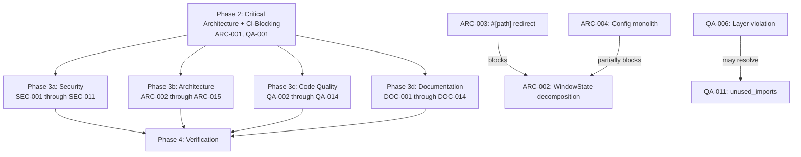

# Project Audit Report

> **Project**: par-term
> **Date**: 2026-03-12
> **Stack**: Rust (Edition 2024), wgpu, egui, tokio, serde, WGSL/GLSL shaders
> **Audited by**: Claude Code Audit System (Opus 4.6)

---

## Executive Summary

par-term is a well-engineered, architecturally self-aware terminal emulator with exceptional documentation and disciplined workspace management across 15 Rust crates. The most critical finding is a **Rust toolchain version mismatch between CI (1.91.0) and release (1.85.0) workflows**, which could produce release binaries compiled against a different toolchain than what CI validates. The codebase has two major structural debts -- the `WindowState` God object (84 `impl` blocks) and the `Config` monolith (1,604 lines, ~270 fields) -- both of which are actively tracked with documented decomposition plans. Security posture is strong with defense-in-depth patterns across trigger execution, path validation, and ACP sandboxing; no critical vulnerabilities were found. Estimated effort for top-priority remediation: 2-3 days for critical/high items, with the God object decomposition being an ongoing multi-sprint effort.

### Issue Count by Severity

| Severity | Architecture | Security | Code Quality | Documentation | Total |
|----------|:-----------:|:--------:|:------------:|:-------------:|:-----:|
| Critical | 1 | 0 | 1 | 1 | **3** |
| High     | 3 | 2 | 4 | 3 | **12** |
| Medium   | 6 | 5 | 5 | 5 | **21** |
| Low      | 5 | 4 | 5 | 4 | **18** |
| **Total**   | **15** | **11** | **15** | **13** | **54** |

---

## Critical Issues (Resolve Immediately)

### [ARC-001] Rust Toolchain Version Mismatch Between CI and Release Workflows
- **Area**: Architecture
- **Location**: `.github/workflows/ci.yml:39`, `.github/workflows/release.yml:18`
- **Description**: CI uses Rust `1.91.0` (matching `rust-version` in `Cargo.toml`), but the release workflow uses `1.85.0` (set via `RUST_VERSION` env var). Release binaries may be compiled with a toolchain 6 versions behind the MSRV, producing binaries with different behavior than what CI validates.
- **Impact**: Users may encounter bugs in release binaries that do not reproduce in CI. Language features available in 1.86-1.91 could work in CI but fail in release builds.
- **Remedy**: Update `release.yml` to set `RUST_VERSION: "1.91.0"`. Centralize via `rust-toolchain.toml` with `channel = "1.91.0"` so both workflows inherit automatically.

### [QA-001] Clippy Violations Break CI
- **Area**: Code Quality
- **Location**: `par-term-config/src/config/prettifier/mod.rs:548-550`, `par-term-prettifier/src/renderers/markdown/tests/inline.rs:23`
- **Description**: `cargo clippy --all-targets --all-features -- -D warnings` produces two hard errors: (1) `field_reassign_with_default` in a prettifier config test, and (2) dead code in test helper `segment_texts()`.
- **Impact**: CI pipeline (`make ci` / `lint-all`) will fail, blocking releases and pre-commit checks.
- **Remedy**: Use struct initializer form for the prettifier config test. Remove or `#[allow(dead_code)]` the unused `segment_texts()` function.

### [DOC-001] 11 of 14 Sub-Crates Missing README.md
- **Area**: Documentation
- **Location**: `par-term-acp/`, `par-term-fonts/`, `par-term-input/`, `par-term-keybindings/`, `par-term-prettifier/`, `par-term-render/`, `par-term-scripting/`, `par-term-settings-ui/`, `par-term-terminal/`, `par-term-tmux/`, `par-term-update/`
- **Description**: Only 3 of 14 sub-crates (`par-term-config`, `par-term-mcp`, `par-term-ssh`) have a README.md. Crates.io uses README.md as the primary documentation entry point.
- **Impact**: Users discovering individual crates on crates.io see no documentation. Contributors lack local orientation documents.
- **Remedy**: Create READMEs following the pattern in `par-term-config/README.md`. The existing `//!` crate-level doc comments can serve as starting material.

---

## High Priority Issues

### [ARC-002] WindowState God Object (84 `impl` Blocks)
- **Area**: Architecture
- **Location**: `src/app/window_state/mod.rs` and 83 other files
- **Description**: `WindowState` has ~30 fields and 84 separate `impl` blocks spread across handler, render_pipeline, input_events, mouse_events, tab_ops, tmux_handler, copy_mode, triggers, file_transfers, and action_handlers directories. Partial decomposition has been done (EguiState, FocusState, OverlayState, etc.), but the remaining surface area is enormous.
- **Impact**: Any method can access any field, making invariant reasoning nearly impossible. Testing requires constructing the entire struct.
- **Remedy**: Continue the documented decomposition. Prioritize extracting `TmuxSubsystem`, `SelectionSubsystem`, and `WindowInfrastructure`. Consider message-passing between subsystems.

### [ARC-003] `#[path]` Module Redirect Breaks Directory Mapping
- **Area**: Architecture
- **Location**: `src/app/window_state/mod.rs:86`
- **Description**: `render_pipeline` is declared as a child module of `window_state` via `#[path = "../render_pipeline/mod.rs"]`, but physically lives as a sibling directory. The module tree contradicts the file system layout.
- **Impact**: `super::` paths resolve unexpectedly, complicating onboarding and refactoring.
- **Remedy**: Move `src/app/render_pipeline/` into `src/app/window_state/render_pipeline/` so the directory matches the module tree. Must be done before ARC-002 decomposition work.

### [ARC-004] Config Struct Is a 1,604-Line Monolith With ~270 Fields
- **Area**: Architecture
- **Location**: `par-term-config/src/config/config_struct/mod.rs`
- **Description**: The `Config` struct contains ~270 public fields. The file documents a splitting strategy listing ~40 candidate sub-structs, and some have been extracted (`GlobalShaderConfig`, `SearchConfig`, etc.), but most remain as flat fields. The struct is `Clone`d frequently.
- **Impact**: Any config change touches this file. `Clone` cost is non-trivial for 270 fields. High merge conflict risk.
- **Remedy**: Continue sub-struct extraction with `#[serde(flatten)]`. Prioritize WindowConfig, InputConfig, ThemeConfig. Consider `Arc<Config>` for sharing.

### [SEC-001] Command Denylist Is Bypassable When `prompt_before_run: false`
- **Area**: Security
- **Location**: `par-term-config/src/automation.rs:464`, `src/app/triggers/mod.rs`
- **Description**: The trigger `RunCommand` denylist uses substring matching. The code documents known bypass vectors (encoding/obfuscation, variable indirection). While `prompt_before_run: true` is the default, the denylist is the sole automated protection when disabled. A malicious program running inside the terminal could craft output matching a trigger regex.
- **Impact**: Arbitrary command execution when `prompt_before_run: false` is configured and a trigger uses a broad regex pattern.
- **Remedy**: (1) Log audit-level warning on every `prompt_before_run: false` execution, (2) require explicit `i_accept_the_risk: true` key for such triggers, (3) add startup notification when insecure triggers are loaded.

### [SEC-002] Session Logging May Capture Passwords Despite Heuristic Redaction
- **Area**: Security
- **Location**: `src/session_logger/core.rs:28-57`, `src/session_logger/mod.rs:10-48`
- **Description**: Password redaction matches a fixed list of prompt patterns. Custom prompts, pasted credentials, and API keys in command arguments are NOT redacted. Session log files could contain plaintext secrets.
- **Impact**: Credential exposure in session log files.
- **Remedy**: (1) Add config option to filter commands matching sensitive patterns, (2) opt-in "paranoid mode" that pauses logging when echo is suppressed, (3) prominent one-time warning when session logging is enabled.

### [QA-002] Pane Render Module Exceeds 800-Line Refactor Threshold (1,040 Lines)
- **Area**: Code Quality
- **Location**: `par-term-render/src/cell_renderer/pane_render/mod.rs`
- **Description**: Contains `build_pane_instance_buffers` (~790 lines) handling background RLE merging, cursor overlays, text rendering, block characters, underlines, separators, and glyph fallback in a single function with 5-6 levels of nesting.
- **Impact**: Very high cyclomatic complexity. Any rendering bug requires understanding the entire 790-line function.
- **Remedy**: Execute the documented extraction plan: extract `rle_merge.rs` and `powerline.rs`. Additionally extract `render_cursor_cell()`, `render_block_char()`, `resolve_glyph_with_fallback()` helpers.

### [QA-003] Magic Number `2048.0` Hardcoded 16 Times in Render Pipeline
- **Area**: Code Quality
- **Location**: `par-term-render/src/cell_renderer/pane_render/mod.rs` (14), `par-term-render/src/renderer/render_passes.rs` (2)
- **Description**: The atlas texture size `2048.0` is used as a magic literal for texture coordinate computation. The NDC conversion pattern `/ self.config.width as f32 * 2.0 - 1.0` appears 19+ times.
- **Impact**: If atlas size changes, 16 scattered literals must be found. Repeated NDC conversion is error-prone.
- **Remedy**: Define `const ATLAS_SIZE: f32 = 2048.0;` and create `fn to_ndc_x(&self, px: f32) -> f32` helper.

### [QA-004] Three `.unwrap()` Calls on `Option` in Production Render Path
- **Area**: Code Quality
- **Location**: `par-term-render/src/renderer/rendering.rs:96,139,444`
- **Description**: `render_split_panes` calls `.unwrap()` on `cursor_shader_renderer.as_ref()` and `custom_shader_renderer.as_mut()` in the main render loop. Guards are separated from unwraps by 40+ lines.
- **Impact**: A panic in the render loop crashes the terminal emulator, losing user data.
- **Remedy**: Replace with `.expect("reason")` at minimum, or use `if let Some(ref mut renderer)` to co-locate guard and access.

### [DOC-002] par-term-input Missing Crate-Level Doc Comment
- **Area**: Documentation
- **Location**: `par-term-input/src/lib.rs`
- **Description**: The only sub-crate without a `//!` crate-level doc comment. All other 13 sub-crates have proper documentation.
- **Impact**: `cargo doc` shows no overview for this crate.
- **Remedy**: Add `//!` doc comment describing the crate's purpose (keyboard event to VT byte sequence conversion).

### [DOC-003] par-term-config Docstring Gap (62% Coverage)
- **Area**: Documentation
- **Location**: `par-term-config/src/defaults/` (terminal.rs, colors.rs, misc.rs, window.rs, font.rs, shader.rs)
- **Description**: 252 of 407 `pub fn` items have `///` doc comments (62%). Most undocumented functions are trivial default value functions in the `defaults/` subdirectory.
- **Impact**: `cargo doc` output shows many public functions without description.
- **Remedy**: Add brief `///` comments to default value functions (e.g., `/// Default number of terminal columns.`).

### [DOC-004] No SECURITY.md File
- **Area**: Documentation
- **Location**: Missing (project root)
- **Description**: The project has significant security surface (ACP agent filesystem access, remote profiles, shader downloads, self-update) but no centralized security policy or vulnerability reporting instructions.
- **Impact**: Security researchers have no clear channel for responsible disclosure.
- **Remedy**: Create `SECURITY.md` with vulnerability reporting instructions, supported versions, and security-relevant configuration options.

---

## Medium Priority Issues

### Architecture

#### [ARC-005] Sub-Crate MSRV Not Declared
- **Location**: All `par-term-*/Cargo.toml` files
- **Description**: Root crate declares `rust-version = "1.91"` but none of the 14 sub-crates specify this field.
- **Remedy**: Add `rust-version = "1.91"` to all sub-crate `Cargo.toml` files.

#### [ARC-006] Sub-Crates Have Minimal Dedicated Test Coverage
- **Location**: `par-term-*/tests/` directories
- **Description**: Only `par-term-fonts` and `par-term-keybindings` have dedicated integration test files. Most testing goes through root-crate integration tests.
- **Remedy**: Add at least one integration test file per sub-crate. Prioritize `par-term-config`, `par-term-render`, `par-term-terminal`.

#### [ARC-007] Heavy Re-Export Facade in Root lib.rs
- **Location**: `src/lib.rs`, `src/config/mod.rs`
- **Description**: `src/config/mod.rs` re-exports over 100 individual types from `par-term-config`, creating two valid import paths for every type.
- **Remedy**: Consider wildcard re-export (`pub use par_term_config::*`) or remove the facade.

#### [ARC-008] par-term-prettifier Is Disproportionately Large (23k Lines)
- **Location**: `par-term-prettifier/` (23,154 lines)
- **Description**: Largest sub-crate by far, containing renderers for Markdown, JSON, YAML, XML, TOML, SQL, CSV, diff, logs, stack traces, mermaid, and trees. Has a 612-line `config_bridge.rs`.
- **Remedy**: Consider feature-gating individual renderers for conditional compilation.

#### [ARC-009] Several Source Files Exceed 500-Line Target
- **Location**: 58 files >= 500 lines, 4 files > 800 lines, 3 files > 1,000 lines
- **Description**: Project guideline: "Keep files under 500 lines; refactor files exceeding 800 lines." Files above 800: `config_struct/mod.rs` (1,604), `box_drawing_data.rs` (1,051), `pane_render/mod.rs` (1,040), `snippets.rs` (798).
- **Remedy**: Prioritize files above 800 lines. Follow documented ARC-009 extraction plans in file headers.

#### [ARC-010] 750 Transitive Dependencies With Duplicate Versions
- **Location**: `Cargo.lock`
- **Description**: Multiple crates in duplicate/triplicate versions: `toml` x3, `toml_edit` x3, `windows-sys` x5, `getrandom` x3.
- **Remedy**: Run `cargo tree -d` and align dependency versions in `[workspace.dependencies]`.

### Security

#### [SEC-003] External Command Prettifier Has No Default Allowlist
- **Location**: `par-term-prettifier/src/custom_renderers.rs:91-148`
- **Description**: `ExternalCommandRenderer` executes arbitrary user-configured commands. When `allowed_commands` is empty (default), any command is executed with only a warning. A shared/imported config could execute attacker commands.
- **Remedy**: Default `allowed_commands` to deny-all, or require explicit opt-in for external renderers.

#### [SEC-004] Shader Installer Allows Installation Without Checksum Verification
- **Location**: `src/shader_installer.rs:143-156`
- **Description**: When no `.sha256` checksum asset exists in a GitHub release, installation proceeds with only a warning.
- **Remedy**: Require checksum verification for new releases. Reject missing checksums for releases above a version threshold.

#### [SEC-005] `allow_all_env_vars: true` Bypasses Config Variable Allowlist
- **Location**: `par-term-config/src/config/env_vars.rs:100-135`
- **Description**: When set in config, all environment variables (including secrets) are resolved via `${VAR}` substitution. A shared config file with this setting could probe sensitive environment variables.
- **Remedy**: Emit startup warning, require it in a non-importable local-only override, or document that shared configs must never include this.

#### [SEC-006] MCP IPC File Permissions Rely on System umask
- **Location**: MCP IPC file creation
- **Description**: On shared systems with permissive umask, IPC files could be readable by other users.
- **Remedy**: Explicitly set `0o600` permissions on MCP IPC files at creation time.

#### [SEC-007] Clipboard Paste Does Not Sanitize Control Characters
- **Location**: Clipboard paste handling
- **Description**: Clipboard content is pasted directly to the PTY without sanitizing VT escape sequences. Consistent with most terminal emulators, but crafted payloads could execute commands.
- **Remedy**: Add configurable "bracketed paste warning" for pastes containing control characters.

### Code Quality

#### [QA-005] Storage Module Structural Duplication
- **Location**: `src/session/storage.rs` (347 lines), `src/profile/storage.rs` (180 lines), `src/arrangements/storage.rs` (277 lines)
- **Description**: All three modules follow identical patterns for path resolution, load, save, file permissions. Bug fixes must be applied three times.
- **Remedy**: Extract a generic `YamlPersistence<T>` trait or helper module.

#### [QA-006] Layer Violation in par-term-config
- **Location**: `par-term-config/src/lib.rs:100-113`
- **Description**: `par-term-config` (Layer 1 foundation) re-exports types from `par-term-emu-core-rust`, coupling the config layer to the terminal emulation core. A 4-step remediation is documented but not executed.
- **Remedy**: Define native types in `par-term-config`, implement `From` conversions in `par-term-terminal`, remove re-exports.

#### [QA-007] `#[allow(dead_code)]` on Fields Intended for Future Use (7 Instances)
- **Location**: `par-term-render/src/cell_renderer/font.rs:16-20`, `par-term-fonts/src/font_manager/mod.rs:54`, `par-term-mcp/src/ipc.rs:44`, `par-term-render/src/cell_renderer/types.rs:36`, `par-term-prettifier/src/cache.rs:28`
- **Description**: Several struct fields marked `#[allow(dead_code)]` with "future use" comments. `FontState` stores three config flags never read after construction.
- **Remedy**: Remove stale "future use" fields or implement the features they're reserved for.

#### [QA-008] `build_pane_instance_buffers` Has Excessive Nesting (5-6 Levels)
- **Location**: `par-term-render/src/cell_renderer/pane_render/mod.rs:308-1038`
- **Description**: Nested: `for row` -> `while col` -> `if has_cursor` -> `match cursor_style` -> `if !render_hollow_here` (5 levels).
- **Remedy**: Extract inner loop bodies into `render_cursor_cell()`, `render_block_char()`, `resolve_glyph_with_fallback()`.

#### [QA-009] 58 Source Files >= 500 Lines (Project Target < 500)
- **Location**: Various (overlaps with ARC-009)
- **Description**: 58 source files >= 500 lines against a <500 target. Several files in the 700-799 range have ARC-009 TODO comments.
- **Remedy**: Prioritize files above 800 lines first, then 700+ files with existing extraction plans.

### Documentation

#### [DOC-005] par-term-render Docstring Gap (87% Coverage)
- **Location**: `par-term-render/src/cell_renderer/pipeline.rs` primarily
- **Description**: 245 of 281 `pub fn` items have doc comments. The 36 undocumented functions are concentrated in GPU pipeline creation.
- **Remedy**: Add `///` comments to undocumented `pub fn` items, prioritizing `pipeline.rs`.

#### [DOC-006] par-term-settings-ui Docstring Gap (85% Coverage)
- **Location**: `par-term-settings-ui/src/` (multiple tab modules)
- **Description**: 122 of 143 `pub fn` items have doc comments. 21 undocumented functions spread across tab modules.
- **Remedy**: Add `///` comments to remaining undocumented `pub fn` items.

#### [DOC-007] Style Guide Link Placeholders Not Cleaned Up
- **Location**: `docs/DOCUMENTATION_STYLE_GUIDE.md`
- **Description**: Contains template placeholder links (`link1.md`, `MIGRATION_V2.md`, `API_DOCUMENTATION.md`) that do not resolve to real files.
- **Remedy**: Convert to clearly non-functional examples or wrap in fenced code blocks.

#### [DOC-008] CONFIG_REFERENCE.md Has a Malformed Link
- **Location**: `docs/CONFIG_REFERENCE.md`
- **Description**: Contains `see [PRETTIFIER.md]PRETTIFIER.md` which is malformed markdown.
- **Remedy**: Fix to `[PRETTIFIER.md](PRETTIFIER.md)`.

#### [DOC-009] Keyboard Shortcuts Doc Uses `Cmd` for Linux/Windows
- **Location**: `docs/KEYBOARD_SHORTCUTS.md` (lines 29-35)
- **Description**: "Next tab", "Previous tab", "Move tab left/right" rows show `Cmd + Shift` in the Linux/Windows column instead of `Ctrl + Shift`.
- **Remedy**: Verify keybinding implementation and update the table.

---

## Low Priority / Improvements

### Architecture

#### [ARC-011] Workspace `resolver = "2"` Is Redundant
- **Location**: `Cargo.toml:3`
- **Description**: Edition 2021+ defaults to resolver v2. All crates use edition 2024.
- **Remedy**: Remove `resolver = "2"`.

#### [ARC-012] `rust-toolchain.toml` Uses Unpinned `channel = "stable"`
- **Location**: `rust-toolchain.toml`
- **Description**: Different developers could use different Rust versions. CI pins to 1.91.0 but local builds don't.
- **Remedy**: Pin to `channel = "1.91.0"`.

#### [ARC-013] `checkall` Target Does Not Include Explicit Typecheck
- **Location**: `Makefile:207`
- **Description**: `checkall` runs `fmt-check lint test` but no explicit `cargo check --workspace`. Rust type checking is implicit in build, but deviates from user's standard Makefile convention.
- **Remedy**: Add `check` to `checkall`, or add a `typecheck` alias mapping to `cargo check --workspace`.

#### [ARC-014] `unwrap()` Usage in Non-Render Production Code
- **Location**: `src/font_metrics.rs` (7), `src/arrangements/storage.rs` (15), `src/profile/storage.rs` (12), `src/snippets/mod.rs` (8)
- **Description**: 135 `unwrap()` calls in `src/` tree, most in test helpers or storage serialization. Some in non-test code paths.
- **Remedy**: Replace with `expect("reason")` or proper error propagation.

#### [ARC-015] 50ms Sleep in `Tab::Drop`
- **Location**: `src/tab/mod.rs:181`
- **Description**: `Tab::drop()` sleeps 50ms to "give the task time to abort." Closing N tabs introduces N*50ms blocking.
- **Remedy**: Use non-blocking abort or move cleanup to a background task.

### Security

#### [SEC-008] Custom SHA-256 Implementation Instead of `sha2` Crate
- **Location**: `src/shader_installer.rs:239-318`
- **Description**: Hand-rolled SHA-256 despite `sha2` already being in workspace dependencies. Only used for integrity checks, not secrets.
- **Remedy**: Replace custom `compute_sha256()` with `sha2::Sha256` from the already-available dependency.

#### [SEC-009] `unsafe` in Test Code Uses `std::mem::zeroed`
- **Location**: `src/app/input_events/snippet_actions.rs:592-602`
- **Description**: Test code uses `unsafe { std::mem::zeroed() }` to construct a `KeyEvent`. If `KeyEvent`'s layout changes in a winit update, this could cause UB in tests.
- **Remedy**: Use a proper constructor or document the specific winit version requirement.

#### [SEC-010] Log File Symlink Race Window
- **Location**: `src/debug.rs:66-80`
- **Description**: TOCTOU window between symlink check/removal and `OpenOptions::open()`. Low practical risk.
- **Remedy**: Use `O_NOFOLLOW` flag via `OpenOptionsExt` on Unix.

#### [SEC-011] Session State Deserialization From User-Owned YAML
- **Location**: `src/session/storage.rs:84`
- **Description**: Session state loaded from `~/.config/par-term/last_session.yaml`. File has `0o600` permissions. `serde_yaml_ng` does not support arbitrary code execution during deserialization. Trust boundary is the user themselves.
- **Remedy**: No immediate action needed. Consider schema validation for loaded session state.

### Code Quality

#### [QA-010] Dead `keywords()` Functions in Settings UI Tabs
- **Location**: `par-term-settings-ui/src/badge_tab.rs:371`, `progress_bar_tab.rs:273`, `arrangements_tab.rs:443`
- **Description**: Three tabs have `keywords()` functions marked `#[allow(dead_code)]` — content inlined elsewhere.
- **Remedy**: Remove dead functions or convert to doc comments.

#### [QA-011] `#[allow(unused_imports)]` in Two Places
- **Location**: `par-term-config/src/lib.rs:114,116`, `par-term-keybindings/src/lib.rs:18`
- **Description**: Re-exports suppressing unused import warnings, suggesting over-broad API surface.
- **Remedy**: Verify if re-exported types are used downstream. Remove if not.

#### [QA-012] `unsafe` Blocks Missing `// SAFETY:` Comments
- **Location**: `src/menu/mod.rs:460`
- **Description**: Some `unsafe` blocks lack `// SAFETY:` comments explaining invariants.
- **Remedy**: Add `// SAFETY:` comments to all `unsafe` blocks.

#### [QA-013] Test Files Use `.unwrap()` Extensively
- **Location**: All test files (1,061 `.unwrap()` calls)
- **Description**: Standard practice, but `.expect("message")` would improve failure diagnostics.
- **Remedy**: Use `.expect()` at key assertion points. Not urgent for all instances.

#### [QA-014] Inconsistent Use of `log::*` vs `crate::debug_*` Macros
- **Location**: `src/` (566 `log::*` calls, 285 `debug_*` calls across 65 files)
- **Description**: Two logging systems by design (`log::*` for one-time events, `debug_*` for high-frequency). Split appears reasonable.
- **Remedy**: No action needed unless specific misuse is found.

### Documentation

#### [DOC-010] README "What's New" Version Mismatch
- **Location**: `README.md`
- **Description**: README says version 0.25.0 but `Cargo.toml` shows 0.26.0. CHANGELOG documents 0.26.0 as released (2026-03-11).
- **Remedy**: Update README to reflect v0.26.0.

#### [DOC-011] Root Crate `src/lib.rs` Uses `//` Instead of `//!` for Module Docs
- **Location**: `src/lib.rs`
- **Description**: Detailed mutex usage policy comment block uses `//` instead of `//!` doc comments.
- **Remedy**: Convert to `//!` crate-level doc comments.

#### [DOC-012] No Explicit MSRV in README
- **Location**: `README.md`
- **Description**: README says "Rust (stable, latest)" but MSRV is 1.91. Users building from source may get confusing errors.
- **Remedy**: Add "Rust 1.91+ (stable)" to prerequisites.

#### [DOC-013] Docs Directory Organization Is Flat
- **Location**: `docs/` (44+ files)
- **Description**: All docs are flat in `docs/` despite style guide recommending subdirectories. The `docs/README.md` index mitigates this.
- **Remedy**: Optional. If desired, group into `docs/guides/`, `docs/architecture/`, `docs/reference/`.

#### [DOC-014] CHANGELOG Missing Comparison Links
- **Location**: `CHANGELOG.md`
- **Description**: No comparison links at bottom (e.g., `[Unreleased]: https://github.com/.../compare/v0.26.0...HEAD`) per Keep a Changelog spec.
- **Remedy**: Add comparison links for each release.

---

## Detailed Findings

### Architecture & Design

The workspace is structured across 15 crates with a clean 5-layer dependency graph (Layer 0: no internal deps, through Layer 4: root crate). Workspace-level dependency management centralizes all external dependencies in `[workspace.dependencies]`. The CI pipeline validates on Linux, macOS, and Windows with `cargo-deny` for security auditing.

The two primary structural debts are the `WindowState` God object (actively being decomposed with documented plans and partial extractions completed) and the `Config` monolith (with a documented 40-candidate sub-struct extraction strategy). The `#[path]` module redirect in `window_state` creates a logical-physical directory mismatch that should be resolved before further decomposition.

The build system (Makefile + Cargo) provides appropriate profiles: `dev-release` for fast incremental development, full release for distribution. The CI/release Rust version mismatch is the most actionable critical finding.

### Security Assessment

**No critical vulnerabilities found.** The codebase demonstrates deliberate security engineering:

- **Defense-in-depth trigger security**: 4 layers (prompt confirmation, command denylist, rate limiting, process limits)
- **Path traversal protection**: `canonicalize()` validation, `..` component rejection, sensitive directory blocklists
- **ACP agent sandboxing**: Canonicalize-based path validation, write restrictions, env var validation
- **Network security**: HTTPS enforcement, host allowlists, platform TLS verifiers, 30-second timeouts
- **Config file hardening**: Atomic writes, `0o600` permissions, symlink validation, env-var allowlisting
- **Zip extraction safety**: `enclosed_name()` prevents zip-slip attacks
- **Dependency auditing**: `cargo-deny` with RustSec advisories set to `deny`

The two high-priority findings (denylist bypass and session logging password capture) are well-documented limitations with existing mitigations. Improvements are defense-in-depth enhancements rather than vulnerability fixes.

### Code Quality

**2,391 tests** across 174 files with ~12% test code ratio. Coverage is comprehensive for config, keybindings, prettifier, and input handling. GPU rendering and platform-specific code are appropriately excluded from automated testing.

The primary code quality concerns are the two oversized files with documented extraction plans (`config_struct/mod.rs` at 1,604 lines, `pane_render/mod.rs` at 1,040 lines), the magic number `2048.0` repeated 16 times in the render pipeline, and 3 `.unwrap()` calls in the production render path that could crash the terminal.

Technical debt is well-tracked via ARC-009 TODO comments with specific extraction plans. The 43 `#[allow(...)]` annotations across 34 files are mostly justified (GPU lifetime management, platform-conditional code).

### Documentation Review

**Documentation quality is exceptional** for a project of this size. Highlights:
- 44+ documentation files covering virtually every feature area
- Architecture docs with Mermaid diagrams following consistent color schemes
- Exemplary CONTRIBUTING.md covering platform setup through release procedures
- 742-line troubleshooting guide with 20+ categories
- Rigorous CHANGELOG following Keep a Changelog format

The most visible gap is the 11 missing sub-crate READMEs, which affects crates.io presentation. Docstring coverage is strong overall (100% in 5 crates, 95%+ in 6 crates, 85-87% in 2 crates, 62% in par-term-config due to trivial default functions).

---

## Remediation Roadmap

### Immediate Actions (Before Next Deployment)
1. Fix Rust version in `release.yml` to match CI (ARC-001)
2. Fix 2 clippy violations blocking CI (QA-001)
3. Fix malformed link in CONFIG_REFERENCE.md (DOC-008)

### Short-term (Next 1-2 Sprints)
1. Create SECURITY.md (DOC-004)
2. Replace custom SHA-256 with `sha2` crate (SEC-008)
3. Create missing sub-crate READMEs (DOC-001)
4. Define `ATLAS_SIZE` constant and NDC helper (QA-003)
5. Replace 3 render-path `.unwrap()` with `.expect()` or `if let` (QA-004)
6. Update README to v0.26.0 (DOC-010)
7. Add MSRV to sub-crate Cargo.tomls (ARC-005)
8. Pin `rust-toolchain.toml` to 1.91.0 (ARC-012)

### Long-term (Backlog)
1. Continue WindowState decomposition (ARC-002) — prerequisite: resolve `#[path]` redirect (ARC-003)
2. Continue Config sub-struct extraction (ARC-004)
3. Extract `rle_merge.rs` and `powerline.rs` from `pane_render/mod.rs` (QA-002)
4. Extract `YamlPersistence<T>` trait from storage modules (QA-005)
5. Resolve par-term-config layer violation (QA-006)
6. Deduplicate transitive dependencies (ARC-010)
7. Add sub-crate integration tests (ARC-006)
8. Address remaining file size violations (ARC-009/QA-009)

---

## Positive Highlights

1. **Exceptional documentation breadth**: 44+ docs files covering every feature area, with a well-organized `docs/README.md` index. The CLAUDE.md project guide is one of the most thorough instruction files encountered, with architecture diagrams, file maps, debugging checklists, and workflow documentation.

2. **Disciplined workspace dependency management**: All shared external dependencies centralized in `[workspace.dependencies]` with consistent version pinning. Sub-crates opt in with `.workspace = true`. This prevents version divergence across 14 crates.

3. **Defense-in-depth security engineering**: Four-layer trigger security, canonicalize-based path validation, ACP agent sandboxing with write restrictions, HTTPS enforcement with host allowlists, atomic config writes with 0o600 permissions, zip-slip prevention, and `cargo-deny` auditing.

4. **Proactive architectural self-awareness**: Rather than ignoring structural debt, the team documents issues inline (ARC-001 through ARC-015), tracks extraction plans in file headers, and has already extracted 12+ sub-state structs from WindowState.

5. **Comprehensive CI pipeline**: Tests on Linux, macOS, and Windows; enforces formatting, clippy, and cargo-deny; release workflow includes preflight checks for path dependency leaks.

6. **Clean crate layering**: 5-layer dependency graph with no circular dependencies, documented bump checklist, and workspace-level version centralization.

7. **2,391 tests with quality test infrastructure**: Tests use descriptive names, cover happy paths and edge cases, provide shared helpers in `tests/common/`, and properly mark PTY-dependent tests as `#[ignore]`.

8. **Outstanding CHANGELOG**: Follows Keep a Changelog format rigorously with Security sections, detailed descriptions, clear categorization, and version dates.

---

## Audit Confidence

| Area | Files Reviewed | Confidence |
|------|---------------|-----------|
| Architecture | 97 | High |
| Security | 50 | High |
| Code Quality | 78 | High |
| Documentation | 44 | High |

*All areas achieved high confidence due to the project's comprehensive documentation and well-structured codebase.*

---

## Remediation Plan

> This section is generated by the audit and consumed directly by `/fix-audit`.
> It pre-computes phase assignments and file conflicts so the fix orchestrator
> can proceed without re-analyzing the codebase.

### Phase Assignments

#### Phase 1 — Critical Security (Sequential, Blocking)
<!-- No critical security issues found. -->
*No critical security issues identified.*

#### Phase 2 — Critical Architecture + CI-Blocking (Sequential, Blocking)
<!-- Issues that must be fixed before anything else. -->
| ID | Title | File(s) | Severity | Blocks |
|----|-------|---------|----------|--------|
| ARC-001 | Rust toolchain version mismatch CI vs release | `.github/workflows/release.yml` | Critical | Safe releases |
| QA-001 | Clippy violations break CI | `par-term-config/src/config/prettifier/mod.rs`, `par-term-prettifier/src/renderers/markdown/tests/inline.rs` | Critical | CI pipeline |

#### Phase 3 — Parallel Execution
<!-- All remaining work, safe to run concurrently by domain. -->

**3a — Security (all)**
| ID | Title | File(s) | Severity |
|----|-------|---------|----------|
| SEC-001 | Command denylist bypassable | `par-term-config/src/automation.rs`, `src/app/triggers/mod.rs` | High |
| SEC-002 | Session logging password capture | `src/session_logger/core.rs`, `src/session_logger/mod.rs` | High |
| SEC-003 | Prettifier no default allowlist | `par-term-prettifier/src/custom_renderers.rs` | Medium |
| SEC-004 | Shader installer no checksum verification | `src/shader_installer.rs` | Medium |
| SEC-005 | allow_all_env_vars bypass | `par-term-config/src/config/env_vars.rs` | Medium |
| SEC-006 | MCP IPC file permissions | MCP IPC creation code | Medium |
| SEC-007 | Clipboard paste control chars | Clipboard paste handling | Medium |
| SEC-008 | Custom SHA-256 implementation | `src/shader_installer.rs` | Low |
| SEC-009 | unsafe mem::zeroed in test | `src/app/input_events/snippet_actions.rs` | Low |
| SEC-010 | Log file symlink race | `src/debug.rs` | Low |
| SEC-011 | Session state deserialization | `src/session/storage.rs` | Low |

**3b — Architecture (remaining)**
| ID | Title | File(s) | Severity |
|----|-------|---------|----------|
| ARC-002 | WindowState God object | `src/app/window_state/mod.rs` + 83 files | High |
| ARC-003 | #[path] module redirect | `src/app/window_state/mod.rs`, `src/app/render_pipeline/` | High |
| ARC-004 | Config struct monolith | `par-term-config/src/config/config_struct/mod.rs` | High |
| ARC-005 | Sub-crate MSRV not declared | All `par-term-*/Cargo.toml` | Medium |
| ARC-006 | Sub-crate test coverage | `par-term-*/tests/` | Medium |
| ARC-007 | Heavy re-export facade | `src/lib.rs`, `src/config/mod.rs` | Medium |
| ARC-008 | Prettifier disproportionately large | `par-term-prettifier/` | Medium |
| ARC-009 | Files exceed 500-line target | Multiple files | Medium |
| ARC-010 | Duplicate transitive dependencies | `Cargo.lock` | Medium |
| ARC-011 | Redundant resolver = "2" | `Cargo.toml` | Low |
| ARC-012 | Unpinned rust-toolchain.toml | `rust-toolchain.toml` | Low |
| ARC-013 | checkall missing typecheck | `Makefile` | Low |
| ARC-014 | unwrap() in production code | `src/font_metrics.rs`, `src/arrangements/storage.rs`, `src/profile/storage.rs`, `src/snippets/mod.rs` | Low |
| ARC-015 | 50ms sleep in Tab::Drop | `src/tab/mod.rs` | Low |

**3c — Code Quality (all)**
| ID | Title | File(s) | Severity |
|----|-------|---------|----------|
| QA-002 | Pane render module >800 lines | `par-term-render/src/cell_renderer/pane_render/mod.rs` | High |
| QA-003 | Magic number 2048.0 x16 | `par-term-render/src/cell_renderer/pane_render/mod.rs`, `par-term-render/src/renderer/render_passes.rs` | High |
| QA-004 | unwrap() in render path | `par-term-render/src/renderer/rendering.rs` | High |
| QA-005 | Storage module duplication | `src/session/storage.rs`, `src/profile/storage.rs`, `src/arrangements/storage.rs` | Medium |
| QA-006 | Config layer violation | `par-term-config/src/lib.rs` | Medium |
| QA-007 | dead_code future-use fields | Multiple files | Medium |
| QA-008 | Excessive nesting in render | `par-term-render/src/cell_renderer/pane_render/mod.rs` | Medium |
| QA-009 | 58 files >= 500 lines | Various | Medium |
| QA-010 | Dead keywords() functions | `par-term-settings-ui/src/badge_tab.rs`, `progress_bar_tab.rs`, `arrangements_tab.rs` | Low |
| QA-011 | Unused import suppressions | `par-term-config/src/lib.rs`, `par-term-keybindings/src/lib.rs` | Low |
| QA-012 | Missing SAFETY comments | `src/menu/mod.rs` | Low |
| QA-013 | Test unwrap() usage | All test files | Low |
| QA-014 | Inconsistent log macros | `src/` (66 files) | Low |

**3d — Documentation (all)**
| ID | Title | File(s) | Severity |
|----|-------|---------|----------|
| DOC-001 | 11 sub-crates missing README | 11 `par-term-*/README.md` files | Critical |
| DOC-002 | par-term-input missing crate doc | `par-term-input/src/lib.rs` | High |
| DOC-003 | par-term-config docstring gap | `par-term-config/src/defaults/*.rs` | High |
| DOC-004 | No SECURITY.md | `SECURITY.md` (new file) | High |
| DOC-005 | par-term-render docstring gap | `par-term-render/src/cell_renderer/pipeline.rs` | Medium |
| DOC-006 | par-term-settings-ui docstring gap | `par-term-settings-ui/src/*.rs` | Medium |
| DOC-007 | Style guide placeholders | `docs/DOCUMENTATION_STYLE_GUIDE.md` | Medium |
| DOC-008 | CONFIG_REFERENCE malformed link | `docs/CONFIG_REFERENCE.md` | Medium |
| DOC-009 | Keyboard shortcuts wrong modifiers | `docs/KEYBOARD_SHORTCUTS.md` | Medium |
| DOC-010 | README version mismatch | `README.md` | Low |
| DOC-011 | lib.rs // vs //! | `src/lib.rs` | Low |
| DOC-012 | No MSRV in README | `README.md` | Low |
| DOC-013 | Flat docs directory | `docs/` | Low |
| DOC-014 | CHANGELOG missing comparison links | `CHANGELOG.md` | Low |

### File Conflict Map
<!-- Files touched by issues in multiple domains. Fix agents must read current file state
     before editing — a prior agent may have already changed these. -->

| File | Domains | Issues | Risk |
|------|---------|--------|------|
| `src/shader_installer.rs` | Security + Architecture | SEC-004, SEC-008, ARC-009 | Read before edit |
| `src/session_logger/core.rs` | Security + Architecture | SEC-002, ARC-009 | Read before edit |
| `src/app/input_events/snippet_actions.rs` | Security + Architecture | SEC-009, ARC-009 | Read before edit |
| `par-term-render/src/cell_renderer/pane_render/mod.rs` | Code Quality + Architecture | QA-002, QA-003, QA-008, ARC-009 | Read before edit |
| `par-term-config/src/lib.rs` | Code Quality x2 | QA-006, QA-011 | Read before edit |
| `src/lib.rs` | Architecture + Documentation | ARC-007, DOC-011 | Read before edit |
| `README.md` | Documentation x2 | DOC-010, DOC-012 | Read before edit |
| `par-term-config/src/config/config_struct/mod.rs` | Architecture x2 | ARC-004, ARC-009 | Read before edit |
| `src/app/window_state/mod.rs` | Architecture x2 | ARC-002, ARC-003 | Read before edit |

### Blocking Relationships
<!-- Explicit dependency declarations from audit agents. -->

- ARC-003 -> ARC-002: The `#[path]` redirect must be resolved before WindowState decomposition, as `super::` path resolution will break when fields are moved to sub-state structs.
- ARC-004 -> ARC-002: WindowState holds a `Config` clone. Extracting sub-state structs requires deciding whether each gets its own config reference or sub-config struct -- the flat 270-field layout makes this harder.
- ARC-001 -> releases: Release binaries may be compiled with Rust 1.85.0 while CI validates with 1.91.0.
- QA-001 -> CI: Two clippy violations will fail `make ci` / `lint-all`, blocking all pre-commit checks.
- DOC-010 -> DOC-001: README version update should run after CHANGELOG Unreleased section is finalized.
- QA-006 -> QA-011: Layer violation remediation (defining native types) may make `#[allow(unused_imports)]` suppressions unnecessary.

### Dependency Diagram

