# Contributing to par-term

Welcome, and thank you for your interest in contributing to par-term. This document covers everything you need to get started: setting up a development environment, understanding the codebase, and submitting high-quality pull requests.

## Table of Contents

- [Overview](#overview)
- [Development Setup](#development-setup)
  - [Prerequisites](#prerequisites)
  - [Platform Dependencies](#platform-dependencies)
  - [Clone and Build](#clone-and-build)
- [Development Workflow](#development-workflow)
- [Code Quality](#code-quality)
- [Testing](#testing)
- [Pull Request Process](#pull-request-process)
- [Code Standards](#code-standards)
- [Sub-Crate Architecture](#sub-crate-architecture)
  - [Dependency Layers](#dependency-layers)
  - [Version Bump Checklist](#version-bump-checklist)
- [Adding Configuration Options](#adding-configuration-options)
- [Adding Keyboard Shortcuts](#adding-keyboard-shortcuts)
- [Debugging](#debugging)
  - [Debug Macros](#debug-macros)
  - [Common Log Categories](#common-log-categories)
- [Related Documentation](#related-documentation)

## Overview

par-term is a cross-platform, GPU-accelerated terminal emulator frontend built in Rust. It uses the [par-term-emu-core-rust](https://github.com/paulrobello/par-term-emu-core-rust) library for VT sequence processing, PTY management, and inline graphics protocols (Sixel, iTerm2, Kitty). The frontend provides GPU-accelerated rendering via wgpu with custom WGSL shaders, including support for custom post-processing shaders (Ghostty/Shadertoy-compatible GLSL).

**Language:** Rust (Edition 2024)
**License:** MIT
**Platforms:** macOS (Metal), Linux (Vulkan), Windows (DirectX 12)

## Development Setup

### Prerequisites

- **Rust** (Edition 2024) with a current stable toolchain
- **Make** for build orchestration
- **Git** for version control

See `Cargo.toml` for the full dependency list and minimum version requirements.

### Platform Dependencies

- **macOS:** Metal backend. No additional system packages required.
- **Linux:** Vulkan backend. Install X11/Wayland development libraries:
  ```bash
  # Debian/Ubuntu
  sudo apt install libxcb-render0-dev libxcb-shape0-dev libxcb-xfixes0-dev
  ```
- **Windows:** DirectX 12 backend. No additional system packages required.

### Clone and Build

```bash
git clone https://github.com/paulrobello/par-term.git
cd par-term
make build
```

The `make build` target uses the `dev-release` profile (opt-level 3, thin LTO, 16 codegen-units) which compiles in roughly 30-40 seconds with approximately 95% of full release performance. Use this for all day-to-day development.

## Development Workflow

Use `make` targets for all common operations:

| Command | Purpose |
|---------|---------|
| `make build` | Dev-release build (optimized, thin LTO, preferred for daily work) |
| `make build-full` | Full release build (LTO, single codegen unit, for distribution) |
| `make build-debug` | Debug build (unoptimized, for stepping through code with a debugger) |
| `make run` | Run in dev-release mode |
| `make test` | Run all tests |
| `make test-one TEST=test_name` | Run a specific test |
| `make all` | Format, lint, test, and build |
| `make fmt` | Format code with `rustfmt` |
| `make lint` | Run `clippy` |
| `make clean` | Clean build artifacts |

**Typical development loop:**

1. Make your changes
2. Run `make run` to test interactively
3. Run `make test` to verify tests pass
4. Run `make all` to confirm everything builds cleanly

> **Note:** Always use `make build` / `make run` for day-to-day development. Only use `make build-debug` when you need debug symbols for stepping through code, and `make build-full` for distribution builds.

## Code Quality

Before committing any changes, run:

```bash
make pre-commit
```

This executes format checking, linting, and the full test suite. For CI-equivalent checks:

```bash
make ci
```

**Policy:**

- Zero warnings from `cargo clippy`
- All code formatted via `cargo fmt`
- All tests passing

The project enforces these standards in CI. Run `make checkall` before pushing to avoid surprises.

## Testing

```bash
make test                        # Run all tests
make test-one TEST=test_name     # Run a specific test by name
cargo test -- --include-ignored  # Run all tests, including PTY-dependent ones
```

**Key details:**

- Some tests require active PTY sessions and are marked `#[ignore]`. These run only when explicitly requested with `--include-ignored`.
- Tests use the `tempfile` crate for temporary configuration files. No test modifies real user configuration.
- Integration tests live in the `tests/` directory and cover config, terminal, and input modules.
- When testing changes, use the debug build window (started via `cargo run`), not the app bundle. The app bundle does not reflect your local code changes.

## Pull Request Process

1. **Fork** the repository and create a feature branch from `main`
2. **Make your changes** in focused, atomic commits
3. **Run `make checkall`** and verify everything passes
4. **Push** your branch and open a pull request against `main`
5. **Describe your changes** clearly in the PR description

**Commit conventions:**

- Use the format: `type(scope): subject` (e.g., `feat(render): add HDR tone mapping`)
- Types: `feat`, `fix`, `docs`, `style`, `refactor`, `test`, `chore`, `perf`
- Subject line: max 50 characters, imperative mood, no trailing period
- Keep commits atomic: one logical change per commit

**Merge policy:** All pull requests use **squash merge** to keep the `main` branch history clean. The branch is deleted after merge.

## Code Standards

### General Rules

- **Rust Edition 2024** for all crates
- **Type annotations** on all public APIs
- **File size:** Target under 500 lines per file. Refactor any file exceeding 800 lines.
- **Extract modules** when logical groupings emerge (see existing patterns: `src/app/`, `src/terminal/`, `src/cell_renderer/`)
- Centralize constants, prefer composition over duplication, create helper traits for shared functionality

### Concurrency

- Use `parking_lot::Mutex` for synchronization
- Use `try_lock()` from sync contexts when accessing `tab.terminal` (`tokio::sync::Mutex`)
- For user-initiated operations (start/stop coprocess), use `blocking_lock()` instead of `try_lock()`

### Debug Logging

The project uses **custom debug macros**, not the standard `log` crate:

```rust
crate::debug_info!("CATEGORY", "message {}", var);   // DEBUG_LEVEL=2+
crate::debug_log!("CATEGORY", "message");            // DEBUG_LEVEL=3+
crate::debug_trace!("CATEGORY", "message");          // DEBUG_LEVEL=4
crate::debug_error!("CATEGORY", "message");          // DEBUG_LEVEL=1+
```

> **Warning:** Do **not** use `log::info!()` or similar macros for debug output. They write to stdout, not the debug log file.

## Sub-Crate Architecture

par-term is organized as a Cargo workspace with 13 sub-crates plus the root application crate. The dependency graph forms a strict layered DAG (Directed Acyclic Graph):

```mermaid
graph TD
    Root[par-term — Root Application]
    Render[par-term-render]
    Config[par-term-config]
    Fonts[par-term-fonts]
    Input[par-term-input]
    Keys[par-term-keybindings]
    Script[par-term-scripting]
    Settings[par-term-settings-ui]
    Terminal[par-term-terminal]
    Tmux[par-term-tmux]
    Update[par-term-update]
    ACP[par-term-acp]
    SSH[par-term-ssh]
    MCP[par-term-mcp]

    Root --> Render
    Root --> Config
    Root --> Fonts
    Root --> Input
    Root --> Keys
    Root --> Script
    Root --> Settings
    Root --> Terminal
    Root --> Tmux
    Root --> Update
    Root --> ACP
    Root --> SSH
    Root --> MCP

    Render --> Config
    Render --> Fonts
    Fonts --> Config
    Input --> Config
    Keys --> Config
    Script --> Config
    Settings --> Config
    Terminal --> Config
    Tmux --> Config
    Update --> Config

    style Root fill:#e65100,stroke:#ff9800,stroke-width:3px,color:#ffffff
    style Render fill:#0d47a1,stroke:#2196f3,stroke-width:2px,color:#ffffff
    style Config fill:#1b5e20,stroke:#4caf50,stroke-width:2px,color:#ffffff
    style Fonts fill:#37474f,stroke:#78909c,stroke-width:2px,color:#ffffff
    style Input fill:#37474f,stroke:#78909c,stroke-width:2px,color:#ffffff
    style Keys fill:#37474f,stroke:#78909c,stroke-width:2px,color:#ffffff
    style Script fill:#37474f,stroke:#78909c,stroke-width:2px,color:#ffffff
    style Settings fill:#37474f,stroke:#78909c,stroke-width:2px,color:#ffffff
    style Terminal fill:#37474f,stroke:#78909c,stroke-width:2px,color:#ffffff
    style Tmux fill:#37474f,stroke:#78909c,stroke-width:2px,color:#ffffff
    style Update fill:#37474f,stroke:#78909c,stroke-width:2px,color:#ffffff
    style ACP fill:#4a148c,stroke:#9c27b0,stroke-width:2px,color:#ffffff
    style SSH fill:#4a148c,stroke:#9c27b0,stroke-width:2px,color:#ffffff
    style MCP fill:#4a148c,stroke:#9c27b0,stroke-width:2px,color:#ffffff
```



### Dependency Layers

| Layer | Crates | Notes |
|-------|--------|-------|
| **Layer 0** | `par-term-acp`, `par-term-ssh`, `par-term-mcp` | No internal dependencies; bump in any order |
| **Layer 1** | `par-term-config` | Foundation crate; depends only on external `par-term-emu-core-rust` |
| **Layer 2** | `par-term-fonts`, `par-term-input`, `par-term-keybindings`, `par-term-scripting`, `par-term-settings-ui`, `par-term-terminal`, `par-term-tmux`, `par-term-update` | All depend on `par-term-config` |
| **Layer 3** | `par-term-render` | Depends on `par-term-config` and `par-term-fonts` |
| **Layer 4** | `par-term` (root) | Depends on all of the above |

### Version Bump Checklist

When bumping sub-crate versions, follow dependency order:

1. Bump `par-term-config` version and update references in all Layer 2/3 crates
2. Bump Layer 0 crate versions
3. Bump Layer 2 crate versions
4. Bump `par-term-render` version and update its `par-term-fonts` reference
5. Update all version references in root `Cargo.toml`
6. Run `cargo check` to verify

## Adding Configuration Options

Follow this checklist when introducing a new configuration setting:

1. Add the field to the `Config` struct in `src/config.rs` with a serde default:
   ```rust
   #[serde(default = "default_my_option")]
   pub my_option: MyType,
   ```
2. Implement the default function and update the `Default` impl
3. Use the config value in the relevant component
4. **Required:** Add UI controls in the appropriate settings tab (`src/settings_ui/*_tab.rs`). Set `settings.has_changes = true` and `*changes_this_frame = true` on change.
5. **Required:** Update search keywords in `src/settings_ui/sidebar.rs` in the `tab_search_keywords()` function

## Adding Keyboard Shortcuts

1. Add key handling in `src/app/input_events.rs`
2. If the shortcut generates a terminal sequence, add sequence generation in `src/input.rs` via `InputHandler`

For snippet or action keybindings, see `docs/SNIPPETS.md`. Key points:

- Snippets use `snippet:<id>`, actions use `action:<id>` as keybinding action names
- Auto-generated during config load via `generate_snippet_action_keybindings()`
- `execute_keybinding_action()` in `input_events.rs` handles execution

## Debugging

### Running with Debug Logging

```bash
make run-debug   # Run with DEBUG_LEVEL=3 (logs to /tmp/par_term_debug.log)
make run-trace   # Run with DEBUG_LEVEL=4 (most verbose)
make tail-log    # Monitor the debug log in real-time (in a separate terminal)
```

> **Warning:** When stopping a debug instance, **never** use `killall par-term`. This kills **all** par-term processes, including the terminal you are working in. Use `pkill -f "target/debug/par-term"` or kill by PID instead.

### Debug Macros

Use the project's custom macros for all debug output:

| Macro | Minimum Level | Purpose |
|-------|---------------|---------|
| `crate::debug_error!()` | `DEBUG_LEVEL=1+` | Error conditions |
| `crate::debug_info!()` | `DEBUG_LEVEL=2+` | Informational messages |
| `crate::debug_log!()` | `DEBUG_LEVEL=3+` | Detailed logging |
| `crate::debug_trace!()` | `DEBUG_LEVEL=4` | Trace-level verbosity |

### Common Log Categories

`TAB`, `TAB_BAR`, `TAB_ACTION`, `MOUSE`, `RENDER`, `SHADER`, `TERMINAL`, `APP`

See `docs/LOGGING.md` for the full logging documentation.

## Related Documentation

- [Architecture](docs/ARCHITECTURE.md) - Detailed system architecture and data flow
- [Custom Shaders](docs/CUSTOM_SHADERS.md) - Background and cursor shader development
- [Keyboard Shortcuts](docs/KEYBOARD_SHORTCUTS.md) - Default keybinding reference
- [Snippets](docs/SNIPPETS.md) - Snippet and action keybinding system
- [Logging](docs/LOGGING.md) - Debug logging system and categories
- [CLAUDE.md](CLAUDE.md) - Full AI assistant development context and workflow reference
