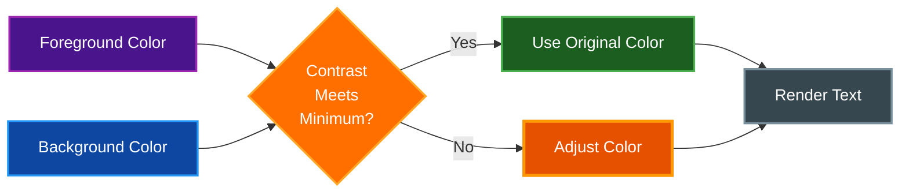

# Accessibility

par-term includes accessibility features to ensure terminal content is readable and usable for all users. This document covers contrast enforcement and related display options.

## Table of Contents

- [Minimum Contrast Enforcement](#minimum-contrast-enforcement)
  - [How It Works](#how-it-works)
  - [WCAG Standards](#wcag-standards)
  - [Configuration](#configuration)
  - [Settings UI](#settings-ui)
- [Related Display Options](#related-display-options)
- [Related Documentation](#related-documentation)

## Minimum Contrast Enforcement

Automatically adjusts text foreground colors when the contrast ratio against the background is too low, ensuring text is always readable regardless of the color scheme or application output.



### How It Works

The feature uses the WCAG (Web Content Accessibility Guidelines) luminance formula to calculate contrast ratios between text and background colors:

1. **Calculate relative luminance** for both foreground and background colors using gamma-corrected sRGB values
2. **Compute contrast ratio** using the formula: `(lighter + 0.05) / (darker + 0.05)`
3. **If contrast is below the minimum**, adjust the foreground color:
   - On **dark backgrounds** (luminance < 0.5): lighten the text toward white
   - On **light backgrounds** (luminance >= 0.5): darken the text toward black
4. **Preserve the alpha channel** so transparency settings are unaffected

The adjustment uses a binary search to find the minimal color change needed, preserving the original color as much as possible.

### WCAG Standards

| Level | Contrast Ratio | Recommended For |
|-------|---------------|-----------------|
| **Disabled** | 1.0:1 | No adjustment (default) |
| **WCAG AA** | 4.5:1 | Normal text accessibility |
| **WCAG AAA** | 7.0:1 | Enhanced accessibility |
| **Maximum** | 21.0:1 | Maximum possible contrast |

> **Tip:** Setting the value to **4.5** (WCAG AA) provides good readability for most users without dramatically altering color schemes.

### Configuration

```yaml
# Minimum contrast ratio (1.0 = disabled, 4.5 = WCAG AA, 7.0 = WCAG AAA)
minimum_contrast: 1.0
```

| Value | Effect |
|-------|--------|
| `1.0` | Disabled - no adjustment (default) |
| `1.0` - `4.5` | Custom low-contrast threshold |
| `4.5` | WCAG AA compliance for normal text |
| `7.0` | WCAG AAA compliance for normal text |
| `7.0` - `21.0` | Higher than AAA (very aggressive adjustment) |

### Settings UI

The minimum contrast slider is located in **Settings > Appearance > Colors**:

- **Slider range**: 1.0 to 7.0
- **Dynamic label** shows the current WCAG level:
  - "Disabled" when set to 1.0
  - "Custom" for values between 1.0 and 4.5
  - "WCAG AA (4.5:1)" for values at or above 4.5
  - "WCAG AAA (7:1)" for values at or above 7.0

Changes take effect immediately - no restart required.

## Related Display Options

These existing config options also affect text readability:

| Option | Description |
|--------|-------------|
| `font_antialias` | Toggle font smoothing for crisp text |
| `font_hinting` | Align glyphs to pixel boundaries for clarity |
| `font_thin_strokes` | Control stroke weight on HiDPI displays |
| `cursor_guide_enabled` | Horizontal line at cursor row for tracking |
| `keep_text_opaque` | Maintain text clarity with window transparency |

## Related Documentation

- [Window Management](WINDOW_MANAGEMENT.md) - Transparency and display settings
- [Keyboard Shortcuts](KEYBOARD_SHORTCUTS.md) - Keyboard shortcut reference
