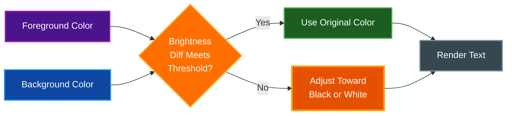

# Accessibility

par-term includes accessibility features to ensure terminal content is readable and usable for all users. This document covers contrast enhancement and related display options.

## Table of Contents

- [Minimum Contrast Enhancement](#minimum-contrast-enhancement)
  - [How It Works](#how-it-works)
  - [Configuration](#configuration)
  - [Settings UI](#settings-ui)
- [Related Display Options](#related-display-options)
- [Related Documentation](#related-documentation)

## Minimum Contrast Enhancement

Automatically adjusts text foreground colors to improve readability when the perceived brightness difference against the background is too low. This ensures text remains legible regardless of the color scheme or application output.


```mermaid
graph LR
    FG[Foreground Color]
    BG[Background Color]
    Check{Brightness<br/>Diff Meets<br/>Threshold?}
    Pass[Use Original Color]
    Adjust[Adjust Toward<br/>Black or White]
    Render[Render Text]

    FG --> Check
    BG --> Check
    Check -->|Yes| Pass
    Check -->|No| Adjust
    Pass --> Render
    Adjust --> Render

    style FG fill:#4a148c,stroke:#9c27b0,stroke-width:2px,color:#ffffff
    style BG fill:#0d47a1,stroke:#2196f3,stroke-width:2px,color:#ffffff
    style Check fill:#ff6f00,stroke:#ffa726,stroke-width:2px,color:#ffffff
    style Pass fill:#1b5e20,stroke:#4caf50,stroke-width:2px,color:#ffffff
    style Adjust fill:#e65100,stroke:#ff9800,stroke-width:3px,color:#ffffff
    style Render fill:#37474f,stroke:#78909c,stroke-width:2px,color:#ffffff
```

### How It Works

The feature uses iTerm2's perceived brightness algorithm (BT.601 luma coefficients) to calculate the brightness difference between foreground and background colors:

1. **Calculate perceived brightness** using the formula: `0.30*R + 0.59*G + 0.11*B`
2. **Compute brightness difference** as the absolute value of `fg_brightness - bg_brightness`
3. **If difference is below threshold**, adjust the foreground color toward black or white:
   - Moves darker text further toward black
   - Moves lighter text further toward white
   - Falls back to opposite direction if adjustment exceeds bounds
4. **Preserve the alpha channel** so transparency settings are unaffected

The adjustment is computed analytically to find the minimal color change needed, preserving the original color hue as much as possible.

### Configuration

```yaml
# Minimum contrast (0.0 = disabled, 0.99 = maximum boost toward black/white)
minimum_contrast: 0.0
```

| Value | Effect |
|-------|--------|
| `0.0` | Disabled - no adjustment (default) |
| `0.0` - `0.5` | Low contrast boost |
| `0.5` - `0.97` | High contrast boost |
| `0.97` - `0.99` | Maximum (near black & white) |

### Settings UI

The minimum contrast slider is located in **Settings > Appearance > Fonts**:

- **Slider range**: 0.0 to 0.99
- **Dynamic label** shows the current level:
  - "Disabled" when set to 0.0
  - "Low" for values between 0.0 and 0.5
  - "High" for values between 0.5 and 0.97
  - "Maximum (near B&W)" for values at or above 0.97

Changes take effect immediately - no restart required.

## Related Display Options

These config options also affect text readability and visual accessibility:

| Option | Description |
|--------|-------------|
| `font_antialias` | Toggle font smoothing for crisp text |
| `font_hinting` | Align glyphs to pixel boundaries for clarity |
| `font_thin_strokes` | Control stroke weight on HiDPI displays |
| `cursor_guide_enabled` | Horizontal line at cursor row for tracking |
| `keep_text_opaque` | Maintain text clarity with window transparency |

> **Tip:** For users with visual impairments, combining `minimum_contrast` with `cursor_guide_enabled` can significantly improve terminal readability.

## Related Documentation

- [Window Management](WINDOW_MANAGEMENT.md) - Transparency and display settings
- [Keyboard Shortcuts](KEYBOARD_SHORTCUTS.md) - Keyboard shortcut reference
- [Configuration Reference](CONFIG_REFERENCE.md) - Complete config options
