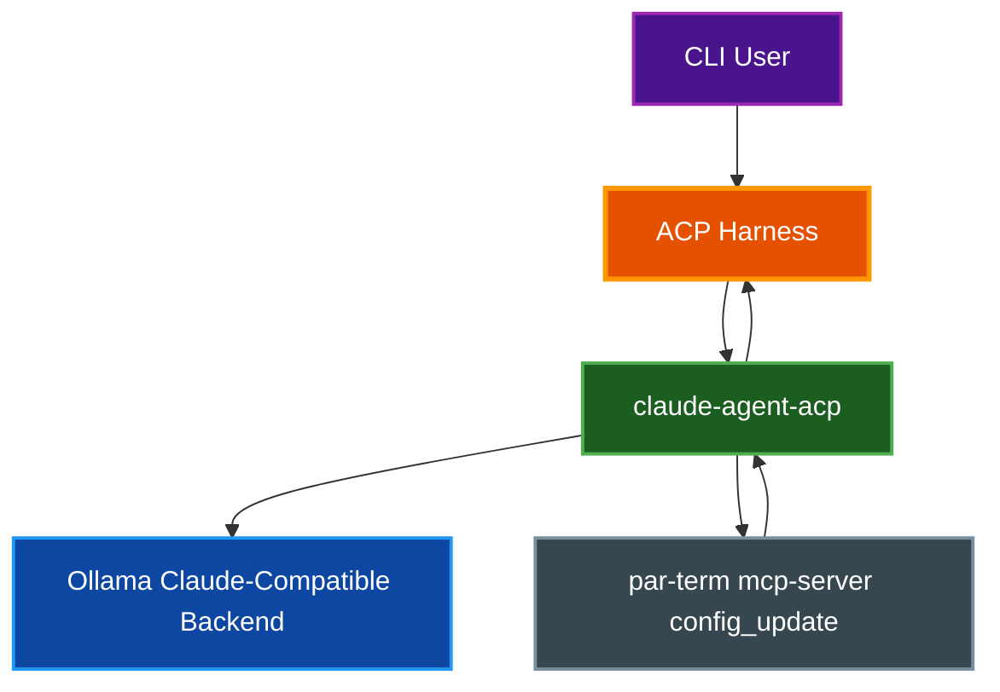

# ACP Harness

`par-term-acp-harness` is a CLI debugging tool for reproducing and analyzing Assistant Panel ACP agent behavior outside the GUI. It uses the same ACP transport, system prompt guidance, and shader-context injection as the Assistant Panel so you can debug Claude/Ollama agent failures from the terminal and capture repeatable transcripts.

## Table of Contents
- [Overview](#overview)
- [Prerequisites](#prerequisites)
- [How It Works](#how-it-works)
- [Usage](#usage)
  - [List Agents](#list-agents)
  - [Run the Default Shader Smoke Test](#run-the-default-shader-smoke-test)
  - [Run a Custom Prompt](#run-a-custom-prompt)
  - [Apply Config Updates](#apply-config-updates)
  - [Save a Transcript](#save-a-transcript)
- [Makefile Targets](#makefile-targets)
- [Examples](#examples)
- [Troubleshooting](#troubleshooting)
- [Related Documentation](#related-documentation)

## Overview

The ACP Harness is intended for debugging agent/runtime issues that are hard to isolate in the Assistant Panel UI, especially local backends such as Claude-compatible Ollama setups.

It is useful when you need to answer questions like:

- Did the agent connect successfully but fail during `session/prompt`?
- Did the model emit a bad tool call (for example `Write` with wrong parameters)?
- Did the model emit XML-style tool tags instead of structured ACP tool calls?
- Did the `config_update` MCP tool run and return a config update payload?
- Is the issue in the UI, the ACP bridge (`claude-agent-acp`), or the model/backend?

The harness reuses the same key par-term components used by the Assistant Panel:

- `par-term-acp::Agent` for the real ACP subprocess/session lifecycle
- Assistant Panel system guidance (`AGENT_SYSTEM_GUIDANCE`)
- Shader context injection (`build_shader_context()` / `should_inject_shader_context()`)
- Custom ACP agent discovery from bundled agents, `~/.config/par-term/agents/`, and `config.yaml` (`ai_inspector_custom_agents`)

This makes it a reliable repro tool for debugging issues before changing UI code.

## Prerequisites

Before using the harness, ensure the following are available:

- par-term source tree (run from the repo root)
- Rust toolchain (to build and run the harness binary)
- The ACP bridge for Claude custom agents: `claude-agent-acp`
- Your local backend (for example Ollama) running if you are testing a local Claude-compatible setup

Typical local Claude+Ollama setup:

```bash
npm install -g @zed-industries/claude-agent-acp
ollama launch claude --model qwen3-coder:latest
```

The harness reads your normal par-term configuration, so it can use the same custom agent entry you use in the Assistant Panel (for example `claude-ollama.local`).

## How It Works

The harness uses the same ACP agent session path as the Assistant Panel, but prints a verbose event stream to the terminal.



The harness prints:

- Connection status changes
- Tool calls and tool-call updates
- Permission requests and auto-selected permission options
- Agent chat text
- Config update payloads
- Prompt RPC completion/failure
- Idle timeout summaries and optional auto-recovery retries

## Usage

### List Agents

List all bundled and custom ACP agents visible to the harness:

```bash
cargo run --bin par-term-acp-harness -- --list-agents
```

This is the fastest way to confirm your `config.yaml` custom agent (for example `claude-ollama.local`) is being loaded correctly.

### Run the Default Shader Smoke Test

The harness includes a default shader prompt that reproduces a common Assistant Panel shader workflow:

```bash
cargo run --bin par-term-acp-harness -- --agent claude-ollama.local
```

The default prompt asks the agent to:

- Create a new background-only shader
- Use a procedural checker pattern
- Add a vortex/pull-in effect
- Set the shader as active

### Run a Custom Prompt

Use `--prompt` to test a different request:

```bash
cargo run --bin par-term-acp-harness -- \
  --agent claude-ollama.local \
  --prompt "set shader to rain"
```

### Apply Config Updates

By default, the harness prints `config_update` payloads but does not write them to your config file.

Use `--apply-config-updates` to apply updates to your real par-term `config.yaml`:

```bash
cargo run --bin par-term-acp-harness -- \
  --agent claude-ollama.local \
  --apply-config-updates
```

**Important:** This modifies your actual par-term configuration file.

### Save a Transcript

Use `--transcript-file` to save a copy of the harness output for debugging or sharing:

```bash
cargo run --bin par-term-acp-harness -- \
  --agent claude-ollama.local \
  --transcript-file /tmp/par-term-acp-harness.log
```

This is useful when reproducing intermittent model behavior, tool-call failures, or prompt stalls.

## Makefile Targets

Two convenience targets are available in the project `Makefile`:

- `make acp-harness`: Runs the harness and passes through `ARGS`
- `make acp-smoke`: Runs a reproducible Claude+Ollama smoke test with a transcript file

Examples:

```bash
make acp-harness ARGS="--list-agents"
```

```bash
make acp-smoke
```

Override the smoke test defaults:

```bash
make acp-smoke \
  ACP_AGENT=claude-ollama.local \
  ACP_TIMEOUT=60 \
  ACP_IDLE_TIMEOUT=8 \
  ACP_TRANSCRIPT=/tmp/acp-smoke.log
```

## Examples

### Debug a `Write` Tool Failure

Use the smoke test or a custom prompt, then inspect the transcript for:

- `[tool] Write ... status=pending`
- `[tool-update] ... status=failed`
- XML-style fallback output such as `<function=Write>`

This helps distinguish:

- Agent/model behavior errors
- ACP bridge/tool schema issues
- Assistant Panel rendering issues

### Debug a Prompt Stall

If the model connects but produces no session updates, the harness will still show:

- `[status] Connecting`
- `[status] Connected`
- Idle timeout summary

This indicates the issue is likely after session creation (backend/model behavior), not the initial ACP handshake.

## Troubleshooting

### Agent Not Found

If you see "Agent not found":

- Run `--list-agents`
- Confirm the `identity` in your `config.yaml` custom agent entry
- Confirm your custom agent is in `ai_inspector_custom_agents`

### `claude-agent-acp` Not Installed

Install the bridge and retry:

```bash
make install-acp
```

### No Model Responses (Connected but Idle)

Check that your local backend is running and the configured model is available:

```bash
ollama launch claude --model qwen3-coder:latest
```

Also confirm your custom agent environment variables (for example `ANTHROPIC_BASE_URL`, `ANTHROPIC_MODEL`) are correct in `config.yaml`.

### Unexpected Tool Calls (`Skill`, malformed `Write`, XML tags)

The harness is designed to reproduce these failures exactly. Save a transcript and compare runs after prompt-guidance or ACP-host changes:

```bash
make acp-smoke ACP_TRANSCRIPT=/tmp/acp-debug.log
```

## Related Documentation

- [Assistant Panel](ASSISTANT_PANEL.md) - Assistant Panel ACP behavior, custom agents, and Claude+Ollama setup
- [Logging](LOGGING.md) - par-term logging and debug log workflows
- [Custom Shaders](CUSTOM_SHADERS.md) - Shader authoring and debugging guidance
- [Documentation Style Guide](DOCUMENTATION_STYLE_GUIDE.md) - Documentation standards used for this file
