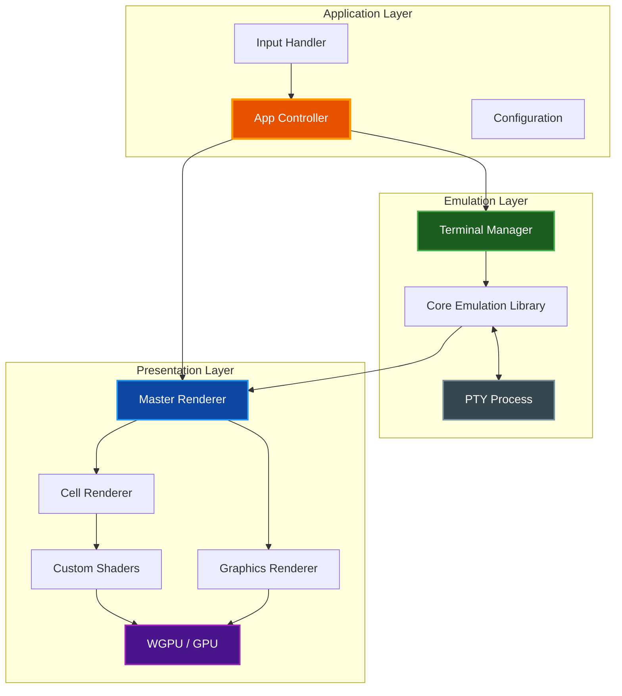
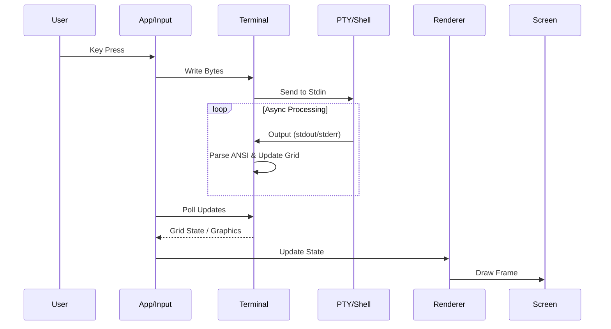

# System Architecture

This document provides a high-level overview of the `par-term` architecture, detailing its core components, data flow, and rendering pipeline.

## Table of Contents
- [Overview](#overview)
- [High-Level Architecture](#high-level-architecture)
- [Core Components](#core-components)
  - [Application Logic](#application-logic)
  - [Terminal Emulation](#terminal-emulation)
  - [Rendering Engine](#rendering-engine)
  - [Text & Font Handling](#text--font-handling)
- [Data Flow](#data-flow)
- [Threading Model](#threading-model)
- [Related Documentation](#related-documentation)

## Overview

`par-term` is a GPU-accelerated, cross-platform terminal emulator frontend written in Rust. It leverages the [par-term-emu-core-rust](https://github.com/paulrobello/par-term-emu-core-rust) library for VT emulation and PTY management, while providing a modern rendering pipeline using `wgpu`.

**Key Architectural Goals:**
*   **Performance:** GPU-based rendering for high frame rates and low latency.
*   **Modularity:** Separation of concerns between UI, emulation, and rendering.
*   **Cross-Platform:** Native support for macOS (Metal), Windows (DirectX 12), and Linux (Vulkan/X11).
*   **Extensibility:** Support for custom shaders and advanced graphics protocols (Sixel, iTerm2, Kitty).

## High-Level Architecture

The system is composed of three primary layers: the Application Layer (handling OS events and state), the Emulation Layer (managing the PTY and VT state), and the Presentation Layer (rendering to the screen).

## Core Components

### Application Logic

*   **App (`src/app.rs`)**: The central coordinator. It initializes the application, manages the main event loop (via `winit`), and orchestrates communication between the input, terminal, and renderer.
*   **Input Handler (`src/input.rs`)**: Translates OS window events (keyboard, mouse) into terminal input sequences or application commands (e.g., shortcuts for copy/paste).
*   **Configuration (`src/config.rs`)**: Manages settings loaded from YAML files, handling platform-specific paths (`%APPDATA%` vs `~/.config`).

### Terminal Emulation

*   **Terminal Manager (`src/terminal.rs`)**: A wrapper around the core emulation library. It exposes a thread-safe API for the UI to interact with the underlying PTY session.
*   **Core Library**: Uses `par-term-emu-core-rust` for:
    *   VT100/ANSI escape sequence parsing.
    *   Grid management and scrollback history.
    *   PTY process lifecycle (spawning shell, resizing, I/O).

### Rendering Engine

*   **Renderer (`src/renderer.rs`)**: The high-level rendering coordinator. It manages the `wgpu` surface and delegates tasks to specialized sub-renderers.
*   **Cell Renderer (`src/cell_renderer.rs`)**: Responsible for drawing the text grid. It uploads cell data (characters, colors, attributes) to the GPU.
*   **Graphics Renderer (`src/graphics_renderer.rs`)**: Handles overlay graphics like Sixel, iTerm2 images, and Kitty graphics.
*   **Custom Shaders (`src/custom_shader_renderer.rs`)**: Provides post-processing effects using GLSL shaders (compatible with Shadertoy/Ghostty).

### Text & Font Handling

*   **Font Manager (`src/font_manager.rs`)**: Handles font discovery and fallback. It supports:
    *   **Primary Font**: The main user-configured monospace font.
    *   **Styled Variants**: Separate fonts for Bold, Italic, etc.
    *   **Range Fonts**: Specific fonts for Unicode ranges (e.g., CJK, Emoji).
    *   **Fallbacks**: System font fallback for missing glyphs.
*   **Text Shaper (`src/text_shaper.rs`)**: Uses `rustybuzz` (HarfBuzz) to shape text, handling ligatures, complex scripts, and combining characters correctly. Rasterization is performed by `swash`.

## Data Flow

The flow of data from user input to screen update is bidirectional.

1.  **Input**: User presses a key; `InputHandler` converts it to bytes.
2.  **Transmission**: Bytes are sent to the PTY via `TerminalManager`.
3.  **Processing**: The shell (e.g., zsh, bash) processes input and writes output.
4.  **Emulation**: The core library parses the output, updating the internal grid state.
5.  **Presentation**: The `App` polls for changes (or is notified) and triggers the `Renderer` to draw the new state to the `Screen`.

## Threading Model

`par-term` employs a hybrid threading model to ensure UI responsiveness.

*   **Main Thread**: Handles the OS event loop (`winit`), UI events, and rendering commands. This is critical as many OS windowing operations must occur on the main thread.
*   **Async Runtime (Tokio)**: A separate thread pool manages asynchronous tasks, primarily:
    *   Reading from and writing to the PTY.
    *   Handling timers (e.g., cursor blink, visual bell).
    *   Managing clipboard synchronization.

Access to shared resources (like the Terminal state) is managed via `parking_lot::Mutex` to prevent contention and ensure safety.

## Related Documentation

*   [Documentation Style Guide](../docs/DOCUMENTATION_STYLE_GUIDE.md) - Standards for project documentation.
*   [Compositor Architecture](../docs/COMPOSITOR.md) - Deep dive into the GPU rendering pipeline and shader system.
*   [API Reference](../docs/API_DOCUMENTATION.md) - (Placeholder) Future detailed API docs.
