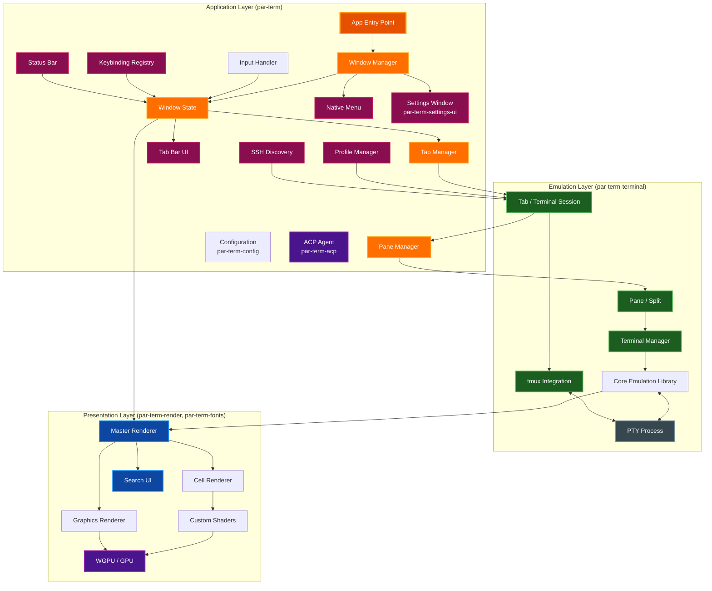
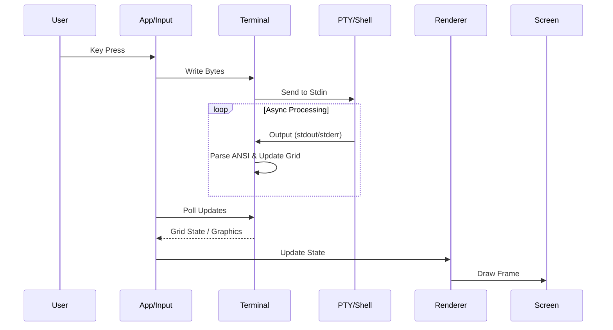
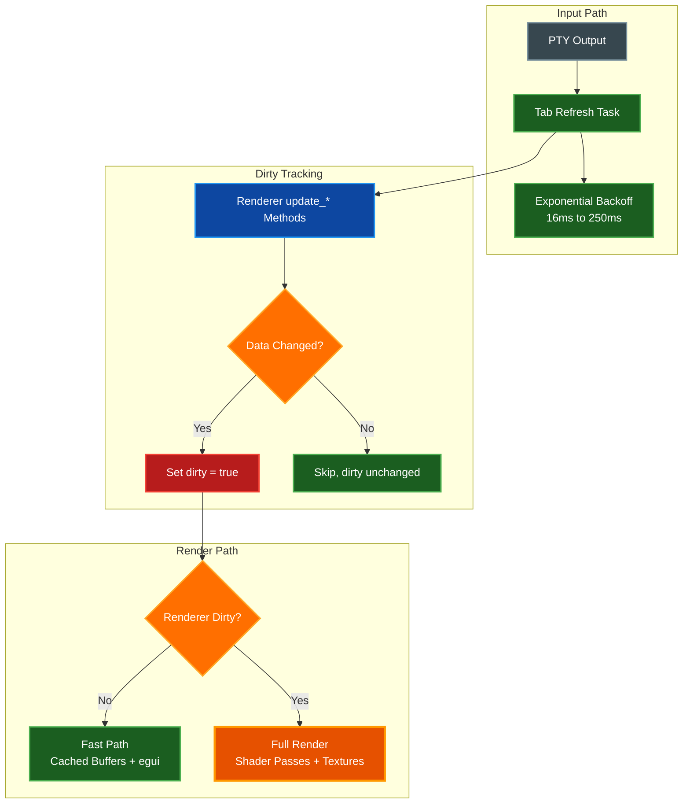

# System Architecture

This document provides a high-level overview of the `par-term` architecture, detailing its core components, data flow, and rendering pipeline.

## Table of Contents
- [Overview](#overview)
- [High-Level Architecture](#high-level-architecture)
- [Workspace Crate Architecture](#workspace-crate-architecture)
- [Core Components](#core-components)
  - [Application Logic](#application-logic)
  - [Terminal Emulation](#terminal-emulation)
  - [Pane & Tab Management](#pane--tab-management)
  - [tmux Integration](#tmux-integration)
  - [Rendering Engine](#rendering-engine)
  - [Text & Font Handling](#text--font-handling)
  - [Additional Features](#additional-features)
- [Data Flow](#data-flow)
- [Threading Model](#threading-model)
- [Performance Optimizations](#performance-optimizations)
  - [Conditional Dirty Tracking](#conditional-dirty-tracking)
  - [Fast Render Path](#fast-render-path)
  - [Adaptive Polling with Exponential Backoff](#adaptive-polling-with-exponential-backoff)
  - [Event Loop Sleep on macOS](#event-loop-sleep-on-macos)
  - [Status Bar Skip Updates When Hidden](#status-bar-skip-updates-when-hidden)
  - [Inactive Tab Refresh Throttling](#inactive-tab-refresh-throttling)
- [GPU Resource Lifecycle](#gpu-resource-lifecycle)
  - [Surface and Device](#surface-and-device)
  - [Glyph Atlas](#glyph-atlas)
  - [Inline Graphics Textures](#inline-graphics-textures)
  - [Custom Shader Resources](#custom-shader-resources)
  - [Frame Timing and FPS Overlay](#frame-timing-and-fps-overlay)
- [Related Documentation](#related-documentation)

## Overview

`par-term` is a GPU-accelerated, cross-platform terminal emulator frontend written in Rust. It leverages the [par-term-emu-core-rust](https://github.com/paulrobello/par-term-emu-core-rust) library for VT emulation and PTY management, while providing a modern rendering pipeline using `wgpu`.

**Key Architectural Goals:**
*   **Performance:** GPU-based rendering for high frame rates and low latency.
*   **Modularity:** Separation of concerns between UI, emulation, and rendering.
*   **Cross-Platform:** Native support for macOS (Metal), Windows (DirectX 12), and Linux (Vulkan/X11).
*   **Extensibility:** Support for custom shaders and advanced graphics protocols (Sixel, iTerm2, Kitty).

## High-Level Architecture

The system is composed of three primary layers: the Application Layer (handling OS events, state, and multi-tab management), the Emulation Layer (managing PTY sessions and VT state), and the Presentation Layer (rendering to the screen).

## Workspace Crate Architecture

The par-term project uses a Cargo workspace to split functionality into focused crates, improving compile times, enforcing dependency boundaries, and enabling independent testing.

```mermaid
graph TD
    Main[par-term<br>Main Binary]
    ACP[par-term-acp<br>ACP Protocol & Agent Management]
    Config[par-term-config<br>Configuration, Cell, ScrollbackMark, PaneId, TabId]
    Fonts[par-term-fonts<br>Font Management & Text Shaping]
    Terminal[par-term-terminal<br>Terminal Manager & Scrollback]
    Render[par-term-render<br>GPU Rendering Engine]
    Settings[par-term-settings-ui<br>Settings Tabs & Sidebar]
    Input[par-term-input<br>Input Sequence Generation]
    Keybind[par-term-keybindings<br>Keybinding Registry & Matching]
    Scripting[par-term-scripting<br>Observer & Scripting System]
    Update[par-term-update<br>Self-Update & Update Checker]
    MCP[par-term-mcp<br>MCP Stdio Server]
    SSH[par-term-ssh<br>SSH Host Discovery]
    Tmux[par-term-tmux<br>tmux Control Mode]

    Main --> ACP
    Main --> Config
    Main --> Fonts
    Main --> Terminal
    Main --> Render
    Main --> Settings
    Main --> Input
    Main --> Keybind
    Main --> Scripting
    Main --> Update
    Main --> MCP
    Main --> SSH
    Main --> Tmux

    Terminal --> Config
    Render --> Config
    Render --> Fonts
    Settings --> Config
    Settings --> Fonts
    Settings --> Render
    Input --> Config
    Keybind --> Config
    Scripting --> Config
    Tmux --> Config
    Tmux --> Terminal

    style Main fill:#e65100,stroke:#ff9800,stroke-width:3px,color:#ffffff
    style ACP fill:#4a148c,stroke:#9c27b0,stroke-width:2px,color:#ffffff
    style Config fill:#1b5e20,stroke:#4caf50,stroke-width:2px,color:#ffffff
    style Fonts fill:#0d47a1,stroke:#2196f3,stroke-width:2px,color:#ffffff
    style Terminal fill:#1b5e20,stroke:#4caf50,stroke-width:2px,color:#ffffff
    style Render fill:#0d47a1,stroke:#2196f3,stroke-width:2px,color:#ffffff
    style Settings fill:#880e4f,stroke:#c2185b,stroke-width:2px,color:#ffffff
    style Input fill:#880e4f,stroke:#c2185b,stroke-width:2px,color:#ffffff
    style Keybind fill:#880e4f,stroke:#c2185b,stroke-width:2px,color:#ffffff
    style Scripting fill:#880e4f,stroke:#c2185b,stroke-width:2px,color:#ffffff
    style Update fill:#880e4f,stroke:#c2185b,stroke-width:2px,color:#ffffff
    style MCP fill:#880e4f,stroke:#c2185b,stroke-width:2px,color:#ffffff
    style SSH fill:#880e4f,stroke:#c2185b,stroke-width:2px,color:#ffffff
    style Tmux fill:#880e4f,stroke:#c2185b,stroke-width:2px,color:#ffffff
```

### Crate Responsibilities

| Crate | Description |
|-------|-------------|
| **par-term** | Main binary crate. Application entry point, window management, event loop, and orchestration. Re-exports key types from sub-crates for backward compatibility. |
| **par-term-acp** | ACP (Agent Communication Protocol) implementation and agent lifecycle management. |
| **par-term-config** | Configuration loading and serialization (`Config` struct), shared types (`Cell`, `ScrollbackMark`, `PaneId`, `TabId`), and configuration file watching. |
| **par-term-fonts** | Font discovery, loading, and fallback chain (`FontManager`, `FontData`). Text shaping via `TextShaper` (HarfBuzz/rustybuzz). |
| **par-term-terminal** | Terminal session management (`TerminalManager`), scrollback buffer, styled content extraction, and PTY interaction wrappers. |
| **par-term-render** | GPU rendering engine: cell renderer, graphics renderer (Sixel/iTerm2/Kitty), custom shader renderer, WGSL shaders, and glyph atlas management. |
| **par-term-settings-ui** | All 28 settings tab modules (appearance, window, terminal, input, effects, notifications, integrations, advanced, etc.), sidebar navigation, and section helper utilities. |
| **par-term-input** | Input sequence generation — translates keyboard/mouse events into VT escape sequences for terminal input. |
| **par-term-keybindings** | Keybinding parsing, matching, and registry with platform-aware modifier handling (`CmdOrCtrl`). |
| **par-term-scripting** | Observer pattern and scripting system for event-driven automation. |
| **par-term-update** | Self-update system and update checker with manifest parsing and version comparison. |
| **par-term-mcp** | MCP (Model Context Protocol) stdio server for AI agent integration. Independently publishable with zero internal crate dependencies. |
| **par-term-ssh** | SSH host discovery via config parsing, known hosts scanning, history scanning, and mDNS/Bonjour discovery. |
| **par-term-tmux** | tmux control mode integration — session lifecycle, bidirectional state sync, and control protocol command builders. |

### Backward Compatibility

All public types from workspace crates are re-exported from the main `par-term` crate. Existing code that imports from the top-level crate continues to work without modification.

## Core Components

### Application Logic

*   **App (`src/app/mod.rs`)**: The entry point that initializes configuration and runs the event loop via `winit`.
*   **WindowManager (`src/app/window_manager.rs`)**: Coordinates multiple terminal windows, handles native menu events, manages the standalone settings window, and applies configuration changes across all windows.
*   **WindowState (`src/app/window_state/`)**: Per-window state module containing tab manager, renderer, input handler, keybinding registry, and shader metadata caches — decomposed into focused sub-modules including `render_pipeline.rs`, `agent_messages.rs`, and state components (AgentState, TmuxState, OverlayUiState).
*   **Input Handler (`par-term-input`)**: Translates OS window events (keyboard, mouse) into terminal input sequences or application commands (e.g., shortcuts for copy/paste).
*   **Keybindings (`par-term-keybindings`)**: Configurable keyboard shortcut system with key combo parsing, platform-aware modifier handling (`CmdOrCtrl`), and action registry.
*   **Menu (`src/menu/mod.rs`)**: Native cross-platform menu bar using `muda` (macOS global menu, Windows/Linux per-window menus).
*   **Configuration (`par-term-config`)**: Manages settings loaded from YAML files, handling platform-specific paths (`%APPDATA%` vs `~/.config`). Includes shader metadata caching and file watching.
*   **Settings Window (`src/settings_window.rs`)**: Standalone egui window for configuration, separate from the main terminal window for better usability.
*   **Settings UI (`par-term-settings-ui`)**: egui-based settings interface with consolidated tabs: Appearance, Window, Terminal, Input, Effects, Notifications, Integrations, and Advanced.
*   **Profile Manager (`src/profile/`)**: iTerm2-style profile system for saving terminal session configurations (working directory, custom commands, tab names). Profiles stored in `~/.config/par-term/profiles.yaml`.
*   **Scripting (`par-term-scripting`)**: Observer pattern implementation for event-driven automation and shell integration callbacks.
*   **Update System (`par-term-update`)**: Self-update mechanism with manifest parsing, version comparison, and download/extraction logic.
*   **MCP Server (`par-term-mcp`)**: Model Context Protocol stdio server for AI agent integration.

### Terminal Emulation

*   **Terminal Manager (`src/terminal/mod.rs`)**: A wrapper around the core emulation library. It exposes a thread-safe API for the UI to interact with the underlying PTY session.
*   **Shell Spawning (`src/terminal/spawn.rs`)**: Handles shell process creation and login shell initialization.
*   **Graphics (`src/terminal/graphics.rs`)**: Manages Sixel and inline graphics metadata.
*   **Clipboard (`src/terminal/clipboard.rs`)**: Clipboard history and OSC 52 synchronization.
*   **Hyperlinks (`src/terminal/hyperlinks.rs`)**: OSC 8 hyperlink tracking and URL detection.
*   **Core Library**: Uses `par-term-emu-core-rust` for:
    *   VT100/ANSI escape sequence parsing.
    *   Grid management and scrollback history.
    *   PTY process lifecycle (spawning shell, resizing, I/O).

### Pane & Tab Management

*   **TabManager (`src/tab/manager.rs`)**: Manages multiple terminal tabs within a window, handling tab creation, switching, reordering, and cleanup.
*   **Tab (`src/tab/mod.rs`)**: Represents a single terminal session with its own terminal, scroll state, mouse state, bell state, render cache, and pane tree.
*   **TabBarUI (`src/tab_bar_ui.rs`)**: egui-based tab bar renderer with click handling, close buttons, activity indicators, and bell icons.
*   **PaneManager (`src/pane/manager.rs`)**: Coordinates pane operations within a tab, managing split creation, resizing, and navigation.
*   **Pane (`src/pane/types.rs`)**: Represents a single terminal pane with its own state. Uses a tree structure (`PaneNode`) for nested splits.

### tmux Integration (`par-term-tmux`)

*   **TmuxSession**: Lifecycle and state management for tmux control mode connections.
*   **TmuxSync**: Bidirectional state synchronization between par-term and tmux.
*   **TmuxCommand**: Command builders for the tmux control protocol.
*   **ParserBridge**: Bridges the core library's control mode parser with par-term's pane system.
*   **Types**: Core data types including `TmuxWindow`, `TmuxPane`, `TmuxLayout`.

### Rendering Engine

*   **Renderer (`src/renderer/mod.rs`)**: The high-level rendering coordinator. It manages the `wgpu` surface and delegates tasks to specialized sub-renderers.
*   **Cell Renderer (`src/cell_renderer/mod.rs`)**: Responsible for drawing the text grid. Includes glyph atlas management (`atlas.rs`), background images (`background.rs`), and the core render loop (`render.rs`).
*   **Graphics Renderer (`src/graphics_renderer.rs`)**: Handles overlay graphics like Sixel, iTerm2 images, and Kitty graphics.
*   **Custom Shaders (`src/custom_shader_renderer/`)**: Provides post-processing effects using GLSL shaders (compatible with Shadertoy/Ghostty). Includes GLSL-to-WGSL transpilation via `naga`, channel texture management (`textures.rs`) for iChannel1-4 inputs, and uniform handling (`types.rs`).

### Text & Font Handling

*   **Font Manager (`src/font_manager/mod.rs`)**: Handles font discovery and fallback. It supports:
    *   **Primary Font**: The main user-configured monospace font.
    *   **Styled Variants**: Separate fonts for Bold, Italic, etc.
    *   **Range Fonts**: Specific fonts for Unicode ranges (e.g., CJK, Emoji).
    *   **Fallbacks**: System font fallback for missing glyphs (`fallbacks.rs`).
*   **Text Shaper (`src/text_shaper.rs`)**: Uses `rustybuzz` (HarfBuzz) to shape text, handling ligatures, complex scripts, and combining characters correctly. Rasterization is performed by `swash`.

### Additional Features

*   **Search (`src/search/`)**: Terminal search functionality with regex support, debounced search, and match highlighting. Includes egui-based search bar overlay.
*   **Session Logger (`src/session_logger.rs`)**: Records terminal sessions to files for replay or audit.
*   **Update Checker (`par-term-update`)**: Checks for new versions of par-term.
*   **Smart Selection (`src/smart_selection.rs`)**: Intelligent text selection with word/path/URL detection.
*   **Paste Transform (`src/paste_transform.rs`)**: Transforms pasted content (bracketed paste, newline handling).
*   **Shell Integration Installer (`src/shell_integration_installer.rs`)**: Installs shell integration scripts for enhanced features.
*   **Shader Installer (`src/shader_installer.rs`)**: Manages installation of custom shaders from the shader gallery.

### SSH System (`par-term-ssh`)

*   **SSH Config Parser**: Parses `~/.ssh/config` for host entries with wildcard filtering, multi-host blocks, and ProxyJump support.
*   **Known Hosts Parser**: Extracts previously-connected hosts from `~/.ssh/known_hosts` with hashed entry skipping and bracketed `[host]:port` support.
*   **History Scanner**: Scans bash/zsh/fish history files for previously-used SSH connections.
*   **mDNS Discovery**: Discovers SSH services on the local network via `_ssh._tcp.local.` Bonjour/mDNS browsing (opt-in).
*   **Discovery Aggregator**: Combines hosts from all sources with deduplication.
*   **Quick Connect UI (`src/ssh_connect_ui.rs`)**: egui dialog with fuzzy search, keyboard navigation, and source grouping.

### Status Bar

*   **StatusBarUI (`src/status_bar/mod.rs`)**: egui-based status bar renderer with three-section layout (left/center/right).
*   **Widget System (`src/status_bar/widgets.rs`)**: Trait-based architecture for 10 built-in widgets (clock, git branch, CPU/memory usage, network status, etc.).
*   **System Monitor (`src/status_bar/system_monitor.rs`)**: Background thread polling CPU, memory, and network metrics at configurable intervals.
*   **Configuration**: Per-widget enable/disable, section assignment, and styling options with auto-hide on fullscreen or mouse inactivity.

## Data Flow

The flow of data from user input to screen update is bidirectional.

1.  **Input**: User presses a key; `InputHandler` converts it to bytes.
2.  **Transmission**: Bytes are sent to the PTY via `TerminalManager`.
3.  **Processing**: The shell (e.g., zsh, bash) processes input and writes output.
4.  **Emulation**: The core library parses the output, updating the internal grid state.
5.  **Presentation**: The `App` polls for changes (or is notified) and triggers the `Renderer` to draw the new state to the `Screen`.

## Threading Model

`par-term` employs a hybrid threading model to ensure UI responsiveness.

*   **Main Thread**: Handles the OS event loop (`winit`), UI events, and rendering commands. This is critical as many OS windowing operations must occur on the main thread.
*   **Async Runtime (Tokio)**: A separate thread pool manages asynchronous tasks, primarily:
    *   Reading from and writing to the PTY.
    *   Handling timers (e.g., cursor blink, visual bell).
    *   Managing clipboard synchronization.

Access to shared resources (like the Terminal state) is managed via `parking_lot::Mutex` to prevent contention and ensure safety.

## Performance Optimizations

`par-term` employs several techniques to minimize CPU and GPU usage when the terminal is idle, reducing power consumption and freeing resources for other applications.

### Conditional Dirty Tracking

The renderer's `update_*` methods (`update_cells`, `update_cursor`, `clear_cursor`, `update_scrollbar`, `set_separator_marks`, `set_cursor_hidden_for_shader`, `set_focused`) return a `bool` indicating whether data actually changed. The outer `Renderer` wrapper only sets `dirty = true` when the inner method reports a change. This prevents unnecessary GPU re-renders when the terminal content is static, which is the common case for an idle terminal displaying a prompt.

### Fast Render Path

When the renderer is not dirty and no custom shader animation is active, the single-pane `render()` method uses a fast path that renders cells from cached GPU buffers plus the egui overlay. This skips expensive operations including shader passes, Sixel texture uploads, and cursor shader rendering. The fast path significantly reduces GPU workload during idle periods while still allowing the egui overlay (tab bar, search bar, status bar) to update independently.

### Adaptive Polling with Exponential Backoff

Tab and pane refresh tasks use exponential backoff when the terminal is idle. Starting at 16ms, the polling interval doubles on each consecutive idle poll (16 -> 32 -> 64 -> 128 -> 250ms max). The interval resets to 16ms immediately when new data arrives from the PTY. This reduces idle wakeups from approximately 62.5/s to approximately 4/s, substantially lowering CPU usage for terminals sitting at a shell prompt.

### Event Loop Sleep on macOS

An explicit `thread::sleep` in the `about_to_wait` handler prevents the macOS event loop from spinning at approximately 250K iterations/sec. This spin occurs despite using `ControlFlow::WaitUntil` due to interactions between CVDisplayLink and NSRunLoop on macOS. The sleep duration is capped at the frame interval when no redraw is needed, ensuring the loop remains responsive to incoming events while avoiding unnecessary CPU burn.

### Status Bar Skip Updates When Hidden

When the status bar is enabled but hidden (fullscreen auto-hide or mouse inactivity timeout), per-frame widget updates, session variable capture, and rendering are skipped entirely. This avoids the cost of polling system metrics (CPU, memory, network) and running egui layout calculations for a UI element that is not visible.

### Inactive Tab Refresh Throttling

Inactive tabs poll for terminal updates at a reduced rate configured by the `inactive_tab_fps` setting. This allows background tabs to continue processing PTY output (preventing buffer stalls) while consuming far less CPU than the active tab's full refresh rate.

## GPU Resource Lifecycle

par-term's GPU resources follow a predictable lifecycle that maps directly onto the
state hierarchy described above.

### Surface and Device

The wgpu surface and device are created once when `WindowState` is initialized. They are
stored inside the `Renderer` struct, which is owned by `WindowState`. When the window is
resized, the surface is reconfigured (not recreated) with the new dimensions. The device
is released when `WindowState` is dropped.

### Glyph Atlas

The glyph atlas is a GPU texture that caches rasterized glyphs. New glyphs are added on
demand during the Cell Pass. The atlas is invalidated and rebuilt when the font or font
size changes (`rebuild_renderer` in `src/app/window_state/renderer_ops.rs`). Atlas
overflow is handled by evicting the least-recently-used glyphs.

### Inline Graphics Textures

Sixel, iTerm2, and Kitty graphics are decoded to RGBA on the CPU and uploaded to GPU
textures during the Graphics Pass. Textures are cached by their content hash. When a
graphic scrolls off screen, its texture is evicted from the cache. Prettifier-rendered
graphics (Mermaid diagrams, etc.) are treated identically — they produce RGBA byte
buffers that enter the same texture cache.

### Custom Shader Resources

Custom background and cursor shaders have their own pipeline objects (created on
shader load) and `iChannel` textures. Shader hot-reload (`shader_hot_reload = true` in
config) watches the shader files on disk. When a change is detected, the transpilation
and pipeline rebuild happen on the main thread before the next frame. The old pipeline is
released after the new one is successfully compiled.

### Frame Timing and FPS Overlay

Frame timing is tracked via a rolling window of recent frame durations. The FPS overlay
(enabled via the settings UI) reads from this rolling average each frame. Frame timing
data is stored as a fixed-size circular buffer inside `WindowState`; it is not persisted
and resets on window close.

## Related Documentation

- [Documentation Style Guide](DOCUMENTATION_STYLE_GUIDE.md) - Standards for project documentation.
- [Compositor Architecture](COMPOSITOR.md) - Deep dive into the GPU rendering pipeline and shader system.
- [Custom Shaders Guide](CUSTOM_SHADERS.md) - Installing and creating custom GLSL shaders.
- [SSH Host Management](SSH.md) - SSH host discovery and quick connect system.
- [Status Bar](STATUS_BAR.md) - Status bar widgets and system monitoring.
- [State Lifecycle](STATE_LIFECYCLE.md) - When state objects are created, updated, and destroyed.
- [Concurrency Guide](CONCURRENCY.md) - Mutex strategy and threading model.
