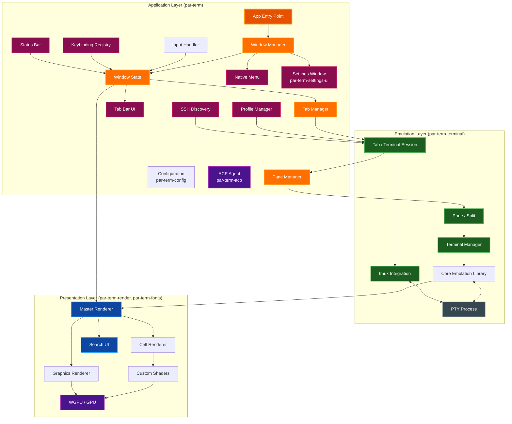
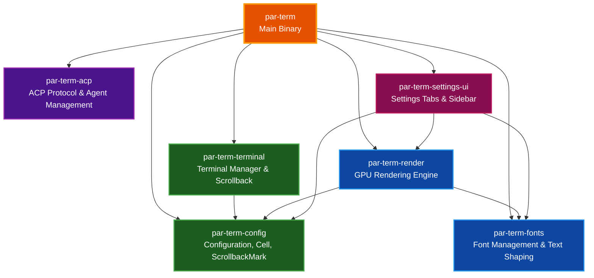
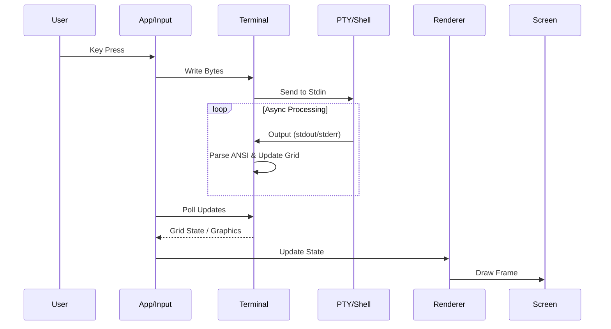

# System Architecture

This document provides a high-level overview of the `par-term` architecture, detailing its core components, data flow, and rendering pipeline.

## Table of Contents
- [Overview](#overview)
- [High-Level Architecture](#high-level-architecture)
- [Workspace Crate Architecture](#workspace-crate-architecture)
- [Core Components](#core-components)
  - [Application Logic](#application-logic)
  - [Terminal Emulation](#terminal-emulation)
  - [Pane & Tab Management](#pane--tab-management)
  - [tmux Integration](#tmux-integration)
  - [Rendering Engine](#rendering-engine)
  - [Text & Font Handling](#text--font-handling)
  - [Additional Features](#additional-features)
- [Data Flow](#data-flow)
- [Threading Model](#threading-model)
- [Related Documentation](#related-documentation)

## Overview

`par-term` is a GPU-accelerated, cross-platform terminal emulator frontend written in Rust. It leverages the [par-term-emu-core-rust](https://github.com/paulrobello/par-term-emu-core-rust) library for VT emulation and PTY management, while providing a modern rendering pipeline using `wgpu`.

**Key Architectural Goals:**
*   **Performance:** GPU-based rendering for high frame rates and low latency.
*   **Modularity:** Separation of concerns between UI, emulation, and rendering.
*   **Cross-Platform:** Native support for macOS (Metal), Windows (DirectX 12), and Linux (Vulkan/X11).
*   **Extensibility:** Support for custom shaders and advanced graphics protocols (Sixel, iTerm2, Kitty).

## High-Level Architecture

The system is composed of three primary layers: the Application Layer (handling OS events, state, and multi-tab management), the Emulation Layer (managing PTY sessions and VT state), and the Presentation Layer (rendering to the screen).

## Workspace Crate Architecture

The par-term project uses a Cargo workspace to split functionality into focused crates, improving compile times, enforcing dependency boundaries, and enabling independent testing.

### Crate Responsibilities

| Crate | Description |
|-------|-------------|
| **par-term** | Main binary crate. Application entry point, window management, event loop, and orchestration. Re-exports key types from sub-crates for backward compatibility. |
| **par-term-acp** | ACP (Agent Communication Protocol) implementation and agent lifecycle management. |
| **par-term-config** | Configuration loading and serialization (`Config` struct), the `Cell` type, `ScrollbackMark`, and shared data types used across crates. |
| **par-term-fonts** | Font discovery, loading, and fallback chain (`FontManager`, `FontData`). Text shaping via `TextShaper` (HarfBuzz/rustybuzz). |
| **par-term-terminal** | Terminal session management (`TerminalManager`), scrollback buffer, styled content extraction, and PTY interaction wrappers. |
| **par-term-render** | GPU rendering engine: cell renderer, graphics renderer (Sixel/iTerm2/Kitty), custom shader renderer, WGSL shaders, and glyph atlas management. |
| **par-term-settings-ui** | All 28 settings tab modules (appearance, window, terminal, input, effects, notifications, integrations, advanced, etc.), sidebar navigation, and section helper utilities. |

### Backward Compatibility

All public types from workspace crates are re-exported from the main `par-term` crate. Existing code that imports from the top-level crate continues to work without modification.

## Core Components

### Application Logic

*   **App (`src/app/mod.rs`)**: The entry point that initializes configuration and runs the event loop via `winit`.
*   **WindowManager (`src/app/window_manager.rs`)**: Coordinates multiple terminal windows, handles native menu events, manages the standalone settings window, and applies configuration changes across all windows.
*   **WindowState (`src/app/window_state.rs`)**: Per-window state containing tab manager, renderer, input handler, keybinding registry, and shader metadata caches.
*   **Input Handler (`src/input.rs`)**: Translates OS window events (keyboard, mouse) into terminal input sequences or application commands (e.g., shortcuts for copy/paste).
*   **Keybindings (`src/keybindings/`)**: Configurable keyboard shortcut system with key combo parsing, platform-aware modifier handling (`CmdOrCtrl`), and action registry.
*   **Menu (`src/menu/mod.rs`)**: Native cross-platform menu bar using `muda` (macOS global menu, Windows/Linux per-window menus).
*   **Configuration (`src/config/mod.rs`)**: Manages settings loaded from YAML files, handling platform-specific paths (`%APPDATA%` vs `~/.config`). Includes shader metadata caching (`shader_metadata.rs`, `shader_config.rs`).
*   **Settings Window (`src/settings_window.rs`)**: Standalone egui window for configuration, separate from the main terminal window for better usability.
*   **Settings UI (`src/settings_ui/mod.rs`)**: egui-based settings interface with consolidated tabs: Appearance, Window, Terminal, Input, Effects, Notifications, Integrations, and Advanced.
*   **Profile Manager (`src/profile/`)**: iTerm2-style profile system for saving terminal session configurations (working directory, custom commands, tab names). Profiles stored in `~/.config/par-term/profiles.yaml`.

### Terminal Emulation

*   **Terminal Manager (`src/terminal/mod.rs`)**: A wrapper around the core emulation library. It exposes a thread-safe API for the UI to interact with the underlying PTY session.
*   **Shell Spawning (`src/terminal/spawn.rs`)**: Handles shell process creation and login shell initialization.
*   **Graphics (`src/terminal/graphics.rs`)**: Manages Sixel and inline graphics metadata.
*   **Clipboard (`src/terminal/clipboard.rs`)**: Clipboard history and OSC 52 synchronization.
*   **Hyperlinks (`src/terminal/hyperlinks.rs`)**: OSC 8 hyperlink tracking and URL detection.
*   **Core Library**: Uses `par-term-emu-core-rust` for:
    *   VT100/ANSI escape sequence parsing.
    *   Grid management and scrollback history.
    *   PTY process lifecycle (spawning shell, resizing, I/O).

### Pane & Tab Management

*   **TabManager (`src/tab/manager.rs`)**: Manages multiple terminal tabs within a window, handling tab creation, switching, reordering, and cleanup.
*   **Tab (`src/tab/mod.rs`)**: Represents a single terminal session with its own terminal, scroll state, mouse state, bell state, render cache, and pane tree.
*   **TabBarUI (`src/tab_bar_ui.rs`)**: egui-based tab bar renderer with click handling, close buttons, activity indicators, and bell icons.
*   **PaneManager (`src/pane/manager.rs`)**: Coordinates pane operations within a tab, managing split creation, resizing, and navigation.
*   **Pane (`src/pane/types.rs`)**: Represents a single terminal pane with its own state. Uses a tree structure (`PaneNode`) for nested splits.

### tmux Integration

*   **TmuxSession (`src/tmux/session.rs`)**: Lifecycle and state management for tmux control mode connections.
*   **TmuxSync (`src/tmux/sync.rs`)**: Bidirectional state synchronization between par-term and tmux.
*   **TmuxCommand (`src/tmux/commands.rs`)**: Command builders for the tmux control protocol.
*   **ParserBridge (`src/tmux/parser_bridge.rs`)**: Bridges the core library's control mode parser with par-term's pane system.
*   **Types (`src/tmux/types.rs`)**: Core data types including `TmuxWindow`, `TmuxPane`, `TmuxLayout`.

### Rendering Engine

*   **Renderer (`src/renderer/mod.rs`)**: The high-level rendering coordinator. It manages the `wgpu` surface and delegates tasks to specialized sub-renderers.
*   **Cell Renderer (`src/cell_renderer/mod.rs`)**: Responsible for drawing the text grid. Includes glyph atlas management (`atlas.rs`), background images (`background.rs`), and the core render loop (`render.rs`).
*   **Graphics Renderer (`src/graphics_renderer.rs`)**: Handles overlay graphics like Sixel, iTerm2 images, and Kitty graphics.
*   **Custom Shaders (`src/custom_shader_renderer/`)**: Provides post-processing effects using GLSL shaders (compatible with Shadertoy/Ghostty). Includes GLSL-to-WGSL transpilation via `naga`, channel texture management (`textures.rs`) for iChannel1-4 inputs, and uniform handling (`types.rs`).

### Text & Font Handling

*   **Font Manager (`src/font_manager/mod.rs`)**: Handles font discovery and fallback. It supports:
    *   **Primary Font**: The main user-configured monospace font.
    *   **Styled Variants**: Separate fonts for Bold, Italic, etc.
    *   **Range Fonts**: Specific fonts for Unicode ranges (e.g., CJK, Emoji).
    *   **Fallbacks**: System font fallback for missing glyphs (`fallbacks.rs`).
*   **Text Shaper (`src/text_shaper.rs`)**: Uses `rustybuzz` (HarfBuzz) to shape text, handling ligatures, complex scripts, and combining characters correctly. Rasterization is performed by `swash`.

### Additional Features

*   **Search (`src/search/`)**: Terminal search functionality with regex support, debounced search, and match highlighting. Includes egui-based search bar overlay.
*   **Session Logger (`src/session_logger.rs`)**: Records terminal sessions to files for replay or audit.
*   **Update Checker (`src/update_checker.rs`)**: Checks for new versions of par-term.
*   **Smart Selection (`src/smart_selection.rs`)**: Intelligent text selection with word/path/URL detection.
*   **Paste Transform (`src/paste_transform.rs`)**: Transforms pasted content (bracketed paste, newline handling).
*   **Shell Integration Installer (`src/shell_integration_installer.rs`)**: Installs shell integration scripts for enhanced features.
*   **Shader Installer (`src/shader_installer.rs`)**: Manages installation of custom shaders from the shader gallery.

### SSH System

*   **SSH Config Parser (`src/ssh/config_parser.rs`)**: Parses `~/.ssh/config` for host entries with wildcard filtering, multi-host blocks, and ProxyJump support.
*   **Known Hosts Parser (`src/ssh/known_hosts.rs`)**: Extracts previously-connected hosts from `~/.ssh/known_hosts` with hashed entry skipping and bracketed `[host]:port` support.
*   **History Scanner (`src/ssh/history_scanner.rs`)**: Scans bash/zsh/fish history files for previously-used SSH connections.
*   **mDNS Discovery (`src/ssh/mdns.rs`)**: Discovers SSH services on the local network via `_ssh._tcp.local.` Bonjour/mDNS browsing (opt-in).
*   **Discovery Aggregator (`src/ssh/discovery.rs`)**: Combines hosts from all sources with deduplication.
*   **Quick Connect UI (`src/ssh_connect_ui.rs`)**: egui dialog with fuzzy search, keyboard navigation, and source grouping.

### Status Bar

*   **StatusBarUI (`src/status_bar/mod.rs`)**: egui-based status bar renderer with three-section layout (left/center/right).
*   **Widget System (`src/status_bar/widgets.rs`)**: Trait-based architecture for 10 built-in widgets (clock, git branch, CPU/memory usage, network status, etc.).
*   **System Monitor (`src/status_bar/system_monitor.rs`)**: Background thread polling CPU, memory, and network metrics at configurable intervals.
*   **Configuration**: Per-widget enable/disable, section assignment, and styling options with auto-hide on fullscreen or mouse inactivity.

## Data Flow

The flow of data from user input to screen update is bidirectional.

1.  **Input**: User presses a key; `InputHandler` converts it to bytes.
2.  **Transmission**: Bytes are sent to the PTY via `TerminalManager`.
3.  **Processing**: The shell (e.g., zsh, bash) processes input and writes output.
4.  **Emulation**: The core library parses the output, updating the internal grid state.
5.  **Presentation**: The `App` polls for changes (or is notified) and triggers the `Renderer` to draw the new state to the `Screen`.

## Threading Model

`par-term` employs a hybrid threading model to ensure UI responsiveness.

*   **Main Thread**: Handles the OS event loop (`winit`), UI events, and rendering commands. This is critical as many OS windowing operations must occur on the main thread.
*   **Async Runtime (Tokio)**: A separate thread pool manages asynchronous tasks, primarily:
    *   Reading from and writing to the PTY.
    *   Handling timers (e.g., cursor blink, visual bell).
    *   Managing clipboard synchronization.

Access to shared resources (like the Terminal state) is managed via `parking_lot::Mutex` to prevent contention and ensure safety.

## Related Documentation

- [Documentation Style Guide](DOCUMENTATION_STYLE_GUIDE.md) - Standards for project documentation.
- [Compositor Architecture](COMPOSITOR.md) - Deep dive into the GPU rendering pipeline and shader system.
- [Custom Shaders Guide](CUSTOM_SHADERS.md) - Installing and creating custom GLSL shaders.
- [SSH Host Management](SSH.md) - SSH host discovery and quick connect system.
- [Status Bar](STATUS_BAR.md) - Status bar widgets and system monitoring.
