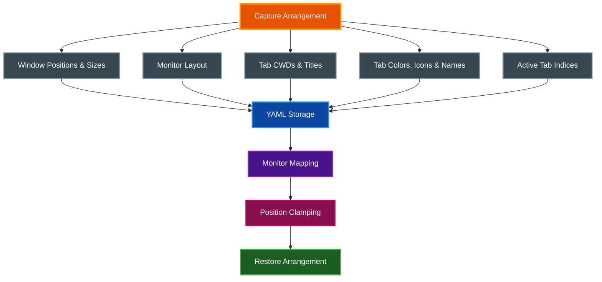
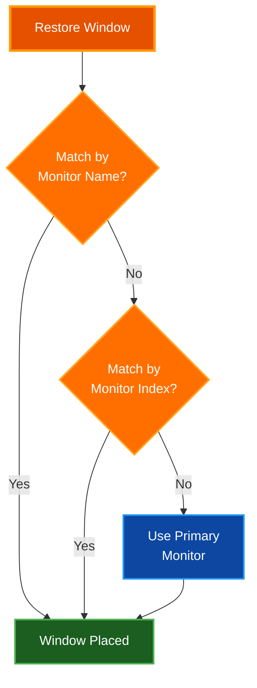
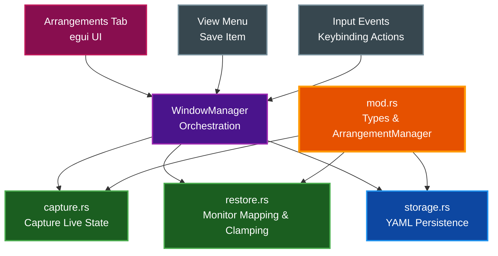

# Window Arrangements

Save and restore complete window layouts, including window positions, sizes, tab working directories, and active tab indices. This feature provides iTerm2-style arrangement management for par-term.

## Table of Contents
- [Overview](#overview)
- [Saving Arrangements](#saving-arrangements)
  - [Via Settings UI](#via-settings-ui)
  - [Via View Menu](#via-view-menu)
  - [Via Keybinding](#via-keybinding)
  - [Duplicate Name Handling](#duplicate-name-handling)
- [Restoring Arrangements](#restoring-arrangements)
  - [Via Settings UI](#via-settings-ui-1)
  - [Via Keybinding](#via-keybinding-1)
  - [Auto-Restore on Startup](#auto-restore-on-startup)
- [Monitor Awareness](#monitor-awareness)
  - [Relative Position Storage](#relative-position-storage)
  - [Monitor Matching](#monitor-matching)
  - [Position Clamping](#position-clamping)
- [Managing Arrangements](#managing-arrangements)
  - [Renaming](#renaming)
  - [Deleting](#deleting)
  - [Reordering](#reordering)
- [Configuration](#configuration)
  - [Config Options](#config-options)
  - [Keybinding Actions](#keybinding-actions)
  - [YAML Persistence](#yaml-persistence)
- [Architecture](#architecture)
- [Related Documentation](#related-documentation)

## Overview

Window arrangements capture the full state of your workspace and allow you to restore it later. Each arrangement stores:

- All open windows and their positions and sizes
- The monitor each window belongs to
- All tabs within each window and their working directories
- Per-tab customizations: user-set tab names, custom tab colors, and custom tab icons
- The active (focused) tab index in each window



## Saving Arrangements

Saving an arrangement captures a snapshot of every open window, including its position, size, monitor, tabs, and active tab index.

### Via Settings UI

1. Open Settings (press `F12` or use the View menu)
2. Navigate to the **Arrangements** tab
3. In the **Save Current Layout** section, enter a name for the arrangement
4. Click **Save**

### Via View Menu

Select **View > Save Window Arrangement...** from the menu bar. This opens the Settings window to the Arrangements tab where you can enter a name and save.

### Via Keybinding

Add a keybinding for the `save_arrangement` action in your `config.yaml`:

```yaml
keybindings:
  - key: "Ctrl+Shift+S"
    action: "save_arrangement"
```

This opens the Settings window to the Arrangements tab for naming and saving.

### Duplicate Name Handling

When saving an arrangement with a name that already exists (matched case-insensitively), par-term displays a confirmation dialog asking whether to overwrite the existing arrangement. Choosing **Overwrite** replaces the old arrangement with the current layout. Choosing **Cancel** returns to the name input without saving.

## Restoring Arrangements

Restoring an arrangement closes all current windows and recreates the saved layout. Each window is placed on the correct monitor with its saved position, size, tabs, and active tab index. Per-tab customizations -- user-set names, custom colors, and custom icons -- are faithfully reapplied to the correct tabs in each window.

In multi-window layouts, par-term uses the exact `WindowId` returned from each window creation to apply tab properties, ensuring that custom colors, icons, and user titles are never misapplied to the wrong window.

> **Warning:** Restoring an arrangement replaces all current windows. Any unsaved state in open terminals is lost.

### Via Settings UI

1. Open Settings (press `F12` or use the View menu)
2. Navigate to the **Arrangements** tab
3. In the **Saved Arrangements** section, find the arrangement to restore
4. Click **Restore** next to its name
5. Confirm the restore in the dialog that appears

### Via Keybinding

Add a keybinding using the `restore_arrangement:<name>` action format:

```yaml
keybindings:
  - key: "Ctrl+Shift+R"
    action: "restore_arrangement:Work Setup"
```

The arrangement name after the colon must match a saved arrangement name (matched case-insensitively). This restores the arrangement immediately without a confirmation dialog.

### Auto-Restore on Startup

Configure an arrangement to restore automatically every time par-term launches:

```yaml
auto_restore_arrangement: "Work Setup"
```

**Via Settings UI:**

1. Open Settings > Arrangements tab
2. In the **Auto-Restore on Startup** section, select an arrangement from the dropdown
3. Select **None (disabled)** to turn off auto-restore

When auto-restore is enabled, par-term skips normal window creation and instead restores the named arrangement. If the arrangement no longer exists, par-term falls back to creating a default window.

## Monitor Awareness

Arrangements are designed to work reliably across different monitor configurations, including when monitors are added, removed, or rearranged.

### Relative Position Storage

Window positions are stored in scale-factor-independent **logical pixels** relative to their monitor's origin. This ensures arrangements restore correctly across monitors with different DPI values (e.g., a Retina display alongside a standard monitor). Positions and sizes use `LogicalPosition`/`LogicalSize` so that winit applies the correct per-monitor DPI conversion on restore.

For example, a window at screen coordinates `(2660, 200)` on a monitor whose origin is `(2560, 0)` is stored as relative position `(100, 200)` in logical pixels.

### Monitor Matching

When restoring an arrangement, par-term maps saved monitors to currently available monitors using a priority-based strategy:



1. **Match by name**: The monitor's display name (e.g., "DELL U2720Q") is compared against the saved name
2. **Match by index**: If no name match is found, the saved monitor index is used if it is within bounds
3. **Primary fallback**: If neither name nor index matches, the window is placed on the primary monitor (index 0)

### Position Clamping

After computing the target position, par-term clamps the window to ensure it remains visible on the target monitor. This handles scenarios where the monitor resolution has changed or the saved position would place the window off-screen.

- Window width and height are clamped to not exceed the monitor dimensions
- At least 100 pixels of the window must remain visible on each axis
- Windows that would be entirely off-screen are pulled back into the visible area

## Managing Arrangements

The Arrangements tab in Settings provides controls for managing saved arrangements.

### Renaming

Click **Rename** next to an arrangement to change its name. Enter the new name and confirm. If the arrangement is referenced by `auto_restore_arrangement` in the config, update that setting to match the new name.

### Deleting

Click **Delete** next to an arrangement. A confirmation dialog prevents accidental deletion. Deletion is permanent and cannot be undone.

### Reordering

Use the **up arrow** and **down arrow** buttons next to each arrangement to change the display order. The order is persisted to the arrangements file automatically.

## Configuration

### Config Options

| Option | Type | Default | Description |
|--------|------|---------|-------------|
| `auto_restore_arrangement` | `string` or `null` | `null` | Name of arrangement to auto-restore on startup. Set to `null` or omit to disable |

```yaml
# Auto-restore a layout on startup
auto_restore_arrangement: "Work Setup"
```

### Keybinding Actions

Two keybinding actions are available for arrangements:

| Action | Description |
|--------|-------------|
| `save_arrangement` | Opens the Settings Arrangements tab for saving |
| `restore_arrangement:<name>` | Restores the named arrangement immediately |

```yaml
keybindings:
  - key: "Ctrl+Shift+S"
    action: "save_arrangement"
  - key: "Ctrl+Shift+1"
    action: "restore_arrangement:Work Setup"
  - key: "Ctrl+Shift+2"
    action: "restore_arrangement:Home Setup"
```

### YAML Persistence

Arrangements are stored in a dedicated YAML file separate from the main configuration:

- **Linux/macOS**: `~/.config/par-term/arrangements.yaml`
- **Windows**: `%APPDATA%\par-term\arrangements.yaml`

The file contains a list of arrangement objects. Each arrangement stores its unique ID, display name, the monitor layout at capture time, and the full window/tab state. The file is created automatically when the first arrangement is saved, and the parent directory is created if it does not exist.

Example structure:

```yaml
- id: "550e8400-e29b-41d4-a716-446655440000"
  name: "Work Setup"
  monitor_layout:
    - name: "DELL U2720Q"
      index: 0
      position: [0, 0]
      size: [2560, 1440]
  windows:
    - monitor:
        name: "DELL U2720Q"
        index: 0
        position: [0, 0]
        size: [2560, 1440]
      position_relative: [100, 200]
      size: [800, 600]
      tabs:
        - cwd: "/home/user/projects"
          title: "zsh"
          user_title: "Editor"
          custom_color: [255, 165, 0, 255]
          custom_icon: "rocket"
        - cwd: "/home/user/logs"
          title: "zsh"
          user_title: null
          custom_color: null
          custom_icon: null
      active_tab_index: 0
  created_at: "2026-01-15T10:30:00Z"
  order: 0
```

## Architecture

The arrangements module is organized into four submodules within `src/arrangements/`:



**Key types in `src/arrangements/mod.rs`:**

- `MonitorInfo`: Captures monitor name, index, position, and size at save time
- `TabSnapshot`: Stores a tab's working directory, title, and optional per-tab customizations (user-set name, custom color, custom icon)
- `WindowSnapshot`: Stores a window's monitor, relative position, size, tabs, and active tab index
- `WindowArrangement`: A named collection of window snapshots with monitor layout and metadata
- `ArrangementManager`: Manages the collection of saved arrangements with ordering, lookup by name, and CRUD operations

**Capture flow** (`src/arrangements/capture.rs`): Enumerates all monitors via the winit event loop, iterates over all open windows, determines each window's monitor, computes the position relative to the monitor origin, and collects tab CWDs, titles, and per-tab customizations (user-set names, custom colors, and custom icons).

**Restore flow** (`src/arrangements/restore.rs`): Builds a monitor mapping from saved monitors to available monitors, converts relative positions back to absolute coordinates on the matched monitor, clamps positions to ensure visibility, and applies per-tab customizations using the exact `WindowId` from each created window to guarantee correct assignment in multi-window layouts.

**Storage** (`src/arrangements/storage.rs`): Serializes and deserializes arrangements to/from YAML using serde. Handles missing files (returns empty manager), empty files, and corrupt files (returns error). Automatically creates parent directories on save.

## Related Documentation

- [Window Management](WINDOW_MANAGEMENT.md) - Window types, multi-monitor support, and display settings
- [Keyboard Shortcuts](KEYBOARD_SHORTCUTS.md) - Keybinding configuration reference
- [Tabs](TABS.md) - Tab management and navigation
