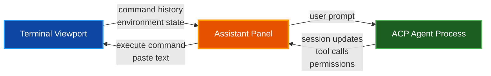
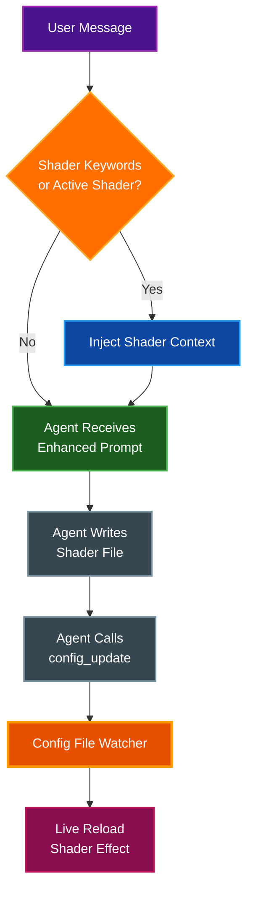

# Assistant Panel

The Assistant Panel is a DevTools-style right-side panel for terminal state inspection and ACP (Agent Communication Protocol) agent integration. It provides command history browsing, structured JSON export, and a full chat interface for connecting to AI coding agents such as Claude Code, Gemini CLI, and others.

## Table of Contents

- [Overview](#overview)
- [Opening and Closing](#opening-and-closing)
- [Panel Layout](#panel-layout)
- [ACP Agent Chat](#acp-agent-chat)
  - [Connecting to an Agent](#connecting-to-an-agent)
  - [Agent Connection Bar](#agent-connection-bar)
  - [Chat Interface](#chat-interface)
  - [Command Suggestions](#command-suggestions)
  - [Permission Handling](#permission-handling)
  - [Auto-Context Feeding](#auto-context-feeding)
  - [YOLO Mode](#yolo-mode)
  - [Terminal Access Toggle](#terminal-access-toggle)
- [Terminal Capture](#terminal-capture)
  - [Capture Scope](#capture-scope)
  - [View Modes](#view-modes)
  - [Live and Paused Modes](#live-and-paused-modes)
- [JSON Export](#json-export)
- [Bundled Agent Configurations](#bundled-agent-configurations)
- [Custom Agent Configurations](#custom-agent-configurations)
- [Shader Assistant](#shader-assistant)
  - [Context Triggers](#context-triggers)
  - [Injected Context](#injected-context)
  - [Config File Watcher](#config-file-watcher)
- [Panel Behavior](#panel-behavior)
- [Configuration](#configuration)
- [Related Documentation](#related-documentation)

## Overview

The Assistant Panel combines two capabilities in a single side panel:

- **Terminal State Inspection**: Browse command history with exit codes, durations, working directories, and command output across four different view modes
- **ACP Agent Integration**: Connect to AI coding agents via JSON-RPC 2.0 over stdio, chat with them, and execute their suggested commands directly in the terminal

The panel opens on the right side of the terminal window and automatically reflows the terminal columns to accommodate the panel width.



## Opening and Closing

| Platform | Shortcut |
|----------|----------|
| macOS | `Cmd+I` |
| Linux / Windows | `Ctrl+Shift+I` |

You can also toggle the panel using the keybinding action `toggle_ai_inspector` in your keybindings configuration. When `ai_inspector_enabled` is true, the new tab dropdown menu includes an **Assistant Panel** toggle item, providing an additional way to open and close the panel.

Press `Escape` while the panel is focused to close it, or click the **X** button in the panel title bar.

When the `ai_inspector_auto_launch` configuration option is enabled, the configured agent connects automatically each time the panel opens.

## Panel Layout

The panel is organized from top to bottom as follows:

1. **Title bar** with heading and close button
2. **Agent connection bar** with status indicator, connect/disconnect controls, and agent selector
3. **Terminal Capture** (collapsible, collapsed by default) with scope, view mode, and command history
4. **Chat messages** (scrollable area, sticks to bottom)
5. **Chat input** with send button (visible when connected)
6. **Controls row** with Terminal access and YOLO checkboxes (visible when connected)
7. **Action bar** with Copy JSON and Save buttons

## ACP Agent Chat

The Agent Communication Protocol (ACP) enables par-term to communicate with AI coding agents via JSON-RPC 2.0 over stdio. The agent runs as a subprocess, and all communication happens through structured messages.

### Connecting to an Agent

```mermaid
sequenceDiagram
    participant U as User
    participant P as Assistant Panel
    participant A as Agent Process

    U->>P: Click Connect
    P->>A: Spawn subprocess (stdio)
    P->>A: initialize (JSON-RPC)
    A-->>P: InitializeResult
    P->>A: session/new
    A-->>P: SessionResult (session_id)
    P-->>U: Status: Connected

    U->>P: Type message + Enter
    P->>A: session/prompt
    A-->>P: session/update (streaming chunks)
    A-->>P: session/update (tool calls)
    A-->>P: session/request_permission
    P-->>U: Render chat messages

    style U fill:#4a148c,stroke:#9c27b0,stroke-width:2px,color:#ffffff
    style P fill:#e65100,stroke:#ff9800,stroke-width:3px,color:#ffffff
    style A fill:#1b5e20,stroke:#4caf50,stroke-width:2px,color:#ffffff
```

**How it works:**

1. par-term spawns the agent's connector binary as a child process
2. The host sends an `initialize` request with client capabilities (filesystem read/write, terminal access, config update)
3. The agent responds with its capabilities and supported modes
4. A `session/new` request creates a working session with the current directory
5. User prompts are sent via `session/prompt` and responses stream back as `session/update` notifications

### Agent Connection Bar

The connection bar sits at the top of the panel and shows:

- **Status indicator**: Green circle when connected, yellow when connecting, gray when disconnected, red on error
- **Connect / Disconnect button**: Connects to the first available agent or disconnects the current session
- **Agent selector dropdown**: Appears when multiple agents are available, allowing you to choose which agent to connect to
- **Install buttons**: For agents whose ACP connector binary is not found in `PATH`, a one-click install button pastes the install command into the terminal

### Chat Interface

The chat area displays messages with visual differentiation by type:

| Message Type | Description | Visual Style |
|-------------|-------------|--------------|
| **User** | Your messages to the agent | Blue background, "You:" label |
| **Agent** | Completed agent responses | Dark background, "Agent:" label |
| **Thinking** | Agent's internal reasoning | Gray italic text |
| **Tool Call** | Agent-initiated operations | Monospace with status indicator (OK/FAIL/running) |
| **Command Suggestion** | Extracted shell commands | Green-tinted background with Run and Paste buttons |
| **Permission** | Agent permission requests | Amber background with option buttons |
| **Auto-Approved** | Permission auto-granted | Gray italic text |
| **System** | Informational messages | Gray italic text with "i" prefix |

All message text supports selection for copying.

### Command Suggestions

When the agent includes shell commands in fenced code blocks (tagged with `bash`, `sh`, `zsh`, or `shell`), par-term automatically extracts them and renders each as a clickable command suggestion block:

- **Run**: Executes the command in the active terminal (sends the command text plus Enter) and notifies the agent that the command was executed
- **Paste**: Writes the command text into the terminal input line without executing it, allowing you to review or modify before running

> **Note:** The agent is instructed to always wrap shell commands in fenced code blocks with a language tag. Plain-text command suggestions are not actionable.

### Permission Handling

When an agent requests permission for a tool call (such as writing a file or running a command), the panel displays a permission dialog with:

- A description of what the agent wants to do
- Option buttons provided by the agent (e.g., "Allow", "Allow for session")
- A **Deny** button to reject the request

Writes to the par-term configuration and shader directories are auto-approved because these are safe operations managed by par-term itself.

### Auto-Context Feeding

When `ai_inspector_auto_context` is enabled, par-term automatically sends command completion results to the connected agent. Each time a command finishes in the terminal, the agent receives a notification containing the command text, exit code, and recent terminal output. This allows the agent to stay aware of what is happening in the terminal without requiring you to copy-paste results manually.

### YOLO Mode

The **YOLO** checkbox enables auto-approval of all agent permission requests. When active, every permission request from the agent is immediately granted without prompting. This is useful for trusted workflows where you want the agent to work uninterrupted, but should be used with caution.

YOLO mode works by setting the agent's session mode to `bypassPermissions`. Unchecking the box reverts to the `default` mode.

### Terminal Access Toggle

The **Terminal access** checkbox controls whether the agent is allowed to write text directly to the terminal. When disabled, agent attempts to write to the terminal are blocked. This provides a safety mechanism when you want the agent to suggest commands but not execute them autonomously.

## Terminal Capture

The Terminal Capture section is collapsible and defaults to collapsed to reduce resource usage when you are primarily using the panel for agent chat.

### Capture Scope

The scope dropdown controls how much command history is included in the snapshot:

| Scope | Description |
|-------|-------------|
| **Visible** | Approximate visible window (last 10 commands) |
| **Recent 5** | Last 5 commands |
| **Recent 10** | Last 10 commands |
| **Recent 25** | Last 25 commands |
| **Recent 50** | Last 50 commands |
| **Full** | Complete command history from scrollback |

### View Modes

Four view modes are available for browsing command history:

- **Cards**: Each command displayed in a framed card with exit code badge, duration, working directory, and collapsible output
- **Timeline**: Flat chronological list with status icons and right-aligned duration
- **Tree**: Collapsible headers per command with expandable detail sections (exit code, duration, CWD, output)
- **List+Detail**: Compact list with status icon and command text

### Live and Paused Modes

- **Live**: Automatically refreshes the snapshot when terminal state changes (new commands detected)
- **Paused** (default): Snapshot is static until you manually click **Refresh**

Terminal capture defaults to paused to minimize resource usage.

## JSON Export

The snapshot data can be exported as structured JSON:

- **Copy JSON**: Copies the snapshot to the clipboard
- **Save**: Saves the snapshot JSON to a file

The exported JSON contains:

```json
{
  "timestamp": "2026-02-17T10:00:00Z",
  "scope": "visible",
  "environment": {
    "hostname": "workstation",
    "username": "user",
    "cwd": "/home/user/project",
    "shell": "zsh"
  },
  "terminal": {
    "cols": 120,
    "rows": 40,
    "cursor": [0, 24]
  },
  "commands": [
    {
      "command": "cargo build",
      "exit_code": 0,
      "duration_ms": 3200,
      "cwd": "/home/user/project",
      "output": null,
      "output_line_count": 0
    }
  ]
}
```

## Bundled Agent Configurations

par-term ships with 8 pre-configured ACP agent definitions embedded at compile time. These are always available regardless of installation method:

| Agent | Identity | Connector Command | Install Command |
|-------|----------|-------------------|-----------------|
| Claude Code | `claude.com` | `claude-code-acp` | `npm install -g @zed-industries/claude-code-acp` |
| Codex CLI (OpenAI) | `openai.com` | `npx @zed-industries/codex-acp` | `npm install -g @zed-industries/codex-acp` |
| Gemini CLI | `geminicli.com` | `gemini --experimental-acp` | - |
| Copilot | `copilot.github.com` | `copilot --acp` | - |
| Amp (AmpCode) | `ampcode.com` | `npx -y amp-acp` | - |
| Auggie (Augment Code) | `augmentcode.com` | `auggie --acp` | - |
| Docker cagent | `docker.com` | `cagent acp` | - |
| OpenHands | `openhands.dev` | `openhands acp` | - |

During discovery, par-term checks whether each connector binary exists in `PATH` and marks agents whose connectors are not installed. The panel shows one-click install buttons for agents that have an `install_command` defined but whose binary is missing.

The default agent (used for auto-launch and the primary Connect button) is configured via `ai_inspector_agent` and defaults to `claude.com`.

## Custom Agent Configurations

You can define custom agents or override bundled agents by placing TOML files in:

```
~/.config/par-term/agents/
```

Each `.toml` file defines a single agent. User-defined agents with the same `identity` as a bundled agent replace the bundled definition.

### Agent TOML Format

```toml
identity = "myagent.example.com"
name = "My Custom Agent"
short_name = "myagent"
protocol = "acp"
type = "coding"
# Optional: set to false to hide this agent
# active = false
# Optional: install command shown when connector is missing
# install_command = "pip install my-agent-acp"

[run_command]
# Platform-specific or wildcard run commands
"*" = "my-agent-acp"
# macos = "my-agent-acp-mac"
# linux = "my-agent-acp-linux"
# windows = "my-agent-acp.exe"
```

**Fields:**

| Field | Required | Description |
|-------|----------|-------------|
| `identity` | Yes | Unique identifier (typically a domain) |
| `name` | Yes | Full display name |
| `short_name` | Yes | Abbreviated name for compact UI elements |
| `protocol` | No | Protocol type (default: `"acp"`) |
| `type` | No | Agent type (default: `"coding"`) |
| `active` | No | Whether the agent appears in the list (default: `true`) |
| `install_command` | No | Command to install the ACP connector |
| `run_command` | Yes | Platform-keyed table of connector commands |

Agent discovery loads definitions in this order:

1. **Embedded defaults** (compiled into par-term)
2. **Bundled directory** (next to the executable, for installed app bundles)
3. **User config directory** (`~/.config/par-term/agents/`)

Later sources override earlier ones by `identity`. Inactive agents (`active = false`) are filtered out after merging.

## Shader Assistant

The Shader Assistant is a context-triggered system that injects shader expertise into agent prompts, enabling ACP agents to create, edit, debug, and apply custom shaders end-to-end.

### Context Triggers

Shader context is automatically injected when either condition is met:

- **Keyword detection**: The user message contains any of 20 shader-related keywords (case-insensitive): `shader`, `glsl`, `wgsl`, `effect`, `crt`, `scanline`, `post-process`, `postprocess`, `fragment`, `mainimage`, `ichannel`, `itime`, `iresolution`, `shadertoy`, `transpile`, `naga`, `cursor effect`, `cursor shader`, `background effect`, `background shader`
- **Active shader state**: A custom background or cursor shader is currently enabled in the configuration

### Injected Context

When triggered, the following context block is prepended to the agent prompt:

- **Current shader state**: Active background and cursor shader names, enabled/disabled status, animation speed, brightness, text opacity, glow parameters
- **Available shaders**: List of `.glsl`, `.frag`, and `.shader` files in the shaders directory, classified into background and cursor categories (cursor shaders have filenames starting with `cursor_`)
- **Debug file paths**: Location of transpiled WGSL output (`/tmp/par_term_<name>_shader.wgsl`) and wrapped GLSL (`/tmp/par_term_debug_wrapped.glsl`)
- **Available uniforms**: All Shadertoy-compatible uniforms (`iTime`, `iResolution`, `iMouse`, `iChannel0-4`) plus cursor-specific extras (`iCurrentCursor`, `iPreviousCursor`, `iTimeCursorChange`)
- **Minimal shader template**: A ready-to-use GLSL template with `mainImage` entry point
- **How to apply changes**: Instructions for using the `config_update` MCP tool to activate shaders without editing `config.yaml` directly
- **Available config keys**: All background and cursor shader configuration keys with their types

### Config File Watcher

A file watcher monitors `config.yaml` for external changes (such as those applied by an agent via the `config_update` tool). When changes are detected, par-term live-reloads the configuration without requiring a restart. This enables a seamless workflow where the agent creates a shader file, activates it via config update, and the user sees the effect immediately.



## Panel Behavior

- **Resizable**: Drag the left edge of the panel to resize. The resize handle highlights on hover and shows a horizontal resize cursor.
- **Minimum width**: 200 pixels
- **Maximum width**: 50% of the viewport width, enforced as a hard constraint to prevent the panel from taking over the window
- **Auto-expand**: If content overflows the configured width, the panel expands to accommodate it (up to the maximum width)
- **Terminal reflow**: When the panel opens, closes, or is resized, the terminal reflows its columns to fit the remaining viewport width
- **Z-ordering**: The panel renders at `Order::Middle` so modal dialogs (quit, close tab, etc.) always appear above it. The resize handle line renders at `Order::Background`.
- **Keyboard**: Press `Escape` to close the panel

## Configuration

All Assistant Panel settings are available in the Settings UI under the **Assistant** tab. The following configuration options are supported in `config.yaml`:

| Option | Type | Default | Description |
|--------|------|---------|-------------|
| `ai_inspector_enabled` | bool | `true` | Enable the Assistant Panel feature |
| `ai_inspector_open_on_startup` | bool | `false` | Open the panel automatically when par-term starts |
| `ai_inspector_width` | float | `317.0` | Default panel width in pixels |
| `ai_inspector_default_scope` | string | `"visible"` | Default capture scope (`visible`, `recent_N`, `full`) |
| `ai_inspector_view_mode` | string | `"tree"` | Default view mode (`cards`, `timeline`, `tree`, `list_detail`) |
| `ai_inspector_live_update` | bool | `false` | Enable live auto-refresh of terminal capture |
| `ai_inspector_show_zones` | bool | `true` | Show zone boundaries in the capture view |
| `ai_inspector_agent` | string | `"claude.com"` | Default agent identity for auto-launch and Connect button |
| `ai_inspector_auto_launch` | bool | `false` | Auto-connect to the configured agent when panel opens |
| `ai_inspector_auto_context` | bool | `false` | Auto-send command results to the connected agent |
| `ai_inspector_context_max_lines` | int | `200` | Maximum output lines sent per auto-context update |
| `ai_inspector_auto_approve` | bool | `false` | Auto-approve all agent permission requests (YOLO mode) |
| `ai_inspector_agent_terminal_access` | bool | `false` | Allow the agent to write directly to the terminal |

**Example configuration:**

```yaml
# Assistant Panel settings
ai_inspector_enabled: true
ai_inspector_width: 400.0
ai_inspector_agent: "claude.com"
ai_inspector_auto_launch: true
ai_inspector_auto_context: false
ai_inspector_auto_approve: false
ai_inspector_agent_terminal_access: false
```

## Related Documentation

- [Keyboard Shortcuts](KEYBOARD_SHORTCUTS.md) - Full keybinding reference including `Cmd+I` / `Ctrl+Shift+I`
- [Automation](AUTOMATION.md) - Scripting and automation features including the observer API
- [Custom Shaders](CUSTOM_SHADERS.md) - Shader creation, Shadertoy compatibility, and debug workflows
- [Shaders](SHADERS.md) - Built-in shader reference and WGSL shader architecture
