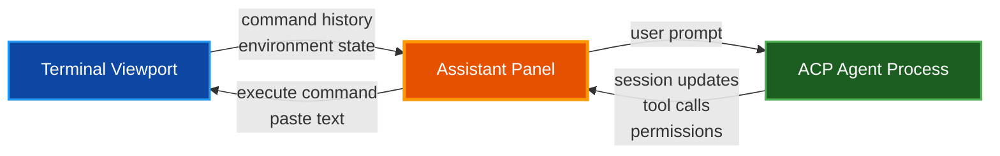
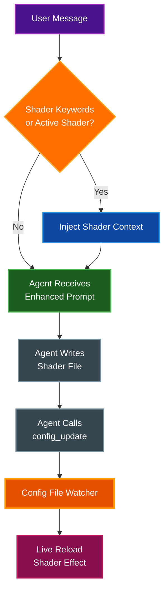

# Assistant Panel

The Assistant Panel is a DevTools-style right-side panel for terminal state inspection and ACP (Agent Communication Protocol) agent integration. It provides command history browsing, structured JSON export, and a full chat interface for connecting to AI coding agents such as Claude Code, Gemini CLI, and others.

## Table of Contents

- [Overview](#overview)
- [Opening and Closing](#opening-and-closing)
- [Panel Layout](#panel-layout)
- [ACP Agent Chat](#acp-agent-chat)
  - [Connecting to an Agent](#connecting-to-an-agent)
  - [Agent Connection Bar](#agent-connection-bar)
  - [Chat Interface](#chat-interface)
  - [Code Block Rendering](#code-block-rendering)
  - [Multi-line Chat Input](#multi-line-chat-input)
  - [Clear Conversation](#clear-conversation)
  - [Cancel Queued Messages](#cancel-queued-messages)
  - [Cancel Streaming Responses](#cancel-streaming-responses)
  - [Command Suggestions](#command-suggestions)
  - [Permission Handling](#permission-handling)
  - [Reset Permission Approvals](#reset-permission-approvals)
  - [Auto-Context Feeding](#auto-context-feeding)
  - [YOLO Mode](#yolo-mode)
  - [Terminal Access Toggle](#terminal-access-toggle)
  - [Screenshot Access Toggle](#screenshot-access-toggle)
  - [Context Restore Across Reconnects](#context-restore-across-reconnects)
- [Terminal Capture](#terminal-capture)
  - [Capture Scope](#capture-scope)
  - [View Modes](#view-modes)
  - [Live and Paused Modes](#live-and-paused-modes)
- [JSON Export](#json-export)
- [Bundled Agent Configurations](#bundled-agent-configurations)
- [Custom Agent Configurations](#custom-agent-configurations)
  - [Settings UI Management](#settings-ui-management)
  - [Claude Code + Ollama (Local) Example](#claude-code--ollama-local-example)
  - [Troubleshooting Claude + Ollama](#troubleshooting-claude--ollama)
- [Shader Assistant](#shader-assistant)
  - [Context Triggers](#context-triggers)
  - [Injected Context](#injected-context)
  - [Config File Watcher](#config-file-watcher)
- [Panel Behavior](#panel-behavior)
- [Configuration](#configuration)
- [Known Issues Fixed in v0.22.0](#known-issues-fixed-in-v0220)
- [Related Documentation](#related-documentation)

## Overview

The Assistant Panel combines two capabilities in a single side panel:

- **Terminal State Inspection**: Browse command history with exit codes, durations, working directories, and command output across four different view modes
- **ACP Agent Integration**: Connect to AI coding agents via JSON-RPC 2.0 over stdio, chat with them, and execute their suggested commands directly in the terminal

The panel opens on the right side of the terminal window and automatically reflows the terminal columns to accommodate the panel width.



## Opening and Closing

| Platform | Shortcut |
|----------|----------|
| macOS | `Cmd+I` |
| Linux / Windows | `Ctrl+Shift+I` |

You can also toggle the panel using the keybinding action `toggle_ai_inspector` in your keybindings configuration. When `ai_inspector_enabled` is true, the new tab dropdown menu includes an **Assistant Panel** toggle item, providing an additional way to open and close the panel.

Press `Escape` while no input widget has focus to close the panel, or click the **X** button in the panel title bar. If the chat input or another widget is focused, `Escape` releases focus from that widget instead of closing the panel.

When the `ai_inspector_auto_launch` configuration option is enabled, the configured agent connects automatically each time the panel opens.

## Panel Layout

The panel is organized from top to bottom as follows:

1. **Title bar** with heading and close button
2. **Agent connection bar** with status indicator, connect/disconnect controls, and agent selector
3. **Terminal Capture** (collapsible, collapsed by default) with scope, view mode, and command history
4. **Chat messages** (scrollable area, sticks to bottom) with code block rendering and streaming support
5. **Chat input** with send button and clear conversation button (visible when connected; supports multi-line editing)
6. **Controls row** with Terminal access and YOLO checkboxes (visible when connected)
7. **Action bar** with Copy JSON and Save buttons

## ACP Agent Chat

The Agent Communication Protocol (ACP) enables par-term to communicate with AI coding agents via JSON-RPC 2.0 over stdio. The agent runs as a subprocess, and all communication happens through structured messages.

### Connecting to an Agent

```mermaid
sequenceDiagram
    participant U as User
    participant P as Assistant Panel
    participant A as Agent Process

    U->>P: Click Connect
    P->>A: Spawn subprocess (stdio)
    P->>A: initialize (JSON-RPC)
    A-->>P: InitializeResult
    P->>A: session/new
    A-->>P: SessionResult (session_id)
    P-->>U: Status: Connected

    U->>P: Type message + Enter
    P->>A: session/prompt
    A-->>P: session/update (streaming chunks)
    A-->>P: session/update (tool calls)
    A-->>P: session/request_permission
    P-->>U: Render chat messages

    style U fill:#4a148c,stroke:#9c27b0,stroke-width:2px,color:#ffffff
    style P fill:#e65100,stroke:#ff9800,stroke-width:3px,color:#ffffff
    style A fill:#1b5e20,stroke:#4caf50,stroke-width:2px,color:#ffffff
```

**How it works:**

1. par-term spawns the agent's connector binary as a child process
2. The host sends an `initialize` request with client capabilities (filesystem read/write, terminal access, config update)
3. The agent responds with its capabilities and supported modes
4. A `session/new` request creates a working session with the current directory
5. User prompts are sent via `session/prompt` and responses stream back as `session/update` notifications

### Agent Connection Bar

The connection bar sits at the top of the panel and shows:

- **Status indicator**: Green circle when connected, yellow when connecting, gray when disconnected, red on error (with inline error message and full-detail tooltip)
- **Connect / Disconnect button**: Connects to the first available agent or disconnects the current session
- **Agent selector dropdown**: Appears when multiple agents are available, allowing you to choose which agent to connect to
- **Install buttons**: For agents whose ACP connector binary is not found in `PATH`, a one-click install button pastes the install command into the terminal

### Connector Installation Notes

- **Claude Code ACP bridge**: Use `@zed-industries/claude-agent-acp` (binary: `claude-agent-acp`)
- **Deprecated package**: `@zed-industries/claude-code-acp` has been renamed/deprecated upstream
- **From source builds**: `make install-acp` installs the Claude ACP bridge, and `make bundle-install` now installs the macOS app bundle, CLI binary, and ACP bridge together

### Chat Interface

The chat area displays messages with visual differentiation by type:

| Message Type | Description | Visual Style |
|-------------|-------------|--------------|
| **User** | Your messages to the agent | Blue background, "You:" label |
| **Agent** | Completed agent responses | Dark background, "Agent:" label |
| **Thinking** | Agent's internal reasoning | Gray italic text |
| **Tool Call** | Agent-initiated operations | Monospace with status indicator (OK/FAIL/running) |
| **Command Suggestion** | Extracted shell commands | Green-tinted background with Run and Paste buttons |
| **Permission** | Agent permission requests | Amber background with option buttons |
| **Auto-Approved** | Auto-approved tool call notification | Gray italic text prefixed with "Auto-approved:" |
| **System** | Informational messages | Gray italic text with "i" prefix |

All message text supports selection for copying.

When YOLO mode or session-scoped approvals automatically grant a tool call, the chat log displays an **Auto-approved** entry showing which tool was approved. This keeps you informed about autonomous actions without interrupting the workflow.

### Code Block Rendering

Agent messages that contain fenced code blocks render with enhanced formatting:

- **Dark background** with a subtle border to distinguish code from prose
- **Language tag label** displayed at the top of the block (e.g., "rust", "python", "bash")
- **Monospace font** for code content
- **Streaming support**: Code blocks render progressively as the agent streams its response, so partial blocks remain readable during generation

Code blocks that use a shell language tag (`bash`, `sh`, `zsh`, `shell`) are also extracted as [Command Suggestions](#command-suggestions) with Run and Paste buttons.

### Multi-line Chat Input

The chat input field supports multi-line editing:

| Key | Action |
|-----|--------|
| `Enter` | Send the current message |
| `Shift+Enter` | Insert a newline |

The input field grows automatically as you type, expanding up to 6 rows before showing a scrollbar. This is useful for pasting multi-line prompts or composing longer instructions without sending prematurely.

### Clear Conversation

The **C** button next to the send button clears the entire chat history without disconnecting the agent. The agent session remains active, so you can continue sending new messages immediately. This is useful for starting a fresh conversation thread while keeping the same connection.

### Cancel Queued Messages

When you send a message while the agent is still processing a previous response, the new message enters a queue. Queued messages display a **(queued)** label and a red **Cancel** button. Clicking Cancel removes the message from the queue before the agent processes it.

### Cancel Streaming Responses

While the agent is streaming a response, a red **Cancel** button appears next to the activity spinner. Clicking Cancel invokes `Agent::cancel()` to abort the in-flight response. The partial response remains visible in the chat history.

### Command Suggestions

When the agent includes shell commands in fenced code blocks (tagged with `bash`, `sh`, `zsh`, or `shell`), par-term automatically extracts them and renders each as a clickable command suggestion block:

- **Run**: Executes the command in the active terminal (sends the command text plus Enter) and notifies the agent that the command was executed
- **Paste**: Writes the command text into the terminal input line without executing it, allowing you to review or modify before running

> **Note:** The agent is instructed to always wrap shell commands in fenced code blocks with a language tag. Plain-text command suggestions are not actionable.

### Permission Handling

When an agent requests permission for a tool call (such as writing a file or running a command), the panel displays a permission dialog with:

- A description of what the agent wants to do
- Option buttons provided by the agent (e.g., "Allow", "Allow for session")
- A **Deny** button to reject the request

Writes to the par-term configuration and shader directories are auto-approved because these are safe operations managed by par-term itself.

For Claude-compatible local backends, par-term also blocks unsupported `Skill` tool permission requests that some models may emit incorrectly.

For visual debugging workflows, agents can use the `terminal_screenshot` MCP tool to request a screenshot of the terminal renderer output (for example shader output). Screenshot requests are permission-gated and are treated separately from normal file/config permissions. The `terminal_screenshot` tool is registered in par-term's built-in MCP server and requires the **Allow Agent Screenshots** setting to be enabled before requests are even presented for approval.

### Reset Permission Approvals

The **Reset approvals** button in the controls row disconnects and immediately reconnects the agent, creating a new ACP session. This revokes all session-scoped permission approvals (such as "Allow for session" grants) without losing the chat history. Prior conversation messages are re-injected into the new session via [Context Restore Across Reconnects](#context-restore-across-reconnects).

Use this when you want to tighten permissions mid-session without fully closing the panel or manually tracking which tools were approved.

### Auto-Context Feeding

When `ai_inspector_auto_context` is enabled, par-term automatically sends command completion results to the connected agent. Each time a command finishes in the terminal, the agent receives a notification containing the command text, exit code, and recent terminal output. This allows the agent to stay aware of what is happening in the terminal without requiring you to copy-paste results manually.

### YOLO Mode

The **YOLO** checkbox enables auto-approval of most agent permission requests. When active, file/config/tool permissions are generally granted without prompting so trusted workflows can proceed uninterrupted, but should still be used with caution.

Screenshot capture requests (`terminal_screenshot`) are intentionally excluded and still prompt for permission unless you approve them interactively.

YOLO mode works by setting the agent's session mode to `bypassPermissions`. Unchecking the box reverts to the `default` mode.

### Terminal Access Toggle

The **Terminal access** checkbox controls whether the agent is allowed to write text directly to the terminal. When disabled, agent attempts to write to the terminal are blocked. This provides a safety mechanism when you want the agent to suggest commands but not execute them autonomously.

### Screenshot Access Toggle

The **Allow Agent Screenshots** setting (Settings -> Assistant -> Permissions) controls whether the agent may request terminal screenshots through the `terminal_screenshot` MCP tool.

- **Enabled**: Screenshot requests appear as normal permission prompts and can be approved/denied per request
- **Disabled**: Screenshot requests are automatically denied, and the panel adds a system message explaining why

This setting is separate from terminal input access and separate from YOLO mode so you can allow autonomous file/config changes while still blocking visual capture.

### Context Restore Across Reconnects

When the agent disconnects and reconnects (including via [Reset Permission Approvals](#reset-permission-approvals)), par-term performs a best-effort restore of the prior conversation. The existing chat messages are injected into the new ACP session so the agent retains context from the previous exchange.

This is a best-effort mechanism: the injected history provides context for the agent's language model, but tool-call state, file watchers, and other session-scoped resources from the previous session are not carried over.

## Terminal Capture

The Terminal Capture section is collapsible and defaults to collapsed to reduce resource usage when you are primarily using the panel for agent chat.

### Capture Scope

The scope dropdown controls how much command history is included in the snapshot:

| Scope | Description |
|-------|-------------|
| **Visible** | Approximate visible window (last 10 commands) |
| **Recent 5** | Last 5 commands |
| **Recent 10** | Last 10 commands |
| **Recent 25** | Last 25 commands |
| **Recent 50** | Last 50 commands |
| **Full** | Complete command history from scrollback |

### View Modes

Four view modes are available for browsing command history:

- **Cards**: Each command displayed in a framed card with exit code badge, duration, working directory, and collapsible output
- **Timeline**: Flat chronological list with status icons and right-aligned duration
- **Tree**: Collapsible headers per command with expandable detail sections (exit code, duration, CWD, output)
- **List+Detail**: Compact list with status icon and command text

### Live and Paused Modes

- **Live**: Automatically refreshes the snapshot when terminal state changes (new commands detected)
- **Paused** (default): Snapshot is static until you manually click **Refresh**

Terminal capture defaults to paused to minimize resource usage.

## JSON Export

The snapshot data can be exported as structured JSON:

- **Copy JSON**: Copies the snapshot to the clipboard
- **Save**: Saves the snapshot JSON to a file

The exported JSON contains:

```json
{
  "timestamp": "2026-02-17T10:00:00Z",
  "scope": "visible",
  "environment": {
    "hostname": "workstation",
    "username": "user",
    "cwd": "/home/user/project",
    "shell": "zsh"
  },
  "terminal": {
    "cols": 120,
    "rows": 40,
    "cursor": [0, 24]
  },
  "commands": [
    {
      "command": "cargo build",
      "exit_code": 0,
      "duration_ms": 3200,
      "cwd": "/home/user/project",
      "output": null,
      "output_line_count": 0
    }
  ]
}
```

## Bundled Agent Configurations

par-term ships with 8 pre-configured ACP agent definitions embedded at compile time. These are always available regardless of installation method:

| Agent | Identity | Connector Command | Install Command |
|-------|----------|-------------------|-----------------|
| Claude Code | `claude.com` | `claude-agent-acp` | `npm install -g @zed-industries/claude-agent-acp` |
| Codex CLI (OpenAI) | `openai.com` | `npx @zed-industries/codex-acp` | `npm install -g @zed-industries/codex-acp` |
| Gemini CLI | `geminicli.com` | `gemini --experimental-acp` | - |
| Copilot | `copilot.github.com` | `copilot --acp` | - |
| Amp (AmpCode) | `ampcode.com` | `npx -y amp-acp` | - |
| Auggie (Augment Code) | `augmentcode.com` | `auggie --acp` | - |
| Docker cagent | `docker.com` | `cagent acp` | - |
| OpenHands | `openhands.dev` | `openhands acp` | - |

During discovery, par-term checks whether each connector binary exists in `PATH` and marks agents whose connectors are not installed. The panel shows one-click install buttons for agents that have an `install_command` defined but whose binary is missing.

The default agent (used for auto-launch and the primary Connect button) is configured via `ai_inspector_agent` and defaults to `claude.com`.

## Custom Agent Configurations

You can define custom agents or override bundled agents by placing TOML files in:

```
~/.config/par-term/agents/
```

Each `.toml` file defines a single agent. User-defined agents with the same `identity` as a bundled agent replace the bundled definition.

You can manage these from either:

- **Settings UI**: Assistant tab custom agent editor (recommended for most users)
- **Files on disk**: TOML files in `~/.config/par-term/agents/` or `ai_inspector_custom_agents` in `config.yaml`

### Agent TOML Format

```toml
identity = "myagent.example.com"
name = "My Custom Agent"
short_name = "myagent"
protocol = "acp"
type = "coding"
# Optional: set to false to hide this agent
# active = false
# Optional: install command shown when connector is missing
# install_command = "pip install my-agent-acp"
# Optional: context window size for Ollama backends
# ollama_context_length = 32768
# Optional: environment variables passed to the agent process
# Useful for Ollama/OpenRouter/local provider endpoints
#
#[env]
#ANTHROPIC_BASE_URL = "http://127.0.0.1:11434"
#ANTHROPIC_AUTH_TOKEN = "ollama"
#ANTHROPIC_API_KEY = ""

[run_command]
# Platform-specific or wildcard run commands
"*" = "my-agent-acp"
# macos = "my-agent-acp-mac"
# linux = "my-agent-acp-linux"
# windows = "my-agent-acp.exe"
```

**Fields:**

| Field | Required | Description |
|-------|----------|-------------|
| `identity` | Yes | Unique identifier (typically a domain) |
| `name` | Yes | Full display name |
| `short_name` | Yes | Abbreviated name for compact UI elements |
| `protocol` | No | Protocol type (default: `"acp"`) |
| `type` | No | Agent type (default: `"coding"`) |
| `active` | No | Whether the agent appears in the list (default: `true`) |
| `install_command` | No | Command to install the ACP connector |
| `env` | No | Environment variables injected into the agent subprocess |
| `ollama_context_length` | No | Context window size for Ollama backends; par-term injects `OLLAMA_CONTEXT_LENGTH` unless the env table already defines it |
| `run_command` | Yes | Platform-keyed table of connector commands |

Agent discovery loads definitions in this order:

1. **Embedded defaults** (compiled into par-term)
2. **Bundled directory** (next to the executable, for installed app bundles)
3. **User config directory** (`~/.config/par-term/agents/`)
4. **`config.yaml`** (`ai_inspector_custom_agents`)

Later sources override earlier ones by `identity`. Inactive agents (`active = false`) are filtered out after merging.

### `config.yaml` Custom Agents

You can also define custom ACP agents directly in `config.yaml` using `ai_inspector_custom_agents`:

```yaml
ai_inspector_custom_agents:
  - identity: "local.my-agent"
    name: "My Local ACP Agent"
    short_name: "myagent"
    protocol: "acp"
    type: "coding"
    run_command:
      "*": "my-agent-acp"
    env:
      ANTHROPIC_BASE_URL: "http://127.0.0.1:11434"
      ANTHROPIC_AUTH_TOKEN: "ollama"
      ANTHROPIC_API_KEY: ""
    install_command: "brew install my-agent"
    # Optional: context window size for Ollama backends
    ollama_context_length: 32768
```

### Settings UI Management

The **Settings > Assistant** tab includes a custom ACP agent manager for adding, editing, and removing entries in `ai_inspector_custom_agents`.

- **Protocol**: par-term currently supports `acp` only; the UI shows this as a read-only field
- **Type**: typically `coding` for terminal/code agents
- **Run command**: the connector binary/command par-term launches (for example `claude-agent-acp`)
- **Install command**: optional command used by the Assistant Panel install button when the connector is missing
- **Environment variables**: add key/value pairs (for example `ANTHROPIC_BASE_URL`, `ANTHROPIC_MODEL`) using the **Add Env Var** button
- **Ollama context**: optional helper field that sets `OLLAMA_CONTEXT_LENGTH` for the agent subprocess (explicit `OLLAMA_CONTEXT_LENGTH` env var still wins)
- **Tooltips**: field labels include tooltips to explain the purpose of each input

If you edit custom agents while the app is already running, close/reopen the Assistant Panel and reconnect the agent. If the selector still shows stale entries, restart par-term to ensure the latest config is loaded.

### Claude Code + Ollama (Local) Example

You can use the Zed Claude ACP bridge with Ollama's Claude-compatible launch mode. The basic flow is:

1. Install the ACP bridge used by par-term:

```bash
npm install -g @zed-industries/claude-agent-acp
```

2. Start Ollama's Claude-compatible endpoint (replace the model if desired):

```bash
ollama launch claude --model qwen3-coder:latest
```

3. Add a custom ACP agent in `config.yaml` (or via Settings > Assistant):

```yaml
ai_inspector_custom_agents:
  - identity: "claude-ollama.local"
    name: "Claude (Ollama Local)"
    short_name: "claude-ollama"
    protocol: "acp"
    type: "coding"
    run_command:
      "*": "claude-agent-acp"
    install_command: "npm install -g @zed-industries/claude-agent-acp"
    env:
      ANTHROPIC_BASE_URL: "http://127.0.0.1:11434"
      ANTHROPIC_MODEL: "qwen3-coder:latest"
      ANTHROPIC_API_KEY: "ollama"
      ANTHROPIC_AUTH_TOKEN: "ollama"
      # Use an isolated Claude config dir to avoid loading ~/.claude defaults/CLAUDE.md
      CLAUDE_CONFIG_DIR: "/Users/your-user/.claude-parterm-ollama"
    # Optional helper: par-term injects OLLAMA_CONTEXT_LENGTH for this agent
    # unless you already define OLLAMA_CONTEXT_LENGTH in env above.
    ollama_context_length: 32768
```

4. (Recommended) Pre-create the isolated Claude config directory and set a matching model hint:

```bash
mkdir -p ~/.claude-parterm-ollama
cat > ~/.claude-parterm-ollama/settings.json <<'EOF'
{
  "model": "qwen3-coder:latest"
}
EOF
```

5. In par-term, open the Assistant Panel, select `Claude (Ollama Local)`, and connect.

Notes:

- The Claude ACP bridge (`claude-agent-acp`) is still required; par-term is the ACP host, while the bridge is the Claude-specific ACP adapter subprocess.
- Some local models do not reliably report provider/model identity. par-term asks them to avoid guessing, so responses may describe capabilities instead of naming the exact model.

### Troubleshooting Claude + Ollama

If the agent connects but behaves incorrectly, check these common issues:

- **Connected but no useful response / generic fallback replies**: Verify `ollama launch claude --model ...` is still running and the model exists locally. Re-run the launch command and reconnect the agent.
- **Need a larger context window**: Increase `ollama_context_length` on the custom agent (or set `OLLAMA_CONTEXT_LENGTH` in Env Vars). If Ollama is running as a separate process/service, set the same context length in that Ollama process environment too.
- **Wrong or missing model identity in chat**: This can be a wrapper/model limitation. Confirm the actual model via your `ANTHROPIC_MODEL` env and `~/.claude-parterm-ollama/settings.json` instead of relying on the chat response.
- **Agent tries unsupported `Skill` / `TodoWrite` / task tools**: par-term now hardens Claude ACP sessions and blocks unsupported `Skill` calls, but reconnect after updating par-term to ensure the new behavior is active.
- **Agent emits raw XML-like tool tags (`<function=...>`)**: Some local models produce tool-call markup instead of ACP tool calls. par-term includes a compatibility fallback for `mcp__par-term-config__config_update`, but normal ACP tool calls are still preferred.
- **Custom agent not visible in selector**: Close/reopen the Assistant Panel, then reconnect. If the app was open during config edits and still shows stale state, restart par-term.
- **Unexpected Claude behavior from `~/.claude/CLAUDE.md`**: Set `CLAUDE_CONFIG_DIR` to a dedicated directory for par-term/Ollama sessions to isolate prompts/settings from your default Claude CLI config.

## Shader Assistant

The Shader Assistant is a context-triggered system that injects shader expertise into agent prompts, enabling ACP agents to create, edit, debug, and apply custom shaders end-to-end.

### Context Triggers

Shader context is automatically injected when either condition is met:

- **Keyword detection**: The user message contains any of 20 shader-related keywords (case-insensitive): `shader`, `glsl`, `wgsl`, `effect`, `crt`, `scanline`, `post-process`, `postprocess`, `fragment`, `mainimage`, `ichannel`, `itime`, `iresolution`, `shadertoy`, `transpile`, `naga`, `cursor effect`, `cursor shader`, `background effect`, `background shader`
- **Active shader state**: A custom background or cursor shader is currently enabled in the configuration

### Injected Context

When triggered, the following context block is prepended to the agent prompt:

- **Current shader state**: Active background and cursor shader names, enabled/disabled status, animation speed, brightness, text opacity, glow parameters
- **Available shaders**: List of `.glsl`, `.frag`, and `.shader` files in the shaders directory, classified into background and cursor categories (cursor shaders have filenames starting with `cursor_`)
- **Debug file paths**: Location of transpiled WGSL output (`/tmp/par_term_<name>_shader.wgsl`) and wrapped GLSL (`/tmp/par_term_debug_wrapped.glsl`)
- **Available uniforms**: All Shadertoy-compatible uniforms (`iTime`, `iResolution`, `iMouse`, `iChannel0-4`) plus cursor-specific extras (`iCurrentCursor`, `iPreviousCursor`, `iTimeCursorChange`)
- **GLSL compatibility and coordinate rules**: Guidance on sampler argument limitations, UV normalization/clamping, pixel-space vs UV-space handling, and Y-flip pitfalls
- **Channel placeholder behavior**: Guidance that unset `iChannel0-3` are transparent 1x1 placeholders and how to detect real textures via `iChannelResolution`
- **Minimal shader template**: A ready-to-use GLSL template with `mainImage` entry point
- **How to apply changes**: Instructions for using the `config_update` MCP tool to activate shaders without editing `config.yaml` directly
- **Available config keys**: All background and cursor shader configuration keys with their types

### Config File Watcher

A file watcher monitors `config.yaml` for external changes (such as those applied by an agent via the `config_update` tool). When changes are detected, par-term live-reloads the configuration without requiring a restart. This enables a seamless workflow where the agent creates a shader file, activates it via config update, and the user sees the effect immediately.



## Panel Behavior

- **Resizable**: Drag the left edge of the panel to resize. The resize handle highlights on hover and shows a horizontal resize cursor.
- **Minimum width**: 200 pixels
- **Maximum width**: 50% of the viewport width, enforced as a hard constraint to prevent the panel from taking over the window
- **Auto-expand**: If content overflows the configured width, the panel expands to accommodate it (up to the maximum width)
- **Terminal reflow**: When the panel opens, closes, or is resized, the terminal reflows its columns to fit the remaining viewport width
- **Z-ordering**: The panel renders at `Order::Middle` so modal dialogs (quit, close tab, etc.) always appear above it. The resize handle line renders at `Order::Background`.
- **Keyboard**: Press `Escape` to close the panel (only when no input widget has focus; see [Opening and Closing](#opening-and-closing))

## Configuration

All Assistant Panel settings are available in the Settings UI under the **Assistant** tab. The custom ACP agent editor in this tab manages `ai_inspector_custom_agents` (including per-agent environment variables) and writes the entries to `config.yaml`.

The following configuration options are supported in `config.yaml`:

| Option | Type | Default | Description |
|--------|------|---------|-------------|
| `ai_inspector_enabled` | bool | `true` | Enable the Assistant Panel feature |
| `ai_inspector_open_on_startup` | bool | `false` | Open the panel automatically when par-term starts |
| `ai_inspector_width` | float | `317.0` | Default panel width in pixels |
| `ai_inspector_default_scope` | string | `"visible"` | Default capture scope (`visible`, `recent_N`, `full`) |
| `ai_inspector_view_mode` | string | `"tree"` | Default view mode (`cards`, `timeline`, `tree`, `list_detail`) |
| `ai_inspector_live_update` | bool | `false` | Enable live auto-refresh of terminal capture |
| `ai_inspector_show_zones` | bool | `true` | Show zone boundaries in the capture view |
| `ai_inspector_agent` | string | `"claude.com"` | Default agent identity for auto-launch and Connect button |
| `ai_inspector_auto_launch` | bool | `false` | Auto-connect to the configured agent when panel opens |
| `ai_inspector_auto_context` | bool | `false` | Auto-send command results to the connected agent |
| `ai_inspector_context_max_lines` | int | `200` | Maximum output lines sent per auto-context update |
| `ai_inspector_auto_approve` | bool | `false` | Auto-approve all agent permission requests (YOLO mode) |
| `ai_inspector_agent_terminal_access` | bool | `false` | Allow the agent to write directly to the terminal |
| `ai_inspector_agent_screenshot_access` | bool | `true` | Allow the agent to request terminal screenshots (still permission-gated per request) |
| `ai_inspector_custom_agents` | list | `[]` | Extra ACP agent definitions merged into discovery (override by `identity`) |

**Example configuration:**

```yaml
# Assistant Panel settings
ai_inspector_enabled: true
ai_inspector_width: 400.0
ai_inspector_agent: "claude.com"
ai_inspector_auto_launch: true
ai_inspector_auto_context: false
ai_inspector_auto_approve: false
ai_inspector_agent_terminal_access: false
ai_inspector_agent_screenshot_access: true
ai_inspector_custom_agents:
  - identity: "local.my-agent"
    name: "My Local ACP Agent"
    short_name: "myagent"
    run_command:
      "*": "my-agent-acp"
    env:
      EXAMPLE_FLAG: "1"
```

## Known Issues Fixed in v0.22.0

The following issues affecting the Assistant Panel were resolved in this release:

- **ACP agent connection in app bundle**: The macOS `.app` bundle now resolves `PATH` through a login shell, so ACP connector binaries installed via `npm -g` or Homebrew are found correctly without manual `PATH` configuration
- **Nested Claude Code session blocking**: par-term no longer leaks the `CLAUDECODE` environment variable into agent subprocesses, which previously caused the Claude ACP bridge to detect a parent Claude session and block startup
- **Assistant Panel input pushed off-screen**: The chat input area no longer overflows the panel bounds when the conversation log grows long
- **Escape key closes panel during input**: Pressing `Escape` while the chat input or another widget has focus now releases focus from that widget rather than closing the panel; a second press (with no widget focused) closes the panel
- **Error status missing details**: Agent error states now display an inline error message in the connection bar with a tooltip showing the full error detail, rather than showing only a red status dot
- **Agent selector not tracking selection**: The agent dropdown now correctly reflects the currently connected agent after reconnection or agent switching

## Related Documentation

- [Keyboard Shortcuts](KEYBOARD_SHORTCUTS.md) - Full keybinding reference including `Cmd+I` / `Ctrl+Shift+I`
- [Automation](AUTOMATION.md) - Scripting and automation features including the observer API
- [Custom Shaders](CUSTOM_SHADERS.md) - Shader creation, Shadertoy compatibility, and debug workflows
- [Shaders](SHADERS.md) - Built-in shader reference and WGSL shader architecture
- [ACP Harness](ACP_HARNESS.md) - Reproducible ACP agent testing and transcript capture
