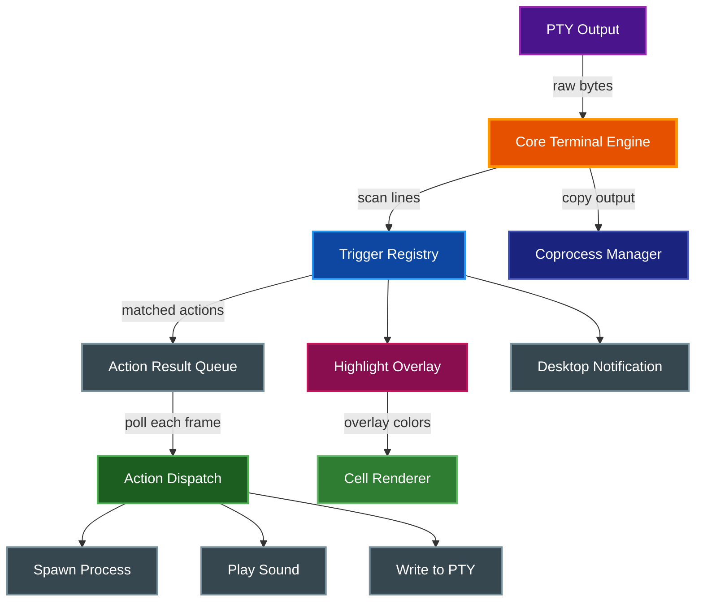
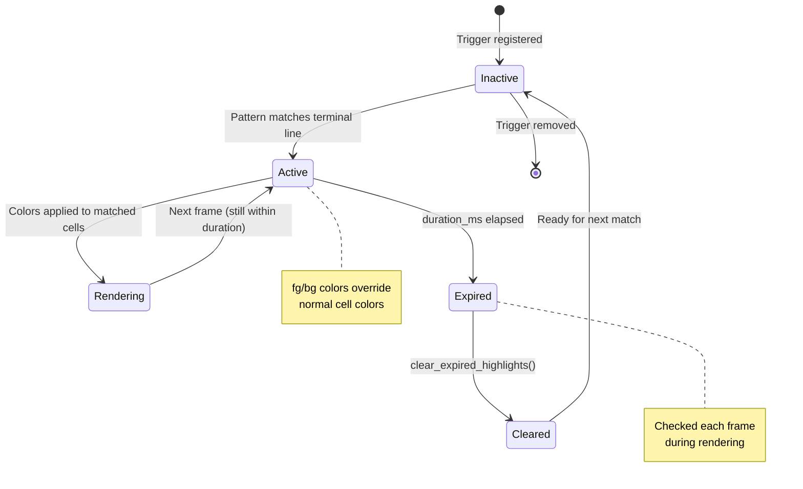
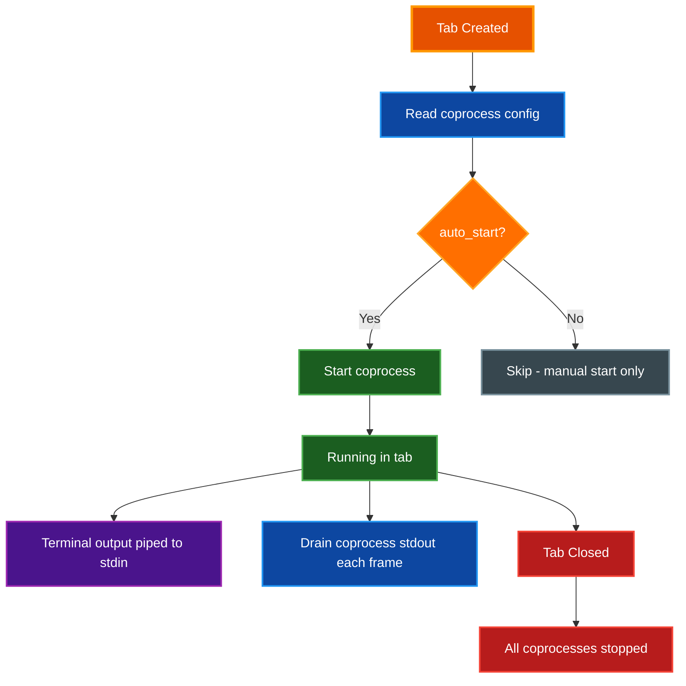

# Automation: Triggers, Actions, and Coprocesses

Par Terminal provides an automation system that lets you react to terminal output with regex-based triggers, execute actions when patterns match, and run coprocesses that exchange data with the terminal session.

## Table of Contents

- [Overview](#overview)
- [Triggers](#triggers)
  - [Defining a Trigger](#defining-a-trigger)
  - [Regex Pattern Syntax](#regex-pattern-syntax)
  - [Capture Groups](#capture-groups)
- [Trigger Actions](#trigger-actions)
  - [Highlight](#highlight)
  - [Notify](#notify)
  - [Mark Line](#mark-line)
  - [Set Variable](#set-variable)
  - [Run Command](#run-command)
  - [Play Sound](#play-sound)
  - [Send Text](#send-text)
- [Trigger Highlights](#trigger-highlights)
- [Action Dispatch](#action-dispatch)
- [Coprocesses](#coprocesses)
  - [Defining a Coprocess](#defining-a-coprocess)
  - [Auto-Start Behavior](#auto-start-behavior)
  - [Per-Tab Lifecycle](#per-tab-lifecycle)
- [Sound Files](#sound-files)
- [Settings UI](#settings-ui)
  - [Managing Triggers](#managing-triggers)
  - [Managing Coprocesses](#managing-coprocesses)
- [Complete Configuration Examples](#complete-configuration-examples)
- [Related Documentation](#related-documentation)

## Overview

The automation system consists of three integrated features:

- **Triggers** match regex patterns against terminal output as it arrives. Each trigger carries one or more actions that fire when the pattern matches.
- **Actions** define what happens when a trigger fires: highlighting matched text, sending desktop notifications, running external commands, playing sounds, sending text back to the terminal, and more.
- **Coprocesses** are long-running external processes that receive a copy of terminal output on their stdin and can write data back to the terminal through their stdout.

Triggers and coprocesses are defined in `config.yaml` and managed through the Settings UI. They are registered per-tab at tab creation time and re-synced whenever settings are saved.

The following diagram shows how the automation system fits into the event loop:



## Triggers

A trigger watches terminal output for lines that match a regex pattern. When a match occurs, all actions attached to the trigger are fired. Triggers can be enabled or disabled individually without removing them from the configuration.

### Defining a Trigger

Add triggers to the `triggers` array in `config.yaml`:

```yaml
triggers:
  - name: "Error highlight"
    pattern: "ERROR: (.+)"
    enabled: true
    actions:
      - type: highlight
        fg: [255, 0, 0]
        duration_ms: 5000
```

Each trigger requires:

| Field | Type | Required | Default | Description |
|-------|------|----------|---------|-------------|
| `name` | string | Yes | -- | Human-readable identifier |
| `pattern` | string | Yes | -- | Regex pattern to match against terminal output |
| `enabled` | boolean | No | `true` | Whether the trigger is active |
| `actions` | array | No | `[]` | List of actions to fire on match |

### Regex Pattern Syntax

Trigger patterns use Rust's `regex` crate syntax. Common patterns include:

| Pattern | Matches |
|---------|---------|
| `ERROR` | The literal text "ERROR" anywhere in a line |
| `^\\$\\s` | Lines that start with a shell prompt |
| `\\b(WARN\|ERROR\|FATAL)\\b` | Any of the listed severity words |
| `failed with exit code (\\d+)` | Failure messages, capturing the exit code |
| `(?i)password` | Case-insensitive match for "password" |

> **📝 Note:** Because patterns are written inside YAML strings, backslashes must be doubled (`\\d` for the regex `\d`). Alternatively, use YAML literal blocks to avoid escaping issues.

### Capture Groups

Parenthesized groups in the pattern capture matched text. Captured values are available in action fields using `$1`, `$2`, etc.:

```yaml
triggers:
  - name: "Build failure"
    pattern: "FAILED: (.+) exited with (\\d+)"
    enabled: true
    actions:
      - type: notify
        title: "Build Failed"
        message: "$1 returned exit code $2"
```

## Trigger Actions

Each trigger can have multiple actions that all fire when the pattern matches. Actions are defined in the trigger's `actions` array. There are seven action types.

### Highlight

Applies foreground and/or background color to the matched text in the terminal display. Highlights are temporary and expire after the specified duration.

```yaml
- type: highlight
  fg: [255, 255, 255]    # Optional: RGB foreground color
  bg: [200, 0, 0]        # Optional: RGB background color
  duration_ms: 5000      # Duration in milliseconds (default: 5000)
```

| Field | Type | Required | Default | Description |
|-------|------|----------|---------|-------------|
| `fg` | `[u8, u8, u8]` | No | `null` | RGB foreground color for matched text |
| `bg` | `[u8, u8, u8]` | No | `null` | RGB background color for matched text |
| `duration_ms` | integer | No | `5000` | How long the highlight remains visible (ms) |

### Notify

Sends a desktop notification using the system notification service.

```yaml
- type: notify
  title: "Alert"
  message: "Something happened: $1"
```

| Field | Type | Required | Description |
|-------|------|----------|-------------|
| `title` | string | Yes | Notification title |
| `message` | string | Yes | Notification body (supports capture group substitution) |

### Mark Line

Marks the current line in the scrollback for easy navigation. An optional label is displayed alongside the marker.

```yaml
- type: mark_line
  label: "Build started"    # Optional label text
```

| Field | Type | Required | Default | Description |
|-------|------|----------|---------|-------------|
| `label` | string | No | `null` | Text label for the mark |

### Set Variable

Sets a named variable that can be referenced by other triggers or displayed in badges.

```yaml
- type: set_variable
  name: "last_error"
  value: "$1"
```

| Field | Type | Required | Description |
|-------|------|----------|-------------|
| `name` | string | Yes | Variable name |
| `value` | string | Yes | Value to assign (supports capture group substitution) |

### Run Command

Spawns an external command as a detached process. The command runs independently and does not block the terminal.

```yaml
- type: run_command
  command: "say"
  args: ["Build failed"]
```

| Field | Type | Required | Default | Description |
|-------|------|----------|---------|-------------|
| `command` | string | Yes | -- | Executable name or path |
| `args` | array of strings | No | `[]` | Command-line arguments |

> **⚠️ Warning:** The command is spawned without a shell. If you need shell features (pipes, redirection), set `command` to your shell and pass the expression as an argument: `command: "sh"`, `args: ["-c", "echo 'done' >> /tmp/log.txt"]`.

### Play Sound

Plays an audio file or the built-in bell tone. Sound files are loaded from the par-term sounds directory.

```yaml
- type: play_sound
  sound_id: "alert.wav"    # Filename, "bell", or empty for built-in tone
  volume: 75               # 0-100 (default: 50)
```

| Field | Type | Required | Default | Description |
|-------|------|----------|---------|-------------|
| `sound_id` | string | No | `""` | Sound file name, `"bell"` for built-in tone, or empty for built-in tone |
| `volume` | integer | No | `50` | Playback volume from 0 to 100 |

### Send Text

Writes text to the terminal's PTY input, as if the user had typed it. An optional delay allows waiting before the text is sent.

```yaml
- type: send_text
  text: "tail -f /var/log/syslog\n"
  delay_ms: 500
```

| Field | Type | Required | Default | Description |
|-------|------|----------|---------|-------------|
| `text` | string | Yes | -- | Text to send to the terminal (use `\n` for Enter) |
| `delay_ms` | integer | No | `0` | Milliseconds to wait before sending |

> **⚠️ Warning:** Use `send_text` with care. Sending text to the terminal is equivalent to typing it, and recursive matches (where the sent text triggers the same trigger again) can cause infinite loops. Make sure your pattern does not match the text you are sending.

## Trigger Highlights

When a trigger includes a `highlight` action, the matched text region receives a temporary color overlay. The rendering pipeline applies highlights after normal cell colors are computed but before the frame is drawn.

The highlight lifecycle works as follows:



Each frame, the renderer calls `get_trigger_highlights()` to retrieve active highlight regions. For each highlight, the renderer overwrites the foreground and/or background color of every cell within the matched column range. After rendering, `clear_expired_highlights()` removes any highlights whose duration has elapsed.

Highlights are identified by row and column range. If the terminal scrolls, the highlight tracks the absolute row position in the scrollback buffer so it remains attached to the correct line.

## Action Dispatch

The event loop dispatches trigger actions each frame, immediately after checking the bell state. The dispatch flow works as follows:

1. The core terminal engine scans each new line of output against all enabled triggers in the trigger registry
2. When a pattern matches, the core engine executes internal actions (Highlight, Notify, MarkLine, SetVariable) directly
3. Actions that require frontend capabilities (RunCommand, PlaySound, SendText) are queued as `ActionResult` events
4. Each frame, `check_trigger_actions()` polls the action result queue and dispatches:
   - **RunCommand**: Spawns the command as a detached child process using `std::process::Command`
   - **PlaySound**: If `sound_id` is `"bell"` or empty, plays the built-in bell tone through the existing audio bell system. Otherwise, opens the sound file from the sounds directory, decodes it, and plays it on a background thread
   - **SendText**: If `delay_ms` is 0, writes the text to the PTY immediately. If a delay is specified, spawns a background thread that sleeps for the delay duration before writing

```mermaid
sequenceDiagram
    participant Core as Core Engine
    participant Queue as Action Queue
    participant Loop as Event Loop
    participant PTY as PTY
    participant OS as OS / Audio

    Core->>Core: Scan new output line
    Core->>Core: Pattern match found
    Core->>Queue: Enqueue ActionResult

    Loop->>Queue: poll_action_results()
    Queue-->>Loop: Vec<ActionResult>

    alt RunCommand
        Loop->>OS: spawn detached process
    else PlaySound (bell)
        Loop->>OS: play built-in bell tone
    else PlaySound (file)
        Loop->>OS: decode and play sound file
    else SendText (no delay)
        Loop->>PTY: write text bytes
    else SendText (with delay)
        Loop->>Loop: spawn background thread
        Loop-->>PTY: write after delay_ms
    end
```

## Coprocesses

A coprocess is a long-running external process that runs alongside a terminal tab. When `copy_terminal_output` is enabled, all output that appears in the terminal is also piped to the coprocess's stdin. The coprocess can process, filter, or log this output independently.

### Defining a Coprocess

Add coprocess definitions to the `coprocesses` array in `config.yaml`:

```yaml
coprocesses:
  - name: "Log watcher"
    command: "grep"
    args: ["--line-buffered", "ERROR"]
    auto_start: false
    copy_terminal_output: true
```

Each coprocess definition requires:

| Field | Type | Required | Default | Description |
|-------|------|----------|---------|-------------|
| `name` | string | Yes | -- | Human-readable identifier |
| `command` | string | Yes | -- | Executable name or path |
| `args` | array of strings | No | `[]` | Command-line arguments |
| `auto_start` | boolean | No | `false` | Start automatically when a tab is created |
| `copy_terminal_output` | boolean | No | `true` | Send terminal output to the coprocess stdin |

### Auto-Start Behavior

When `auto_start` is set to `true`, the coprocess is started automatically each time a new tab is created. The startup sequence is:

1. Tab creates a new `CoprocessManager` instance
2. For each coprocess definition with `auto_start: true`, the manager calls `start()` with the coprocess configuration
3. The coprocess is spawned as a child process with its stdin connected for receiving terminal output
4. A coprocess ID is assigned and tracked in the tab's `coprocess_ids` array
5. If the coprocess fails to start, a warning is logged and the tab continues without it

Coprocesses with `auto_start: false` appear in the configuration but are not started until manually activated through the Settings UI.

### Per-Tab Lifecycle

Each tab maintains its own `CoprocessManager` and set of running coprocesses. This means:

- Opening a new tab starts a fresh set of auto-start coprocesses
- Closing a tab stops all coprocesses running in that tab
- Coprocesses in one tab do not interact with coprocesses in another tab
- The coprocess manager drains buffered stdout from each running coprocess every frame



## Sound Files

The `play_sound` action loads audio files from the par-term sounds directory:

```
~/.config/par-term/sounds/
```

On macOS and Linux this resolves via XDG to `~/.config/par-term/sounds/`. On Windows it resolves to `%APPDATA%\par-term\sounds\`.

**Supported formats:** The audio decoder (rodio) supports WAV, OGG Vorbis, FLAC, and MP3. Place sound files in the sounds directory and reference them by filename in the `sound_id` field.

**Special values for `sound_id`:**

| Value | Behavior |
|-------|----------|
| `""` (empty string) | Plays the built-in bell tone |
| `"bell"` | Plays the built-in bell tone |
| `"alert.wav"` | Loads and plays `~/.config/par-term/sounds/alert.wav` |
| Any other filename | Loaded from the sounds directory |

**Volume:** The `volume` field accepts an integer from 0 to 100. It is converted to a float ratio internally (`volume / 100.0`) and clamped to the 0.0-1.0 range. The default is 50.

If the specified file does not exist, a warning is logged and no sound is played. File decoding errors are also logged without interrupting the terminal.

## Settings UI

Triggers and coprocesses are managed through the **Settings > Automation** tab. The tab contains two collapsible sections.

### Managing Triggers

The **Triggers** section provides:

- **Trigger list**: Each trigger shows its enabled checkbox, name, pattern (in monospace), and action count
- **Enable/disable toggle**: Click the checkbox next to a trigger to toggle it without editing
- **Edit button**: Opens an inline edit form for the trigger
- **Delete button**: Removes the trigger from the configuration
- **Add Trigger button**: Opens a form to create a new trigger

The trigger edit form includes:

- **Name field**: A text input for the trigger's human-readable name
- **Pattern field**: A text input with live regex validation. Invalid patterns display a red error message below the field
- **Actions list**: Numbered list of attached actions, each showing type-specific inline editors (color pickers, sliders, text fields)
- **Add action dropdown**: Select an action type to append to the trigger
- **Save/Cancel buttons**: Save validates that name and pattern are non-empty and the regex compiles

Changes are applied immediately when saved and synced to the core trigger registry. A re-sync flag is set so that the active tab's terminal picks up the new trigger definitions.

### Managing Coprocesses

The **Coprocesses** section provides:

- **Coprocess list**: Each entry shows an `[auto]` or `[manual]` badge, the name, and the full command (in monospace)
- **Edit button**: Opens an inline edit form
- **Delete button**: Removes the coprocess definition
- **Add Coprocess button**: Opens a form to create a new definition

The coprocess edit form includes:

- **Name field**: Human-readable identifier
- **Command field**: The executable to run
- **Arguments field**: Space-separated arguments
- **Auto-start checkbox**: Whether to start the coprocess automatically with new tabs
- **Copy terminal output checkbox**: Whether to pipe terminal output to the coprocess stdin

> **📝 Note:** The quick search bar in Settings supports the following keywords for the Automation tab: `trigger`, `regex`, `pattern`, `match`, `action`, `highlight`, `notify`, `coprocess`, `pipe`, `subprocess`, `auto start`.

## Complete Configuration Examples

### Error Monitoring Setup

This example highlights errors in red, sends a desktop notification with the error message, and plays an alert sound:

```yaml
triggers:
  - name: "Error monitor"
    pattern: "\\b(ERROR|FATAL):\\s*(.+)"
    enabled: true
    actions:
      - type: highlight
        fg: [255, 255, 255]
        bg: [180, 0, 0]
        duration_ms: 10000
      - type: notify
        title: "Terminal Error"
        message: "$1: $2"
      - type: play_sound
        sound_id: "error.wav"
        volume: 60
```

### Build System Integration

Detect build completion and send a notification with a sound:

```yaml
triggers:
  - name: "Build succeeded"
    pattern: "BUILD SUCCESSFUL in (\\S+)"
    enabled: true
    actions:
      - type: notify
        title: "Build Complete"
        message: "Finished in $1"
      - type: play_sound
        sound_id: "bell"
        volume: 40
      - type: highlight
        bg: [0, 100, 0]
        duration_ms: 3000

  - name: "Build failed"
    pattern: "BUILD FAILED"
    enabled: true
    actions:
      - type: highlight
        fg: [255, 255, 255]
        bg: [200, 0, 0]
        duration_ms: 8000
      - type: play_sound
        sound_id: "error.wav"
        volume: 80
      - type: run_command
        command: "say"
        args: ["Build failed"]
```

### Test Runner Notifications

Mark test result lines and set variables for badge display:

```yaml
triggers:
  - name: "Tests passed"
    pattern: "(\\d+) tests? passed"
    enabled: true
    actions:
      - type: mark_line
        label: "Tests passed"
      - type: set_variable
        name: "test_result"
        value: "PASS ($1)"

  - name: "Tests failed"
    pattern: "(\\d+) tests? failed"
    enabled: true
    actions:
      - type: mark_line
        label: "Tests failed"
      - type: set_variable
        name: "test_result"
        value: "FAIL ($1)"
      - type: highlight
        fg: [255, 100, 100]
        duration_ms: 15000
```

### Auto-Response Trigger

Automatically respond to a password prompt (use with caution):

```yaml
triggers:
  - name: "SSH key passphrase"
    pattern: "Enter passphrase for key"
    enabled: false
    actions:
      - type: send_text
        text: "my-passphrase\n"
        delay_ms: 200
```

> **⚠️ Warning:** Storing passwords in configuration files is a security risk. This example is shown for illustration; prefer SSH agent or keychain integration for production use.

### Coprocess for Log Filtering

Run a log filter coprocess that receives all terminal output and filters for warnings:

```yaml
coprocesses:
  - name: "Warning filter"
    command: "grep"
    args: ["--line-buffered", "WARN"]
    auto_start: true
    copy_terminal_output: true
```

### Full Automation Configuration

A combined configuration showing triggers and coprocesses together:

```yaml
# Trigger definitions
triggers:
  - name: "Error highlight"
    pattern: "\\bERROR\\b"
    enabled: true
    actions:
      - type: highlight
        fg: [255, 255, 255]
        bg: [180, 0, 0]
        duration_ms: 5000
      - type: play_sound
        sound_id: ""
        volume: 50

  - name: "Warning highlight"
    pattern: "\\bWARN(ING)?\\b"
    enabled: true
    actions:
      - type: highlight
        fg: [0, 0, 0]
        bg: [255, 200, 0]
        duration_ms: 3000

  - name: "Compile error"
    pattern: "error\\[E(\\d+)\\]"
    enabled: true
    actions:
      - type: notify
        title: "Compile Error"
        message: "Rust error E$1"
      - type: highlight
        fg: [255, 100, 100]
        duration_ms: 8000

  - name: "SSH connection"
    pattern: "Connection to (\\S+) closed"
    enabled: true
    actions:
      - type: notify
        title: "SSH Disconnected"
        message: "Lost connection to $1"

# Coprocess definitions
coprocesses:
  - name: "Error logger"
    command: "sh"
    args: ["-c", "grep --line-buffered ERROR >> /tmp/terminal_errors.log"]
    auto_start: true
    copy_terminal_output: true

  - name: "Activity monitor"
    command: "wc"
    args: ["-l"]
    auto_start: false
    copy_terminal_output: true
```

## Related Documentation

- [Architecture](ARCHITECTURE.md) - System design and data flow overview
- [Tabs](TABS.md) - Tab management and per-tab state
- [Badges](BADGES.md) - Dynamic badge display using trigger variables
- [Keyboard Shortcuts](KEYBOARD_SHORTCUTS.md) - Quick access to settings and features
- [Profiles](PROFILES.md) - Per-profile trigger and coprocess configuration
