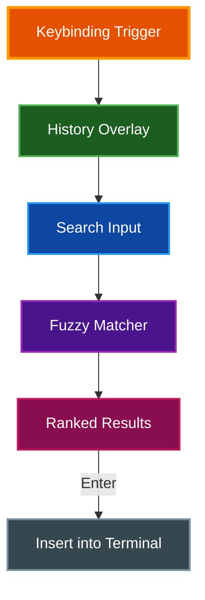

# Command History

par-term includes a fuzzy command history search overlay for quickly finding and re-executing previous commands.

## Table of Contents
- [Overview](#overview)
- [Opening Command History](#opening-command-history)
- [Fuzzy Matching](#fuzzy-matching)
- [Navigation](#navigation)
- [Entry Details](#entry-details)
- [History Capture](#history-capture)
- [Configuration](#configuration)
- [Related Documentation](#related-documentation)

## Overview

The command history search provides a searchable overlay for browsing and selecting from your command history with fuzzy matching, exit code indicators, and relative timestamps.



## Opening Command History

| Action | macOS | Linux/Windows |
|--------|-------|---------------|
| Open command history | `Cmd + R` | `Ctrl + Alt + R` |

The overlay appears over the terminal with a search input field and a scrollable list of previous commands.

## Fuzzy Matching

The search uses the Skim fuzzy matching algorithm for ranked results:

- Type any substring or abbreviation to filter commands
- Results are ranked by match quality (best matches appear first)
- Matching characters are highlighted with yellow underline in the results list
- The search is case-insensitive

**Examples:**

| Query | Matches |
|-------|---------|
| `gco` | `git checkout`, `git commit`, `git config` |
| `dkr` | `docker run`, `docker restart` |
| `mk` | `make build`, `make test`, `mkdir` |

## Navigation

| Key | Action |
|-----|--------|
| `Arrow Up` | Move selection up |
| `Arrow Down` | Move selection down |
| `Enter` | Insert selected command into terminal |
| `Escape` | Close overlay without inserting |

## Entry Details

Each history entry displays:

- **Command text** with fuzzy match highlighting
- **Exit code indicator**: green circle for success (exit 0), red circle for failure (non-zero), gray circle for unknown
- **Relative timestamp**: how long ago the command was executed (e.g., "2m ago", "1h ago", "3d ago")

## History Capture

Commands are captured from two sources:

1. **OSC 133 shell integration markers**: When shell integration is installed, par-term captures commands as they execute via the standard shell integration protocol
2. **Core library history**: The terminal emulation core tracks command input independently

**Deduplication**: Re-executing a command moves it to the top of the history list rather than creating a duplicate entry.

## Configuration

```yaml
# Maximum number of history entries to keep (default: 1000)
command_history_max_entries: 1000
```

**Settings UI:** Settings > Terminal > Command History

**Persistence:** History is saved across sessions to `~/.config/par-term/command_history.yaml`.

## Related Documentation

- [Keyboard Shortcuts](KEYBOARD_SHORTCUTS.md) - All keyboard shortcuts
- [Search](SEARCH.md) - Terminal text search (separate feature)
- [Integrations](INTEGRATIONS.md) - Shell integration for command capture
