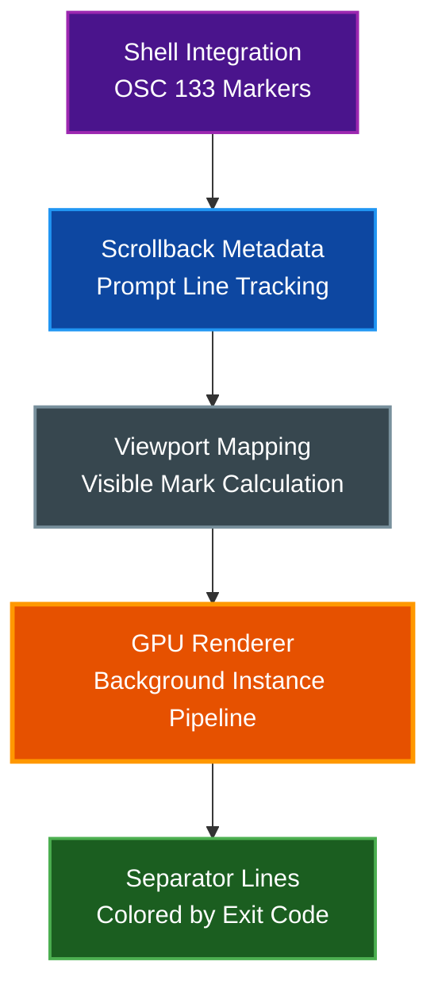
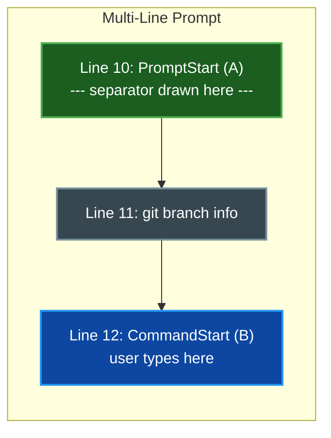

# Command Separators

Horizontal separator lines rendered between shell commands in the terminal grid, providing a clear visual boundary between each command and its output. Requires shell integration to detect prompt boundaries.

## Table of Contents

- [Overview](#overview)
- [Prerequisites](#prerequisites)
- [How It Works](#how-it-works)
  - [Shell Integration and OSC 133](#shell-integration-and-osc-133)
  - [Separator Placement](#separator-placement)
  - [Exit-Code Coloring](#exit-code-coloring)
- [Configuration](#configuration)
  - [Options Reference](#options-reference)
  - [Example Configuration](#example-configuration)
- [Settings UI](#settings-ui)
- [Prompt Compatibility](#prompt-compatibility)
- [Split-Pane Support](#split-pane-support)
- [Troubleshooting](#troubleshooting)
- [Related Documentation](#related-documentation)

## Overview

Command separators draw thin horizontal lines at the boundary between shell commands, making it easy to visually distinguish where one command's output ends and the next prompt begins. The lines span the full width of the terminal content area and are colored based on the exit code of the preceding command.



The feature is **disabled by default** and must be explicitly enabled in configuration or the Settings UI.

## Prerequisites

Command separators require **shell integration** to be installed. The shell integration script emits OSC 133 escape sequences that par-term uses to identify prompt boundaries.

To install shell integration:

```bash
par-term install-shell-integration
```

See [Integrations](INTEGRATIONS.md) for full installation instructions and supported shells.

## How It Works

### Shell Integration and OSC 133

The OSC 133 protocol defines a set of markers that shells emit at specific points during the prompt-command lifecycle:

| Marker | Name | Purpose |
|--------|------|---------|
| `\e]133;A\a` | **PromptStart** | Emitted at the very beginning of the prompt |
| `\e]133;B\a` | **CommandStart** | Emitted where the user types their command (after the prompt text) |
| `\e]133;C\a` | **CommandExecuted** | Emitted when the command begins execution |
| `\e]133;D\a` | **CommandFinished** | Emitted when the command finishes (includes exit code) |

par-term captures these markers along with the absolute cursor line at parse time through its shell integration event queue. The `ScrollbackMetadata` module tracks prompt lines, associates them with command results, and produces a list of `ScrollbackMark` entries used for both scrollbar indicators and separator rendering.

### Separator Placement

Separators are placed at the **top of the prompt** (the PromptStart marker line), not at the cursor line where the user types. This distinction matters for multi-line prompts:



When a PromptStart (A) marker and CommandStart (B) marker are within a few lines of each other, the system merges them and keeps the earlier PromptStart position. This ensures the separator appears at the visual top of the prompt rather than partway through it.

### Exit-Code Coloring

When exit-code coloring is enabled (the default), separator lines indicate the result of the preceding command:

| Exit Code | Color | Meaning |
|-----------|-------|---------|
| `0` | Green | Command succeeded |
| Non-zero | Red | Command failed |
| Unknown | Gray | No exit code available yet |

The specific color values used are:

- **Success (exit 0)**: `rgba(0.25, 0.75, 0.25, opacity)` -- green
- **Failure (non-zero)**: `rgba(0.85, 0.25, 0.25, opacity)` -- red
- **Unknown**: `rgba(0.5, 0.5, 0.5, opacity)` -- gray

When exit-code coloring is disabled, all separators use the configured custom color instead.

> **Tip:** Trigger marks with custom colors override exit-code coloring. If a mark has a custom color set by a trigger rule, that color takes precedence.

## Configuration

### Options Reference

| Option | Type | Default | Description |
|--------|------|---------|-------------|
| `command_separator_enabled` | boolean | `false` | Enable separator lines between commands |
| `command_separator_thickness` | float | `1.0` | Line thickness in pixels (range: 0.5 - 5.0) |
| `command_separator_opacity` | float | `0.4` | Line opacity (range: 0.0 - 1.0) |
| `command_separator_exit_color` | boolean | `true` | Color lines by exit code (green/red/gray) |
| `command_separator_color` | [R, G, B] | `[128, 128, 128]` | Custom color when exit-code coloring is disabled |

### Example Configuration

```yaml
# Enable command separator lines
command_separator_enabled: true

# Thin, subtle lines
command_separator_thickness: 1.0
command_separator_opacity: 0.4

# Color by exit code (green=success, red=failure)
command_separator_exit_color: true

# Custom color (used only when exit-code coloring is disabled)
command_separator_color: [128, 128, 128]
```

A more prominent configuration for high-visibility separators:

```yaml
command_separator_enabled: true
command_separator_thickness: 2.0
command_separator_opacity: 0.8
command_separator_exit_color: true
```

To use a fixed custom color instead of exit-code coloring:

```yaml
command_separator_enabled: true
command_separator_thickness: 1.5
command_separator_opacity: 0.5
command_separator_exit_color: false
command_separator_color: [100, 149, 237]  # Cornflower blue
```

## Settings UI

Command separator settings are located in **Settings > Terminal > Command Separators**:

- **Show separator lines between commands** -- Checkbox to enable or disable the feature. The label notes that shell integration is required.
- **Thickness (px)** -- Slider ranging from 0.5 to 5.0 pixels
- **Opacity** -- Slider ranging from 0.0 to 1.0
- **Color by exit code** -- Checkbox to toggle exit-code coloring (green for success, red for failure)
- **Custom color** -- Color picker, only available when exit-code coloring is disabled

All controls except the enable checkbox are disabled when the feature is turned off. Changes take effect immediately without requiring a restart.

## Prompt Compatibility

Command separators work with any prompt configuration that emits OSC 133 markers:

- **Single-line prompts** (e.g., `$ `) -- PromptStart and CommandStart on the same line; separator drawn at that line
- **Two-line prompts** (e.g., path on one line, prompt character on the next) -- Separator drawn at the top line
- **Multi-line prompts** (e.g., Starship, Powerline, Oh My Posh) -- Separator drawn at the PromptStart line, which is the first line of the prompt block
- **Tall prompts** (up to 6 lines) -- The system supports prompts up to `MAX_PROMPT_HEIGHT` (6 lines) when merging PromptStart and CommandStart markers

The key requirement is that the shell integration script emits the PromptStart marker at the beginning of the prompt. Most shell integration implementations do this correctly.

## Split-Pane Support

Command separators work in both single-pane and split-pane modes. In split-pane mode:

- Each pane independently tracks its own shell integration markers and scrollback metadata
- Separator marks are computed per-pane based on each pane's scroll offset and visible lines
- Separators span only the content area of their respective pane
- Pane opacity is respected -- separator opacity is multiplied by the pane's own opacity value

## Troubleshooting

### Separators not appearing

1. **Verify shell integration is installed**: Run `par-term install-shell-integration` and restart your shell
2. **Check the feature is enabled**: Confirm `command_separator_enabled: true` in your config or enable it in Settings > Terminal > Command Separators
3. **Run a command first**: Separators appear at prompt boundaries, so you need at least one completed command for a line to appear
4. **Check opacity**: If `command_separator_opacity` is set very low (near 0.0), the lines may be invisible

### Separators appear in the wrong position

- Multi-line prompts require the shell integration script to emit a PromptStart marker at the top of the prompt. If your shell only emits CommandStart, the separator will appear at the cursor line instead
- Check that your shell integration script is up to date by running `par-term install-shell-integration`

### Colors not changing with exit codes

- Ensure `command_separator_exit_color` is set to `true`
- Some shells may not report exit codes through the OSC 133;D marker. Check that your shell integration script includes `$?` or `$status` in the CommandFinished sequence

## Related Documentation

- [Integrations](INTEGRATIONS.md) - Shell integration installation and supported shells
- [Scrollback](SCROLLBACK.md) - Scrollback buffer and navigation
- [Accessibility](ACCESSIBILITY.md) - Contrast enforcement and display readability options
- [Window Management](WINDOW_MANAGEMENT.md) - Split-pane modes and window layout
