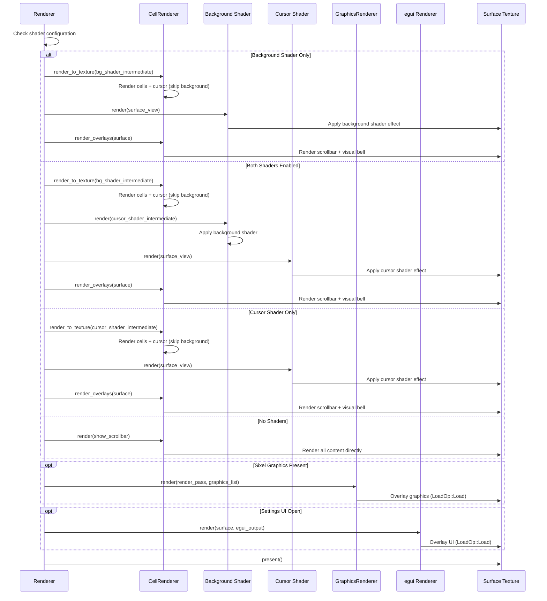
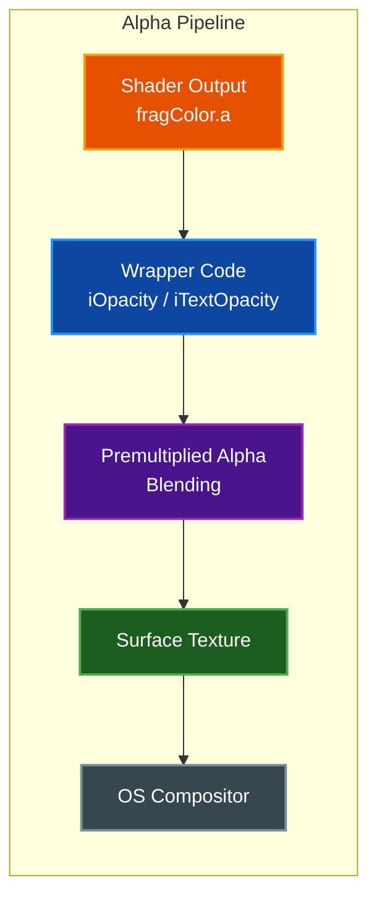
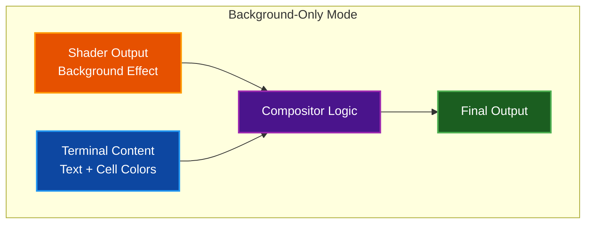
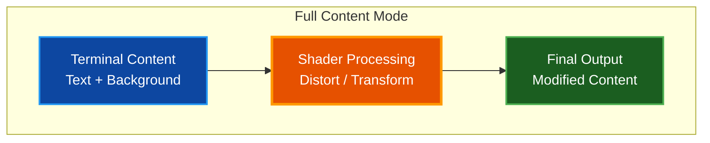

# Compositor and Custom Shader System

This document describes how par-term's GPU compositor handles rendering layers, transparency, and custom shader effects. It provides guidance for writing custom GLSL shaders that integrate with the terminal's rendering pipeline.

## Table of Contents

- [Overview](#overview)
- [Compositor Architecture](#compositor-architecture)
  - [Render Layer Stack](#render-layer-stack)
  - [Render Order](#render-order)
- [Transparency and Alpha Compositing](#transparency-and-alpha-compositing)
  - [macOS Metal Layer Configuration](#macos-metal-layer-configuration)
  - [Alpha Flow Through Pipeline](#alpha-flow-through-pipeline)
- [Custom Shader System](#custom-shader-system)
  - [Shader Location](#shader-location)
  - [Shader Format](#shader-format)
  - [Available Uniforms](#available-uniforms)
  - [Shader Modes](#shader-modes)
- [Writing Custom Shaders](#writing-custom-shaders)
  - [Basic Structure](#basic-structure)
  - [Background-Only Mode](#background-only-mode)
  - [Full Content Mode](#full-content-mode)
- [Example Shaders](#example-shaders)
  - [Static Gradient Background](#static-gradient-background)
  - [Animated Water Distortion](#animated-water-distortion)
  - [CRT Retro Effect](#crt-retro-effect)
  - [Bloom/Glow Effect](#bloomglow-effect)
  - [Negative Color Inversion](#negative-color-inversion)
- [Configuration](#configuration)
- [Troubleshooting](#troubleshooting)
- [Related Documentation](#related-documentation)

## Overview

Par-term uses a GPU-accelerated compositor built on wgpu (Vulkan/Metal/DirectX 12) that manages multiple render layers. The compositor supports:

- **Background images** with various display modes (fit, fill, stretch, tile, center)
- **Background shaders** for animated backgrounds and post-processing effects
- **Cursor shaders** for cursor-specific effects (trails, glows, ripples)
- **Per-pixel transparency** for window transparency effects
- **Sixel/iTerm2/Kitty graphics** inline image rendering
- **Settings UI overlay** via egui

The custom shader system is compatible with Ghostty/Shadertoy-style GLSL shaders, making it easy to adapt existing shader code. Both background and cursor shaders share the same uniform interface and can be enabled independently.

## Compositor Architecture

### Render Layer Stack

The compositor renders content in a specific order from bottom to top:

```mermaid
graph TB
    subgraph "Compositor Layer Stack"
        L0[Background Image Layer<br/>Optional background image]
        L1[Terminal Content Layer<br/>Cell Backgrounds + Text + Cursor]
        L2[Background Shader Layer<br/>Post-processing Effects]
        L3[Cursor Shader Layer<br/>Cursor Trails + Glows]
        L4[Overlay Layer<br/>Scrollbar + Visual Bell]
        L5[Graphics Layer<br/>Sixel/iTerm2/Kitty Images]
        L6[UI Layer<br/>egui Settings Panel]
    end

    L0 --> L1
    L1 --> L2
    L2 --> L3
    L3 --> L4
    L4 --> L5
    L5 --> L6

    style L0 fill:#1a237e,stroke:#3f51b5,stroke-width:2px,color:#ffffff
    style L1 fill:#0d47a1,stroke:#2196f3,stroke-width:2px,color:#ffffff
    style L2 fill:#e65100,stroke:#ff9800,stroke-width:3px,color:#ffffff
    style L3 fill:#ff6f00,stroke:#ffa726,stroke-width:2px,color:#ffffff
    style L4 fill:#37474f,stroke:#78909c,stroke-width:2px,color:#ffffff
    style L5 fill:#4a148c,stroke:#9c27b0,stroke-width:2px,color:#ffffff
    style L6 fill:#1b5e20,stroke:#4caf50,stroke-width:2px,color:#ffffff
```



> **Note:** Par-term supports two independent custom shaders: a **background shader** for post-processing effects and a **cursor shader** for cursor-specific effects (trails, glows). When shaders are enabled, terminal content is first rendered to an intermediate texture, then processed by the background shader (if enabled), then by the cursor shader (if enabled). Overlays (scrollbar, visual bell) are rendered after shaders to ensure they remain unaffected by shader effects.

### Render Order

The rendering pipeline executes in this sequence:



## Transparency and Alpha Compositing

### macOS Metal Layer Configuration

On macOS, the compositor configures the CAMetalLayer for per-pixel transparency and performance:

```rust
// Allow per-pixel transparency (content only)
setOpaque: false
// Keep global layer opacity at 1.0; per-pixel alpha controls transparency
setOpacity: 1.0
// Disable VSync throttling for improved frame rates
setDisplaySyncEnabled: false
```

This configuration ensures:
- Alpha values written by shaders control window transparency
- The desktop shows through transparent pixels
- Frame rates can exceed the display refresh rate when VSync is disabled

### Alpha Flow Through Pipeline

The alpha channel flows through the compositor as follows:



**Key points:**

- **`iOpacity`**: Window opacity applied to background pixels
- **`iTextOpacity`**: Text opacity applied to text pixels
- **Premultiplied alpha blending**: Used throughout the pipeline
- **Final alpha determines transparency**: `alpha = 1.0` is opaque, `alpha = 0.0` is fully transparent

## Custom Shader System

Par-term supports two independent shader systems that can be enabled separately or together:

1. **Background Shaders** (`custom_shader`): Post-processing effects applied to the entire terminal
2. **Cursor Shaders** (`cursor_shader`): Visual effects that follow the cursor

Both use the same GLSL format and share uniforms.

### Shader Location

Custom shaders are stored in the par-term configuration directory:

| Platform | Path |
|----------|------|
| macOS/Linux | `~/.config/par-term/shaders/` |
| Windows | `%APPDATA%\par-term\shaders\` |

The shaders directory is created automatically when par-term starts.

### Shader Format

Par-term uses **Ghostty/Shadertoy-style GLSL shaders**. Each shader must define a `mainImage` function:

```glsl
void mainImage(out vec4 fragColor, in vec2 fragCoord)
{
    // Your shader code here
    fragColor = vec4(1.0, 0.0, 0.0, 1.0);  // Red output
}
```

The shader is automatically wrapped with the necessary boilerplate for uniforms, samplers, and vertex shader code.

### Available Uniforms

Par-term provides a comprehensive set of Shadertoy-compatible uniforms:

#### Standard Shadertoy Uniforms

| Uniform | Type | Description |
|---------|------|-------------|
| `iResolution` | `vec3` | Viewport resolution: `xy` = pixels, `z` = pixel aspect ratio (usually 1.0) |
| `iTime` | `float` | Time in seconds since shader started (animated) |
| `iTimeDelta` | `float` | Time since last frame in seconds |
| `iFrame` | `float` | Frame counter (increments each frame) |
| `iFrameRate` | `float` | Current frame rate in FPS |
| `iMouse` | `vec4` | Mouse state (see below) |
| `iDate` | `vec4` | Date/time (year, month 0-11, day 1-31, seconds since midnight) |
| `iChannel0` | `sampler2D` | User texture channel 0 (Shadertoy compatible) |
| `iChannel1` | `sampler2D` | User texture channel 1 |
| `iChannel2` | `sampler2D` | User texture channel 2 |
| `iChannel3` | `sampler2D` | User texture channel 3 |
| `iChannel4` | `sampler2D` | Terminal content texture (par-term specific) |
| `iChannelResolution[0-4]` | `vec4` | Channel resolutions `[width, height, 1.0, 0.0]` |
| `iCubemap` | `samplerCube` | Cubemap texture for environment mapping |
| `iCubemapResolution` | `vec4` | Cubemap face size `[size, size, 1.0, 0.0]` |

#### iMouse Behavior

The `iMouse` uniform follows Shadertoy conventions with Y-axis flipped to bottom-left origin:

- **xy**: Current mouse position in pixels when left button is held, otherwise last drag position
- **z**: Click X position (positive when button down, negative when released)
- **w**: Click Y position (positive when button down, negative when released)

Example usage:
```glsl
void mainImage(out vec4 fragColor, in vec2 fragCoord) {
    vec2 uv = fragCoord / iResolution.xy;

    // Check if mouse is being dragged
    if (iMouse.z > 0.0) {
        // Draw circle at mouse position
        float dist = length(fragCoord - iMouse.xy);
        if (dist < 20.0) {
            fragColor = vec4(1.0, 0.0, 0.0, 1.0);
            return;
        }
    }

    fragColor = texture(iChannel4, uv);
}
```

#### Par-term Specific Uniforms

| Uniform | Type | Description |
|---------|------|-------------|
| `iOpacity` | `float` | Window opacity (0.0 - 1.0). Set to 0.0 in chain mode (when shader output feeds another shader) |
| `iTextOpacity` | `float` | Text opacity (0.0 - 1.0). Respects `keep_text_opaque` setting |
| `iBrightness` | `float` | Shader brightness multiplier (0.05 - 1.0) |
| `iFullContent` | `float` | Full content mode flag (0.0 or 1.0) |
| `iBackgroundColor` | `vec4` | Solid background color `[R, G, B, A]` (0.0-1.0). When A > 0, solid color mode is active |
| `iTimeKeyPress` | `float` | Time when last key was pressed (same timebase as iTime) |

#### Cursor Uniforms (Ghostty-Compatible)

These uniforms enable cursor trail and glow effects:

| Uniform | Type | Description |
|---------|------|-------------|
| `iCurrentCursor` | `vec4` | Current cursor: `xy` = position, `zw` = cell size (pixels) |
| `iPreviousCursor` | `vec4` | Previous cursor position and size |
| `iCurrentCursorColor` | `vec4` | Current cursor RGBA color |
| `iPreviousCursorColor` | `vec4` | Previous cursor RGBA color |
| `iTimeCursorChange` | `float` | Time when cursor last moved (same timebase as `iTime`) |
| `iCursorTrailDuration` | `float` | Trail animation duration in seconds |
| `iCursorGlowRadius` | `float` | Glow radius in pixels |
| `iCursorGlowIntensity` | `float` | Glow intensity (0.0 - 1.0) |
| `iCursorShaderColor` | `vec4` | User-configured cursor shader color |

### Shader Modes

Par-term supports two shader modes controlled by the `custom_shader_full_content` configuration option:

#### Background-Only Mode (Default)

In this mode (`iFullContent = 0.0`):

- Shader provides a **background** effect
- Terminal **text is composited cleanly on top** of shader output
- Text remains sharp and unaffected by shader distortions
- Best for animated backgrounds, gradients, and visual effects behind text



#### Full Content Mode

In this mode (`iFullContent = 1.0`):

- Shader receives **full terminal content** (text + background) via `iChannel4`
- Shader output is used **directly** - no automatic text compositing
- Enables text distortion, warping, color manipulation
- Best for CRT effects, underwater distortion, glitch effects



## Writing Custom Shaders

### Basic Structure

Every shader follows this pattern:

```glsl
void mainImage(out vec4 fragColor, in vec2 fragCoord)
{
    // 1. Normalize coordinates to 0-1 range
    vec2 uv = fragCoord / iResolution.xy;

    // 2. Sample terminal content (iChannel4 in par-term)
    vec4 terminal = texture(iChannel4, uv);

    // 3. Apply your effect
    vec3 color = /* your effect */;

    // 4. Output with alpha
    fragColor = vec4(color, 1.0);
}
```

### Background-Only Mode

For background effects that preserve text readability:

```glsl
// Animated gradient background
void mainImage(out vec4 fragColor, in vec2 fragCoord)
{
    vec2 uv = fragCoord / iResolution.xy;

    // Create animated gradient
    float t = iTime * 0.5;
    vec3 color1 = vec3(0.1, 0.1, 0.3);  // Dark blue
    vec3 color2 = vec3(0.3, 0.1, 0.2);  // Dark purple

    float gradient = sin(uv.x * 3.14159 + t) * 0.5 + 0.5;
    vec3 bg = mix(color1, color2, gradient);

    // Output background color
    // The wrapper will composite text on top automatically
    fragColor = vec4(bg, 1.0);
}
```

### Full Content Mode

For effects that manipulate the entire terminal content:

```glsl
// Underwater distortion effect (requires full_content mode)
void mainImage(out vec4 fragColor, in vec2 fragCoord)
{
    vec2 uv = fragCoord / iResolution.xy;

    // Create wave distortion
    float wave = sin(uv.y * 20.0 + iTime * 2.0) * 0.01;
    vec2 distorted_uv = uv + vec2(wave, 0.0);

    // Sample distorted terminal content (iChannel4)
    vec4 color = texture(iChannel4, distorted_uv);

    // Apply blue tint
    color.rgb *= vec3(0.8, 0.9, 1.0);

    fragColor = color;
}
```

## Example Shaders

### Static Gradient Background

A simple diagonal gradient from dark blue to dark red:

```glsl
// gradient-background.glsl
void mainImage(out vec4 fragColor, in vec2 fragCoord)
{
    vec2 uv = fragCoord.xy / iResolution.xy;

    // Diagonal gradient factor
    float gradientFactor = (uv.x + uv.y) / 2.0;

    // Define colors
    vec3 startColor = vec3(0.1, 0.1, 0.5);  // Dark blue
    vec3 endColor = vec3(0.5, 0.1, 0.1);    // Dark red

    vec3 gradientColor = mix(startColor, endColor, gradientFactor);

    // Sample terminal to detect content
    vec4 terminal = texture(iChannel4, uv);

    // Blend: use terminal color where content exists
    float mask = 1.0 - step(0.5, dot(terminal.rgb, vec3(1.0)));
    vec3 blended = mix(terminal.rgb, gradientColor, mask);

    fragColor = vec4(blended, terminal.a);
}
```

### Animated Water Distortion

Caustic water effect that distorts terminal content (use with full content mode):

```glsl
// water.glsl
#define TAU 6.28318530718
#define MAX_ITER 6

void mainImage(out vec4 fragColor, in vec2 fragCoord)
{
    vec3 water_color = vec3(1.0) * 0.5;
    float time = iTime * 0.5 + 23.0;
    vec2 uv = fragCoord.xy / iResolution.xy;

    // Generate caustic pattern
    vec2 p = mod(uv * TAU, TAU) - 250.0;
    vec2 i = vec2(p);
    float c = 1.0;
    float inten = 0.005;

    for (int n = 0; n < MAX_ITER; n++) {
        float t = time * (1.0 - (3.5 / float(n + 1)));
        i = p + vec2(cos(t - i.x) + sin(t + i.y),
                     sin(t - i.y) + cos(t + i.x));
        c += 1.0 / length(vec2(p.x / (sin(i.x + t) / inten),
                               p.y / (cos(i.y + t) / inten)));
    }

    c /= float(MAX_ITER);
    c = 1.17 - pow(c, 1.4);
    vec3 color = vec3(pow(abs(c), 15.0));
    color = clamp((color + water_color) * 1.2, 0.0, 1.0);

    // Distort UV based on caustic
    vec2 tc = vec2(cos(c) - 0.75, sin(c) - 0.75) * 0.04;
    uv = clamp(uv + tc, 0.0, 1.0);

    fragColor = texture(iChannel4, uv);
    if (fragColor.a == 0.0) fragColor = vec4(1.0);
    fragColor *= vec4(color, 1.0);
}
```

### CRT Retro Effect

Classic CRT monitor simulation with curvature and scanlines (use with full content mode):

```glsl
// retro-terminal.glsl
float warp = 0.25;  // CRT curvature
float scan = 0.50;  // Scanline darkness

void mainImage(out vec4 fragColor, in vec2 fragCoord)
{
    vec2 uv = fragCoord / iResolution.xy;

    // Calculate distance from center (for curvature)
    vec2 dc = abs(0.5 - uv);
    dc *= dc;

    // Apply CRT warp
    uv.x -= 0.5;
    uv.x *= 1.0 + (dc.y * (0.3 * warp));
    uv.x += 0.5;
    uv.y -= 0.5;
    uv.y *= 1.0 + (dc.x * (0.4 * warp));
    uv.y += 0.5;

    // Black outside boundaries
    if (uv.y > 1.0 || uv.x < 0.0 || uv.x > 1.0 || uv.y < 0.0) {
        fragColor = vec4(0.0, 0.0, 0.0, 1.0);
    } else {
        // Apply scanline effect
        float apply = abs(sin(fragCoord.y) * 0.5 * scan);

        // Sample and apply color tint
        vec3 color = texture(iChannel4, uv).rgb;
        vec3 tint = vec3(0.0, 0.8, 0.6);  // Teal/green tint

        fragColor = vec4(mix(color * tint, vec3(0.0), apply), 1.0);
    }
}
```

### Bloom/Glow Effect

Adds a soft glow to bright text (use with full content mode):

```glsl
// bloom.glsl
// Golden spiral samples for blur kernel
const vec3[24] samples = vec3[24](
    vec3(0.169, 0.986, 1.0),
    vec3(-1.333, 0.472, 0.707),
    vec3(-0.846, -1.511, 0.577),
    vec3(1.554, -1.259, 0.5),
    // ... additional samples
    vec3(-2.877, 3.965, 0.204)
);

float lum(vec4 c) {
    return 0.299 * c.r + 0.587 * c.g + 0.114 * c.b;
}

void mainImage(out vec4 fragColor, in vec2 fragCoord) {
    vec2 uv = fragCoord.xy / iResolution.xy;
    vec4 color = texture(iChannel4, uv);

    vec2 step = vec2(1.414) / iResolution.xy;

    // Sample surrounding pixels for bloom
    for (int i = 0; i < 24; i++) {
        vec3 s = samples[i];
        vec4 c = texture(iChannel4, uv + s.xy * step);
        float l = lum(c);
        if (l > 0.2) {
            color += l * s.z * c * 0.2;
        }
    }

    fragColor = color;
}
```

### Negative Color Inversion

Simple color inversion effect (use with full content mode):

```glsl
// negative.glsl
void mainImage(out vec4 fragColor, in vec2 fragCoord)
{
    vec2 uv = fragCoord / iResolution.xy;
    vec4 color = texture(iChannel4, uv);

    // Invert RGB, preserve alpha
    fragColor = vec4(1.0 - color.rgb, color.a);
}
```

## Configuration

Custom shader settings in `~/.config/par-term/config.yaml`:

```yaml
# ========== Background Shader Settings ==========
# Path to shader file (relative to shaders/ directory or absolute path)
custom_shader: "water.glsl"

# Enable/disable the background shader
custom_shader_enabled: true

# Enable animation (updates iTime each frame)
custom_shader_animation: true

# Animation speed multiplier (1.0 = normal, default: 1.0)
custom_shader_animation_speed: 1.0

# Text opacity when using shader (0.0 - 1.0, default: 1.0)
custom_shader_text_opacity: 1.0

# Brightness multiplier (0.05 - 1.0, default: 1.0)
custom_shader_brightness: 1.0

# Full content mode - shader can manipulate text (default: false)
custom_shader_full_content: false

# Texture channels (iChannel0-3, Shadertoy compatible)
# Paths can be relative to config dir or absolute
custom_shader_channel0: "textures/noise.png"
custom_shader_channel1: null
custom_shader_channel2: null
custom_shader_channel3: null

# Cubemap texture for environment mapping (6-face cubemap prefix)
custom_shader_cubemap: "shaders/textures/cubemaps/env-outside"
custom_shader_cubemap_enabled: true

# Use background image as iChannel0 instead of custom_shader_channel0
custom_shader_use_background_as_channel0: false

# ========== Cursor Shader Settings ==========
# Path to cursor shader file (relative to shaders/ directory or absolute)
cursor_shader: "cursor_glow.glsl"

# Enable/disable cursor shader (default: false)
cursor_shader_enabled: false

# Animation settings
cursor_shader_animation: true
cursor_shader_animation_speed: 1.0

# Cursor effect parameters
cursor_shader_color: [255, 255, 255]        # RGB color for shader effects
cursor_shader_trail_duration: 0.5           # Trail duration in seconds
cursor_shader_glow_radius: 80.0             # Glow radius in pixels
cursor_shader_glow_intensity: 0.3           # Glow intensity (0.0 - 1.0)

# Hide default cursor when shader is active (default: false)
cursor_shader_hides_cursor: false

# Disable cursor shader in alt screen apps like vim, less, htop (default: true)
cursor_shader_disable_in_alt_screen: true

# ========== General Settings ==========
# Window opacity (affects shader background, 0.0 - 1.0)
window_opacity: 1.0

# Background image settings (rendered before terminal content)
background_image: "~/image.png"
background_image_enabled: true
background_image_mode: stretch  # fit, fill, stretch, tile, center
background_image_opacity: 1.0
```

## Troubleshooting

### Shader Not Loading

**Symptom:** Terminal starts but no shader effect visible

**Solutions:**
- Verify shader file exists in `~/.config/par-term/shaders/`
- Check `custom_shader_enabled: true` in config
- Look for shader compilation errors in terminal output
- Ensure shader has `mainImage` function signature

### Black Screen

**Symptom:** Terminal content not visible

**Solutions:**
- Ensure shader outputs alpha > 0.0: `fragColor = vec4(color, 1.0);`
- Check UV coordinates are in 0.0-1.0 range
- Verify `iChannel0` sampling with valid coordinates

### Text Not Readable

**Symptom:** Text is distorted or hard to read

**Solutions:**
- Use background-only mode (`custom_shader_full_content: false`) for most effects
- Increase `custom_shader_text_opacity` to 1.0
- Reduce distortion intensity in shader

### Performance Issues

**Symptom:** Low frame rate with custom shader

**Solutions:**
- Reduce shader complexity (fewer iterations, simpler math)
- Disable animation when not needed: `custom_shader_animation: false`
- Use `iTime * speed` with small speed values

### Shader Compilation Errors

**Symptom:** Error messages on startup

**Common fixes:**
- GLSL version compatibility: shaders are compiled as GLSL 450
- Use `texture(sampler2D, vec2)` not `texture2D`
- Declare constants with `const` keyword
- Array initialization: `vec3[N] arr = vec3[N](...)`

## Related Documentation

- [README.md](../README.md) - Project overview and configuration reference
- [Custom Shaders Guide](CUSTOM_SHADERS.md) - Installing and creating custom shaders
- [Included Shaders](SHADERS.md) - Complete list of all available shaders
- [Architecture](ARCHITECTURE.md) - System architecture overview
- [Shadertoy](https://www.shadertoy.com) - Shader inspiration and examples
- [Ghostty Shaders](https://ghostty.org/) - Compatible shader format reference
