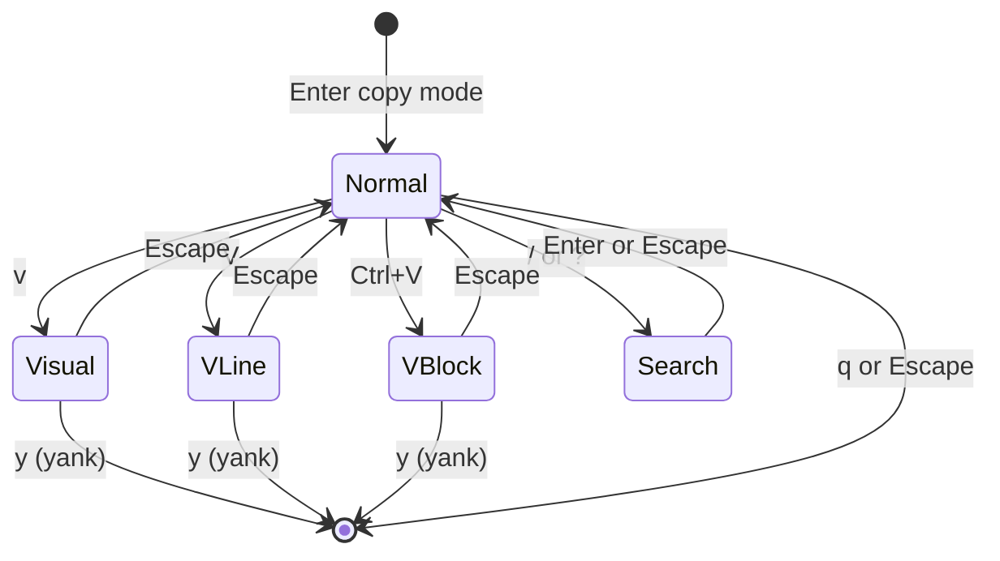

# Copy Mode

Vi-style keyboard-driven text selection and navigation for par-term, similar to iTerm2's copy mode.

## Table of Contents

- [Overview](#overview)
- [Entering and Exiting](#entering-and-exiting)
- [Navigation](#navigation)
  - [Basic Motions](#basic-motions)
  - [Word Motions](#word-motions)
  - [Page Motions](#page-motions)
  - [Line Motions](#line-motions)
  - [Count Prefix](#count-prefix)
- [Visual Selection](#visual-selection)
- [Yank (Copy)](#yank-copy)
- [Search](#search)
- [Marks](#marks)
- [Status Bar](#status-bar)
- [Configuration](#configuration)
- [Related Documentation](#related-documentation)

## Overview

Copy mode provides a full vi-style interface for navigating the terminal buffer and selecting text using only the keyboard. When copy mode is active, all keyboard input drives an independent cursor through the terminal buffer (including scrollback) rather than being sent to the shell.



## Entering and Exiting

| Action | macOS | Linux/Windows |
|--------|-------|---------------|
| Toggle copy mode | `Cmd + Shift + C` | `Ctrl + Shift + Space` |

The keybinding is configurable via Settings > Input > Keybindings using the `toggle_copy_mode` action.

**Exiting:**
- `q` exits copy mode immediately
- `Escape` exits visual mode first, then exits copy mode on a second press
- Switching tabs exits copy mode automatically
- Yanking exits copy mode when `copy_mode_auto_exit_on_yank` is enabled (default)

## Navigation

### Basic Motions

| Key | Action |
|-----|--------|
| `h` / `Left` | Move left |
| `j` / `Down` | Move down |
| `k` / `Up` | Move up |
| `l` / `Right` | Move right |
| `0` | Start of line |
| `$` | End of line |
| `^` | First non-blank character |
| `Home` | Start of line |
| `End` | End of line |

### Word Motions

| Key | Action |
|-----|--------|
| `w` | Forward to start of next word |
| `b` | Backward to start of previous word |
| `e` | Forward to end of word |
| `W` | WORD forward (whitespace-delimited) |
| `B` | WORD backward (whitespace-delimited) |
| `E` | WORD end (whitespace-delimited) |

### Page Motions

| Key | Action |
|-----|--------|
| `Ctrl + U` | Half page up |
| `Ctrl + D` | Half page down |
| `Ctrl + B` / `PageUp` | Full page up |
| `Ctrl + F` / `PageDown` | Full page down |

### Line Motions

| Key | Action |
|-----|--------|
| `gg` | Go to top of scrollback |
| `G` | Go to bottom of buffer |
| `{count}G` | Go to specific line (e.g., `10G`) |

### Count Prefix

Prefix any motion with a number to repeat it. For example:
- `5j` moves down 5 lines
- `3w` moves forward 3 words
- `10G` goes to line 10

## Visual Selection

Enter a visual mode to start selecting text, then use any motion to extend the selection.

| Key | Mode | Description |
|-----|------|-------------|
| `v` | Character | Select individual characters |
| `V` | Line | Select entire lines |
| `Ctrl + V` | Block | Rectangular/column selection |

Each visual mode is a toggle. Press the same key again to exit that mode, or press `Escape`.

## Yank (Copy)

Press `y` while in any visual mode to copy the selection to the clipboard.

- If `copy_mode_auto_exit_on_yank` is enabled (default), copy mode exits after yanking
- If disabled, the selection clears but copy mode stays active

## Search

| Key | Action |
|-----|--------|
| `/` | Start forward search |
| `?` | Start backward search |
| `Enter` | Execute search |
| `Escape` | Cancel search |
| `n` | Find next match |
| `N` | Find previous match |

Search is case-insensitive and wraps around the entire buffer.

## Marks

Set bookmarks at positions in the buffer and jump back to them.

| Key | Action |
|-----|--------|
| `m{a-z}` | Set mark (e.g., `ma` sets mark 'a') |
| `'{a-z}` | Jump to mark (e.g., `'a` jumps to mark 'a') |

Marks persist for the duration of the copy mode session and are cleared on exit.

## Status Bar

When copy mode is active, a status bar overlay appears at the bottom of the terminal showing:

- **Current mode**: COPY, VISUAL, V-LINE, V-BLOCK, or SEARCH
- **Cursor position**: Line and column
- **Search query**: When searching

The status bar can be hidden via Settings > Input > Copy Mode.

## Configuration

### Config Options

```yaml
# Enable/disable copy mode (default: true)
copy_mode_enabled: true

# Auto-exit copy mode after yanking (default: true)
copy_mode_auto_exit_on_yank: true

# Show status bar overlay (default: true)
copy_mode_show_status: true
```

### Settings UI

All options are available in Settings > Input > Copy Mode section.

### Custom Keybinding

Override the default keybinding in `config.yaml`:

```yaml
keybindings:
  - key: "CmdOrCtrl+Shift+C"
    action: "toggle_copy_mode"
```

## Related Documentation

- [Keyboard Shortcuts](KEYBOARD_SHORTCUTS.md) - Complete keyboard shortcut reference
- [Mouse Features](MOUSE_FEATURES.md) - Mouse-based text selection
- [Search](SEARCH.md) - Terminal search (separate from copy mode search)
