# Crate Structure

Reference guide for the par-term Cargo workspace: how the workspace is split, what each crate owns, and how to work with the dependency graph when cutting releases or adding new sub-crates.

## Table of Contents

- [Overview](#overview)
- [Dependency Diagram](#dependency-diagram)
- [Layer Descriptions](#layer-descriptions)
  - [Layer 0 — Independent Utilities](#layer-0--independent-utilities)
  - [Layer 1 — Foundation](#layer-1--foundation)
  - [Layer 2 — Feature Crates](#layer-2--feature-crates)
  - [Layer 3 — Rendering](#layer-3--rendering)
  - [Layer 4 — Root Binary](#layer-4--root-binary)
- [Crate Reference](#crate-reference)
- [Version Bump Order](#version-bump-order)
- [Adding a New Sub-Crate](#adding-a-new-sub-crate)
- [Related Documentation](#related-documentation)

## Overview

par-term uses a Cargo workspace to decompose the application into focused, independently-testable crates. The split serves three goals:

- **Compile-time parallelism** — crates without shared state compile concurrently, keeping incremental builds fast.
- **Explicit dependency boundaries** — a crate can only use what it declares; layering is enforced by the compiler.
- **Independent publishing** — utility crates such as `par-term-mcp` and `par-term-ssh` can be published to crates.io and consumed by other projects without pulling in the full terminal stack.

The workspace contains 14 sub-crates plus the root binary. They form a directed acyclic graph with four distinct layers.

## Dependency Diagram

```mermaid
graph TD
    Main[par-term<br>Root Binary]

    subgraph "Layer 0 — Independent Utilities"
        ACP[par-term-acp<br>ACP Agent Protocol]
        SSH[par-term-ssh<br>SSH Host Discovery]
        MCP[par-term-mcp<br>MCP Stdio Server]
    end

    subgraph "Layer 1 — Foundation"
        Config[par-term-config<br>Configuration & Shared Types]
    end

    subgraph "Layer 2 — Feature Crates"
        Fonts[par-term-fonts<br>Font Management & Text Shaping]
        Input[par-term-input<br>Input Sequence Generation]
        Keybind[par-term-keybindings<br>Keybinding Registry]
        Prettifier[par-term-prettifier<br>Content Prettifier]
        Scripting[par-term-scripting<br>Observer & Scripting]
        Settings[par-term-settings-ui<br>Settings Tabs & Sidebar]
        Terminal[par-term-terminal<br>Terminal Manager]
        Tmux[par-term-tmux<br>tmux Control Mode]
        Update[par-term-update<br>Self-Update System]
    end

    subgraph "Layer 3 — Rendering"
        Render[par-term-render<br>GPU Rendering Engine]
    end

    Config --> Fonts
    Config --> Input
    Config --> Keybind
    Config --> Prettifier
    Config --> Scripting
    Config --> Settings
    Config --> Terminal
    Config --> Tmux
    Config --> Update

    Fonts --> Render
    Config --> Render

    Main --> ACP
    Main --> Config
    Main --> Fonts
    Main --> Input
    Main --> Keybind
    Main --> MCP
    Main --> Prettifier
    Main --> Render
    Main --> Scripting
    Main --> Settings
    Main --> SSH
    Main --> Terminal
    Main --> Tmux
    Main --> Update

    style Main fill:#e65100,stroke:#ff9800,stroke-width:3px,color:#ffffff
    style ACP fill:#4a148c,stroke:#9c27b0,stroke-width:2px,color:#ffffff
    style SSH fill:#4a148c,stroke:#9c27b0,stroke-width:2px,color:#ffffff
    style MCP fill:#4a148c,stroke:#9c27b0,stroke-width:2px,color:#ffffff
    style Config fill:#1b5e20,stroke:#4caf50,stroke-width:2px,color:#ffffff
    style Fonts fill:#0d47a1,stroke:#2196f3,stroke-width:2px,color:#ffffff
    style Input fill:#880e4f,stroke:#c2185b,stroke-width:2px,color:#ffffff
    style Keybind fill:#880e4f,stroke:#c2185b,stroke-width:2px,color:#ffffff
    style Scripting fill:#880e4f,stroke:#c2185b,stroke-width:2px,color:#ffffff
    style Settings fill:#880e4f,stroke:#c2185b,stroke-width:2px,color:#ffffff
    style Terminal fill:#880e4f,stroke:#c2185b,stroke-width:2px,color:#ffffff
    style Tmux fill:#880e4f,stroke:#c2185b,stroke-width:2px,color:#ffffff
    style Prettifier fill:#880e4f,stroke:#c2185b,stroke-width:2px,color:#ffffff
    style Update fill:#880e4f,stroke:#c2185b,stroke-width:2px,color:#ffffff
    style Render fill:#0d47a1,stroke:#2196f3,stroke-width:2px,color:#ffffff
```



## Layer Descriptions

### Layer 0 — Independent Utilities

These crates carry zero internal workspace dependencies. They can be built, tested, and published in any order, and are safe to extract into standalone repositories if needed.

| Crate | Responsibility |
|-------|---------------|
| `par-term-acp` | Agent Communication Protocol (ACP) — JSON-RPC-based protocol for integrating AI agents. Handles agent lifecycle, tool-call dispatch, and transcript management. No internal deps means it can be embedded in other tools. |
| `par-term-ssh` | SSH host discovery — parses `~/.ssh/config`, `~/.ssh/known_hosts`, and shell history; performs mDNS/Bonjour network scanning. Produces a deduplicated list of SSH targets for the quick-connect UI. |
| `par-term-mcp` | MCP stdio server — implements the Model Context Protocol over stdin/stdout for AI agent integration. Independently publishable; reads par-term config paths via `dirs` but carries no crate-level dep on `par-term-config`. |

### Layer 1 — Foundation

One crate forms the root of the internal dependency graph. All Layer 2 crates depend on it.

| Crate | Responsibility |
|-------|---------------|
| `par-term-config` | Configuration loading, YAML serialization, and shared types used across the workspace: `Config`, `Cell`, `ScrollbackMark`, `PaneId`, `TabId`, `KeyBinding`, `FontRange`, and more. Includes optional file watching (`notify`) for config hot-reload and optional `wgpu` type conversions for the render crate. |

> **Note:** `par-term-config` depends on `par-term-emu-core-rust` (an external crate, not in this workspace) for `UnicodeVersion`, `AmbiguousWidth`, and `NormalizationForm` types. Bumping the core library version requires updating `par-term-config` first.

### Layer 2 — Feature Crates

These nine crates each depend on `par-term-config` and implement a distinct feature area. They can be built in parallel after Layer 1 is ready.

| Crate | Responsibility |
|-------|---------------|
| `par-term-fonts` | Font discovery, loading, and fallback chain using `fontdb`. Text shaping via `rustybuzz` (HarfBuzz port). Glyph rasterization via `swash`. Provides `FontManager` and `TextShaper` to the render and terminal layers. |
| `par-term-input` | Translates `winit` keyboard and mouse events into VT escape byte sequences. Handles modifier keys, function keys, mouse reporting modes, and clipboard paste sequences. |
| `par-term-keybindings` | Parses keybinding definitions from config, matches key combos against incoming events, and maintains a named action registry. Supports platform-aware `CmdOrCtrl` modifier shorthand. |
| `par-term-prettifier` | Content prettifier framework — detects structured content in terminal output (Markdown, JSON, YAML, diffs, stack traces, diagrams, CSV, SQL results, logs, TOML, XML, tables) and renders it with rich syntax highlighting and inline graphics. Pluggable detector/renderer architecture; ships 12 built-in format renderers including native Mermaid diagram support. |
| `par-term-scripting` | Observer pattern implementation for event-driven automation. Integrates with `par-term-emu-core-rust`'s terminal event observer trait to trigger shell callbacks and automation scripts on terminal output events. |
| `par-term-settings-ui` | 14 settings tabs: Appearance (includes Badge + Progress Bar), Window (includes Arrangements), Input, Terminal, Effects, Status Bar, Profiles, Notifications, Integrations (includes SSH), Automation (includes Scripts), Snippets & Actions, Prettifier, Assistant, Advanced. Sidebar navigation component and section search. Built on egui; depends only on `par-term-config`. |
| `par-term-terminal` | `TerminalManager` — the thread-safe wrapper around `PtySession` from `par-term-emu-core-rust`. Manages the PTY process, scrollback extraction, styled content, clipboard OSC 52, hyperlink tracking, and inline graphics metadata. |
| `par-term-tmux` | tmux control mode integration: session lifecycle, bidirectional state sync between par-term panes and tmux windows/panes, and control protocol command builders. Bridges the core library's control mode parser to par-term's pane system. |
| `par-term-update` | Self-update system: fetches release manifests, compares semantic versions, downloads and verifies binary archives (SHA-256), and extracts updates in place. Tracks last-check timestamps against the configured `UpdateCheckFrequency`. |

### Layer 3 — Rendering

One crate sits above Layer 2 because it depends on both `par-term-config` and `par-term-fonts`.

| Crate | Responsibility |
|-------|---------------|
| `par-term-render` | GPU rendering engine built on `wgpu`. Owns the cell renderer (glyph atlas, instanced draw calls, WGSL shaders), the graphics renderer (Sixel/iTerm2/Kitty texture cache), the custom shader renderer (GLSL-to-WGSL via `naga`, iChannel textures), and the egui overlay integration. |

### Layer 4 — Root Binary

| Crate | Responsibility |
|-------|---------------|
| `par-term` | Application entry point. Owns window management (`winit` event loop), the tab/pane tree, input routing, the native menu (`muda`), the standalone settings window, the AI inspector panel, session logging, search, profile management, and all cross-crate orchestration. Re-exports public types from all workspace crates for backward compatibility. |

## Crate Reference

Quick lookup table with each crate's primary public types and where they are consumed.

| Crate | Key Public Types / APIs | Primary Consumers |
|-------|------------------------|-------------------|
| `par-term-acp` | `AcpAgent`, `AcpSession`, `ToolCall` | `par-term` (AI inspector panel) |
| `par-term-config` | `Config`, `Cell`, `PaneId`, `TabId`, `KeyBinding`, `FontRange`, `ScrollbackMark` | All workspace crates |
| `par-term-fonts` | `FontManager`, `FontData`, `TextShaper`, `ShapedGlyph` | `par-term-render`, `par-term` |
| `par-term-input` | `InputHandler`, `encode_key`, `encode_mouse` | `par-term` |
| `par-term-keybindings` | `KeybindingRegistry`, `KeyCombo`, `KeyAction` | `par-term` |
| `par-term-mcp` | `McpServer`, `McpRequest`, `McpResponse` | `par-term` |
| `par-term-prettifier` | `PrettifierPipeline`, `ContentBlock`, `GutterManager`, `RendererRegistry` | `par-term` |
| `par-term-render` | `Renderer`, `CellRenderer`, `GraphicsRenderer`, `CustomShaderRenderer` | `par-term` |
| `par-term-scripting` | `ScriptingHost`, `TerminalObserver` | `par-term` |
| `par-term-settings-ui` | `SettingsUi`, `SettingsState`, all tab structs | `par-term` (settings window) |
| `par-term-ssh` | `SshHostDiscovery`, `SshHost` | `par-term` (quick connect UI) |
| `par-term-terminal` | `TerminalManager`, `ScrollbackContent` | `par-term`, `par-term-tmux` |
| `par-term-tmux` | `TmuxSession`, `TmuxSync`, `TmuxCommand` | `par-term` |
| `par-term-update` | `UpdateChecker`, `UpdateManifest` | `par-term` |

## Version Bump Order

When cutting a release for crates.io, bump crate versions in dependency order. Bumping a crate out of order will cause `cargo check` or `cargo publish` to fail because downstream crates pin internal deps by exact version path.

**Rule:** bump a crate only after all crates it depends on have been bumped. Update both the crate's own `version` field in its `Cargo.toml` and any `version = "..."` constraint in dependent crates' `Cargo.toml` files.

```
Step 1 — Bump par-term-config
  Update version in: par-term-config/Cargo.toml
  Update references in: par-term-fonts, par-term-input, par-term-keybindings,
                        par-term-prettifier, par-term-scripting, par-term-settings-ui,
                        par-term-terminal, par-term-tmux, par-term-update, par-term-render,
                        Cargo.toml (root)

Step 2 — Bump Layer 0 crates (any order, no cross-deps)
  par-term-acp
  par-term-ssh
  par-term-mcp
  Update references in: Cargo.toml (root)

Step 3 — Bump Layer 2 crates (any order within the step)
  par-term-fonts
  par-term-input
  par-term-keybindings
  par-term-prettifier
  par-term-scripting
  par-term-settings-ui
  par-term-terminal
  par-term-tmux
  par-term-update
  Update references in: par-term-render/Cargo.toml (for par-term-fonts),
                        Cargo.toml (root)

Step 4 — Bump par-term-render
  Update version in: par-term-render/Cargo.toml
  Update par-term-fonts ref in: par-term-render/Cargo.toml
  Update reference in: Cargo.toml (root)

Step 5 — Bump par-term (root)
  Update version in: Cargo.toml
  Update all workspace dep versions

Step 6 — Verify
  cargo check --workspace
```

**Quick bump checklist:**

1. Bump `par-term-config` version, update all references (including `par-term-prettifier`).
2. Bump Layer 0 crate versions, update root references.
3. Bump Layer 2 crate versions (including `par-term-prettifier`), update render and root references.
4. Bump `par-term-render` version, update root reference.
5. Bump root `par-term` version.
6. Run `cargo check --workspace` to confirm no version mismatches.
7. Run `make checkall` before publishing.

## Adding a New Sub-Crate

Follow this checklist when introducing a new sub-crate to the workspace.

### 1. Create the crate

```bash
# From the repository root
cargo new --lib par-term-<name>
```

### 2. Register in the workspace

Add the new crate to `Cargo.toml` at the root level:

```toml
[workspace]
members = [
    # ... existing members ...
    "par-term-<name>",
]
```

### 3. Set package metadata

Edit `par-term-<name>/Cargo.toml` and fill in all required fields:

```toml
[package]
name = "par-term-<name>"
version = "0.1.0"
edition = "2024"
authors = ["Paul Robello <probello@gmail.com>"]
description = "One-line description for crates.io"
license = "MIT"
repository = "https://github.com/paulrobello/par-term"
homepage = "https://github.com/paulrobello/par-term"
keywords = ["terminal", "<keyword>"]
categories = ["<category>"]
```

### 4. Determine the layer

Before adding internal deps, decide which layer the crate belongs to:

- **Layer 0**: The crate needs no internal workspace deps. Keep it that way.
- **Layer 1**: Only if creating a new shared foundation (rare — `par-term-config` already fills this role).
- **Layer 2**: The crate depends on `par-term-config` only.
- **Layer 3**: The crate depends on `par-term-config` and at least one Layer 2 crate.

> **Avoid adding deps that create cycles.** Run `cargo check --workspace` immediately after adding any new internal dependency.

### 5. Add to the dependency graph documentation

Update the Mermaid diagram in the [Dependency Diagram](#dependency-diagram) section above:

- Add the new node with an appropriate label.
- Add edges from its dependencies to the new node.
- Add the edge from the new node to `Main` (root binary) if applicable.
- Apply the correct color for its layer (see style definitions in the diagram source).

### 6. Update the version bump order

Add the crate to the correct step in the [Version Bump Order](#version-bump-order) section.

### 7. Update ARCHITECTURE.md

Add the crate to the "Workspace Crate Architecture" section in `docs/ARCHITECTURE.md` — both the Mermaid diagram and the crate responsibilities table.

### 8. Verify

```bash
cargo check --workspace
make test
make lint
```

## Related Documentation

- [System Architecture](ARCHITECTURE.md) - High-level architecture including the workspace crate diagram.
- [Documentation Style Guide](DOCUMENTATION_STYLE_GUIDE.md) - Standards for project documentation.
- [Contributing Guide](../CONTRIBUTING.md) - Development environment setup and contribution workflow.
