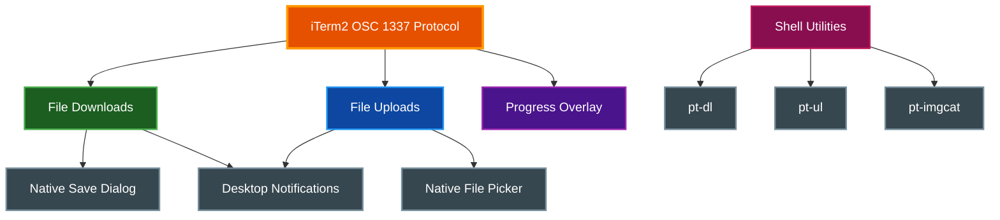
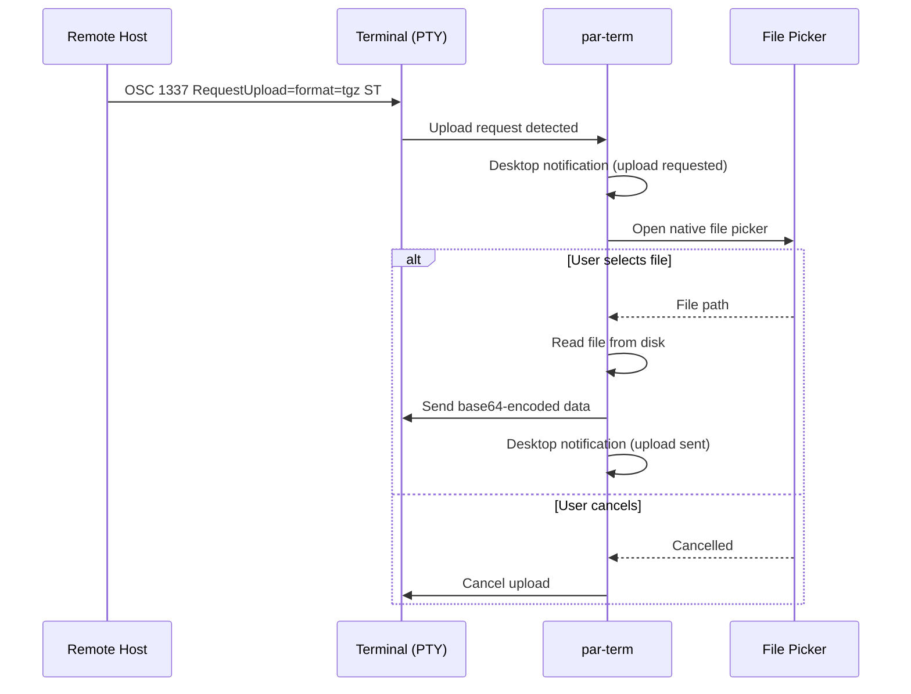

# File Transfers

Native file transfer support for downloading, uploading, and displaying inline images using the iTerm2 OSC 1337 protocol, with native OS file dialogs and a real-time progress overlay.

## Table of Contents
- [Overview](#overview)
- [File Downloads](#file-downloads)
  - [Download Flow](#download-flow)
  - [Save Location Preferences](#save-location-preferences)
  - [Desktop Notifications](#desktop-notifications)
- [File Uploads](#file-uploads)
  - [Upload Flow](#upload-flow)
  - [Upload Cancellation](#upload-cancellation)
- [Progress Overlay](#progress-overlay)
- [Shell Integration Utilities](#shell-integration-utilities)
  - [pt-dl -- Download Files](#pt-dl----download-files)
  - [pt-ul -- Upload Files](#pt-ul----upload-files)
  - [pt-imgcat -- Display Inline Images](#pt-imgcat----display-inline-images)
  - [Installation](#utility-installation)
  - [SSH Usage](#ssh-usage)
  - [tmux and screen Support](#tmux-and-screen-support)
- [Configuration](#configuration)
  - [Settings UI](#settings-ui)
  - [Config File Options](#config-file-options)
- [Troubleshooting](#troubleshooting)
- [Related Documentation](#related-documentation)

## Overview

par-term implements the iTerm2 OSC 1337 File protocol for bidirectional file transfers between local and remote hosts. The system provides:

- **Native file dialogs** for save and open operations, matching OS conventions
- **Real-time progress overlay** showing all active transfers with progress bars
- **Desktop notifications** for transfer lifecycle events (start, complete, fail)
- **Shell utilities** (`pt-dl`, `pt-ul`, `pt-imgcat`) that work over SSH on any remote host



## File Downloads

When a remote application or shell utility sends file data using the OSC 1337 File protocol with `inline=0`, par-term intercepts the transfer and presents a native save dialog.

### Download Flow

```mermaid
sequenceDiagram
    participant R as Remote Host
    participant T as Terminal (PTY)
    participant P as par-term
    participant D as Save Dialog
    participant F as Filesystem

    R->>T: OSC 1337 File=name=...;size=...;inline=0:base64data ST
    T->>P: Parse file transfer sequence
    P->>P: Show progress in overlay
    P->>P: Desktop notification (transfer started)
    P->>D: Open native save dialog
    D-->>P: User selects save path
    P->>F: Write file to disk
    P->>P: Desktop notification (transfer complete)
    P->>P: Update last used directory
```

The download process:

1. The terminal emulator core parses the OSC 1337 `File` escape sequence from the PTY output
2. The transfer appears in the progress overlay with a progress bar
3. When the transfer completes, a native save dialog opens with the suggested filename
4. The default directory in the save dialog is determined by your save location preference
5. After saving, a desktop notification confirms the download with the filename and size

### Save Location Preferences

You can configure where the save dialog opens by default. The setting controls the initial directory shown in the native save dialog:

| Option | Behavior |
|--------|----------|
| **Downloads folder** | Opens the system Downloads directory (default) |
| **Last used directory** | Remembers the directory from your most recent save |
| **Current working directory** | Uses the shell's current directory (requires shell integration) |
| **Custom directory** | Always opens a specific directory you choose |

> **Note:** If the configured directory is unavailable (e.g., shell integration not installed for CWD mode, or custom path does not exist), the save dialog falls back to the system Downloads folder.

### Desktop Notifications

par-term sends desktop notifications for file transfer lifecycle events:

- **Upload Requested** -- When a remote application requests a file upload
- **Download Saved** -- After a file is successfully saved, including filename and size
- **Download Save Failed** -- If writing the file to disk fails
- **Upload Sent** -- After upload data is successfully transmitted
- **Upload Failed** -- If the upload file cannot be read or the terminal is unavailable
- **File Transfer Failed** -- When a transfer fails for any reason

## File Uploads

When a remote application sends an OSC 1337 `RequestUpload` escape sequence, par-term shows a native file picker so you can select a local file to upload.

### Upload Flow



### Upload Cancellation

If you dismiss the file picker without selecting a file, par-term cancels the upload request. The remote application receives an abort signal, and no data is transmitted.

## Progress Overlay

A semi-transparent progress overlay appears at the bottom-right corner of the terminal window whenever file transfers are active. The overlay:

- Shows all active transfers with directional indicators (down arrow for downloads, up arrow for uploads)
- Displays a progress bar for each transfer when the total size is known
- Shows an animated indeterminate bar when the total size is unknown
- Indicates how many completed downloads are waiting for the save dialog
- Indicates how many upload requests are pending
- Auto-hides 2 seconds after the last transfer completes
- Renders at the `Foreground` layer so it appears above terminal content and the scrollbar

Only one native dialog (save or file picker) is open at a time. If multiple transfers complete simultaneously, they queue up and each dialog opens in sequence after the previous one closes.

## Shell Integration Utilities

Three POSIX shell scripts provide convenient commands for file transfers and inline image display. They use the iTerm2 OSC 1337 protocol and work on any host, including remote servers accessed via SSH.

### pt-dl -- Download Files

`pt-dl` encodes files as base64 and sends them via OSC 1337 `File` with `inline=0`, triggering a native save dialog in par-term.

```bash
# Download a single file
pt-dl report.pdf

# Download multiple files
pt-dl file1.txt file2.txt file3.log

# Pipe data from stdin (requires --name)
cat /var/log/syslog | pt-dl --name syslog.txt
mysqldump mydb | pt-dl --name backup.sql
```

**Dependencies:** `base64`, `wc`, `printf`, `cat`, `basename` (standard Unix utilities)

### pt-ul -- Upload Files

`pt-ul` sends an OSC 1337 `RequestUpload` escape sequence. par-term shows a native file picker, and the selected file data is sent to the remote host as a base64-encoded tar.gz archive.

```bash
# Upload to current directory
pt-ul

# Upload to a specific directory
pt-ul /tmp/uploads
```

**Dependencies:** `base64`, `printf`, `cat`, `tar`, `stty`

### pt-imgcat -- Display Inline Images

`pt-imgcat` encodes images and sends them via OSC 1337 `File` with `inline=1` for inline display directly in the terminal.

```bash
# Display an image
pt-imgcat photo.png

# Display with size constraints (cells or pixels)
pt-imgcat --width 80 --height 24 diagram.png
pt-imgcat --width 400px --height 300px image.jpg

# Display from stdin
cat screenshot.png | pt-imgcat

# Allow stretching (disable aspect ratio preservation)
pt-imgcat --no-preserve-aspect-ratio banner.png
```

**Options:**

| Flag | Description |
|------|-------------|
| `--width <N>` | Width in cells or pixels (e.g., `80`, `400px`) |
| `--height <N>` | Height in cells or pixels |
| `--preserve-aspect-ratio` | Maintain aspect ratio (default) |
| `--no-preserve-aspect-ratio` | Allow stretching |

**Dependencies:** `base64`, `wc`, `printf`, `cat`, `basename`

### Utility Installation

The utilities are installed automatically as part of shell integration. There are two ways to install them:

**From par-term Settings:**

Open Settings (F12) > Integrations > Install Shell Integration

**Via curl on a remote host:**

```bash
curl -fsSL https://paulrobello.github.io/par-term/install-shell-integration.sh | bash
```

Both methods install the scripts to `~/.config/par-term/bin/` and configure your shell's PATH to include that directory. After installation, restart your shell or source your shell configuration:

```bash
source ~/.bashrc   # bash
source ~/.zshrc    # zsh
```

### SSH Usage

All three utilities work transparently over SSH because they rely only on standard Unix tools available on virtually any system. Install shell integration on the remote host and the utilities are immediately available:

```bash
# On the remote host
curl -fsSL https://paulrobello.github.io/par-term/install-shell-integration.sh | bash
source ~/.bashrc

# Download a remote log file to your local machine
pt-dl /var/log/app.log

# Display a remote chart inline
pt-imgcat /tmp/chart.png

# Upload a local config file to the remote host
pt-ul /etc/myapp/
```

The escape sequences travel through the SSH connection and are interpreted by par-term on your local machine.

### tmux and screen Support

The utilities automatically detect when running inside tmux or screen (by checking the `TERM` environment variable for `tmux*` or `screen*` prefixes) and wrap escape sequences in the appropriate passthrough format. No additional configuration is needed.

## Configuration

### Settings UI

File transfer settings are accessible in the Settings window under **Advanced > File Transfers**:

1. Open Settings with **F12** (or **Cmd+,** on macOS)
2. Navigate to the **Advanced** tab in the sidebar
3. Expand the **File Transfers** section
4. Select your preferred download save location from the dropdown
5. If "Custom directory" is selected, enter a path or use the browse button to pick a folder

You can also find this section by typing `download`, `upload`, `transfer`, or `save location` in the Settings search box.

### Config File Options

The following options can be set in `config.yaml`:

```yaml
# Default save location for downloaded files
# Options: downloads, last_used, cwd, or custom with a path
download_save_location: downloads

# Example: custom directory
# download_save_location:
#   custom: "/Users/me/Transfers"
```

| Option | Type | Default | Description |
|--------|------|---------|-------------|
| `download_save_location` | enum | `downloads` | Where the save dialog opens by default |
| `last_download_directory` | string | (none) | Automatically tracked; the directory from the most recent save (used when `last_used` is selected) |

## Troubleshooting

### Save dialog does not appear

**Symptom:** A file transfer completes but no save dialog opens.

**Possible causes:**
- Another native dialog is already open (dialogs are serialized and process one at a time)
- The terminal lock could not be acquired due to heavy concurrent activity

**Solution:** Wait for any open dialog to close. The pending download is queued and the save dialog appears automatically.

### Utilities not found after installation

**Symptom:** Running `pt-dl`, `pt-ul`, or `pt-imgcat` returns "command not found".

**Solution:**
1. Verify the scripts exist in `~/.config/par-term/bin/`
2. Check that `~/.config/par-term/bin` is in your PATH
3. Restart your shell or source your shell configuration file

### Transfers do not work over SSH

**Symptom:** Running `pt-dl` or `pt-imgcat` on a remote host produces no effect.

**Solution:**
- Verify shell integration is installed on the remote host
- Confirm `base64` is available on the remote system (`which base64`)
- Check that the SSH connection is not stripping escape sequences (some SSH configurations or jump hosts may filter non-standard escape sequences)

### Upload shows "Error: tar is required"

**Symptom:** `pt-ul` fails with a tar-related error on the remote host.

**Solution:** Install `tar` on the remote host. The upload utility packages files as tar.gz archives and requires tar for extraction.

### Current working directory option not working

**Symptom:** The save dialog opens to Downloads instead of the shell's current directory when `cwd` is selected.

**Solution:** Install shell integration, which provides working directory tracking via OSC 7 / OSC 133. Without shell integration, par-term cannot determine the shell's current directory and falls back to the Downloads folder.

### Large file transfers are slow

**Symptom:** Transferring large files takes a long time.

**Explanation:** The OSC 1337 protocol base64-encodes all file data, which increases the transfer size by approximately 33%. For very large files, consider using `scp`, `rsync`, or other dedicated file transfer tools instead.

## Related Documentation

- [Integrations](INTEGRATIONS.md) - Shell integration installation and configuration
- [Keyboard Shortcuts](KEYBOARD_SHORTCUTS.md) - All keyboard shortcuts including Settings access
- [SSH](SSH.md) - SSH connection features and remote host management
