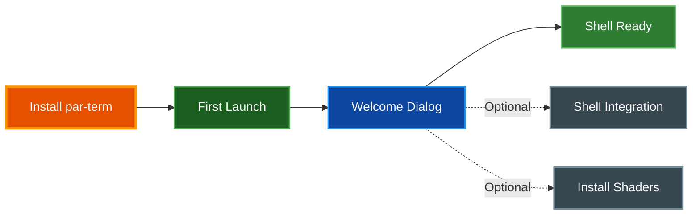

# Getting Started with par-term

A friendly walkthrough to get you up and running with par-term in your first 10 minutes. This guide covers installation, essential shortcuts, and the most useful features for day-to-day use.

## Table of Contents
- [Overview](#overview)
- [Installation](#installation)
  - [macOS](#macos)
  - [Linux](#linux)
  - [Windows](#windows)
  - [From Source](#from-source)
- [First Launch](#first-launch)
- [Essential Keyboard Shortcuts](#essential-keyboard-shortcuts)
- [Installing Shell Integration](#installing-shell-integration)
- [Installing Shaders](#installing-shaders)
- [Customizing Your Terminal](#customizing-your-terminal)
  - [Opening Settings](#opening-settings)
  - [Profiles](#profiles)
  - [Themes and Colors](#themes-and-colors)
  - [Fonts](#fonts)
- [Split Panes](#split-panes)
  - [Creating Splits](#creating-splits)
  - [Navigating Panes](#navigating-panes)
  - [Resizing Panes](#resizing-panes)
  - [Closing Panes](#closing-panes)
- [Next Steps](#next-steps)
- [Related Documentation](#related-documentation)

## Overview

par-term is a cross-platform, GPU-accelerated terminal emulator built in Rust. It runs on macOS, Linux, and Windows with native graphics acceleration (Metal, Vulkan, and DirectX 12 respectively).

**Why par-term?**

- **Fast rendering** -- GPU-accelerated text and graphics with custom shaders for visual effects
- **Rich graphics** -- Full support for Sixel, iTerm2, and Kitty inline image protocols
- **Modern features** -- Split panes, profiles, vi-style copy mode, configurable status bar, and an AI assistant panel
- **Deep customization** -- 49+ background shaders, cursor effects, configurable keybindings, snippets, and automation triggers
- **Cross-platform** -- Consistent experience across macOS, Linux, and Windows

## Installation

### macOS

The easiest way to install on macOS is via Homebrew:

```bash
brew install --cask paulrobello/tap/par-term
```

This installs the `.app` bundle and handles macOS Gatekeeper automatically.

### Linux

Install from source (see [From Source](#from-source) below). You need GTK3 and display server libraries first:

**Ubuntu/Debian:**
```bash
sudo apt install libgtk-3-dev libxkbcommon-dev libwayland-dev libxcb-render0-dev libxcb-shape0-dev libxcb-xfixes0-dev libasound2-dev
```

**Fedora/RHEL:**
```bash
sudo dnf install gtk3-devel libxkbcommon-devel wayland-devel libxcb-devel alsa-lib-devel
```

**Arch Linux:**
```bash
sudo pacman -S gtk3 libxkbcommon wayland libxcb alsa-lib
```

### Windows

Install from source using `cargo` (see [From Source](#from-source) below). A DirectX 12 capable GPU is required.

### From Source

Requires a Rust toolchain (stable, 2024 edition) and modern graphics drivers:

```bash
git clone https://github.com/paulrobello/par-term
cd par-term
cargo build --release
./target/release/par-term
```

> **📝 Note:** See the [README](../README.md) for full installation details, macOS bundle creation, and troubleshooting Gatekeeper issues.

## First Launch

When you open par-term for the first time:

1. A **welcome dialog** appears offering to install shell integration and the shader collection. Both are optional but recommended -- you can always install them later
2. Your default shell starts in a new tab, just like any terminal emulator
3. par-term creates a configuration file at `~/.config/par-term/config.yaml` (Linux/macOS) or `%APPDATA%\par-term\config.yaml` (Windows)

The default configuration provides a clean, dark terminal with sensible defaults. You do not need to edit anything to get started -- everything can be configured through the Settings UI later.



## Essential Keyboard Shortcuts

These are the shortcuts you use most often. On macOS, the primary modifier is `Cmd`. On Linux and Windows, it is `Ctrl+Shift` (to avoid conflicts with terminal control codes like Ctrl+C).

| Action | macOS | Linux/Windows |
|--------|-------|---------------|
| **New tab** | `Cmd + T` | `Ctrl + Shift + T` |
| **Close tab** | `Cmd + W` | `Ctrl + Shift + W` |
| **Next tab** | `Cmd + Shift + ]` or `Ctrl + Tab` | `Ctrl + Tab` |
| **Previous tab** | `Cmd + Shift + [` or `Ctrl + Shift + Tab` | `Ctrl + Shift + Tab` |
| **Switch to tab 1-9** | `Cmd + 1-9` | `Alt + 1-9` |
| **Copy** | `Cmd + C` | `Ctrl + Shift + C` |
| **Paste** | `Cmd + V` | `Ctrl + Shift + V` |
| **Search** | `Cmd + F` | `Ctrl + Shift + F` |
| **Split horizontal** | `Cmd + D` | `Ctrl + Shift + D` |
| **Split vertical** | `Cmd + Shift + D` | `Ctrl + Shift + E` |
| **Open Settings** | `F12` or `Cmd + ,` | `F12` or `Ctrl + ,` |
| **Toggle fullscreen** | `F11` | `F11` |
| **Reload config** | `F5` | `F5` |
| **Toggle help panel** | `F1` | `F1` |

> **✅ Tip:** Press `F1` at any time to toggle the help panel, which shows available shortcuts in context.

See [Keyboard Shortcuts](KEYBOARD_SHORTCUTS.md) for the complete reference.

## Installing Shell Integration

Shell integration enables communication between your shell and par-term. Without it, par-term works fine as a basic terminal. With it, you get:

- **Directory tracking** -- Tab titles update to show your current directory, and new tabs inherit the directory of the active tab
- **Prompt navigation** -- Jump between command prompts with keyboard shortcuts
- **Command status** -- Exit code tracking, command separators between prompts, and desktop notifications for long-running commands

**Install via CLI:**

```bash
# Auto-detects your shell (bash, zsh, or fish)
par-term install-shell-integration
```

**Install via Settings UI:**

1. Press `F12` to open Settings
2. Navigate to the **Integrations** tab
3. Click **Install Shell Integration**

After installation, restart your shell or source your RC file (for example, `source ~/.zshrc`) for the integration to take effect.

> **📝 Note:** Shell integration scripts are saved to `~/.config/par-term/` and a source line is added to your shell's RC file. You can uninstall at any time with `par-term uninstall-shell-integration`.

## Installing Shaders

par-term includes 49+ GLSL background shaders (starfield, matrix rain, CRT effects, plasma, and more) and 12+ cursor effect shaders (glow, trail, ripple). These are optional visual enhancements.

**Install via CLI:**

```bash
par-term install-shaders
```

**Install via Settings UI:**

1. Press `F12` to open Settings
2. Navigate to the **Integrations** tab
3. Click **Install** in the Custom Shaders section

Once installed, enable a background shader in Settings under **Background & Effects**, or toggle the active shader with `Cmd/Ctrl + Shift + B`.

> **✅ Tip:** Lower the `custom_shader_brightness` setting (for example, 0.3-0.5) to keep shader backgrounds from overpowering your terminal text. You can also install both shell integration and shaders at once with `par-term install-integrations`.

## Customizing Your Terminal

### Opening Settings

Press `F12` (or `Cmd + ,` on macOS / `Ctrl + ,` on Linux and Windows) to open the Settings window. Settings are organized into tabs with a searchable sidebar. Changes apply in real time -- there is no "Apply" button.

### Profiles

Profiles save terminal configurations for quick access. Each profile can specify a working directory, shell, custom command, SSH connection, tab name, and icon.

1. Press `Cmd/Ctrl + Shift + P` to open the **Profile Drawer** on the right edge of the window
2. Click **Manage** to create, edit, or reorder profiles in Settings
3. Double-click a profile in the drawer to launch it in a new tab

Profiles also support **auto-switching** -- par-term can automatically apply a profile when you `cd` into a matching directory, connect to a specific SSH host, or attach to a tmux session. See [Profiles](PROFILES.md) for details.

### Themes and Colors

par-term supports iTerm2-style color schemes. Change themes in **Settings > Appearance > Colors**. Built-in options include Dracula, Monokai, Solarized, and many more.

### Fonts

Configure fonts in **Settings > Appearance > Font**. par-term supports:

- Separate font families for regular, bold, italic, and bold-italic text
- Unicode range mapping for CJK, emoji, or symbol fonts
- HarfBuzz text shaping for ligatures and complex scripts

## Split Panes

Split panes let you run multiple terminal sessions side by side within a single tab.

### Creating Splits

| Action | macOS | Linux/Windows |
|--------|-------|---------------|
| Split horizontally (left/right) | `Cmd + D` | `Ctrl + Shift + D` |
| Split vertically (top/bottom) | `Cmd + Shift + D` | `Ctrl + Shift + E` |

Each new pane starts a fresh shell session. You can split panes further to create any layout you need.

### Navigating Panes

| Shortcut | Action |
|----------|--------|
| `Cmd/Ctrl + Alt + Left` | Move focus to pane on the left |
| `Cmd/Ctrl + Alt + Right` | Move focus to pane on the right |
| `Cmd/Ctrl + Alt + Up` | Move focus to pane above |
| `Cmd/Ctrl + Alt + Down` | Move focus to pane below |

### Resizing Panes

| Shortcut | Action |
|----------|--------|
| `Cmd/Ctrl + Alt + Shift + Left` | Shrink pane from the right |
| `Cmd/Ctrl + Alt + Shift + Right` | Grow pane to the right |
| `Cmd/Ctrl + Alt + Shift + Up` | Shrink pane from the bottom |
| `Cmd/Ctrl + Alt + Shift + Down` | Grow pane downward |

You can also drag pane dividers with the mouse.

### Closing Panes

| Action | macOS | Linux/Windows |
|--------|-------|---------------|
| Close focused pane | `Cmd + Shift + W` | `Ctrl + Shift + X` |

When only one pane remains, the tab reverts to a single terminal session.

## Next Steps

Now that you have the basics, explore these features as your needs grow:

```mermaid
graph TD
    Basics[Basics - You Are Here]
    CopyMode[Copy Mode]
    Snippets[Snippets & Actions]
    SSH[SSH Quick Connect]
    Tmux[tmux Integration]
    Assistant[Assistant Panel]
    Shaders[Custom Shaders]
    Automation[Triggers & Automation]
    StatusBar[Status Bar]
    Prettifier[Content Prettifier]

    Basics --> CopyMode
    Basics --> Snippets
    Basics --> SSH
    Basics --> Tmux
    Basics --> Assistant
    Basics --> Shaders
    Basics --> Automation
    Basics --> StatusBar
    Basics --> Prettifier

    style Basics fill:#e65100,stroke:#ff9800,stroke-width:3px,color:#ffffff
    style CopyMode fill:#1b5e20,stroke:#4caf50,stroke-width:2px,color:#ffffff
    style Snippets fill:#1b5e20,stroke:#4caf50,stroke-width:2px,color:#ffffff
    style SSH fill:#0d47a1,stroke:#2196f3,stroke-width:2px,color:#ffffff
    style Tmux fill:#0d47a1,stroke:#2196f3,stroke-width:2px,color:#ffffff
    style Assistant fill:#4a148c,stroke:#9c27b0,stroke-width:2px,color:#ffffff
    style Shaders fill:#4a148c,stroke:#9c27b0,stroke-width:2px,color:#ffffff
    style Automation fill:#880e4f,stroke:#c2185b,stroke-width:2px,color:#ffffff
    style StatusBar fill:#880e4f,stroke:#c2185b,stroke-width:2px,color:#ffffff
    style Prettifier fill:#880e4f,stroke:#c2185b,stroke-width:2px,color:#ffffff
```



- **[Copy Mode](COPY_MODE.md)** -- Vi-style keyboard-driven text selection with search, marks, and visual modes
- **[Snippets & Actions](SNIPPETS.md)** -- Save text blocks with variables, create custom actions bound to keybindings
- **[SSH Quick Connect](SSH.md)** -- Browse and connect to SSH hosts from your config, known hosts, and shell history
- **[tmux Integration](TABS.md)** -- Native tmux status bar rendering, bidirectional pane resize, and session picker
- **[Assistant Panel](ASSISTANT_PANEL.md)** -- Chat with AI agents (Claude Code, GitHub Copilot, and others) directly in your terminal
- **[Custom Shaders](CUSTOM_SHADERS.md)** -- Create your own GLSL shaders or port effects from Shadertoy
- **[Triggers & Automation](AUTOMATION.md)** -- Regex triggers on terminal output with 7 action types and coprocess support
- **[Status Bar](STATUS_BAR.md)** -- Configurable widget bar with clock, git branch, CPU/memory, and more
- **[Content Prettifier](PRETTIFIER.md)** -- Auto-detect and render Markdown, JSON, diffs, diagrams, and other structured content

## Related Documentation

- [README](../README.md) - Project overview, full installation instructions, and feature list
- [Keyboard Shortcuts](KEYBOARD_SHORTCUTS.md) - Complete keyboard shortcut reference
- [Mouse Features](MOUSE_FEATURES.md) - Mouse selection, URL handling, and pane interaction
- [Profiles](PROFILES.md) - Profile system for saved terminal configurations
- [Integrations](INTEGRATIONS.md) - Shell integration and shader installation details
- [Custom Shaders](CUSTOM_SHADERS.md) - Shader configuration, uniforms, and creation guide
- [Window Management](WINDOW_MANAGEMENT.md) - Window types, multi-monitor, and transparency
- [Window Arrangements](ARRANGEMENTS.md) - Save and restore window layouts
- [Search](SEARCH.md) - Terminal search with regex, case-sensitive, and whole-word modes
- [Paste Special](PASTE_SPECIAL.md) - Clipboard transformations for pasting
- [Session Management](SESSION_MANAGEMENT.md) - Session undo, restore, and logging
- [Accessibility](ACCESSIBILITY.md) - Minimum contrast enforcement and display options
- [Self-Update](SELF_UPDATE.md) - Updating par-term via CLI or Settings UI
