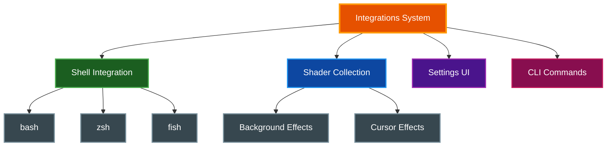

# Integrations

par-term provides optional integrations to enhance your terminal experience, including shell integration for improved directory tracking and a shader collection for visual effects.

## Table of Contents
- [Overview](#overview)
- [Shell Integration](#shell-integration)
  - [Features](#shell-features)
  - [Installation](#shell-installation)
  - [Supported Shells](#supported-shells)
  - [How It Works](#how-it-works)
  - [Troubleshooting](#troubleshooting-shell)
- [Remote Shell Integration](#remote-shell-integration)
- [Shader Installation](#shader-installation)
  - [Included Shaders](#included-shaders)
  - [Installation Methods](#shader-installation-methods)
  - [Manifest System](#manifest-system)
  - [Uninstallation](#shader-uninstallation)
- [Settings UI](#settings-ui)
- [CLI Commands](#cli-commands)
- [Related Documentation](#related-documentation)

## Overview

Integrations in par-term are optional enhancements that extend functionality:



## Shell Integration

Shell integration enhances the terminal experience by enabling communication between your shell and par-term.

### Shell Features

- **Directory Tracking (OSC 7)**: Tab titles automatically update to show the current working directory
- **Command Notifications (OSC 777)**: Desktop notifications for long-running commands
- **Prompt Navigation (OSC 133)**: Navigate between command prompts using keyboard shortcuts
- **Current Working Directory Sync**: New tabs can inherit the current directory from the active tab

### Shell Installation

**Method 1: Settings UI (Recommended)**

1. Press `F12` to open Settings
2. Navigate to the **Integrations** tab
3. Click **Install Shell Integration**

**Method 2: CLI Command**

```bash
# Auto-detect shell
par-term install-shell-integration

# Specify shell explicitly
par-term install-shell-integration --shell bash
par-term install-shell-integration --shell zsh
par-term install-shell-integration --shell fish
```

**Method 3: Manual Installation (via curl)**

```bash
curl -sSL https://paulrobello.github.io/par-term/install-shell-integration.sh | sh
```

### Supported Shells

| Shell | Script Location | RC File |
|-------|-----------------|---------|
| **bash** | `~/.config/par-term/shell_integration.bash` | `~/.bashrc` or `~/.bash_profile` |
| **zsh** | `~/.config/par-term/shell_integration.zsh` | `~/.zshrc` |
| **fish** | `~/.config/par-term/shell_integration.fish` | `~/.config/fish/config.fish` |

### How It Works

The installation process:

1. Detects your current shell from the `$SHELL` environment variable
2. Downloads the appropriate shell integration script
3. Saves it to `~/.config/par-term/`
4. Adds a source line to your shell's RC file wrapped in markers:

```bash
# >>> par-term shell integration >>>
[ -f "$HOME/.config/par-term/shell_integration.bash" ] && source "$HOME/.config/par-term/shell_integration.bash"
# <<< par-term shell integration <<<
```

### Troubleshooting Shell

**Integration not working after installation:**
1. Restart your shell or run `source ~/.bashrc` (or equivalent)
2. Verify the script exists: `ls ~/.config/par-term/shell_integration.*`
3. Check your RC file for the source line

**Reinstalling:**
```bash
par-term install-shell-integration
# Or uninstall first:
par-term uninstall-shell-integration
par-term install-shell-integration
```

## Remote Shell Integration

When working on a remote host via SSH, you can install shell integration directly from par-term without manually running commands.

### Installing on a Remote Host

**Method 1: Application Menu (Recommended)**

1. Establish an SSH connection to the remote host in a terminal tab
2. From the menu bar: **Shell > Install Shell Integration on Remote Host...**
3. A confirmation dialog appears showing the exact command that will be sent
4. Click **Install** to send the command, or **Cancel** to dismiss

The command sent to the remote host:

```bash
curl -sSL https://paulrobello.github.io/par-term/install-shell-integration.sh | sh
```

**Method 2: Manual Installation**

If the menu option is not available, run the install command directly in your SSH session:

```bash
curl -sSL https://paulrobello.github.io/par-term/install-shell-integration.sh | sh
```

**Requirements:**
- An active SSH session to the remote host
- `curl` available on the remote host
- Permission to modify shell RC files on the remote host

> **📝 Note:** The install script auto-detects the remote shell (bash, zsh, or fish) and installs the appropriate integration script. Restart the remote shell after installation for changes to take effect.

## Shader Installation

par-term includes a collection of 49+ background shaders and 12+ cursor effect shaders.

### Included Shaders

**Background Effects:**
- CRT/Retro effects (scanlines, phosphor glow)
- Matrix rain, starfield, galaxy
- Plasma, fire, underwater
- Abstract visualizations
- Nature effects (clouds, rain, snow)

**Cursor Effects:**
- Glow, trail, ripple
- Blaze, sweep, warp
- Particle effects

See [SHADERS.md](SHADERS.md) for the complete shader gallery.

### Shader Installation Methods

**Method 1: First-Run Dialog**

On first launch, par-term offers to install the shader collection. Choose:
- **Yes, Install**: Downloads and installs immediately
- **Never**: Saves preference, never ask again
- **Later**: Dismiss for this session

**Method 2: Settings UI**

1. Press `F12` to open Settings
2. Navigate to the **Integrations** tab
3. In the **Custom Shaders** section, click **Install**

**Method 3: CLI Command**

```bash
# Interactive (with confirmation prompt)
par-term install-shaders

# Non-interactive
par-term install-shaders -y
par-term install-shaders --force
```

**Method 4: Manual Installation (via curl)**

```bash
curl -sSL https://paulrobello.github.io/par-term/install-shaders.sh | sh
```

**Method 5: Combined Installation**

Install both shaders and shell integration at once:

```bash
par-term install-integrations
par-term install-integrations -y  # Non-interactive
```

### Manifest System

par-term tracks installed shaders using a manifest file for safe updates and uninstallation.

**Location:** `~/.config/par-term/shaders/manifest.json`

**Manifest Contents:**
```json
{
  "version": "0.7.0",
  "generated": "2026-02-02T23:35:26.106195+00:00",
  "files": [
    {
      "path": "crt.glsl",
      "sha256": "8fceff368cefed1888525c00f613dd9a...",
      "type": "shader",
      "category": "retro"
    }
  ]
}
```

**File Status Detection:**
- **Unchanged**: Hash matches manifest (safe to update/remove)
- **Modified**: You've edited a bundled shader
- **UserCreated**: Your custom shader (not in manifest)
- **Missing**: Listed in manifest but deleted

### Shader Uninstallation

```bash
# Interactive (prompts for confirmation)
par-term uninstall-shaders

# Force removal
par-term uninstall-shaders --force
```

**What gets removed:**
- Bundled shader files with matching checksums
- Empty directories

**What gets preserved:**
- User-created shaders (not in manifest)
- Modified bundled shaders (different checksum)

## Settings UI

The Integrations tab in Settings (`F12`) provides a graphical interface for managing integrations.

**Shell Integration Section:**
- Installation status indicator
- Detected shell display
- Install/Reinstall/Uninstall buttons
- Manual installation command (click to copy)

**Custom Shaders Section:**
- Installation status with shader count
- Installed version display
- Install/Reinstall/Uninstall buttons
- Open Folder button (reveals shader directory)
- Manual installation command (click to copy)

## CLI Commands

**Shell Integration:**
```bash
par-term install-shell-integration [--shell bash|zsh|fish]
par-term uninstall-shell-integration
```

**Shaders:**
```bash
par-term install-shaders [-y|--yes] [-f|--force]
par-term uninstall-shaders [-f|--force]
```

**Combined:**
```bash
par-term install-integrations [-y|--yes]
```

## Related Documentation

- [SHADERS.md](SHADERS.md) - Complete shader gallery and descriptions
- [CUSTOM_SHADERS.md](CUSTOM_SHADERS.md) - Creating custom shaders
- [SSH Host Management](SSH.md) - SSH host profiles and quick connect
- [../README.md](../README.md) - Project overview
