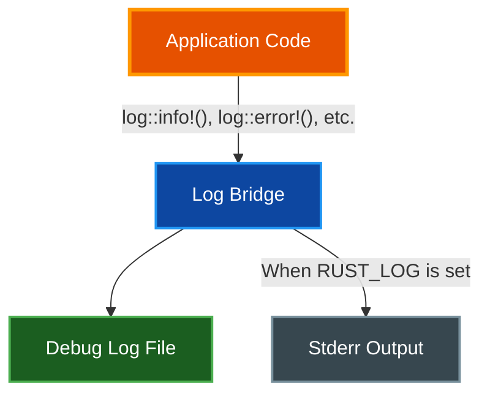

# Debug Logging

par-term provides configurable debug logging to help diagnose issues. Log output is written to a file rather than the terminal, making it safe to use without interfering with your session.

## Table of Contents

- [Overview](#overview)
- [Log Levels](#log-levels)
- [Configuration](#configuration)
  - [Config File](#config-file)
  - [CLI Flag](#cli-flag)
  - [Environment Variables](#environment-variables)
  - [Precedence](#precedence)
- [Log File Location](#log-file-location)
- [Settings UI](#settings-ui)
- [Usage Examples](#usage-examples)
- [Module Filtering](#module-filtering)
- [Troubleshooting](#troubleshooting)
- [Related Documentation](#related-documentation)

## Overview



All `log::info!()`, `log::error!()`, and other standard Rust logging macros are routed through a unified bridge to the debug log file. This ensures logs are captured even when running as a macOS app bundle or Windows GUI application where stderr is invisible.

## Log Levels

| Level | Description | Use Case |
|-------|-------------|----------|
| **Off** | No logging (default) | Normal operation |
| **Error** | Errors only | Diagnosing crashes or failures |
| **Warn** | Warnings and errors | Identifying potential issues |
| **Info** | Informational messages | General debugging |
| **Debug** | Detailed debug output | Investigating specific behavior |
| **Trace** | Most verbose | Deep investigation of code paths |

## Configuration

### Config File

Set the log level in `~/.config/par-term/config.yaml`:

```yaml
log_level: off  # Options: off, error, warn, info, debug, trace
```

### CLI Flag

Override the config file setting from the command line:

```bash
par-term --log-level debug
par-term --log-level trace
par-term --log-level off
```

### Environment Variables

The `RUST_LOG` environment variable also controls logging and additionally mirrors output to stderr:

```bash
RUST_LOG=debug par-term
```

### Precedence

Log level is determined by the highest-priority source:

1. **`--log-level` CLI flag** (highest priority)
2. **`RUST_LOG` environment variable**
3. **`log_level` config file setting**
4. **Default: `off`** (lowest priority)

## Log File Location

| Platform | Path |
|----------|------|
| macOS/Linux | `/tmp/par_term_debug.log` |
| Windows | `%TEMP%\par_term_debug.log` |

The log file is created fresh each session (truncated on startup). Log entries include timestamps with microsecond precision:

```
[2026-02-06 14:30:15.123456] [INFO] [par_term::app] Config loaded successfully
[2026-02-06 14:30:15.234567] [DEBUG] [par_term::terminal] PTY read: 1024 bytes
```

## Settings UI

Debug logging is configured in **Settings > Advanced > Debug Logging**:

- **Log level dropdown** - Select from Off, Error, Warn, Info, Debug, Trace
- **Log file path** - Displays the current log file location
- **Open Log File button** - Opens the log file in your system's default text editor

Changes take effect immediately - no restart required.

## Usage Examples

**Monitoring logs in real-time:**
```bash
tail -f /tmp/par_term_debug.log
```

**Filtering by component:**
```bash
# Watch terminal-related events
tail -f /tmp/par_term_debug.log | grep --line-buffered "terminal"

# Watch rendering events
tail -f /tmp/par_term_debug.log | grep --line-buffered "renderer"

# Watch shader-related messages
tail -f /tmp/par_term_debug.log | grep --line-buffered "shader"
```

**Capturing logs for a bug report:**
```bash
# Start with trace logging
par-term --log-level trace

# Reproduce the issue, then exit
# Copy the log file
cp /tmp/par_term_debug.log ~/Desktop/par-term-debug.log
```

## Module Filtering

Certain noisy third-party crates are automatically filtered to reduce log volume:

| Module | Level | Reason |
|--------|-------|--------|
| `wgpu_core` | Warn | Very verbose GPU internals |
| `wgpu_hal` | Warn | Hardware abstraction noise |
| `naga` | Warn | Shader compiler internals |
| `rodio` | Error | Audio engine noise |
| `cpal` | Error | Audio device enumeration |

These filters ensure that par-term's own messages remain visible even at high verbosity levels.

## Troubleshooting

**Log file is empty:**
- Verify `log_level` is not set to `off`
- Check if `--log-level off` was passed on the command line
- Ensure the log file path is writable

**Too much output:**
- Lower the log level (e.g., `info` instead of `trace`)
- Use `grep` to filter for specific components

**Logs not appearing for a specific component:**
- Some components use the custom `debug_*!()` macros controlled by the `DEBUG_LEVEL` environment variable (separate from the `log_level` config)
- Set `DEBUG_LEVEL=4` for maximum custom debug output

## Related Documentation

- [Automation](AUTOMATION.md) - Trigger and coprocess debugging
- [Integrations](INTEGRATIONS.md) - Shell integration troubleshooting
