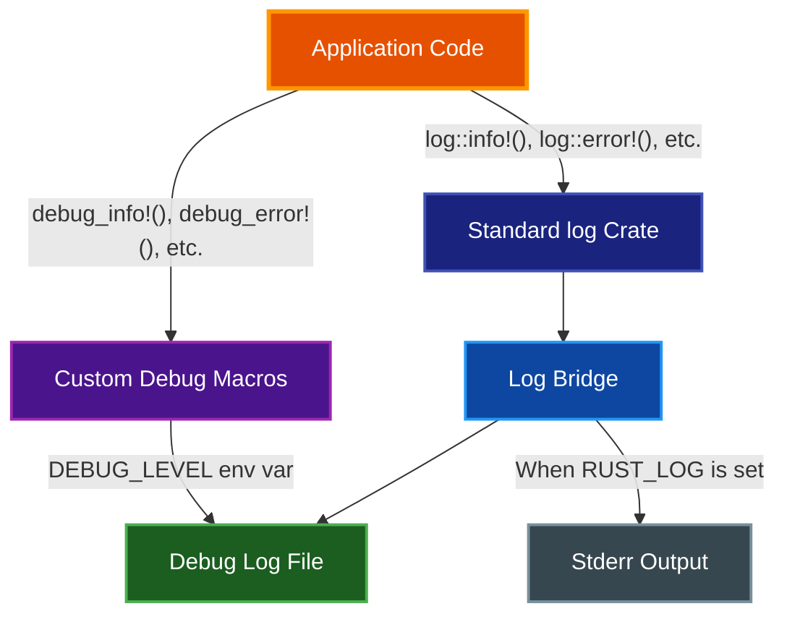

# Debug Logging

par-term provides configurable debug logging to help diagnose issues. Log output is written to a file rather than the terminal, making it safe to use without interfering with your session.

## Table of Contents

- [Overview](#overview)
- [Log Levels](#log-levels)
- [Configuration](#configuration)
  - [Config File](#config-file)
  - [CLI Flag](#cli-flag)
  - [Environment Variables](#environment-variables)
  - [Precedence](#precedence)
- [Log File Location](#log-file-location)
- [Settings UI](#settings-ui)
- [Usage Examples](#usage-examples)
- [Module Filtering](#module-filtering)
- [Troubleshooting](#troubleshooting)
- [Related Documentation](#related-documentation)

## Overview

par-term has **two parallel logging systems** that both write to the same file:

| System | Macros | Control | Best for |
|--------|--------|---------|----------|
| Custom debug | `crate::debug_info!("CAT", ...)`, `debug_error!()`, `debug_log!()`, `debug_trace!()` | `DEBUG_LEVEL=0-4` env var | High-frequency render/input events with category tags |
| Standard `log` crate | `log::info!()`, `log::warn!()`, `log::error!()`, etc. | `RUST_LOG` env var or `--log-level` CLI | Application lifecycle, startup/shutdown, config, I/O errors |


```mermaid
graph TD
    App[Application Code]
    CustomDebug[Custom Debug Macros]
    LogCrate[Standard log Crate]
    Bridge[Log Bridge]
    File[Debug Log File]
    Stderr[Stderr Output]

    App -->|"debug_info!(), debug_error!(), etc."| CustomDebug
    App -->|"log::info!(), log::error!(), etc."| LogCrate
    CustomDebug -->|"DEBUG_LEVEL env var"| File
    LogCrate --> Bridge
    Bridge --> File
    Bridge -->|"When RUST_LOG is set"| Stderr

    style App fill:#e65100,stroke:#ff9800,stroke-width:3px,color:#ffffff
    style CustomDebug fill:#4a148c,stroke:#9c27b0,stroke-width:2px,color:#ffffff
    style LogCrate fill:#1a237e,stroke:#3f51b5,stroke-width:2px,color:#ffffff
    style Bridge fill:#0d47a1,stroke:#2196f3,stroke-width:2px,color:#ffffff
    style File fill:#1b5e20,stroke:#4caf50,stroke-width:2px,color:#ffffff
    style Stderr fill:#37474f,stroke:#78909c,stroke-width:2px,color:#ffffff
```

**Rule of thumb**: Use `log::*!()` for events that happen once (startup, config load, profile switch, errors). Use `crate::debug_*!()` for events that fire every frame or on every keystroke (rendering, input, shader updates). Third-party crates (wgpu, tokio, etc.) emit only through `log`, never through the custom macros.

## Log Levels

### Standard `log` Crate Levels (config file / `--log-level` / `RUST_LOG`)

| Level | Description | Use Case |
|-------|-------------|----------|
| **Off** | No logging (default) | Normal operation |
| **Error** | Errors only | Diagnosing crashes or failures |
| **Warn** | Warnings and errors | Identifying potential issues |
| **Info** | Informational messages | General debugging |
| **Debug** | Detailed debug output | Investigating specific behavior |
| **Trace** | Most verbose | Deep investigation of code paths |

### Custom Debug Levels (`DEBUG_LEVEL` env var)

| Level | Value | Macros Enabled |
|-------|-------|----------------|
| **Off** | 0 | None (default) |
| **Error** | 1 | `debug_error!()` |
| **Info** | 2 | `debug_info!()`, `debug_error!()` |
| **Debug** | 3 | `debug_log!()`, `debug_info!()`, `debug_error!()` |
| **Trace** | 4 | All: `debug_trace!()`, `debug_log!()`, `debug_info!()`, `debug_error!()` |

## Configuration

### Config File

Set the log level in `~/.config/par-term/config.yaml`:

```yaml
log_level: off  # Options: off, error, warn, info, debug, trace
```

### CLI Flag

Override the config file setting from the command line:

```bash
par-term --log-level debug
par-term --log-level trace
par-term --log-level off
```

### Environment Variables

Two environment variables control logging:

**`RUST_LOG`** - Controls the standard `log` crate output:
```bash
RUST_LOG=debug par-term
```
When `RUST_LOG` is set, output is also mirrored to stderr for terminal debugging.

**`DEBUG_LEVEL`** - Controls custom debug macros (separate system):
```bash
DEBUG_LEVEL=4 par-term  # Enable all custom debug output (0-4)
```

### Precedence

Log level is determined by the highest-priority source:

1. **`--log-level` CLI flag** (highest priority)
2. **`RUST_LOG` environment variable**
3. **`log_level` config file setting**
4. **Default: `off`** (lowest priority)

## Log File Location

| Platform | Path |
|----------|------|
| macOS/Linux | `$TMPDIR/par_term_debug.log` (defaults to `/tmp/`) |
| Windows | `%TEMP%\par_term_debug.log` |

The log file is created fresh each session (truncated on startup). Log entries include Unix epoch timestamps with microsecond precision:

```
================================================================================
par-term log session started at 1738864215.123456 (debug_level=Off, rust_log=info)
================================================================================
[1738864215.234567] [INFO ] [par_term::app] Config loaded successfully
[1738864215.345678] [DEBUG] [par_term::terminal] PTY read: 1024 bytes
```

## Settings UI

Debug logging is configured in **Settings > Advanced > Debug Logging**:

- **Log level dropdown** - Select from Off, Error, Warn, Info, Debug, Trace
- **Log file path** - Displays the current log file location
- **Open Log File button** - Opens the log file in your system's default text editor

Changes take effect immediately - no restart required.

## Usage Examples

**Monitoring logs in real-time:**
```bash
# Standard location
tail -f /tmp/par_term_debug.log

# Or using the Makefile target
make tail-log
```

**Running with debug logging:**
```bash
# Standard log crate debugging
par-term --log-level debug

# Custom debug macros (high-frequency events)
make run-debug    # DEBUG_LEVEL=3
make run-trace    # DEBUG_LEVEL=4
```

**Filtering by component:**
```bash
# Watch terminal-related events
tail -f /tmp/par_term_debug.log | grep --line-buffered "terminal"

# Watch rendering events
tail -f /tmp/par_term_debug.log | grep --line-buffered "RENDER"

# Watch shader-related messages
tail -f /tmp/par_term_debug.log | grep --line-buffered "SHADER"
```

**Capturing logs for a bug report:**
```bash
# Start with trace logging
par-term --log-level trace

# Reproduce the issue, then exit
# Copy the log file
cp /tmp/par_term_debug.log ~/Desktop/par-term-debug.log
```

## Module Filtering

Certain noisy third-party crates are automatically filtered to reduce log volume:

| Module | Level | Reason |
|--------|-------|--------|
| `wgpu_core` | Warn | Very verbose GPU internals |
| `wgpu_hal` | Warn | Hardware abstraction noise |
| `naga` | Warn | Shader compiler internals |
| `rodio` | Error | Audio engine noise |
| `cpal` | Error | Audio device enumeration |

These filters ensure that par-term's own messages remain visible even at high verbosity levels.

## Troubleshooting

**Log file is empty:**
- Verify `log_level` is not set to `off` in config
- Check if `--log-level off` was passed on the command line
- Ensure the log file path is writable (check `$TMPDIR` permissions)

**Too much output:**
- Lower the log level (e.g., `info` instead of `trace`)
- Use `grep` to filter for specific components
- For custom debug macros, use lower `DEBUG_LEVEL` values

**Logs not appearing for a specific component:**
- Some components use the custom `debug_*!()` macros controlled by `DEBUG_LEVEL` (separate from `log_level` config)
- Set `DEBUG_LEVEL=4` for maximum custom debug output
- Example: `DEBUG_LEVEL=4 par-term` or `make run-trace`

**Security note:**
- The log file is created with 0600 permissions (owner-only) on Unix
- Symlinks at the log path are automatically removed to prevent symlink attacks

## Related Documentation

- [Automation](AUTOMATION.md) - Trigger and coprocess debugging
- [Integrations](INTEGRATIONS.md) - Shell integration troubleshooting
