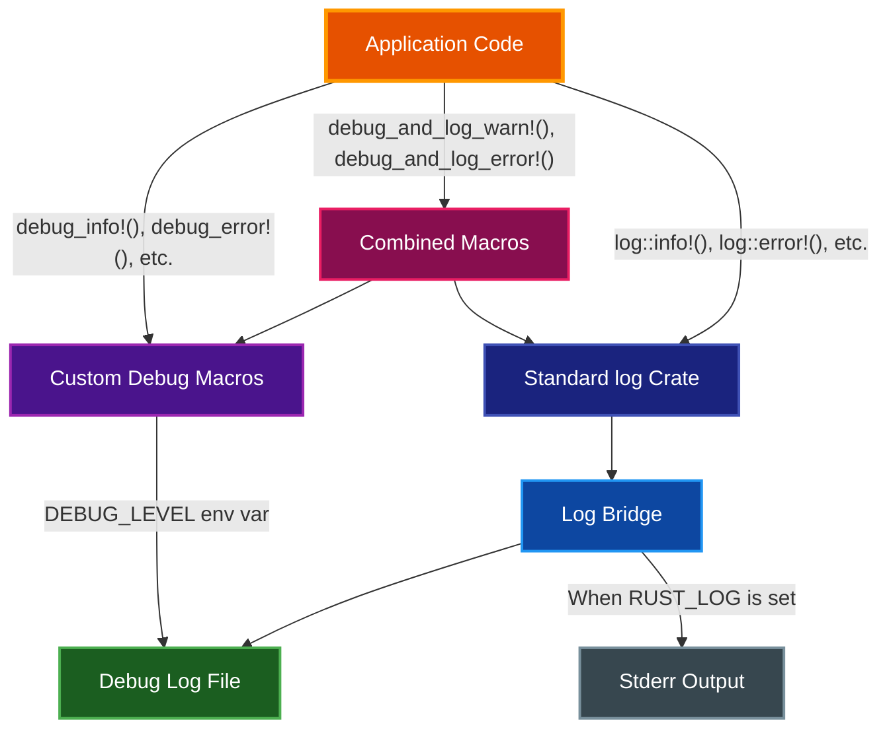

# Debug Logging

par-term provides configurable debug logging to help diagnose issues. Log output is written to a file rather than the terminal, making it safe to use without interfering with your session.

## Table of Contents

- [Overview](#overview)
- [Log Levels](#log-levels)
- [Configuration](#configuration)
  - [Config File](#config-file)
  - [CLI Flag](#cli-flag)
  - [Environment Variables](#environment-variables)
  - [Precedence](#precedence)
- [Log File Location](#log-file-location)
- [Settings UI](#settings-ui)
- [Usage Examples](#usage-examples)
- [Module Filtering](#module-filtering)
  - [Inline-Image Payload Diagnostics](#inline-image-payload-diagnostics)
- [Debug Categories](#debug-categories)
- [Troubleshooting](#troubleshooting)
- [Related Documentation](#related-documentation)

## Overview

par-term has **two parallel logging systems** (with combined macros for bridging both) that write to the same file:

| System | Macros | Control | Best for |
|--------|--------|---------|----------|
| Custom debug | `crate::debug_info!("CAT", ...)`, `debug_error!()`, `debug_log!()`, `debug_trace!()` | `DEBUG_LEVEL=0-4` env var | High-frequency render/input events with category tags |
| Combined | `debug_and_log_warn!("CAT", ...)`, `debug_and_log_error!("CAT", ...)` | Both systems | Emit to both custom debug log and `log` crate simultaneously |
| Standard `log` crate | `log::info!()`, `log::warn!()`, `log::error!()`, etc. | `RUST_LOG` env var, config file, or `--log-level` CLI | Application lifecycle, startup/shutdown, config, I/O errors |


```mermaid
graph TD
    App[Application Code]
    CustomDebug[Custom Debug Macros]
    Combined[Combined Macros]
    LogCrate[Standard log Crate]
    Bridge[Log Bridge]
    File[Debug Log File]
    Stderr[Stderr Output]

    App -->|"debug_info!(), debug_error!(), etc."| CustomDebug
    App -->|"debug_and_log_warn!(), debug_and_log_error!()"| Combined
    App -->|"log::info!(), log::error!(), etc."| LogCrate
    CustomDebug -->|"DEBUG_LEVEL env var"| File
    Combined --> CustomDebug
    Combined --> LogCrate
    LogCrate --> Bridge
    Bridge --> File
    Bridge -->|"When RUST_LOG is set"| Stderr

    style App fill:#e65100,stroke:#ff9800,stroke-width:3px,color:#ffffff
    style CustomDebug fill:#4a148c,stroke:#9c27b0,stroke-width:2px,color:#ffffff
    style Combined fill:#880e4f,stroke:#e91e63,stroke-width:2px,color:#ffffff
    style LogCrate fill:#1a237e,stroke:#3f51b5,stroke-width:2px,color:#ffffff
    style Bridge fill:#0d47a1,stroke:#2196f3,stroke-width:2px,color:#ffffff
    style File fill:#1b5e20,stroke:#4caf50,stroke-width:2px,color:#ffffff
    style Stderr fill:#37474f,stroke:#78909c,stroke-width:2px,color:#ffffff
```

**Rule of thumb**: Use `log::*!()` for events that happen once (startup, config load, profile switch, errors). Use `crate::debug_*!()` for events that fire every frame or on every keystroke (rendering, input, shader updates). Third-party crates (wgpu, tokio, etc.) emit only through `log`, never through the custom macros.

## Log Levels

### Standard `log` Crate Levels (config file / `--log-level` / `RUST_LOG`)

| Level | Description | Use Case |
|-------|-------------|----------|
| **Off** | No logging (default) | Normal operation |
| **Error** | Errors only | Diagnosing crashes or failures |
| **Warn** | Warnings and errors | Identifying potential issues |
| **Info** | Informational messages | General debugging |
| **Debug** | Detailed debug output | Investigating specific behavior |
| **Trace** | Most verbose | Deep investigation of code paths |

### Custom Debug Levels (`DEBUG_LEVEL` env var)

| Level | Value | Macros Enabled |
|-------|-------|----------------|
| **Off** | 0 | None (default) |
| **Error** | 1 | `debug_error!()` |
| **Info** | 2 | `debug_info!()`, `debug_error!()` |
| **Debug** | 3 | `debug_log!()`, `debug_info!()`, `debug_error!()` |
| **Trace** | 4 | All: `debug_trace!()`, `debug_log!()`, `debug_info!()`, `debug_error!()` |

## Configuration

### Config File

Set the log level in `~/.config/par-term/config.yaml`:

```yaml
log_level: off  # Options: off, error, warn, info, debug, trace
```

### CLI Flag

Override the config file setting from the command line:

```bash
par-term --log-level debug
par-term --log-level trace
par-term --log-level off
```

### Environment Variables

Two environment variables control logging:

**`RUST_LOG`** - Controls the standard `log` crate output:
```bash
RUST_LOG=debug par-term
```
When `RUST_LOG` is set, output is also mirrored to stderr for terminal debugging.

**`DEBUG_LEVEL`** - Controls custom debug macros (separate system):
```bash
DEBUG_LEVEL=4 par-term  # Enable all custom debug output (0-4)
```

### Precedence

The effective `log` crate level is resolved during startup. The config setting is applied after the bridge initializes, so it overrides `RUST_LOG` when no CLI flag is present:

1. **`--log-level` CLI flag** (highest priority)
2. **`log_level` config file setting** (applied at app startup; overrides `RUST_LOG` when no CLI flag is set)
3. **`RUST_LOG` environment variable**
4. **Default: `off`** (lowest priority; the config default is `LogLevel::Off`)

Because the config setting beats `RUST_LOG`, `make run-debug` and `make run-trace` also pass the `--log-level` flag explicitly: with `RUST_LOG` alone, a config such as `log_level: error` would override the environment variable and silence the run.

## Log File Location

| Platform | Current session | Previous session |
|----------|-----------------|------------------|
| macOS/Linux | `$TMPDIR/par_term_debug.log` (defaults to `/tmp/`) | `$TMPDIR/par_term_debug.log.1` |
| Windows | `%TEMP%\par_term_debug.log` | `%TEMP%\par_term_debug.log.1` |

Each session starts with a fresh log. The previous session's log is **not** discarded: it is rolled aside to `par_term_debug.log.1` before the live path is truncated, so a crash report survives the restart that follows it. Only one generation is kept — the launch after that overwrites `.1`.

The roll is skipped, leaving any existing `.1` intact, when the log is absent, empty, not a regular file, or owned by another user. The empty case matters in practice: `make run-debug` and `make run-trace` pipe through `tee`, which truncates the path before par-term opens it, so those runs do not produce a `.1`.

Log entries include Unix epoch timestamps with microsecond precision:

```
================================================================================
par-term log session started at 1738864215.123456 (debug_level=Off, rust_log=info)
================================================================================
[1738864215.234567] [INFO ] [par_term::app] Config loaded successfully
[1738864215.345678] [DEBUG] [par_term_terminal::terminal] PTY read: 1024 bytes
```

## Settings UI

Debug logging is configured in **Settings > Advanced > Debug Logging**:

- **Log level dropdown** - Select from Off, Error, Warn, Info, Debug, Trace
- **Log file path** - Displays the current log file location
- **Open Log File button** - Opens the log file in your system's default text editor

Changes take effect immediately - no restart required.

## Usage Examples

**Monitoring logs in real-time:**
```bash
# Standard location
tail -f "${TMPDIR:-/tmp}"/par_term_debug.log

# Or using the Makefile target
make tail-log
```

**Running with debug logging:**
```bash
# Standard log crate debugging
par-term --log-level debug

# Both logging systems together; the targets pass --log-level so a
# config log_level setting cannot silence the run
make run-debug    # RUST_LOG=debug + DEBUG_LEVEL=3 + --log-level debug
make run-trace    # RUST_LOG=trace + DEBUG_LEVEL=4 + --log-level trace
```

**Filtering by component:**
```bash
# Watch terminal-related events
tail -f "${TMPDIR:-/tmp}"/par_term_debug.log | grep --line-buffered "terminal"

# Watch rendering events
tail -f "${TMPDIR:-/tmp}"/par_term_debug.log | grep --line-buffered "RENDER"

# Watch shader-related messages
tail -f "${TMPDIR:-/tmp}"/par_term_debug.log | grep --line-buffered "SHADER"
```

**Capturing logs for a bug report:**
```bash
# Start with trace logging
par-term --log-level trace

# Reproduce the issue, then exit
# Copy the log file
cp "${TMPDIR:-/tmp}"/par_term_debug.log ~/Desktop/par-term-debug.log
```

If par-term crashed and you have already restarted it, the panic report is in the rolled-aside log, not the live one:

```bash
cp "${TMPDIR:-/tmp}"/par_term_debug.log.1 ~/Desktop/par-term-crash.log
```

## Module Filtering

Certain noisy third-party crates are automatically filtered to reduce log volume:

| Module | Level | Reason |
|--------|-------|--------|
| `wgpu_core` | Warn | Very verbose GPU internals |
| `wgpu_hal` | Warn | Hardware abstraction layer noise |
| `naga` | Warn | Shader compiler internals |
| `rodio` | Error | Audio engine noise |
| `cpal` | Error | Audio device enumeration |

These filters ensure that par-term's own messages remain visible even at high verbosity levels.

### Inline-Image Payload Diagnostics

When the effective `log` crate level is `debug` or `trace`, the terminal layer logs bounded inline-image payload diagnostics at the texture-upload boundary: the first/middle/last RGBA samples and the nonzero-alpha count for each image. Emission is gated on `log::log_enabled!`, so runs at lower levels pay nothing. These samples distinguish a decode or transparency problem (wrong pixels, all-transparent payload) from a placement problem (correct pixels, wrong position) when images render blank or invisible.

## Debug Categories

Custom debug macros use category tags for selective filtering. The following categories are used throughout the codebase:

| Category | Description |
|----------|-------------|
| `AI_INSPECTOR` | AI inspector panel operations |
| `APP` | Application-level render pipeline operations |
| `ARRANGEMENT` | Window arrangement save/restore |
| `CAT` | General-purpose catch-all |
| `CLIPBOARD` | OSC 52 clipboard synchronization |
| `CONFIG` | Configuration loading and propagation |
| `CONCURRENCY` | `try_lock()` failure telemetry and lock contention reporting |
| `COPY_MODE` | Copy/selection mode operations |
| `cursor-shader` | Cursor shader configuration resolution snapshot |
| `DYNAMIC_PROFILE` | Dynamic profile fetching, caching, and merging |
| `EVENT_LOOP` | Event loop scheduling and wakeups |
| `FILE_TRANSFER` | File transfer upload/download operations |
| `FRAME_TIMING` | Frame timing and vsync measurements |
| `GRAPHICS` | Graphics surface setup and adapter selection |
| `INPUT` | Input dispatch and PTY write failures from input handlers |
| `KEYBINDING` | Keybinding dispatch and rebinding |
| `MOUSE` | Mouse event handling |
| `PANE_CHECK` | Pane health and lifecycle checks |
| `PANE_CLOSE` | Pane closure lifecycle |
| `PANE_EXIT` | Pane exit handling |
| `PANE_PROMOTE` | Pane promotion to tab |
| `PANE_SPLIT` | Pane split operations |
| `PASTE` | Clipboard paste handling |
| `PREFIX_ACTION` | Prefix key action processing |
| `PROFILE` | Profile management and switching |
| `REDRAW` | Screen redraw scheduling |
| `RENDER` | GPU rendering pipeline (cells, graphics, overlays) |
| `RESIZE` | Window and pane resize handling |
| `SCRIPT` | Scripting engine lifecycle |
| `SEMANTIC` | Semantic history and URL detection |
| `SESSION_LOGGER` | Session logging operations |
| `SHADER` | Custom shader loading, compilation, and hot-reload |
| `SHADER_INSTALL` | Custom shader installation and removal |
| `SHIFTENTER` | Shift+Enter key handling |
| `TAB` | Tab management and lifecycle |
| `TAB_ACTION` | Tab action execution from snippets/keybindings |
| `TAB_DEMOTE` | Tab demotion to pane |
| `TAB_SYNC` | Tab state synchronization |
| `TERMINAL` | PTY and terminal emulator operations |
| `TMUX` | Tmux integration (gateway, layout, session management) |
| `TMUX_INPUT` | Tmux input forwarding |
| `TRIGGER` | Automation trigger evaluation and firing |

> **Note:** The terminal-emulator core dependency (`par-term-emu-core-rust`) defines its own copy of these macros and emits additional categories, including `PTY` (PTY read errors), `PTY_SHUTDOWN` (reader-thread shutdown lifecycle), and `STREAMING` (session streaming server lifecycle). They honor the same `DEBUG_LEVEL` semantics but write to a **separate** file, `par_term_emu_core_rust_debug_rust.log`, in the same temp directory — not to `par_term_debug.log`.

Filter by category using grep:
```bash
tail -f "${TMPDIR:-/tmp}"/par_term_debug.log | grep --line-buffered "CONCURRENCY"
```

## Troubleshooting

**Log file is empty:**
- Verify `log_level` is not set to `off` in config
- Check if `--log-level off` was passed on the command line
- Ensure the log file path is writable (check `$TMPDIR` permissions)
- If you are looking for output from a session that has already ended, check `par_term_debug.log.1` — the live path holds only the current session

**Too much output:**
- Lower the log level (e.g., `info` instead of `trace`)
- Use `grep` to filter for specific components
- For custom debug macros, use lower `DEBUG_LEVEL` values

**Logs not appearing for a specific component:**
- Some components use the custom `debug_*!()` macros controlled by `DEBUG_LEVEL` (separate from `log_level` config)
- Set `DEBUG_LEVEL=4` for maximum custom debug output
- Example: `DEBUG_LEVEL=4 par-term` or `make run-trace`

**Security note:**
- The log file is created with 0600 permissions (owner-only) on Unix
- Symlinks at the log path are automatically removed to prevent symlink attacks

## Related Documentation

- [Automation](features/AUTOMATION.md) - Trigger and coprocess debugging
- [Integrations](features/INTEGRATIONS.md) - Shell integration troubleshooting
