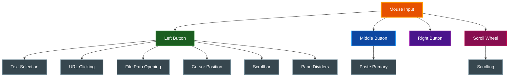

# Mouse Features

par-term provides comprehensive mouse support for text selection, URL handling, and pane management.

## Table of Contents
- [Overview](#overview)
- [Text Selection](#text-selection)
- [URL Handling](#url-handling)
- [Semantic History](#semantic-history)
- [Cursor Positioning](#cursor-positioning)
- [Scrolling](#scrolling)
- [Pane Interaction](#pane-interaction)
- [Configuration](#configuration)
- [Platform Differences](#platform-differences)
- [Related Documentation](#related-documentation)

## Overview

Mouse interactions in par-term:



## Text Selection

### Selection Modes

| Action | Mode | Description |
|--------|------|-------------|
| Click + Drag | Normal | Character-by-character selection |
| Double-Click | Word | Select word at cursor |
| Triple-Click | Line | Select entire line |
| Alt+Cmd + Drag (macOS) | Rectangular | Column-based block selection |
| Alt+Ctrl + Drag (Windows/Linux) | Rectangular | Column-based block selection |

### Word Selection

Double-click selects a word based on word boundary characters.

**Default word characters:** `/-+\~_.` (alphanumeric + these)

Configure in `config.yaml`:
```yaml
word_characters: "/-+\\~_."
```

### Smart Selection

When enabled, double-click can detect and select:
- URLs (http://, https://, etc.)
- Email addresses
- File paths
- IP addresses

Configure:
```yaml
smart_selection_enabled: true
```

### Auto-Copy

Selected text is automatically copied to clipboard when selection ends:
```yaml
auto_copy_selection: true
copy_trailing_newline: false  # Strip trailing newlines
```

### Click Timing

Configure double/triple-click detection:
```yaml
mouse_double_click_threshold: 200  # milliseconds
mouse_triple_click_threshold: 200  # milliseconds
```

## URL Handling

### Opening URLs

Hold `Cmd` (macOS) or `Ctrl` (Windows/Linux) and click a URL to open it.

**Detected Schemes:**
- `http://`, `https://`
- `ftp://`, `ftps://`
- `file://`, `git://`, `ssh://`
- `www.*` (converted to https://)

**Visual Feedback:**
- Cursor changes to hand pointer on URL hover
- Window title shows URL as tooltip

### OSC 8 Hyperlinks

par-term supports terminal-embedded hyperlinks (OSC 8 protocol) for more reliable URL detection.

## Semantic History

### Opening File Paths

Hold `Cmd` (macOS) or `Ctrl` (Windows/Linux) and click a detected file path to open it in your editor.

**Detected Paths:**
- Absolute paths: `/Users/name/projects/main.rs`, `/etc/config.yaml`
- Relative paths: `./src/main.rs`, `../lib/utils.py`
- Home-relative paths: `~/projects/app.js`
- Paths with line numbers: `./src/main.rs:42` or `./src/main.rs:42:10`

**Visual Feedback:**
- Detected paths are highlighted with a configurable color (default: bright cyan) and optional underline
- Underline style (solid or stipple) and visibility are configurable
- Cursor changes to hand pointer on hover

**Editor Selection:**
- Uses `$EDITOR` / `$VISUAL` by default
- Configurable custom editor command with `{file}`, `{line}`, `{col}` placeholders
- Directories open in the system file manager

Configure:
```yaml
semantic_history_enabled: true
semantic_history_editor_mode: environment_variable  # or: custom, system_default
semantic_history_editor: "code -g {file}:{line}"    # custom mode only
```

> See [Semantic History](SEMANTIC_HISTORY.md) for full documentation.

## Cursor Positioning

### Option/Alt + Click

Move the text cursor to the clicked position:

| Platform | Shortcut |
|----------|----------|
| macOS | `Option + Click` |
| Windows/Linux | `Alt + Click` |

**Requirements:**
- Must be at bottom of scrollback (not scrolled up)
- Not on alternate screen (apps like vim handle their own cursor)
- Not combined with Cmd/Super

Configure:
```yaml
option_click_moves_cursor: true
```

## Scrolling

### Mouse Wheel

Scroll through the scrollback buffer with the mouse wheel.

Configure scroll speed:
```yaml
mouse_scroll_speed: 1.0  # Multiplier (1.0 = normal)
```

### Scrollbar

- **Click thumb:** Drag to scroll
- **Click track:** Jump to position
- **Drag:** Smooth scrolling

### Application Scrolling

When a terminal application requests mouse tracking (vim, htop, etc.), scroll events are forwarded to the application instead of scrolling locally.

## Pane Interaction

### Focus Panes

Click on a pane to focus it.

### Resize Panes

Drag the divider between panes to resize:
- Horizontal dividers: resize height
- Vertical dividers: resize width

**Visual Feedback:**
- Cursor changes to resize indicator on divider hover
- Dividers sync to tmux if gateway is active

## Configuration

### All Mouse Options

```yaml
# Selection behavior
auto_copy_selection: true
copy_trailing_newline: false
word_characters: "/-+\\~_."
smart_selection_enabled: true

# Click timing
mouse_double_click_threshold: 200
mouse_triple_click_threshold: 200

# Scroll behavior
mouse_scroll_speed: 1.0
report_horizontal_scroll: true

# Cursor movement
option_click_moves_cursor: true

# Paste behavior
middle_click_paste: true

# Window focus
focus_follows_mouse: false
```

### Settings UI

The Input tab in Settings provides:

| Option | Description |
|--------|-------------|
| **Auto-copy selection** | Copy to clipboard on selection |
| **Copy trailing newline** | Include newlines when copying |
| **Middle-click paste** | Enable middle-click paste |
| **Option-click moves cursor** | Alt/Option+click cursor positioning |
| **Focus follows mouse** | Auto-focus window on cursor enter |

## Platform Differences

| Feature | macOS | Windows/Linux |
|---------|-------|---------------|
| URL modifier | `Cmd` | `Ctrl` |
| Cursor move | `Option` | `Alt` |
| Rectangular select | `Option + Cmd` | `Alt + Ctrl` |
| Primary selection | No | Yes (X11) |
| Middle-click paste | Clipboard | Primary selection |

## Related Documentation

- [README.md](../README.md) - Project overview
- [Keyboard Shortcuts](KEYBOARD_SHORTCUTS.md) - Keyboard shortcut reference
- [Semantic History](SEMANTIC_HISTORY.md) - File path clicking details
