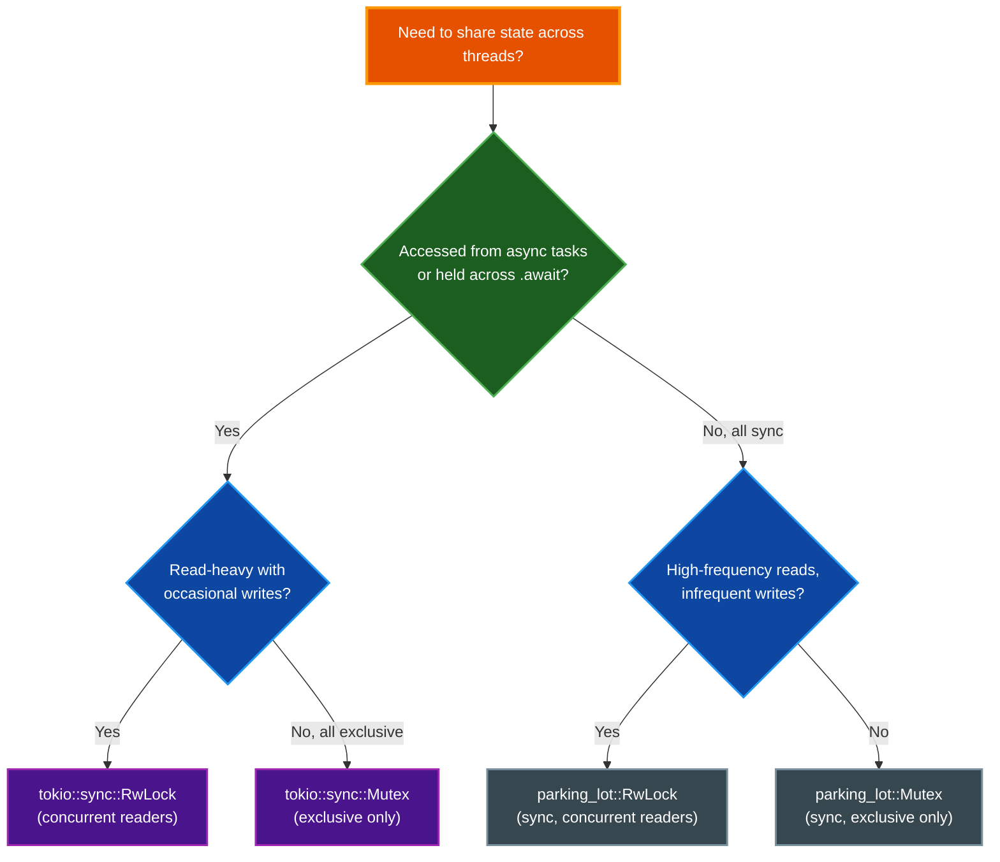

# Mutex Patterns in par-term

par-term uses multiple synchronization primitives that serve different purposes. Choosing the
wrong one — or calling the wrong access method — is a source of deadlocks and panics. This
document explains the design, decision rules, and correct usage patterns.

## Table of Contents

- [Why Multiple Synchronization Types?](#why-multiple-synchronization-types)
- [Decision Matrix](#decision-matrix)
- [Decision Flowchart](#decision-flowchart)
- [Key Types and Their Lock Choices](#key-types-and-their-lock-choices)
- [Accessing `Tab.terminal` from a Sync Context](#accessing-tabterminal-from-a-sync-context)
- [Accessing `Tab.terminal` from an Async Context](#accessing-tabterminal-from-an-async-context)
- [Anti-Patterns to Avoid](#anti-patterns-to-avoid)
- [`try_lock()` / `try_read()` / `try_write()` Failure Telemetry](#try_lock--try_read--try_write-failure-telemetry)
- [Summary](#summary)
- [Related Documentation](#related-documentation)

---

## Why Multiple Synchronization Types?

### The Boundary Problem

par-term straddles two execution environments:

| Environment | Driver |
|---|---|
| **Async tasks** | Tokio runtime (`Arc<Runtime>`) — spawned for PTY I/O, mouse reporting, key-send operations |
| **Sync event loop** | winit `EventLoop` — runs on the main thread, drives rendering and OS events |

#### `tokio::sync::RwLock`

A `tokio::sync::RwLock` allows multiple concurrent readers or a single exclusive writer.
It can be held across `.await` points, which is essential for async tasks. However,
locking it from a **non-async context** requires `blocking_read()` / `blocking_write()`,
which parks the calling thread. Calling blocking methods from inside a Tokio worker thread
will deadlock if all worker threads are occupied.

Use `tokio::sync::RwLock` when:
- The resource is shared with async tasks
- Read-heavy workloads benefit from concurrent readers
- The critical section may be held across `.await` points

#### `tokio::sync::Mutex`

A `tokio::sync::Mutex` provides exclusive access only but is simpler than RwLock.
Like RwLock, it can be held across `.await` points and has blocking variants for sync
contexts.

Use `tokio::sync::Mutex` when:
- The resource is shared with async tasks
- All access requires exclusive access (no read/write distinction)
- The critical section may be held across `.await` points

#### `parking_lot::Mutex`

A `parking_lot::Mutex` is a plain OS-level mutex. It has no async support but is smaller,
faster, and cannot cause Tokio deadlocks. It is the right choice when all callers are
sync threads.

Use `parking_lot::Mutex` when:
- All access is from sync contexts only
- No `.await` points are needed while holding the lock
- Performance matters more than async compatibility

---

## Decision Matrix

| State is shared with async tasks? | Access pattern | Use |
|---|---|---|
| Yes (PTY reader, input sender, resize, etc.) | Read-heavy with occasional writes | `tokio::sync::RwLock` |
| Yes | Always exclusive access | `tokio::sync::Mutex` |
| No (only sync threads / event loop) | Any | `parking_lot::Mutex` |

A secondary heuristic: if the critical section must be held across an `.await` point, the
type **must** be `tokio::sync::RwLock` or `tokio::sync::Mutex`.

## Decision Flowchart



---

## Key Types and Their Lock Choices

### `tokio::sync::RwLock`

| Type | Field | Reason |
|---|---|---|
| `Tab` | `terminal: Arc<tokio::sync::RwLock<TerminalManager>>` | Shared with async PTY reader and input tasks; read-heavy |
| `Pane` | `terminal: Arc<tokio::sync::RwLock<TerminalManager>>` | Same — each pane has its own PTY; read-heavy |

### `tokio::sync::Mutex`

| Type | Field | Reason |
|---|---|---|
| `AgentState` | `agent: Option<Arc<tokio::sync::Mutex<Agent>>>` | Accessed from spawned async prompt tasks; exclusive access only |

### `parking_lot::Mutex`

| Type | Field | Reason |
|---|---|---|
| `SharedSessionLogger` (type alias) | `Arc<parking_lot::Mutex<Option<SessionLogger>>>` | Only accessed from sync event loop and std threads |
| `SystemMonitor` | `data: Arc<parking_lot::Mutex<SystemMonitorData>>` | Background std thread writer, sync render-thread reader |
| `GitBranchPoller` | `status: Arc<parking_lot::Mutex<GitStatus>>` | Sync git-check thread + sync render thread |
| `DebugLogger` (static) | `OnceLock<parking_lot::Mutex<DebugLogger>>` | Non-async log writes from any thread |
| `ShaderWatcher` | `Arc<parking_lot::Mutex<HashMap<...>>>` | std thread writer, sync event loop reader |
| `AudioBell` | `sink: Option<Arc<parking_lot::Mutex<Player>>>` | Rodio plays on a std thread |
| `BadgeState` | `variables: Arc<parking_lot::RwLock<SessionVariables>>` | RwLock for frequent reads, infrequent writes, all sync |
| `ActiveUpload` | `error: Arc<parking_lot::Mutex<Option<String>>>` | Error state written from std thread, read from event loop |

---

## Accessing `Tab.terminal` from a Sync Context

`Tab.terminal` is `Arc<tokio::sync::RwLock<TerminalManager>>`. The winit event loop is
not an async context, so `.read().await` / `.write().await` are unavailable. Two
alternatives exist:

### `try_read()` / `try_write()` — Non-blocking poll

```rust
// In the winit event loop (about_to_wait, window events, etc.)
if let Ok(term) = tab.terminal.try_read() {
    // use term for read-only access ...
} else {
    // Lock is held by an async task; skip this frame, retry next.
    crate::debug::record_try_lock_failure("resize");
}

// For write access
if let Ok(mut term) = tab.terminal.try_write() {
    term.resize(cols, rows);
}
```

Use `try_read()` / `try_write()` for:
- Per-frame rendering polls (read)
- Resize propagation (write)
- Any operation that can safely be deferred to the next frame

### `blocking_read()` / `blocking_write()` — Blocking wait

```rust
// For infrequent user-initiated operations (coprocess start/stop, scripting setup)
let mut term = tab.terminal.blocking_write();
term.start_coprocess(...);
```

Use `blocking_read()` / `blocking_write()` for:
- Coprocess start / stop (user action, happens once)
- Scripting observer registration
- File transfer initiation triggered by user
- Any operation that **must not** be skipped

**WARNING**: Never call `blocking_read()` / `blocking_write()` from within a
`runtime.spawn()`'d async task. If all Tokio worker threads are waiting on blocking
methods, Tokio will deadlock.

---

## Accessing `Tab.terminal` from an Async Context

```rust
// Inside runtime.spawn() or an async fn
let term = terminal_clone.read().await;  // For read-only access
// term is held across the await — safe with tokio::sync::RwLock

let mut term = terminal_clone.write().await;  // For exclusive write access
// term is held across the await — safe with tokio::sync::RwLock
```

Never use `try_read()` / `try_write()` from async code to guard long-lived operations;
prefer `.read().await` / `.write().await` so the task yields instead of spinning.

---

## Anti-Patterns to Avoid

### Deadlock: `blocking_write` inside a Tokio task

```rust
// BAD — never do this inside runtime.spawn()
runtime.spawn(async move {
    let term = terminal.blocking_write(); // may deadlock Tokio thread pool
});

// GOOD
runtime.spawn(async move {
    let term = terminal.write().await;
});
```

### Wrong lock for a new async-shared type

```rust
// BAD — parking_lot::Mutex cannot be held across .await
let mu = Arc::new(parking_lot::Mutex::new(state));
runtime.spawn(async move {
    let guard = mu.lock(); // guard held, then ...
    some_async_fn().await; // ... held across await point: undefined behavior / panic
});

// GOOD
let mu = Arc::new(tokio::sync::RwLock::new(state));
runtime.spawn(async move {
    let guard = mu.read().await;
    some_async_fn().await; // safe
});
```

### Calling `.read().await` / `.write().await` from a sync context

```rust
// BAD — sync context, cannot .await
fn handle_event(&mut self) {
    let term = self.tab.terminal.read().await; // compile error
}

// GOOD — use try_read()/try_write() or blocking_read()/blocking_write() depending on requirements
fn handle_event(&mut self) {
    if let Ok(term) = self.tab.terminal.try_read() { ... }
}
```

### Using `tokio::sync::RwLock` for pure-sync state

```rust
// UNNECESSARY — if no async task ever touches this, parking_lot is simpler
let log: Arc<tokio::sync::RwLock<Logger>> = Arc::new(tokio::sync::RwLock::new(Logger::new()));

// BETTER
let log: Arc<parking_lot::Mutex<Logger>> = Arc::new(parking_lot::Mutex::new(Logger::new()));
```

---

## `try_lock()` / `try_read()` / `try_write()` Failure Telemetry

The codebase tracks try-lock misses via `crate::debug::record_try_lock_failure(site)`.
This increments a global atomic counter and emits a `CONCURRENCY` debug log entry
(visible at `DEBUG_LEVEL >= 3`). Periodic summaries are emitted by `about_to_wait`.

When adding a new `try_read()`, `try_write()`, or `try_lock()` call site, pass a short label:

```rust
if let Ok(term) = self.terminal.try_read() {
    // ...
} else {
    crate::debug::record_try_lock_failure("my_operation");
}
```

A high miss rate at a specific site indicates that an async task is holding the lock
longer than expected, which may warrant investigation.

---

## Summary

```text
tokio::sync::RwLock  — async tasks share the value; use .read().await / .write().await
                       sync callers: try_read()/try_write() (skip-able) or blocking_read()/blocking_write() (must-succeed)

tokio::sync::Mutex   — async tasks need exclusive access; use .lock().await
                       sync callers: try_lock() (skip-able) or blocking_lock() (must-succeed)

parking_lot::Mutex   — all callers are sync threads; use .lock() directly
                       never hold across .await
```

---

## Related Documentation

- [CONCURRENCY.md](CONCURRENCY.md) — State hierarchy and threading model overview
- [CLAUDE.md](../CLAUDE.md) — Critical gotchas and development guidelines
- `src/debug.rs` — Debug logging infrastructure
