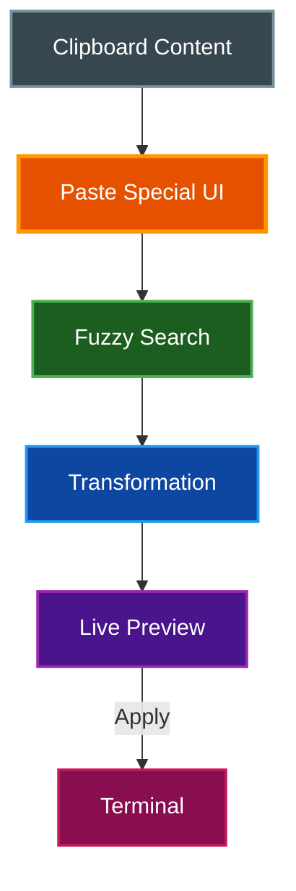
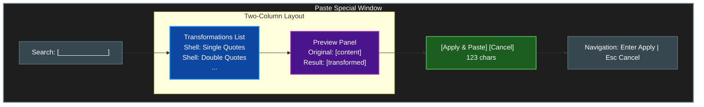

# Paste Special

par-term's Paste Special feature allows you to transform clipboard content before pasting, with 29 different transformations across 5 categories. A configurable paste delay option is also available for slow terminals or remote connections.

## Table of Contents
- [Overview](#overview)
- [Opening Paste Special](#opening-paste-special)
- [Transformations](#transformations)
  - [Shell Category](#shell-category)
  - [Case Category](#case-category)
  - [Newline Category](#newline-category)
  - [Whitespace Category](#whitespace-category)
  - [Encoding Category](#encoding-category)
- [Paste Delay](#paste-delay)
- [Using the UI](#using-the-ui)
- [Related Documentation](#related-documentation)

## Overview

Paste Special provides a searchable list of transformations with live preview:


```mermaid
graph TD
    Clipboard[Clipboard Content]
    UI[Paste Special UI]
    Search[Fuzzy Search]
    Transform[Transformation]
    Preview[Live Preview]
    Terminal[Terminal]

    Clipboard --> UI
    UI --> Search
    Search --> Transform
    Transform --> Preview
    Preview -->|Apply| Terminal

    style Clipboard fill:#37474f,stroke:#78909c,stroke-width:2px,color:#ffffff
    style UI fill:#e65100,stroke:#ff9800,stroke-width:3px,color:#ffffff
    style Search fill:#1b5e20,stroke:#4caf50,stroke-width:2px,color:#ffffff
    style Transform fill:#0d47a1,stroke:#2196f3,stroke-width:2px,color:#ffffff
    style Preview fill:#4a148c,stroke:#9c27b0,stroke-width:2px,color:#ffffff
    style Terminal fill:#880e4f,stroke:#c2185b,stroke-width:2px,color:#ffffff
```

## Opening Paste Special

**Keyboard Shortcut:** `Cmd+Shift+V` (macOS) or `Ctrl+Alt+V` (Windows/Linux)

**Alternative:** From Clipboard History (`Ctrl+Shift+H`), press `Shift+Enter` on an entry.

## Transformations

### Shell Category

| Transform | Description | Example |
|-----------|-------------|---------|
| **Shell: Single Quotes** | Wrap in single quotes, escape internal quotes | `hello world` → `'hello world'` |
| **Shell: Double Quotes** | Wrap in double quotes, escape special chars | `$PATH` → `"$PATH"` |
| **Shell: Backslash Escape** | Escape shell special characters | `hello world` → `hello\ world` |

**Shell escaping handles:**
- Spaces, tabs, newlines
- Quotes (single and double)
- Shell operators (`&`, `|`, `;`, etc.)
- Redirections (`<`, `>`)
- Glob patterns (`*`, `?`, `[`, `]`)

### Case Category

| Transform | Description | Example |
|-----------|-------------|---------|
| **Case: UPPERCASE** | All characters uppercase | `hello world` → `HELLO WORLD` |
| **Case: lowercase** | All characters lowercase | `HELLO WORLD` → `hello world` |
| **Case: Title Case** | First letter of each word | `hello world` → `Hello World` |
| **Case: camelCase** | First word lower, rest capitalized | `hello world` → `helloWorld` |
| **Case: PascalCase** | All words capitalized | `hello world` → `HelloWorld` |
| **Case: snake_case** | Lowercase with underscores | `Hello World` → `hello_world` |
| **Case: SCREAMING_SNAKE** | Uppercase with underscores | `hello world` → `HELLO_WORLD` |
| **Case: kebab-case** | Lowercase with hyphens | `Hello World` → `hello-world` |

**Word boundary detection:**
- Whitespace
- Hyphens and underscores
- camelCase transitions (lowercase to uppercase)

### Newline Category

| Transform | Description | Example |
|-----------|-------------|---------|
| **Newline: Paste as Single Line** | Strip all newlines and join with spaces | `hello\nworld` → `hello world` |
| **Newline: Add Newlines** | Ensure text ends with a newline after each line | `hello\nworld` → `hello\nworld\n` |
| **Newline: Remove Newlines** | Remove all newline characters | `hello\nworld` → `helloworld` |

**Use Cases:**
- **Single Line**: Paste multi-line content as one line (e.g., pasting a path that got line-wrapped)
- **Add Newlines**: Ensure commands are executed when pasted line by line
- **Remove Newlines**: Clean up content with unwanted line breaks

### Whitespace Category

| Transform | Description | Example |
|-----------|-------------|---------|
| **Whitespace: Trim** | Remove leading/trailing whitespace | `  hello  ` → `hello` |
| **Whitespace: Trim Lines** | Trim each line | `  hello  \n  world  ` → `hello\nworld` |
| **Whitespace: Collapse Spaces** | Multiple spaces → single | `hello    world` → `hello world` |
| **Whitespace: Tabs to Spaces** | Convert tabs to 4 spaces | `\t` → `    ` |
| **Whitespace: Spaces to Tabs** | Convert 4 spaces to tabs | `    ` → `\t` |
| **Whitespace: Remove Empty Lines** | Delete blank lines | Removes empty lines |
| **Whitespace: Normalize Line Endings** | Convert to LF | `\r\n` → `\n` |

### Encoding Category

| Transform | Description | Example |
|-----------|-------------|---------|
| **Encode: Base64** | Encode as Base64 | `hello` → `aGVsbG8=` |
| **Decode: Base64** | Decode Base64 | `aGVsbG8=` → `hello` |
| **Encode: URL** | Percent-encode | `hello world` → `hello%20world` |
| **Decode: URL** | Decode percent-encoding | `hello%20world` → `hello world` |
| **Encode: Hex** | Encode as hexadecimal | `AB` → `4142` |
| **Decode: Hex** | Decode hexadecimal | `4142` → `AB` |
| **Encode: JSON Escape** | Escape for JSON string | `"hello"` → `\"hello\"` |
| **Decode: JSON Unescape** | Unescape JSON | `\"hello\"` → `"hello"` |

**Error Handling:**
- Invalid Base64: Shows error message
- Invalid hex: Shows error message
- Invalid URL encoding: Shows error message
- Invalid JSON escapes: Shows error message

## Paste Delay

For slow terminals or remote connections that cannot handle rapid paste, a configurable delay can be added between pasted lines.

**Config option:** `paste_delay_ms` (0-500ms, default: 0)

```yaml
paste_delay_ms: 50  # Add 50ms delay between pasted lines
```

**Settings UI:** Settings > Input > Selection & Clipboard > Paste Delay slider

**When to use:**
- Remote SSH sessions with slow connections
- Serial terminal connections
- Applications that process input line-by-line with buffering limitations

## Using the UI

### UI Layout


```mermaid
graph TB
    subgraph Window["Paste Special Window"]
        Search["Search: [_____________]"]
        subgraph Columns["Two-Column Layout"]
            Transforms["Transformations List<br/>Shell: Single Quotes<br/>Shell: Double Quotes<br/>..."]
            Preview["Preview Panel<br/>Original: [content]<br/>Result: [transformed]"]
        end
        Buttons["[Apply & Paste] [Cancel]    123 chars"]
        Hints["Navigation: Enter Apply | Esc Cancel"]
    end

    Search --> Transforms
    Transforms --> Preview
    Preview --> Buttons
    Buttons --> Hints

    style Window fill:#1E1E1E,stroke:#78909c,stroke-width:2px,color:#ffffff
    style Search fill:#37474f,stroke:#78909c,stroke-width:1px,color:#ffffff
    style Transforms fill:#0d47a1,stroke:#2196f3,stroke-width:2px,color:#ffffff
    style Preview fill:#4a148c,stroke:#9c27b0,stroke-width:2px,color:#ffffff
    style Buttons fill:#1b5e20,stroke:#4caf50,stroke-width:2px,color:#ffffff
    style Hints fill:#37474f,stroke:#78909c,stroke-width:1px,color:#ffffff
```

### Navigation

| Key | Action |
|-----|--------|
| `↑` / `↓` | Navigate transformations |
| `Enter` | Apply and paste |
| `Escape` | Cancel |
| Type | Filter transformations |

### Search/Filter

Type in the search box to filter transformations:
- `b64` → Shows Base64 transforms
- `shell` → Shows shell escaping
- `upper` → Shows uppercase transform
- `case` → Shows all case transforms

### Preview

The right panel shows:
- **Original:** First part of clipboard content (newlines shown as `↵`, tabs as `→`)
- **Result:** Transformed content or error message
- **Content length:** Character count

## Related Documentation

- [KEYBOARD_SHORTCUTS.md](KEYBOARD_SHORTCUTS.md) - All keyboard shortcuts
- [CONFIG_REFERENCE.md](CONFIG_REFERENCE.md) - Configuration options including `paste_delay_ms`
- [MOUSE_FEATURES.md](MOUSE_FEATURES.md) - Mouse-based copy/paste operations
