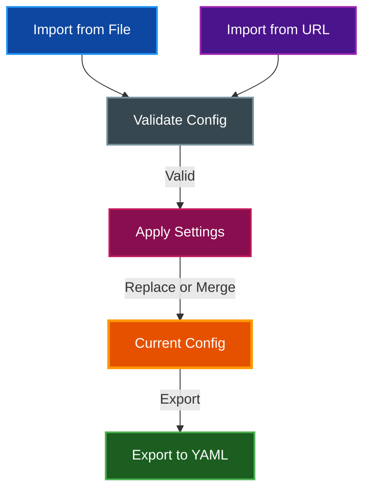

# Import/Export Preferences

par-term supports importing and exporting terminal configuration for backup, sharing, and team standardization.

## Table of Contents
- [Overview](#overview)
- [Exporting Preferences](#exporting-preferences)
- [Importing Preferences](#importing-preferences)
  - [Import from File](#import-from-file)
  - [Import from URL](#import-from-url)
  - [Import Modes](#import-modes)
- [Settings UI](#settings-ui)
- [Related Documentation](#related-documentation)

## Overview

The import/export system reads and writes par-term configuration in YAML format, allowing you to back up settings, share configurations between machines, or distribute team-standard configurations.

## Exporting Preferences

Export the current configuration to a YAML file:

1. Open Settings (`F12` or `Cmd/Ctrl + ,`)
2. Navigate to **Advanced** > **Import/Export Preferences**
3. Click **Export**
4. Choose a location in the native file dialog
5. The current configuration saves as a `.yaml` file

The exported file contains all non-default configuration values.

## Importing Preferences

### Import from File

1. Open Settings > **Advanced** > **Import/Export Preferences**
2. Click **Import from File**
3. Select a `.yaml` configuration file
4. Choose an import mode (Replace or Merge)
5. The configuration applies immediately

### Import from URL

1. Open Settings > **Advanced** > **Import/Export Preferences**
2. Enter the URL of a configuration file
3. Click **Import from URL**
4. Choose an import mode (Replace or Merge)
5. The configuration downloads and applies

### Import Modes

| Mode | Behavior |
|------|----------|
| **Replace** | Completely replaces the current configuration with the imported values |
| **Merge** | Only overrides values that differ from defaults, preserving your customizations |

**Merge mode** is recommended when importing partial configurations or when you want to preserve your existing settings while adding specific overrides from the imported file.

**Validation**: All imported configurations are validated before applying. Malformed or invalid YAML files are rejected with an error message.

## Settings UI

All import/export controls are located in **Settings > Advanced > Import/Export Preferences**.

## Related Documentation

- [Window Management](WINDOW_MANAGEMENT.md) - Window and display configuration
- [Profiles](PROFILES.md) - Profile management (separate from main config)
- [Arrangements](ARRANGEMENTS.md) - Window arrangements (separate from main config)
