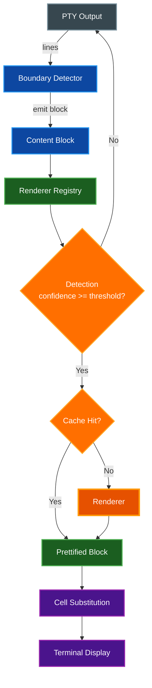

# Content Prettifier

The Content Prettifier detects structured content in terminal output (Markdown, JSON, YAML, diffs, diagrams, and more) and renders it in a rich, human-readable form directly in the terminal. It uses a pluggable trait-based architecture where detectors identify formats and renderers handle display, with full support for custom user-defined renderers, per-profile overrides, and Claude Code integration.

## Table of Contents

- [Overview](#overview)
- [Architecture](#architecture)
  - [Core Traits](#core-traits)
  - [Pipeline Flow](#pipeline-flow)
  - [Key Types](#key-types)
- [Built-in Renderers](#built-in-renderers)
  - [Markdown](#markdown)
  - [JSON](#json)
  - [YAML](#yaml)
  - [TOML](#toml)
  - [XML](#xml)
  - [CSV](#csv)
  - [Diff](#diff)
  - [Log](#log)
  - [Diagrams](#diagrams)
  - [SQL Results](#sql-results)
  - [Stack Trace](#stack-trace)
- [Custom Renderers](#custom-renderers)
  - [Defining a Custom Renderer](#defining-a-custom-renderer)
  - [ANSI Color Support](#ansi-color-support)
  - [Custom Diagram Languages](#custom-diagram-languages)
- [Detection System](#detection-system)
  - [Detection Scope](#detection-scope)
  - [Confidence Scoring](#confidence-scoring)
  - [Custom Detection Rules](#custom-detection-rules)
- [Clipboard Integration](#clipboard-integration)
- [Claude Code Integration](#claude-code-integration)
- [Toggle UX](#toggle-ux)
- [Render Cache](#render-cache)
- [Profile Overrides](#profile-overrides)
- [Complete Configuration Example](#complete-configuration-example)
- [Settings UI](#settings-ui)
- [Related Documentation](#related-documentation)

## Overview

The Content Prettifier watches terminal output and automatically identifies structured content using regex-based detection rules with weighted confidence scoring. When a content block is detected with sufficient confidence, it is rendered with syntax highlighting, table formatting, color-coded diffs, and other format-specific enhancements. Users can toggle between rendered and source views per-block or globally.

The system consists of:

- **Detectors** that identify content formats by scanning output lines against regex rules
- **Renderers** that transform detected content into styled terminal output
- **A pipeline** that wires boundary detection, format detection, rendering, and caching together
- **Cell substitution** that replaces raw terminal cells with rendered output in the display

## Architecture

### Core Traits

The prettifier is built on two core traits defined in `src/prettifier/traits.rs`:

**`ContentDetector`** identifies whether a content block matches a specific format:

| Method | Description |
|--------|-------------|
| `format_id()` | Unique identifier (e.g., `"markdown"`, `"json"`) |
| `display_name()` | Human-readable name for the settings UI |
| `detect(content)` | Analyze content and return a `DetectionResult` with confidence score |
| `quick_match(first_lines)` | Fast pre-filter before running full detection |
| `detection_rules()` | Return the regex rules powering this detector |
| `accepts_custom_rules()` | Whether user-added rules are accepted (default: `true`) |

**`ContentRenderer`** renders detected content into styled terminal output:

| Method | Description |
|--------|-------------|
| `format_id()` | Matching identifier from the corresponding detector |
| `display_name()` | Human-readable name for the settings UI |
| `capabilities()` | Required capabilities (text styling, inline graphics, external command, network) |
| `render(content, config)` | Render a content block into styled output |
| `format_badge()` | Short badge text for the gutter indicator (e.g., `"MD"`, `"JSON"`) |

Both traits require `Send + Sync` for thread safety.

### Pipeline Flow

The `PrettifierPipeline` (`src/prettifier/pipeline.rs`) orchestrates the full flow:



1. **Boundary Detection**: The `BoundaryDetector` accumulates output lines and emits `ContentBlock` instances at natural boundaries (OSC 133 command markers, blank-line runs, max scan lines, debounce timeout, or alternate screen transitions).
2. **Format Detection**: The `RendererRegistry` runs all registered detectors against each block in priority order, keeping the result with the highest confidence score.
3. **Rendering**: If confidence meets the threshold, the matching renderer produces `RenderedContent` with styled lines and optional inline graphics.
4. **Caching**: Rendered content is stored in an LRU cache keyed by content hash and terminal width.
5. **Cell Substitution**: The rendered output replaces the original terminal cells in the display, with a gutter badge indicating the detected format.

### Key Types

| Type | File | Description |
|------|------|-------------|
| `ContentBlock` | `types.rs` | Raw terminal output lines with timestamps, row range, and preceding command |
| `DetectionResult` | `types.rs` | Format ID, confidence score, matched rules, and detection source |
| `RenderedContent` | `types.rs` | Styled lines, source line mappings, optional inline graphics, and format badge |
| `StyledLine` | `types.rs` | A line composed of `StyledSegment` instances |
| `StyledSegment` | `types.rs` | Text with optional fg/bg color, bold, italic, underline, strikethrough, and hyperlink URL |
| `RendererRegistry` | `registry.rs` | Holds all registered detectors (sorted by priority) and renderers (keyed by format ID) |
| `PrettifierPipeline` | `pipeline.rs` | Top-level orchestrator wiring boundary detection, registry, cache, and Claude Code integration |
| `PrettifiedBlock` | `pipeline.rs` | A detected+rendered block wrapping a `DualViewBuffer` for source/rendered toggling |
| `DualViewBuffer` | `buffer.rs` | Manages source content and rendered content with view mode toggling and copy support |
| `RenderCache` | `cache.rs` | LRU cache for rendered content keyed by content hash and terminal width |
| `DetectionRule` | `types.rs` | A regex rule with ID, weight, scope, strength, source, and optional command context |

## Built-in Renderers

All 11 built-in renderers are enabled by default with priority 50. Each has a dedicated detector and renderer pair.

### Markdown

**Format ID**: `markdown` | **Badge**: `MD`

Renders Markdown content with full inline formatting:

- **Headers** (H1-H6): Color-coded by level with three styles (Colored, Bold, Underlined)
- **Lists**: Ordered and unordered with proper indentation
- **Code blocks**: Fenced code blocks with language-aware syntax highlighting and optional background shading
- **Tables**: Column-aligned rendering using Unicode box-drawing characters
- **Links**: Three rendering styles:
  - `UnderlineColor` (default) -- underlined text with OSC 8 hyperlink
  - `InlineUrl` -- displays `text (url)` inline
  - `Footnote` -- displays `text[1]` with footnotes collected at the end
- **Horizontal rules**: Three styles (Thin, Thick, Dashed)
- **Blockquotes**: Indented with vertical bar prefix
- **Inline formatting**: Bold, italic, strikethrough, inline code

### JSON

**Format ID**: `json` | **Badge**: `JSON`

Syntax-highlighted JSON with proper indentation. Colors keys, string values, numbers, booleans, and null distinctly.

### YAML

**Format ID**: `yaml` | **Badge**: `YAML`

Key/value coloring with support for anchors, aliases, tags, and multi-line values.

### TOML

**Format ID**: `toml` | **Badge**: `TOML`

Section header highlighting with `[section]` and `[[array]]` formatting, key/value coloring, and comment styling.

### XML

**Format ID**: `xml` | **Badge**: `XML`

Tag and attribute highlighting with proper nesting visualization. Colors element names, attribute names, attribute values, and text content distinctly.

### CSV

**Format ID**: `csv` | **Badge**: `CSV`

Column-aligned table rendering. Detects delimiters and formats data into an aligned table with header separation.

### Diff

**Format ID**: `diff` | **Badge**: `DIFF`

Unified diff rendering with `+`/`-` coloring:

- Added lines highlighted in green
- Removed lines highlighted in red
- File headers and hunk markers styled distinctly
- Optional side-by-side display mode (configurable via `display_mode: "side_by_side"`)

### Log

**Format ID**: `log` | **Badge**: `LOG`

Severity-based coloring for log lines. Detects common log formats and applies color based on severity level (DEBUG, INFO, WARN, ERROR, FATAL).

### Diagrams

**Format ID**: `diagrams` | **Badge**: `DG`

Renders fenced code blocks tagged with diagram language identifiers. Supports 10 diagram languages across 11 tags:

| Tag | Language | Local CLI | Kroki |
|-----|----------|-----------|-------|
| `mermaid` | Mermaid | `mmdc` | Yes |
| `plantuml` | PlantUML | `plantuml` | Yes |
| `graphviz` / `dot` | GraphViz | `dot` | Yes |
| `d2` | D2 | `d2` | Yes |
| `ditaa` | Ditaa | -- | Yes |
| `svgbob` | SvgBob | `svgbob` | Yes |
| `erd` | Erd | `erd` | Yes |
| `vegalite` | Vega-Lite | -- | Yes |
| `wavedrom` | WaveDrom | -- | Yes |
| `excalidraw` | Excalidraw | -- | Yes |

**Three rendering backends:**

| Backend | Config Value | Behavior |
|---------|-------------|----------|
| Auto | `"auto"` (default) | Tries local CLI first, falls back to Kroki API |
| Local | `"local"` | Uses only local CLI tools |
| Kroki | `"kroki"` | Uses only the Kroki API |
| Text fallback | `"text_fallback"` | Syntax-highlighted source display only |

The Kroki server URL is configurable (default: `https://kroki.io`). When a backend renders successfully, the diagram is displayed as an inline graphic (PNG). When all backends fail, the source is displayed with syntax-aware coloring.

### SQL Results

**Format ID**: `sql_results` | **Badge**: `SQL`

Tabular result set rendering. Detects SQL result output patterns and formats them into aligned tables.

### Stack Trace

**Format ID**: `stack_trace` | **Badge**: `STK`

Error and exception trace highlighting. Detects common stack trace patterns across languages and applies color-coded formatting to file paths, line numbers, and error messages.

## Custom Renderers

### Defining a Custom Renderer

Add custom renderers under `content_prettifier.custom_renderers:` in `config.yaml`. Each custom renderer defines detection patterns and an external command to pipe content through:

```yaml
content_prettifier:
  custom_renderers:
    - id: "protobuf"
      name: "Protocol Buffers"
      detect_patterns: ["^message\\s+\\w+", "^syntax\\s*="]
      render_command: "bat"
      render_args: ["--language=protobuf", "--color=always", "--style=plain"]
      priority: 40
```

| Field | Type | Required | Default | Description |
|-------|------|----------|---------|-------------|
| `id` | string | Yes | -- | Unique identifier for this renderer |
| `name` | string | Yes | -- | Human-readable display name |
| `detect_patterns` | array of strings | No | `[]` | Regex patterns for detection (at least one must match) |
| `render_command` | string | No | `null` | Shell command to pipe content through |
| `render_args` | array of strings | No | `[]` | Arguments to pass to the render command |
| `priority` | integer | No | `50` | Priority relative to built-in renderers (higher = checked first) |

The `ExternalCommandRenderer` pipes the full content block to the command's stdin and captures ANSI-colored output from stdout. If `render_command` is omitted, only the detector is registered (useful for detection-only rules that feed into a built-in renderer).

Custom renderers run alongside built-in ones and are sorted by priority. A custom renderer with priority 60 will be checked before all default (priority 50) built-in renderers.

### ANSI Color Support

External command output is parsed for full ANSI SGR (Select Graphic Rendition) sequences:

- **Reset** (SGR 0) and attribute toggles (bold, italic, underline, strikethrough)
- **Standard colors** (30-37 foreground, 40-47 background)
- **Bright colors** (90-97 foreground, 100-107 background)
- **256-color mode** (38;5;N foreground, 48;5;N background)
- **RGB true-color** (38;2;R;G;B foreground, 48;2;R;G;B background)

This means any command that produces ANSI-colored output (e.g., `bat`, `pygmentize`, `highlight`) works as a custom renderer.

### Custom Diagram Languages

Add custom diagram languages that integrate with the diagram renderer's backend system:

```yaml
content_prettifier:
  custom_diagram_languages:
    - tag: "tikz"
      display_name: "TikZ"
      kroki_type: "tikz"
      local_command: null
      local_args: []
```

Custom diagram languages are registered alongside the built-in ones and support the same backend selection (auto, local, kroki, text_fallback).

## Detection System

### Detection Scope

The `detection.scope` setting controls when the prettifier scans for content:

| Scope | Config Value | Behavior |
|-------|-------------|----------|
| All | `"all"` (default) | Scans all terminal output. Uses blank-line heuristics and debounce timeouts to identify block boundaries. |
| Command Output | `"command_output"` | Only scans content between OSC 133 shell integration markers (C and D). Requires shell integration to be installed. |
| Manual Only | `"manual_only"` | Never auto-detects. Content is only prettified via explicit trigger rules or the `trigger_prettify()` API. |

> **Note:** The `"command_output"` scope does **not** work with Claude Code sessions because Claude Code does not emit OSC 133 markers. Use `"all"` scope for Claude Code.

### Confidence Scoring

Each detector runs multiple weighted regex rules against a content block. The detection result includes:

- **Confidence score** (0.0 to 1.0): Sum of matched rule weights, capped at 1.0
- **Matched rules**: List of rule IDs that contributed to the score
- **Detection source**: `AutoDetected` or `TriggerInvoked`

The `confidence_threshold` (default: 0.6) sets the minimum score required for a detection to be accepted. The registry evaluates all detectors in priority order and selects the result with the highest confidence. Priority is the tiebreaker when confidence scores are equal.

**Rule properties:**

| Property | Description |
|----------|-------------|
| `weight` | Confidence contribution when matched (0.0-1.0) |
| `scope` | Where to apply: `AnyLine`, `FirstLines(N)`, `LastLines(N)`, `FullBlock`, `PrecedingCommand` |
| `strength` | Signal strength: `Definitive` (sufficient alone), `Strong` (high confidence), `Supporting` (needs corroboration) |
| `source` | `BuiltIn` (shipped, can be disabled) or `UserDefined` (from config, can be edited/removed) |
| `command_context` | Optional regex that restricts the rule to output from matching commands |

### Custom Detection Rules

Add or override detection rules for any format via `detection_rules:` in `config.yaml`:

```yaml
content_prettifier:
  detection_rules:
    markdown:
      additional:
        - id: "md_custom_fence"
          pattern: "^```custom"
          weight: 0.4
          scope: "first_lines:5"
          enabled: true
          description: "Custom fence block marker"
      overrides:
        - id: "md_atx_header"
          enabled: false
        - id: "md_bold"
          weight: 0.5
```

**Additional rules** are appended to the detector's rule set. **Overrides** modify built-in rules by ID, allowing you to disable or re-weight specific rules without replacing the entire detector.

## Clipboard Integration

When copying text from prettified content blocks, the clipboard behavior is configurable:

```yaml
content_prettifier:
  clipboard:
    default_copy: "rendered"
    source_copy_modifier: "Alt"
    vi_copy_mode: "source"
```

| Setting | Values | Default | Description |
|---------|--------|---------|-------------|
| `default_copy` | `"rendered"`, `"source"` | `"rendered"` | What to copy by default when selecting text in a prettified block |
| `source_copy_modifier` | `"Alt"`, `"Shift"`, `"Ctrl"` | `"Alt"` | Hold this modifier while copying to get the alternative form |
| `vi_copy_mode` | `"source"`, `"rendered"` | `"source"` | What vi copy mode (`y` yank) copies from prettified blocks |

When `default_copy` is `"rendered"`, a normal copy gets the styled/formatted text and holding Alt copies the original source. When `default_copy` is `"source"`, the behavior is reversed.

## Claude Code Integration

The prettifier has dedicated support for Claude Code sessions, configured under `claude_code_integration:`:

```yaml
content_prettifier:
  claude_code_integration:
    auto_detect: true
    render_markdown: true
    render_diffs: true
    auto_render_on_expand: true
    show_format_badges: true
```

| Setting | Default | Description |
|---------|---------|-------------|
| `auto_detect` | `true` | Detect Claude Code sessions via the `CLAUDE_CODE` environment variable or process name |
| `render_markdown` | `true` | Prettify Markdown content in Claude Code output |
| `render_diffs` | `true` | Prettify diffs in Claude Code output |
| `auto_render_on_expand` | `true` | Automatically run the prettifier when a collapsed block is expanded via Ctrl+O |
| `show_format_badges` | `true` | Show format badges (e.g., `MD Markdown`, `{} JSON`) on collapsed blocks |

**Session detection** checks (in order):

1. The `CLAUDE_CODE` environment variable is set
2. The foreground process name contains "claude"

**Expand/collapse tracking**: When Claude Code shows `(ctrl+o to expand)` markers, the integration tracks block states. On expansion, if `auto_render_on_expand` is enabled, the newly visible content is automatically run through the detection and rendering pipeline.

**Compact mode**: When Claude Code is in compact mode, prettification is skipped entirely to avoid interfering with Claude Code's own rendering.

> **Important:** The `"command_output"` detection scope does **not** work with Claude Code because Claude Code does not emit OSC 133 shell integration markers. Use `"all"` scope instead.

## Toggle UX

The prettifier provides two levels of toggling:

| Toggle | Key Binding | Scope |
|--------|-------------|-------|
| Global toggle | `Ctrl+Shift+P` (configurable via `global_toggle_key`) | Enables/disables all prettification for the session |
| Per-block toggle | Click or keyboard action on a prettified block | Switches an individual block between rendered and source views |

**Global toggle** (`toggle_global()`): Overrides the config-level enabled state for the current session. Toggling off immediately stops new detection and rendering. Existing rendered blocks remain visible but can be individually toggled back to source view.

**Per-block toggle** (`toggle_block(block_id)`): Each `PrettifiedBlock` wraps a `DualViewBuffer` that maintains both the source content and the rendered content. Toggling switches the view mode between `Rendered` and `Source` without re-rendering.

The `respect_alternate_screen` setting (default: `true`) creates boundaries at alternate screen transitions (e.g., entering/exiting `vim`, `less`, `top`), ensuring prettified blocks do not span across application boundaries.

## Render Cache

The `RenderCache` avoids re-rendering unchanged content blocks. It is keyed by content hash and terminal width, since rendered output may differ at different widths (e.g., table column alignment, line wrapping).

```yaml
content_prettifier:
  cache:
    max_entries: 64
```

| Setting | Default | Description |
|---------|---------|-------------|
| `max_entries` | `64` | Maximum number of cached entries before LRU eviction |

Cache behavior:

- **Hit**: Returns the cached `RenderedContent` immediately, skipping the renderer
- **Miss**: Runs the renderer, stores the result, and returns it
- **Eviction**: When the cache is full, the least recently used entry is evicted
- **Invalidation**: When content changes, all cached entries for that content hash (any width) are invalidated
- **Width sensitivity**: The same content at different terminal widths is cached separately
- **Statistics**: Hit count, miss count, entry count, and max entries are tracked for diagnostics

When the terminal is resized, the pipeline calls `re_render_if_needed()` which re-renders any blocks whose cached width no longer matches.

## Profile Overrides

Per-profile prettifier overrides allow different configurations for different terminal sessions (e.g., an SSH profile with stricter detection, a development profile with specific renderers disabled).

All override fields are `Option<T>` -- `None` means inherit from the global configuration. Precedence (highest to lowest):

1. Profile-level setting (if present)
2. Global config-level setting
3. Built-in default

```yaml
profiles:
  - name: "Development"
    content_prettifier:
      enabled: true
      respect_alternate_screen: false
      per_block_toggle: true
      detection:
        scope: "command_output"
        confidence_threshold: 0.8
      renderers:
        markdown:
          enabled: true
        json:
          priority: 100
        diagrams:
          enabled: false
      claude_code_integration:
        render_markdown: false
```

The following fields support profile-level overrides:

| Field | Override Type |
|-------|-------------|
| `enabled` | `Option<bool>` |
| `respect_alternate_screen` | `Option<bool>` |
| `per_block_toggle` | `Option<bool>` |
| `detection.scope` | `Option<String>` |
| `detection.confidence_threshold` | `Option<f32>` |
| `detection.max_scan_lines` | `Option<usize>` |
| `detection.debounce_ms` | `Option<u64>` |
| `renderers.<name>.enabled` | `Option<bool>` |
| `renderers.<name>.priority` | `Option<i32>` |
| `claude_code_integration.auto_detect` | `Option<bool>` |
| `claude_code_integration.render_markdown` | `Option<bool>` |
| `claude_code_integration.render_diffs` | `Option<bool>` |
| `claude_code_integration.auto_render_on_expand` | `Option<bool>` |
| `claude_code_integration.show_format_badges` | `Option<bool>` |

## Complete Configuration Example

A full `content_prettifier:` block showing all available settings:

```yaml
content_prettifier:
  # Alternate screen transitions create block boundaries
  respect_alternate_screen: true

  # Key binding for global prettifier toggle
  global_toggle_key: "Ctrl+Shift+P"

  # Allow per-block source/rendered toggling
  per_block_toggle: true

  # Detection pipeline settings
  detection:
    scope: "all"                    # "all", "command_output", or "manual_only"
    confidence_threshold: 0.6       # Minimum confidence (0.0-1.0) for auto-detection
    max_scan_lines: 500             # Force block emission after this many lines
    debounce_ms: 100                # Emit block after this many ms of inactivity

  # Clipboard behavior for prettified blocks
  clipboard:
    default_copy: "rendered"        # "rendered" or "source"
    source_copy_modifier: "Alt"     # Modifier key for alternative copy
    vi_copy_mode: "source"          # "source" or "rendered"

  # Per-renderer enable/disable and priority
  renderers:
    markdown:
      enabled: true
      priority: 50
    json:
      enabled: true
      priority: 50
    yaml:
      enabled: true
      priority: 50
    toml:
      enabled: true
      priority: 50
    xml:
      enabled: true
      priority: 50
    csv:
      enabled: true
      priority: 50
    diff:
      enabled: true
      priority: 50
      display_mode: null            # null (unified) or "side_by_side"
    log:
      enabled: true
      priority: 50
    diagrams:
      enabled: true
      priority: 50
      engine: null                  # null ("auto"), "local", "kroki", or "text_fallback"
      kroki_server: null            # null (https://kroki.io) or custom URL
    sql_results:
      enabled: true
      priority: 50
    stack_trace:
      enabled: true
      priority: 50

  # User-defined custom renderers
  custom_renderers:
    - id: "protobuf"
      name: "Protocol Buffers"
      detect_patterns: ["^message\\s+\\w+", "^syntax\\s*="]
      render_command: "bat"
      render_args: ["--language=protobuf", "--color=always", "--style=plain"]
      priority: 40

    - id: "terraform"
      name: "Terraform HCL"
      detect_patterns: ["^resource\\s+\"", "^provider\\s+\"", "^variable\\s+\""]
      render_command: "bat"
      render_args: ["--language=hcl", "--color=always", "--style=plain"]
      priority: 45

  # Claude Code integration
  claude_code_integration:
    auto_detect: true
    render_markdown: true
    render_diffs: true
    auto_render_on_expand: true
    show_format_badges: true

  # Custom detection rule overrides per format
  detection_rules:
    markdown:
      additional:
        - id: "md_custom_admonition"
          pattern: "^:::(?:tip|warning|note|danger)"
          weight: 0.5
          scope: "any_line"
          enabled: true
          description: "Admonition blocks"
      overrides:
        - id: "md_atx_header"
          weight: 0.6

  # Render cache settings
  cache:
    max_entries: 64
```

## Settings UI

The prettifier has a dedicated settings tab accessible via **Settings > Content Prettifier**. The tab is organized into the following sections:

**Detection Settings:**
- Detection scope dropdown (`all`, `command_output`, `manual_only`)
- Confidence threshold slider (0.0-1.0)
- Max scan lines input
- Debounce milliseconds input

**Renderer Toggles:**
- Enable/disable checkbox and priority input for each of the 11 built-in renderers
- Diff display mode selector (unified or side-by-side)
- Diagram engine selector (auto, local, kroki, text_fallback) and Kroki server URL input

**Custom Renderers:**
- List of user-defined custom renderers with add, edit, and delete controls
- Edit form with fields for: ID, name, detection patterns (regex list), render command, render arguments, and priority

**Claude Code Integration:**
- Auto-detect toggle
- Render Markdown toggle
- Render diffs toggle
- Auto-render on expand toggle
- Show format badges toggle

**Clipboard Behavior:**
- Default copy mode (rendered or source)
- Source copy modifier key
- Vi copy mode selection

**Cache Settings:**
- Max entries input
- Cache statistics display (current entries, hit rate)

**Toggle Settings:**
- Global toggle key binding
- Per-block toggle enable/disable
- Respect alternate screen toggle

## Related Documentation

- [Architecture](ARCHITECTURE.md) -- System design and data flow overview
- [Automation](AUTOMATION.md) -- Triggers, actions, and coprocesses (similar pipeline concepts)
- [Profiles](PROFILES.md) -- Per-profile configuration overrides
- [Debug Logging](LOGGING.md) -- Log category `PRETTIFIER` for troubleshooting
