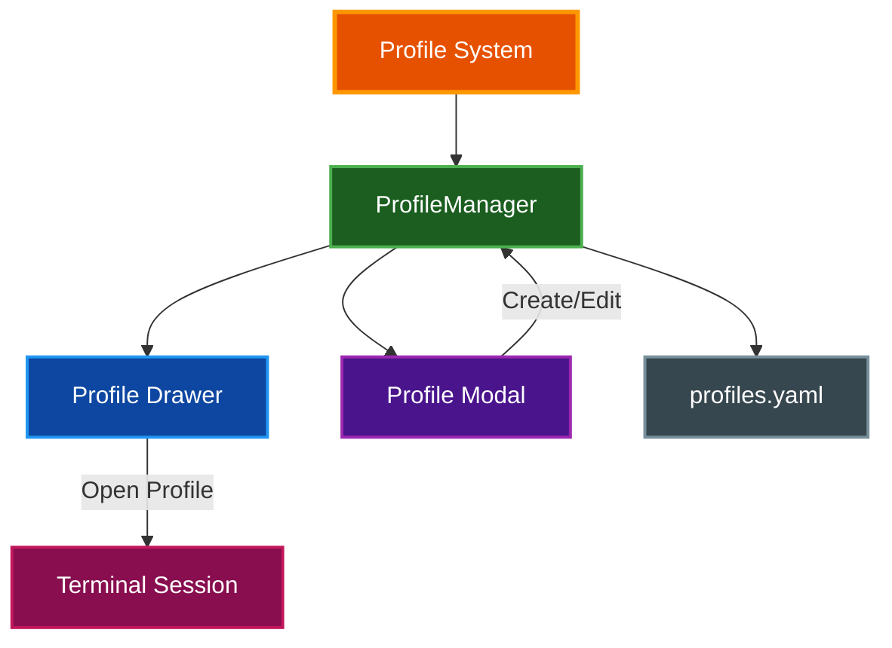
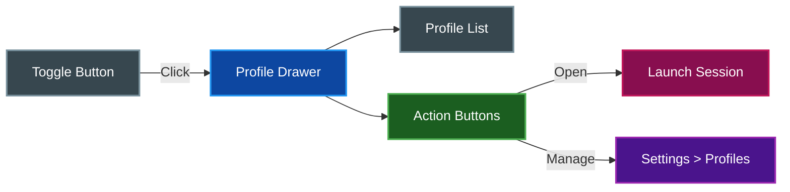
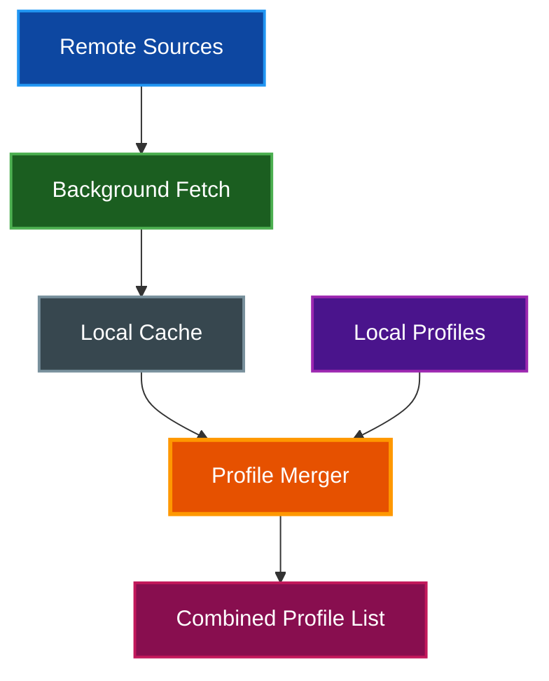

# Profiles

par-term provides a profile system for saving and quickly launching terminal sessions with custom configurations, similar to iTerm2's profile system.

## Table of Contents
- [Overview](#overview)
- [Profile Settings](#profile-settings)
- [Managing Profiles](#managing-profiles)
  - [Settings UI](#settings-ui)
  - [Profile Drawer](#profile-drawer)
- [Creating Profiles](#creating-profiles)
  - [Profile Icon Picker](#profile-icon-picker)
- [Using Profiles](#using-profiles)
- [Auto-Switching](#auto-switching)
  - [Directory-Based Profile Switching](#directory-based-profile-switching)
  - [Tmux Profile Auto-Switching](#tmux-profile-auto-switching)
  - [Hostname-Based Switching](#hostname-based-switching)
  - [Auto-Switch Priority](#auto-switch-priority)
  - [Auto-Switch Visual Application](#auto-switch-visual-application)
- [Default Startup Directory](#default-startup-directory)
- [Per-Profile Badge Configuration](#per-profile-badge-configuration)
- [Per-Pane Background Settings](#per-pane-background-settings)
  - [Available Controls](#available-controls)
  - [Darken Control](#darken-control)
  - [Real-Time Preview](#real-time-preview)
  - [Settings UI](#settings-ui-1)
- [Dynamic Profiles](#dynamic-profiles)
  - [Configuration](#configuration-1)
  - [Background Refresh](#background-refresh)
  - [Local Cache](#local-cache)
  - [Conflict Resolution](#conflict-resolution)
  - [Security](#security)
  - [Visual Indicators](#visual-indicators)
  - [Keybinding](#keybinding)
  - [Dynamic Profiles Settings UI](#dynamic-profiles-settings-ui)
- [Storage](#storage)
- [Related Documentation](#related-documentation)

## Overview

Profiles allow you to save terminal configurations for quick access:



## Profile Settings

Each profile can customize the following:

| Setting | Description | Required |
|---------|-------------|----------|
| **Name** | Display name for the profile | Yes |
| **Icon** | Nerd Font icon or custom text identifier | No |
| **Working Directory** | Initial directory for the session | No |
| **Command** | Custom command (instead of default shell) | No |
| **Command Arguments** | Arguments for the custom command | No |
| **Tab Name** | Custom name for the terminal tab | No |
| **Shell** | Specific shell for this profile (overrides global) | No |
| **Login Shell** | Override global login shell setting (None/true/false) | No |
| **SSH Host** | SSH hostname for remote connections | No |
| **SSH User** | SSH username | No |
| **SSH Port** | SSH port number | No |
| **SSH Identity File** | Path to SSH identity/key file | No |
| **SSH Extra Args** | Additional SSH command-line arguments | No |
| **Directory Patterns** | Glob patterns for CWD-based auto-switching | No |
| **Tmux Session Patterns** | Glob patterns for auto-switching (e.g., `work-*`) | No |
| **Badge Text** | Custom badge format for this profile | No |
| **Badge Appearance** | Override badge color, font, position, size | No |

## Managing Profiles

### Settings UI

Profile management is embedded in the Settings window under the **Profiles** tab. Open Settings (`F12` or `Cmd/Ctrl + ,`) and navigate to the Profiles tab.

**Profile Management Features:**
- Create, edit, delete, and reorder profiles inline
- Up/Down buttons to change profile order
- Edit (pencil) and Delete (trash) buttons per profile
- Unsaved changes indicator

The profile drawer's **Manage** button and the menu's **Manage Profiles** action both open the Settings window to the Profiles tab.

### Profile Drawer

The profile drawer provides quick access to your profiles from the right side of the window.

**Opening the Drawer:**
- Press `Cmd+Shift+P` (macOS) or `Ctrl+Shift+P` (Windows/Linux)
- Or click the toggle button on the right edge of the window

**Drawer Features:**
- Collapsible panel (220px wide when expanded, 12px when collapsed)
- Scrollable profile list with icons
- Single-click to select, double-click to open
- Indicator dots (`...`) for profiles with custom settings
- Quick action buttons: **Open** and **Manage**



## Creating Profiles

**Step-by-step:**

1. Open the profile drawer (`Cmd/Ctrl+Shift+P`)
2. Click **Manage**
3. Click **+ New Profile**
4. Fill in the profile settings:
   - **Name** (required): Give your profile a descriptive name
   - **Icon**: Add a Nerd Font icon for visual identification
   - **Working Directory**: Set the starting directory
   - **Command**: Override the default shell (optional)
   - **Arguments**: Space-separated command arguments
   - **Tab Name**: Custom tab title (optional)
5. Optionally click the icon picker button to choose a Nerd Font icon
6. Click **Save Profile**
7. Click **Save** to persist changes

### Profile Icon Picker

The profile icon field includes an icon picker popup with ~120 curated Nerd Font icons organized in 10 categories. Nerd Font icons render reliably in the egui-based settings UI and each icon shows a descriptive tooltip on hover.

| Category | Description | Example Icons |
|----------|-------------|---------------|
| Terminal | Shells and terminal emulators | Terminal, Bash, PowerShell, tmux, Prompt |
| Dev & Tools | Languages and development tools | Code, GitHub, Python, Rust, Node.js, Vim |
| Files & Data | Files, folders, and storage | File, Folder, Database, Save, Package |
| Network & Cloud | Networking and cloud services | Globe, WiFi, Cloud, Server, SSH, AWS |
| Security | Locks, keys, and access control | Lock, Shield, Key, Eye, Warning |
| Git & VCS | Version control systems | Branch, Merge, Commit, GitHub, GitLab |
| Containers & Infra | Containers and infrastructure | Docker, Kubernetes, CPU, Gear, Memory |
| OS & Platforms | Operating systems and platforms | Apple, Windows, Linux, Homebrew |
| Status & Alerts | Status indicators and signals | Check, Bolt, Rocket, Fire, Star |
| People & Misc | People and miscellaneous symbols | User, Robot, Gamepad, Music, Bookmark |

Click any icon to set it as the profile icon, or type a custom value directly in the text field. Use the "Clear icon" button to remove the current icon.

**Example Profiles:**

| Profile | Command | Working Dir | Use Case |
|---------|---------|-------------|----------|
| Development | - | `~/projects` | General development |
| SSH Server | `ssh user@server` | - | Remote connection |
| Docker Shell | `docker exec -it container bash` | - | Container access |
| Python REPL | `python3` | `~/scripts` | Interactive Python |

## Using Profiles

**Launch a Profile:**

1. Open the profile drawer (`Cmd/Ctrl+Shift+P`)
2. Double-click a profile, or
3. Select a profile and click **Open**

**What Happens:**
- A new tab opens with the profile's configuration
- Working directory is set if specified
- Custom command runs (or default shell if not specified)
- Tab name updates if specified

## Default Startup Directory

When opening a new terminal without a profile, par-term uses the configured startup directory mode.

### Startup Modes

| Mode | Description |
|------|-------------|
| `home` | Start in home directory (default) |
| `previous` | Start in last session's working directory |
| `custom` | Start in a user-specified directory |

### Configuration

```yaml
# Startup mode: "home", "previous", or "custom"
startup_directory_mode: "home"

# Custom directory (only used when mode is "custom")
startup_directory: "/path/to/directory"
```

### Settings UI

1. Press `F12` to open Settings
2. Navigate to **Terminal** → **Shell**
3. Find the **Startup Directory** section
4. Select mode and configure path if needed

### Priority

Directory selection follows this priority:

1. **Profile working directory** - If launching a profile with a directory set
2. **Legacy `working_directory`** - If set in config (for backwards compatibility)
3. **Startup directory mode** - Based on `startup_directory_mode` setting
4. **Home directory** - Fallback if configured path doesn't exist

> **📝 Note:** The `previous` mode requires shell integration to track directory changes during a session.

## Auto-Switching

par-term can automatically apply profiles based on the current working directory, tmux session name, or remote hostname. Auto-switched profiles apply all visual settings including icon, title, badge, and optional command execution.

### Directory-Based Profile Switching

Profiles can automatically apply when the terminal's working directory matches configured glob patterns.

**Configuration:**

Add `directory_patterns` to a profile:

```yaml
- id: 550e8400-e29b-41d4-a716-446655440000
  name: Work Projects
  directory_patterns:
    - "~/Repos/work-*"
    - "~/Repos/company-*"
    - "/opt/projects/*"
  icon: "🏢"
  badge_text: "WORK"
```

**Pattern Examples:**

| Pattern | Matches |
|---------|---------|
| `~/Repos/work-*` | `~/Repos/work-api`, `~/Repos/work-frontend` |
| `/opt/projects/*` | Any directory under `/opt/projects/` |
| `~/Repos/par-term*` | `~/Repos/par-term`, `~/Repos/par-term-core` |

- Patterns support `~` for home directory expansion
- CWD changes are detected via OSC 7 (requires shell integration)
- First matching profile wins (check profile order)
- Profile clears when CWD no longer matches any pattern

**Settings UI:**

1. Open Settings > Profiles
2. Edit a profile
3. Find the "Directory Patterns" field
4. Enter comma-separated glob patterns

### Tmux Profile Auto-Switching

Profiles can automatically apply when connecting to tmux sessions with matching names.

**Configuration:**

Add `tmux_session_patterns` to a profile:

```yaml
- id: 550e8400-e29b-41d4-a716-446655440000
  name: Production
  tmux_session_patterns:
    - "*-prod"
    - "*-production"
    - "prod-*"
  badge_text: "🔴 PROD"
  badge_color: [255, 0, 0]
```

**Pattern Matching:**

| Pattern | Matches |
|---------|---------|
| `dev-*` | `dev-api`, `dev-frontend`, etc. |
| `*-prod` | `api-prod`, `web-prod`, etc. |
| `*server*` | `webserver`, `api-server-1`, etc. |
| `main` | Exact match only |

- Patterns are case-insensitive
- First matching profile wins (check profile order)
- Profile clears when tmux session ends

**Settings UI:**

1. Open Settings > Profiles
2. Edit a profile
3. Find "Auto-Switch Tmux" field
4. Enter comma-separated patterns: `work-*, *-production`

### Hostname-Based Switching

Profiles automatically apply when connecting to remote hosts with matching hostnames, detected via OSC 7 and OSC 1337 RemoteHost sequences.

### Auto-Switch Priority

When multiple auto-switch mechanisms could apply, the following priority order determines which profile wins:

1. **Explicit user selection** — manual profile selection always takes precedence
2. **SSH command detection** — running `ssh` process triggers profile matching
3. **Hostname match** — remote host detection via OSC 1337
4. **Directory match** — CWD-based matching
5. **Default profile** — fallback when no pattern matches

### Auto-Switch Visual Application

When a profile is auto-applied via any switching mechanism (directory, hostname, or tmux session), the following settings are applied:

| Setting | Description |
|---------|-------------|
| **Profile icon** | Displayed in the tab bar (horizontal and vertical layouts) |
| **Tab title** | Overrides the current tab title |
| **Badge text** | Sets the badge overlay text |
| **Badge styling** | Applies badge color, alpha, font, bold, margins, size |
| **Command** | Executes the profile's command (if configured) |

The original tab title saves when an auto-profile applies and restores when the auto-profile clears.

## Per-Profile Badge Configuration

Profiles can override global badge settings for visual differentiation per environment.

### Available Overrides

| Setting | Description |
|---------|-------------|
| `badge_text` | Custom badge format string |
| `badge_color` | RGB color override |
| `badge_color_alpha` | Opacity override (0.0-1.0) |
| `badge_font` | Font family override |
| `badge_font_bold` | Bold toggle override |
| `badge_top_margin` | Position override |
| `badge_right_margin` | Position override |
| `badge_max_width` | Size constraint override |
| `badge_max_height` | Size constraint override |

### Example: Environment Indicators

```yaml
# Production profile - red badge
- name: Production
  badge_text: "🔴 PROD"
  badge_color: [255, 0, 0]
  badge_color_alpha: 0.3

# Development profile - green badge
- name: Development
  badge_text: "🟢 DEV"
  badge_color: [0, 255, 0]
  badge_color_alpha: 0.2

# Staging profile - yellow badge
- name: Staging
  badge_text: "🟡 STAGING"
  badge_color: [255, 200, 0]
```

### Settings UI

1. Open profile editor (double-click profile or click edit)
2. Expand "Badge Appearance" section
3. Check boxes to enable individual overrides
4. Configure color, font, margins, and size as needed

## Per-Pane Background Settings

When using split panes, each pane can have its own custom background image that overrides the global background. Per-pane backgrounds support independent image selection, display mode, opacity, and darkening control.

### Available Controls

| Setting | Description | Range |
|---------|-------------|-------|
| **Background Image** | Custom image path for this pane | — |
| **Display Mode** | How the image fills the pane (fit, fill, stretch, tile, center) | — |
| **Opacity** | Transparency of the background image | 0.0–1.0 |
| **Darken** | Darkens the background by reducing RGB towards black, independent of opacity | 0.0–1.0 |

### Darken Control

The darken slider (0.0–1.0) reduces the RGB values of the background image towards black while leaving opacity unchanged. This allows you to dim a bright background without affecting its transparency level:

- **0.0** — No darkening applied (full brightness)
- **0.5** — Background is 50% darkened (RGB values reduced by half)
- **1.0** — Fully darkened to black

For example, a background with `opacity: 0.8` and `darken: 0.5` will be 80% opaque and 50% darker than the original image.

### Real-Time Preview

Per-pane background settings apply instantly as values change. Adjusting the image, mode, opacity, or darken level immediately updates the preview in the terminal. No manual "Apply" button is required — changes take effect in real-time.

### Example: Production vs. Development Panes

```yaml
pane_backgrounds:
  # Left pane: production environment with dim red overlay
  - index: 0
    image: "~/images/prod-bg.png"
    mode: fill
    opacity: 0.7
    darken: 0.3

  # Right pane: development environment with bright blue overlay
  - index: 1
    image: "~/images/dev-bg.png"
    mode: fit
    opacity: 0.6
    darken: 0.0
```

### Settings UI

Access per-pane background settings in **Settings > Appearance > Background**:

1. Click on a split pane in the preview (if using split panes)
2. Configure the following for the selected pane:
   - **Image**: Browse to and select a custom background image, or leave empty to use the global background
   - **Mode**: Choose how the image fills the pane
   - **Opacity**: Adjust the transparency slider (0.0–1.0)
   - **Darken**: Adjust the darkening slider (0.0–1.0)

Changes apply immediately to the terminal without requiring manual confirmation.

## Dynamic Profiles

par-term can fetch profiles from remote URLs, enabling teams to share standardized terminal configurations. Dynamic profiles are read-only and update automatically in the background.



### Configuration

Dynamic profile sources are defined in `config.yaml` as an array:

```yaml
dynamic_profile_sources:
  - url: "https://example.com/team-profiles.yaml"
    headers:
      Authorization: "Bearer <token>"
    refresh_interval_minutes: 30
    max_size_bytes: 1048576
    conflict_resolution: "local_wins"
  - url: "https://internal.corp/devops-profiles.yaml"
    refresh_interval_minutes: 60
```

| Field | Type | Default | Description |
|-------|------|---------|-------------|
| `url` | string | (required) | URL to fetch profiles from |
| `headers` | map | `{}` | Custom HTTP headers (e.g., auth tokens) |
| `refresh_interval_minutes` | integer | `30` | How often to re-fetch the source |
| `max_size_bytes` | integer | `1048576` | Maximum response size (1 MB default) |
| `conflict_resolution` | string | `"local_wins"` | How to handle ID collisions with local profiles |

### Background Refresh

Dynamic profile sources refresh automatically on a configurable timer:

- The default refresh interval is 30 minutes
- Each source can have its own interval via `refresh_interval_minutes`
- Refresh occurs in the background without blocking the UI
- Failed fetches retain the previously cached version

### Local Cache

Fetched profiles are cached locally to provide offline access and faster startup:

**Cache location:** `~/.config/par-term/cache/dynamic_profiles/`

- Each source URL maps to a separate cache file
- The cache is populated on first fetch and updated on each successful refresh
- On startup, par-term loads from cache immediately and refreshes in the background

### Conflict Resolution

When a dynamic profile has the same ID as a local profile, the `conflict_resolution` setting determines which takes precedence:

| Mode | Description |
|------|-------------|
| `local_wins` | Local profile takes precedence (default) |
| `remote_wins` | Dynamic profile overrides the local one |

### Security

- **HTTPS enforcement**: When `headers` contain authentication tokens, par-term requires the URL to use HTTPS. HTTP URLs with auth headers are rejected at load time
- **Size limits**: The `max_size_bytes` setting prevents downloading unexpectedly large payloads

### Visual Indicators

Dynamic profiles are visually distinguished throughout the interface:

- A `[dynamic]` badge appears next to dynamic profile names in the profile modal and profile drawer
- Dynamic profiles are read-only; edit and delete controls are disabled for them
- The source URL is shown in the profile detail view

### Keybinding

Use the `reload_dynamic_profiles` action to manually trigger an immediate refresh of all dynamic profile sources:

```yaml
keybindings:
  - key: "CmdOrCtrl+Shift+F5"
    action: "reload_dynamic_profiles"
```

### Dynamic Profiles Settings UI

Dynamic profile sources can be managed in **Settings > Profiles > Dynamic Sources**:

- Add, edit, and remove remote source URLs
- Configure per-source headers, refresh interval, and size limits
- Set conflict resolution mode
- View last fetch status and timestamp per source

## Storage

Profiles are stored in YAML format:

**Location:** `~/.config/par-term/profiles.yaml`

**Format:**
```yaml
- id: 550e8400-e29b-41d4-a716-446655440000
  name: Development
  working_directory: ~/projects
  icon: "\U0001F4BB"
  order: 0
- id: 6fa459ea-ee8a-3ca4-894e-db77e160355e
  name: SSH Server
  command: ssh
  command_args:
    - user@server
  icon: "\U0001F310"
  order: 1
```

**Key Points:**
- UUIDs uniquely identify each profile
- Order field controls display sequence
- Changes save immediately when clicking **Save** in the modal

## Related Documentation

- [Keyboard Shortcuts](KEYBOARD_SHORTCUTS.md) - Profile keyboard shortcuts
- [Tabs](TABS.md) - Tab management and directory inheritance
- [SSH Host Management](SSH.md) - SSH profiles and host-based auto-switching
- [Badges](BADGES.md) - Badge system and variables
- [Integrations](INTEGRATIONS.md) - Shell integration for directory tracking
