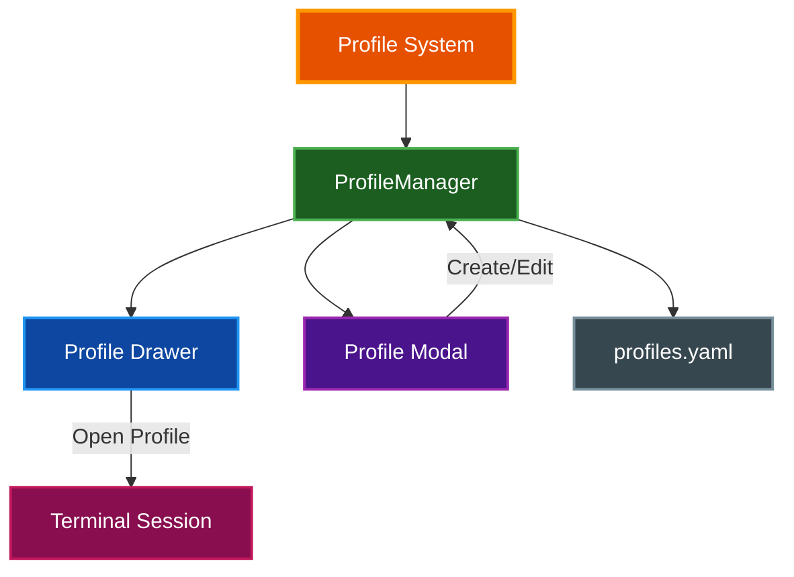
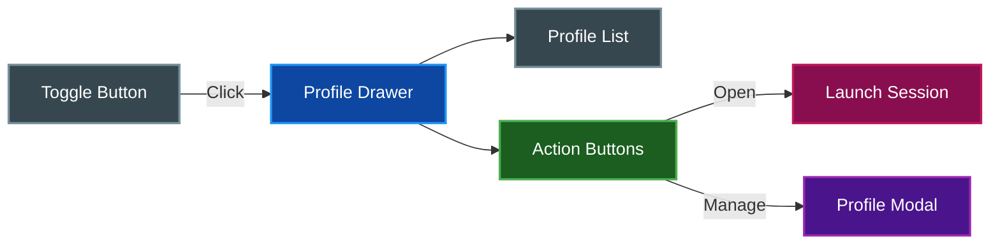

# Profiles

par-term provides a profile system for saving and quickly launching terminal sessions with custom configurations, similar to iTerm2's profile system.

## Table of Contents
- [Overview](#overview)
- [Profile Settings](#profile-settings)
- [Managing Profiles](#managing-profiles)
  - [Profile Drawer](#profile-drawer)
  - [Profile Modal](#profile-modal)
- [Creating Profiles](#creating-profiles)
- [Using Profiles](#using-profiles)
- [Storage](#storage)
- [Related Documentation](#related-documentation)

## Overview

Profiles allow you to save terminal configurations for quick access:



## Profile Settings

Each profile can customize the following:

| Setting | Description | Required |
|---------|-------------|----------|
| **Name** | Display name for the profile | Yes |
| **Icon** | Emoji or icon identifier | No |
| **Working Directory** | Initial directory for the session | No |
| **Command** | Custom command (instead of default shell) | No |
| **Command Arguments** | Arguments for the custom command | No |
| **Tab Name** | Custom name for the terminal tab | No |

## Managing Profiles

### Profile Drawer

The profile drawer provides quick access to your profiles from the right side of the window.

**Opening the Drawer:**
- Press `Cmd+Shift+P` (macOS) or `Ctrl+Shift+P` (Windows/Linux)
- Or click the toggle button on the right edge of the window

**Drawer Features:**
- Collapsible panel (220px wide when expanded, 12px when collapsed)
- Scrollable profile list with icons
- Single-click to select, double-click to open
- Indicator dots (`...`) for profiles with custom settings
- Quick action buttons: **Open** and **Manage**



### Profile Modal

The profile modal provides full CRUD (Create, Read, Update, Delete) operations.

**Opening the Modal:**
- Click **Manage** in the profile drawer
- Or use the Settings UI

**Modal Views:**

1. **List View** - Shows all profiles with:
   - Up/Down reorder buttons
   - Edit (pencil) button
   - Delete (trash) button
   - Unsaved changes indicator

2. **Edit/Create Form** - Fields for all profile settings with:
   - Name validation (required)
   - Browse button for working directory
   - Help text for optional fields

3. **Delete Confirmation** - Safety dialog before deletion

## Creating Profiles

**Step-by-step:**

1. Open the profile drawer (`Cmd/Ctrl+Shift+P`)
2. Click **Manage**
3. Click **+ New Profile**
4. Fill in the profile settings:
   - **Name** (required): Give your profile a descriptive name
   - **Icon**: Add an emoji for visual identification
   - **Working Directory**: Set the starting directory
   - **Command**: Override the default shell (optional)
   - **Arguments**: Space-separated command arguments
   - **Tab Name**: Custom tab title (optional)
5. Click **Save Profile**
6. Click **Save** to persist changes

**Example Profiles:**

| Profile | Command | Working Dir | Use Case |
|---------|---------|-------------|----------|
| Development | - | `~/projects` | General development |
| SSH Server | `ssh user@server` | - | Remote connection |
| Docker Shell | `docker exec -it container bash` | - | Container access |
| Python REPL | `python3` | `~/scripts` | Interactive Python |

## Using Profiles

**Launch a Profile:**

1. Open the profile drawer (`Cmd/Ctrl+Shift+P`)
2. Double-click a profile, or
3. Select a profile and click **Open**

**What Happens:**
- A new tab opens with the profile's configuration
- Working directory is set if specified
- Custom command runs (or default shell if not specified)
- Tab name updates if specified

## Storage

Profiles are stored in YAML format:

**Location:** `~/.config/par-term/profiles.yaml`

**Format:**
```yaml
- id: 550e8400-e29b-41d4-a716-446655440000
  name: Development
  working_directory: ~/projects
  icon: "\U0001F4BB"
  order: 0
- id: 6fa459ea-ee8a-3ca4-894e-db77e160355e
  name: SSH Server
  command: ssh
  command_args:
    - user@server
  icon: "\U0001F310"
  order: 1
```

**Key Points:**
- UUIDs uniquely identify each profile
- Order field controls display sequence
- Changes save immediately when clicking **Save** in the modal

## Related Documentation

- [README.md](../README.md) - Project overview
- [KEYBOARD_SHORTCUTS.md](KEYBOARD_SHORTCUTS.md) - Profile keyboard shortcuts
