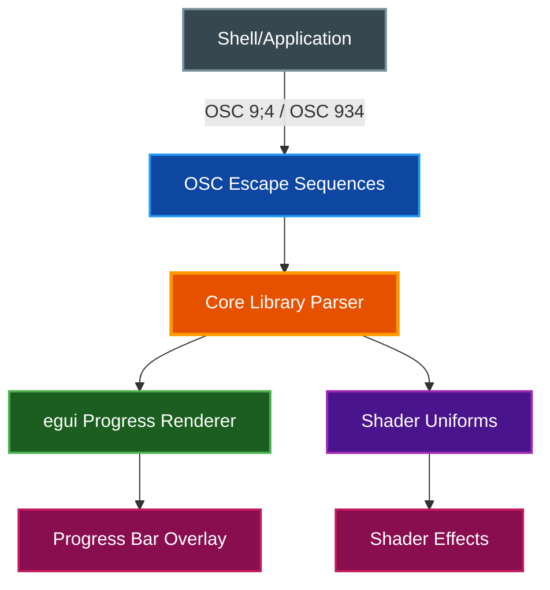

# Progress Bars

par-term renders thin overlay progress bars at the top or bottom of the terminal window, driven by standard escape sequences from running processes.

## Table of Contents
- [Overview](#overview)
- [Protocols](#protocols)
  - [OSC 9;4 (ConEmu/Windows Terminal)](#osc-94-conemuwindows-terminal)
  - [OSC 934 (Named Progress Bars)](#osc-934-named-progress-bars)
- [Configuration](#configuration)
- [Shader Integration](#shader-integration)
- [Shell Usage Examples](#shell-usage-examples)
- [Related Documentation](#related-documentation)

## Overview

Progress bars provide visual feedback for long-running operations directly in the terminal window. They render as thin overlays that do not interfere with terminal content.



## Protocols

### OSC 9;4 (ConEmu/Windows Terminal)

The standard protocol for simple progress bars. Supported states:

| State | Code | Description | Visual |
|-------|------|-------------|--------|
| **Hidden** | `0` | Remove progress bar | Bar disappears |
| **Normal** | `1` | Standard progress | Green bar |
| **Error** | `2` | Error occurred | Red bar |
| **Indeterminate** | `3` | Unknown progress | Animated oscillating bar |
| **Warning** | `4` | Warning state | Yellow bar |

**Sequence format:**

```
ESC ] 9 ; 4 ; state ; percent ST
```

**Examples:**

```bash
# Show 50% progress
printf "\033]9;4;1;50\007"

# Show error state at 75%
printf "\033]9;4;2;75\007"

# Show indeterminate (animated)
printf "\033]9;4;3;0\007"

# Hide progress bar
printf "\033]9;4;0;0\007"
```

### OSC 934 (Named Progress Bars)

Extended protocol for multiple concurrent named progress bars. Each bar is identified by a unique name and managed independently.

**Sequence format:**

```
ESC ] 934 ; name ; state ; percent ST
```

**Examples:**

```bash
# Start two concurrent progress bars
printf "\033]934;download;1;30\007"
printf "\033]934;compile;1;60\007"

# Update one
printf "\033]934;download;1;80\007"

# Mark compile as complete and hide
printf "\033]934;compile;0;100\007"
```

Multiple concurrent bars stack vertically at the configured position (top or bottom of the terminal window).

## Configuration

All progress bar settings are available in the Settings UI under the **Progress Bar** tab.

| Setting | Description | Default |
|---------|-------------|---------|
| `progress_bar_enabled` | Enable progress bar rendering | `true` |
| `progress_bar_style` | Display style: `bar` or `bar_with_text` | `bar` |
| `progress_bar_position` | Position: `top` or `bottom` | `bottom` |
| `progress_bar_height` | Bar height in pixels | `3.0` |
| `progress_bar_opacity` | Opacity (0.0-1.0) | `0.8` |
| `progress_bar_normal_color` | Color for normal state (RGB) | `[76, 175, 80]` (green) |
| `progress_bar_warning_color` | Color for warning state (RGB) | `[255, 193, 7]` (yellow) |
| `progress_bar_error_color` | Color for error state (RGB) | `[244, 67, 54]` (red) |
| `progress_bar_indeterminate_color` | Color for indeterminate state (RGB) | `[33, 150, 243]` (blue) |

**Example configuration:**

```yaml
progress_bar_enabled: true
progress_bar_style: bar_with_text
progress_bar_position: top
progress_bar_height: 4.0
progress_bar_opacity: 0.9
progress_bar_normal_color: [76, 175, 80]
progress_bar_warning_color: [255, 193, 7]
progress_bar_error_color: [244, 67, 54]
progress_bar_indeterminate_color: [33, 150, 243]
```

## Shader Integration

The `iProgress` vec4 uniform exposes progress bar state to custom GLSL shaders, enabling shader effects that react to progress:

| Component | Description | Range |
|-----------|-------------|-------|
| `iProgress.x` | State: 0=hidden, 1=normal, 2=error, 3=indeterminate, 4=warning | 0.0-4.0 |
| `iProgress.y` | Progress percentage | 0.0-1.0 |
| `iProgress.z` | Active flag (any bar visible) | 0.0 or 1.0 |
| `iProgress.w` | Active bar count | 0.0+ |

**Example shader usage:**

```glsl
void mainImage(out vec4 fragColor, in vec2 fragCoord) {
    vec2 uv = fragCoord / iResolution.xy;

    // Glow effect at screen edges during progress
    if (iProgress.z > 0.5) {
        float edge = smoothstep(0.0, 0.05, uv.x) * smoothstep(0.0, 0.05, 1.0 - uv.x);
        float glow = (1.0 - edge) * iProgress.y * 0.3;

        // Color based on state
        vec3 color = vec3(0.0, 1.0, 0.0); // normal = green
        if (iProgress.x > 1.5 && iProgress.x < 2.5) color = vec3(1.0, 0.0, 0.0); // error = red
        if (iProgress.x > 3.5) color = vec3(1.0, 0.8, 0.0); // warning = yellow

        fragColor += vec4(color * glow, glow);
    }
}
```

See [Custom Shaders Guide](CUSTOM_SHADERS.md) for complete uniform documentation.

## Shell Usage Examples

### Bash Progress Wrapper

```bash
# Function to show progress for a loop
progress_loop() {
    local total=$1
    shift
    for i in $(seq 1 "$total"); do
        printf "\033]9;4;1;%d\007" $((i * 100 / total))
        "$@"
    done
    printf "\033]9;4;0;0\007"
}

# Usage: progress_loop 10 sleep 0.5
```

### Download Progress

```bash
# Show progress during a download
printf "\033]9;4;3;0\007"  # Indeterminate while starting
curl -O https://example.com/file.tar.gz
if [ $? -eq 0 ]; then
    printf "\033]9;4;1;100\007"  # Complete
else
    printf "\033]9;4;2;0\007"    # Error
fi
sleep 1
printf "\033]9;4;0;0\007"  # Hide
```

### Named Concurrent Tasks

```bash
# Run multiple tasks with individual progress bars
printf "\033]934;lint;1;0\007"
printf "\033]934;test;1;0\007"

# Update as tasks progress
printf "\033]934;lint;1;50\007"
printf "\033]934;test;1;25\007"

# Complete
printf "\033]934;lint;0;100\007"
printf "\033]934;test;1;100\007"
printf "\033]934;test;0;100\007"
```

## Related Documentation

- [Custom Shaders Guide](CUSTOM_SHADERS.md) - `iProgress` uniform and shader development
- [Automation](AUTOMATION.md) - Triggers and coprocesses for terminal automation
- [Integrations](INTEGRATIONS.md) - Shell integration for enhanced terminal features
