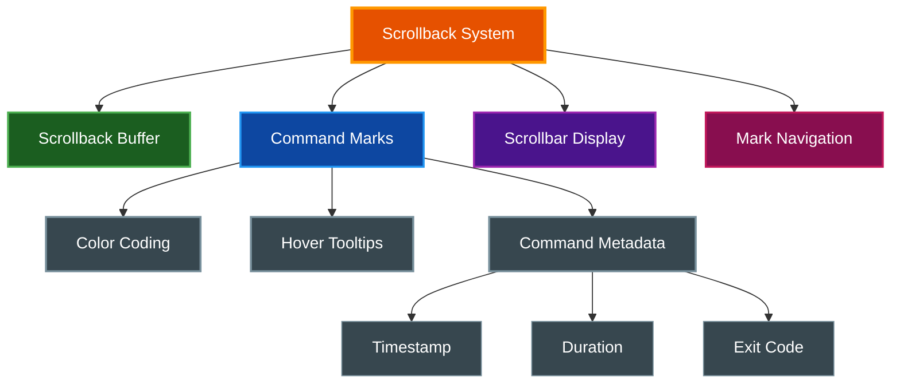

# Scrollback & Command Marks

par-term provides a comprehensive scrollback system with command markers that track shell command execution, enabling navigation between prompts and viewing command timing information.

## Table of Contents
- [Overview](#overview)
- [Scrollback Buffer](#scrollback-buffer)
- [Command Marks](#command-marks)
  - [How Marks Work](#how-marks-work)
  - [Mark Colors](#mark-colors)
  - [Mark Tooltips](#mark-tooltips)
- [Mark Navigation](#mark-navigation)
- [Scrollbar](#scrollbar)
- [Configuration](#configuration)
- [Requirements](#requirements)
- [Related Documentation](#related-documentation)

## Overview

The scrollback system combines buffer history with command tracking:



## Scrollback Buffer

The scrollback buffer stores terminal output history for scrolling and searching.

**Configuration:**

```yaml
# Number of lines to retain in scrollback
scrollback_lines: 10000
```

**Scrolling:**

| Action | Shortcut |
|--------|----------|
| Scroll up one line | Mouse wheel up |
| Scroll down one line | Mouse wheel down |
| Scroll up one page | `Page Up` |
| Scroll down one page | `Page Down` |
| Scroll to top | `Cmd+Home` (macOS) / `Ctrl+Home` |
| Scroll to bottom | `Cmd+End` (macOS) / `Ctrl+End` |

## Command Marks

Command marks are visual indicators on the scrollbar showing where commands were executed in the terminal history.

### How Marks Work

When shell integration is installed, par-term tracks:

1. **Prompt Start (OSC 133;A)** - Where each prompt begins
2. **Command Executed (OSC 133;C)** - When command execution starts
3. **Command Finished (OSC 133;D)** - When command completes with exit code

This metadata is displayed as colored marks on the scrollbar.

```mermaid
sequenceDiagram
    participant Shell
    participant Terminal
    participant Scrollbar

    Shell->>Terminal: OSC 133;A (Prompt Start)
    Note over Terminal: Record prompt line
    Shell->>Terminal: User types command
    Shell->>Terminal: OSC 133;C (Command Executed)
    Note over Terminal: Record start time
    Shell->>Terminal: Command output
    Shell->>Terminal: OSC 133;D;exit_code (Command Finished)
    Note over Terminal: Record duration & exit code
    Terminal->>Scrollbar: Update mark with color
```

### Mark Colors

Marks are color-coded based on command exit status:

| Color | Meaning | Exit Code |
|-------|---------|-----------|
| **Green** | Success | `0` |
| **Red** | Failure | Non-zero |
| **Gray** | Unknown | Not available |

### Mark Tooltips

Hover over scrollbar marks to see command details:

**Tooltip Information:**
- **Command**: The executed command text (truncated if long)
- **Time**: Execution start time (HH:MM:SS)
- **Duration**: How long the command ran
- **Exit**: Exit code

**Enabling Tooltips:**

1. Press `F12` to open Settings
2. Navigate to **Terminal** → **Scrollbar**
3. Enable "Show command markers" (if not already enabled)
4. Enable "Show tooltips on hover"

Or via configuration:

```yaml
scrollbar_command_marks: true
scrollbar_mark_tooltips: true
```

## Mark Navigation

Jump between command prompts using keyboard shortcuts:

| Action | Shortcut |
|--------|----------|
| Previous command mark | `Cmd+↑` (macOS) / `Ctrl+↑` |
| Next command mark | `Cmd+↓` (macOS) / `Ctrl+↓` |

This is useful for quickly navigating through command history in a long terminal session.

## Scrollbar

The scrollbar displays both scroll position and command marks.

**Scrollbar Settings:**

| Setting | Description | Default |
|---------|-------------|---------|
| `scrollbar_position` | `"left"` or `"right"` | `"right"` |
| `scrollbar_width` | Width in pixels | `12.0` |
| `scrollbar_autohide_delay` | Auto-hide delay in ms (0=never) | `0` |
| `scrollbar_thumb_color` | Thumb RGBA color | `[128, 128, 128, 200]` |
| `scrollbar_track_color` | Track RGBA color | `[64, 64, 64, 100]` |
| `scrollbar_command_marks` | Show command marks | `true` |
| `scrollbar_mark_tooltips` | Show tooltips on hover | `false` |

**Example Configuration:**

```yaml
scrollbar_position: "right"
scrollbar_width: 14.0
scrollbar_autohide_delay: 3000  # Hide after 3 seconds
scrollbar_command_marks: true
scrollbar_mark_tooltips: true
scrollbar_thumb_color: [150, 150, 150, 220]
scrollbar_track_color: [50, 50, 50, 80]
```

## Configuration

Complete scrollback configuration:

```yaml
# Buffer size
scrollback_lines: 10000

# Scrollbar appearance
scrollbar_position: "right"
scrollbar_width: 12.0
scrollbar_autohide_delay: 0
scrollbar_thumb_color: [128, 128, 128, 200]
scrollbar_track_color: [64, 64, 64, 100]

# Command marks (requires shell integration)
scrollbar_command_marks: true
scrollbar_mark_tooltips: true
```

## Requirements

**Command marks require shell integration to be installed.**

Without shell integration, the terminal cannot track command boundaries, timestamps, or exit codes.

To install shell integration:

1. Press `F12` to open Settings
2. Navigate to the **Integrations** tab
3. Click **Install Shell Integration**

Or via CLI:

```bash
par-term install-shell-integration
```

See [Integrations](INTEGRATIONS.md) for detailed installation instructions.

## Related Documentation

- [Integrations](INTEGRATIONS.md) - Shell integration installation
- [Keyboard Shortcuts](KEYBOARD_SHORTCUTS.md) - Navigation shortcuts
- [Search](SEARCH.md) - Search through scrollback buffer
- [Mouse Features](MOUSE_FEATURES.md) - Mouse wheel scrolling
