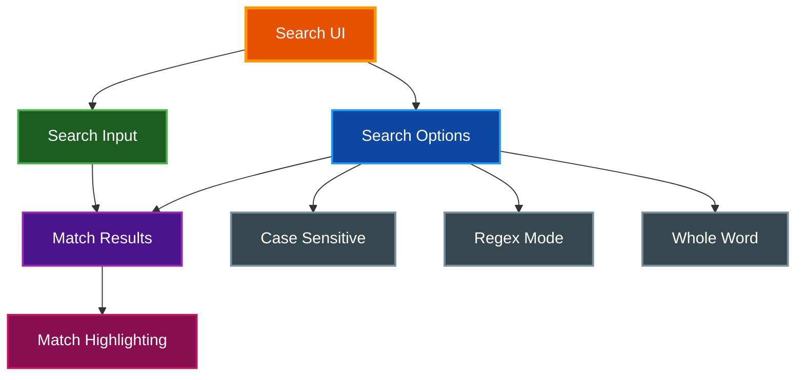

# Terminal Search

par-term includes a powerful search feature for finding text in the terminal's scrollback buffer.

## Table of Contents
- [Overview](#overview)
- [Opening Search](#opening-search)
- [Search Modes](#search-modes)
- [Navigation](#navigation)
- [Configuration](#configuration)
- [Keyboard Shortcuts](#keyboard-shortcuts)
- [Related Documentation](#related-documentation)

## Overview

The search feature provides real-time text search with multiple modes:



## Opening Search

Press `Cmd+F` (macOS) or `Ctrl+F` (Windows/Linux) to open the search bar.

**Search Bar Layout:**
```
┌─────────────────────────────────────────────────┐
│ Search: [________________________] 3 of 42  ▲ ▼ ✕│
├─────────────────────────────────────────────────┤
│ [Aa] [.*] [\b]                                  │
├─────────────────────────────────────────────────┤
│ Enter: Next | Shift+Enter: Prev | Escape: Close │
└─────────────────────────────────────────────────┘
```

## Search Modes

### Plain Text (Default)
- Finds literal string matches
- Supports substring matching
- Multiple matches per line

### Case Sensitive
Toggle with the **Aa** button.

| Mode | "Hello" matches |
|------|-----------------|
| Off (default) | "hello", "HELLO", "Hello" |
| On | "Hello" only |

### Regular Expression
Toggle with the **.\*** button.

| Pattern | Matches |
|---------|---------|
| `error\|warn` | "error" or "warn" |
| `\d{4}` | Any 4-digit number |
| `^$` | Empty lines |
| `func\w+\(` | Function calls |

**Invalid Regex:** Shows "Invalid" in match counter with error message.

### Whole Word
Toggle with the **\b** button.

| Query | Whole Word Off | Whole Word On |
|-------|----------------|---------------|
| "test" | "test", "testing", "contest" | "test" only |
| "log" | "log", "logging", "dialog" | "log" only |

## Navigation

### Match Counter
Displays current position: `3 of 42`

### Navigation Controls
- **▲ (Up Arrow)** - Previous match
- **▼ (Down Arrow)** - Next match
- **✕** - Close search

### Auto-Scroll
When navigating, the terminal automatically scrolls to center the current match on screen.

### Wrap Around
Navigation wraps from last match to first (and vice versa).

## Configuration

Add these options to `~/.config/par-term/config.yaml`:

```yaml
# Default search behavior
search_case_sensitive: false    # Case-insensitive by default
search_regex: false             # Plain text by default
search_wrap_around: true        # Wrap navigation

# Highlight colors [R, G, B, A] (0-255)
search_highlight_color: [255, 200, 0, 180]          # Yellow
search_current_highlight_color: [255, 100, 0, 220]  # Orange
```

### Settings UI Options

The Terminal tab in Settings provides:

| Option | Description |
|--------|-------------|
| **Match highlight** | Color picker for all matches |
| **Current match** | Color picker for current match |
| **Case sensitive by default** | Start searches case-sensitive |
| **Use regex by default** | Start searches in regex mode |
| **Wrap around when navigating** | Enable wrap-around navigation |

### Default Highlight Colors

| Match Type | Color | RGBA |
|------------|-------|------|
| Regular matches | Yellow | (255, 200, 0, 180) |
| Current match | Orange | (255, 100, 0, 220) |

## Keyboard Shortcuts

| Shortcut | Action |
|----------|--------|
| `Cmd/Ctrl + F` | Open search bar |
| `Enter` | Next match |
| `Shift + Enter` | Previous match |
| `Escape` | Close search bar |
| `Cmd/Ctrl + G` | Next match (global) |
| `Cmd/Ctrl + Shift + G` | Previous match (global) |

## Technical Details

### Search Scope
- Current screen content
- All scrollback buffer lines
- Multiple matches per line supported

### Performance
- 150ms debounce on query changes
- Regex patterns cached for performance
- Handles Unicode and emoji correctly
- Wide characters properly positioned

### Match Data
Each match tracks:
- Line number (absolute position in scrollback)
- Column (character position)
- Length (match length in characters)

## Related Documentation

- [Command History](COMMAND_HISTORY.md) - Fuzzy command history search (separate from terminal text search)
- [Keyboard Shortcuts](KEYBOARD_SHORTCUTS.md) - All keyboard shortcuts
- [README.md](../README.md) - Project overview
