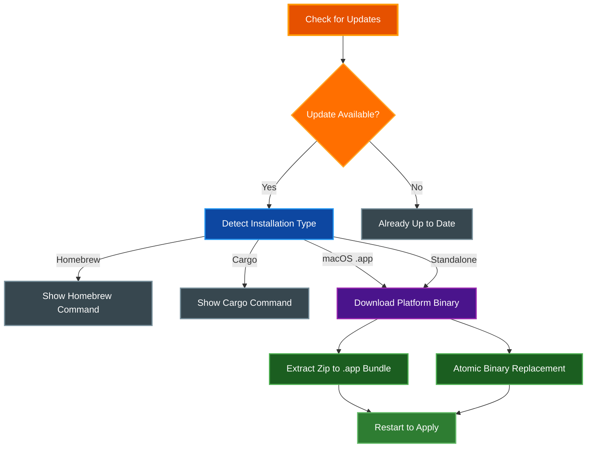

# Self-Update

par-term can check for new releases and update itself in-place, eliminating the need to manually download new versions for standalone and app bundle installations.

## Table of Contents
- [Overview](#overview)
- [Update Checking](#update-checking)
  - [Automatic Checks](#automatic-checks)
  - [Check Frequency](#check-frequency)
  - [Skip Version](#skip-version)
- [CLI Usage](#cli-usage)
- [Settings UI](#settings-ui)
- [Installation Type Detection](#installation-type-detection)
  - [Homebrew](#homebrew)
  - [Cargo Install](#cargo-install)
  - [macOS App Bundle](#macos-app-bundle)
  - [Standalone Binary](#standalone-binary)
- [Update Process](#update-process)
  - [macOS App Bundle Updates](#macos-app-bundle-updates)
  - [Linux and Windows Standalone Updates](#linux-and-windows-standalone-updates)
  - [Windows Binary Cleanup](#windows-binary-cleanup)
- [Configuration](#configuration)
- [Security Considerations](#security-considerations)
- [Troubleshooting](#troubleshooting)
- [Related Documentation](#related-documentation)

## Overview

The self-update system consists of two components that work together:

1. **Update Checker** -- Periodically queries the GitHub Releases API to determine whether a newer version is available
2. **Self-Updater** -- Downloads the appropriate platform binary and replaces the running installation in-place

The behavior depends on how par-term was installed. Managed installations (Homebrew, cargo) receive upgrade instructions instead of an in-place update, while standalone binaries and macOS app bundles are updated directly.



## Update Checking

### Automatic Checks

par-term checks for new releases automatically based on a configurable frequency. On startup, after a short delay, the update checker queries the GitHub Releases API to compare the current version against the latest published release. If a newer version is available, a desktop notification is shown.

The checker uses semantic versioning (semver) to compare versions. A version is considered newer only if its semver value is strictly greater than the current version.

### Check Frequency

Four frequency options are available:

| Frequency | Interval | Description |
|-----------|----------|-------------|
| **Never** | Disabled | No automatic checks |
| **Daily** | 24 hours | Check once per day |
| **Weekly** | 7 days | Check once per week (default) |
| **Monthly** | 30 days | Check once per month |

The checker also enforces a minimum interval of one hour between API requests to avoid rate limiting, even when checks are triggered manually.

### Skip Version

You can suppress notifications for a specific version by clicking "Skip This Version" in the update notification or by setting `skipped_version` in the configuration. The skipped version is ignored during comparisons until a newer release supersedes it.

## CLI Usage

The `self-update` subcommand checks for updates and installs them from the command line.

**Interactive mode** (prompts for confirmation):

```bash
par-term self-update
```

**Non-interactive mode** (skips confirmation prompt):

```bash
par-term self-update --yes
par-term self-update -y
```

The CLI workflow:

1. Displays the current version and detected installation type
2. For Homebrew or cargo installations, prints the appropriate upgrade command and exits
3. Queries the GitHub Releases API for the latest version
4. Compares versions using semver; exits if already up to date
5. Shows release notes (first 10 lines) and prompts for confirmation (unless `--yes`)
6. Downloads the platform-specific binary from the release assets
7. Performs platform-specific installation (see [Update Process](#update-process))
8. Reports success and advises restarting par-term

## Settings UI

The Settings window provides graphical controls for update management under **Advanced > Updates**.

**Update frequency dropdown**: Select how often par-term checks for updates (Never, Daily, Weekly, Monthly).

**Last checked timestamp**: Shows when the last update check occurred.

**Skipped version display**: If a version has been skipped, shows which version and provides a "Clear" button to resume notifications.

**Check Now button**: Triggers an immediate update check regardless of the configured frequency. The result is displayed inline:
- Green text for "You are running the latest version"
- Yellow text with version number when an update is available
- Red text if the check failed

**Install Update button**: When an update is available and the installation type supports in-place updates (macOS app bundle or standalone binary), an "Install Update" button appears. Clicking it downloads and installs the update with a progress indication. The button is disabled while installation is in progress.

For Homebrew and cargo installations, the Settings UI displays the appropriate upgrade command instead of an install button.

## Installation Type Detection

par-term automatically detects how it was installed by examining the path of the running executable. This determines whether in-place updates are possible and what update strategy to use.

| Installation Type | Path Pattern | In-Place Update |
|-------------------|-------------|-----------------|
| Homebrew | Contains `/homebrew/` or `/Cellar/` | No |
| Cargo Install | Contains `/.cargo/bin/` | No |
| macOS App Bundle | Contains `.app/Contents/MacOS/` | Yes |
| Standalone Binary | Any other path | Yes |

### Homebrew

When the executable path contains `/homebrew/` or `/Cellar/`, par-term identifies the installation as Homebrew-managed. Self-update is refused because Homebrew tracks installed packages and their versions; bypassing it would cause inconsistencies.

The CLI and Settings UI display the recommended upgrade command:

```bash
brew upgrade --cask par-term
```

### Cargo Install

When the executable path contains `/.cargo/bin/`, par-term identifies the installation as cargo-managed. Self-update is refused because cargo tracks installed crates.

The CLI and Settings UI display the recommended upgrade command:

```bash
cargo install par-term
```

### macOS App Bundle

When the executable path contains `.app/Contents/MacOS/`, par-term identifies the installation as a macOS app bundle. This type supports in-place updates by extracting a new zip archive over the existing bundle.

### Standalone Binary

Any executable path that does not match the above patterns is treated as a standalone binary. This covers Linux binaries, Windows executables, and custom installation locations. This type supports in-place updates via atomic binary replacement.

## Update Process

### macOS App Bundle Updates

The macOS release asset is a zip archive containing a complete `.app` bundle. The update process:

1. Downloads the platform-appropriate zip file (e.g., `par-term-macos-aarch64.zip` or `par-term-macos-x86_64.zip`)
2. Derives the `.app` root directory by navigating three levels up from the running binary (`Contents/MacOS/par-term` -> `.app/`)
3. Opens the downloaded zip archive and locates the top-level `.app` directory within it
4. Extracts all files from the archive into the existing `.app` bundle, overwriting existing files
5. Preserves Unix file permissions from the archive entries
6. Reports the install path and advises restarting

### Linux and Windows Standalone Updates

Standalone binary updates use an atomic replacement strategy:

1. Downloads the platform-appropriate binary (e.g., `par-term-linux-x86_64` or `par-term-windows-x86_64.exe`)
2. Writes the downloaded binary to a temporary file alongside the current executable (with `.new` extension)
3. Sets executable permissions on Unix systems (`chmod 755`)
4. Performs the replacement:
   - **Unix (Linux/macOS)**: Uses `rename()` which is atomic on the same filesystem. The running process continues using the old inode until it exits
   - **Windows**: Renames the current executable to `.old`, then renames the new binary to the original name. The old file cannot be deleted while running, so cleanup happens on the next startup

### Windows Binary Cleanup

On Windows, the running executable cannot be deleted or overwritten directly. During self-update, the current binary is renamed to `.old` and the new binary takes its place. On the next startup, par-term automatically detects and removes the leftover `.old` file. This cleanup runs early in the startup process and logs the result. On non-Windows platforms, this cleanup is a no-op.

## Configuration

The following `config.yaml` options control update behavior:

```yaml
# How often to check for updates: never, daily, weekly, monthly
update_check_frequency: weekly

# Timestamp of the last update check (managed automatically)
last_update_check: "2026-02-10T15:30:00+00:00"

# Version to skip in update notifications (e.g., "0.14.0")
skipped_version: null
```

All update settings are accessible through Settings (`F12`) under **Advanced > Updates**.

## Security Considerations

- **HTTPS only**: All communication with the GitHub API and asset downloads use HTTPS with TLS
- **GitHub API**: Release information is fetched from the official GitHub Releases API (`api.github.com`), and binaries are downloaded from GitHub's release asset URLs
- **No code execution during download**: Downloaded binaries are written to disk first and are not executed as part of the update process. The user must restart par-term to use the new version
- **Permission preservation**: On Unix systems, the new binary receives standard executable permissions (`0o755`). On macOS app bundles, Unix permissions from the zip archive entries are preserved
- **Atomic replacement on Unix**: The `rename()` system call provides atomic replacement, ensuring the binary is never in a partially-written state
- **Safe Windows replacement**: On Windows, the rename-based strategy ensures the original binary is preserved as `.old` until the new version starts successfully
- **No privilege escalation**: The update runs with the same permissions as the running process. If par-term does not have write access to its own binary, the update fails with a clear error message
- **Rate limiting**: The update checker enforces a minimum one-hour interval between API requests to avoid triggering GitHub rate limits
- **User confirmation**: In interactive mode (both CLI and Settings UI), the user must explicitly confirm before the update proceeds

## Troubleshooting

**"par-term is installed via Homebrew" error**:
par-term detected a Homebrew installation. Use `brew upgrade --cask par-term` instead.

**"par-term is installed via cargo" error**:
par-term detected a cargo installation. Use `cargo install par-term` instead.

**"Could not find par-term-<platform> in the latest release" error**:
The latest GitHub release does not contain a binary for your OS and architecture. Check the [releases page](https://github.com/paulrobello/par-term/releases) for supported platforms.

**"Failed to fetch release info" error**:
Network connectivity issue or GitHub API rate limit. Try again later or check your internet connection.

**"Failed to replace binary: Permission denied" error**:
The running process does not have write access to its installation directory. On Linux, you may need to run the update with appropriate permissions if the binary is in a system directory.

**Update installed but old version still running**:
A restart is required after every update. Close and reopen par-term to use the new version.

## Related Documentation

- [INTEGRATIONS.md](INTEGRATIONS.md) - Shell integration and shader installation
- [ARCHITECTURE.md](ARCHITECTURE.md) - System architecture overview
- [../CHANGELOG.md](../CHANGELOG.md) - Version history and release notes
- [../README.md](../README.md) - Project overview and getting started
