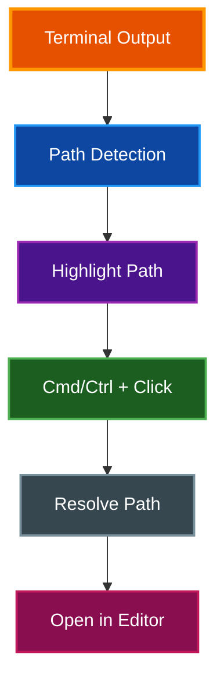

# Semantic History

Click file paths in terminal output to open them directly in your editor. Semantic history detects file paths with optional line and column numbers, letting you jump straight from compiler output, stack traces, and build logs to the relevant source code.

## Table of Contents

- [Overview](#overview)
- [How It Works](#how-it-works)
  - [Path Detection](#path-detection)
  - [Supported Path Formats](#supported-path-formats)
  - [Opening Files](#opening-files)
- [Editor Modes](#editor-modes)
  - [Environment Variable (Default)](#environment-variable-default)
  - [Custom Editor Command](#custom-editor-command)
  - [System Default](#system-default)
- [Configuration](#configuration)
- [Link Handler](#link-handler)
- [Settings UI](#settings-ui)
- [Examples](#examples)
  - [Editor Command Examples](#editor-command-examples)
  - [Common Scenarios](#common-scenarios)
- [Troubleshooting](#troubleshooting)
- [Related Documentation](#related-documentation)

## Overview



**Purpose:** Jump from terminal output directly to source code in your editor

**Key Features:**
- Detects file paths in terminal output with optional line:column numbers
- Opens files in your configured editor at the exact location
- Opens directories in your system file manager
- Resolves relative paths using the shell's current working directory
- Visual highlighting of detected paths

## How It Works

### Path Detection

Semantic history scans terminal output for file path patterns. Detected paths are highlighted in **bright cyan** with an underline to indicate they are clickable.

Paths are detected when they start with:
- `./` (current directory)
- `../` (parent directory)
- `~/` (home directory)

> **Note:** Absolute paths starting with `/` are not automatically detected to avoid false positives with command output.

### Supported Path Formats

| Format | Example | Description |
|--------|---------|-------------|
| Path only | `./src/main.rs` | Opens file at line 1 |
| Path:line | `./src/main.rs:42` | Opens file at line 42 |
| Path:line:col | `./src/main.rs:42:10` | Opens file at line 42, column 10 |
| Bracket notation | `./src/main.rs[42]` | Opens file at line 42 |
| Bracket with col | `./src/main.rs[42, 10]` | Opens file at line 42, column 10 |
| Parenthesis notation | `./src/main.rs(42)` | Opens file at line 42 |
| Parenthesis with col | `./src/main.rs(42, 10)` | Opens file at line 42, column 10 |

### Opening Files

| Platform | Action |
|----------|--------|
| macOS | `Cmd + Click` on a highlighted path |
| Windows/Linux | `Ctrl + Click` on a highlighted path |

**Path resolution:**
1. `~/` is expanded to the user's home directory
2. `./` and `../` are resolved relative to the shell's current working directory
3. The path is verified to exist before attempting to open
4. Directories open in the system file manager (Finder, Explorer, Nautilus)

## Editor Modes

Three modes control how files are opened:

### Environment Variable (Default)

Uses the `$EDITOR` or `$VISUAL` environment variable to determine the editor.

1. Checks `$EDITOR` first
2. Falls back to `$VISUAL` if `$EDITOR` is not set
3. Falls back to system default if neither is set

### Custom Editor Command

Specify a custom editor command with placeholder support:

| Placeholder | Replaced With |
|-------------|---------------|
| `{file}` | The file path |
| `{line}` | Line number (defaults to 1) |
| `{col}` | Column number (defaults to 1) |

If no `{file}` placeholder is found, the file path is appended to the command.

### System Default

Opens files with the operating system's default application for that file type. Ignores custom editor settings.

## Configuration

```yaml
# Enable/disable semantic history (default: true)
semantic_history_enabled: true

# Editor selection mode: environment_variable, custom, system_default
semantic_history_editor_mode: environment_variable

# Custom editor command (only used with "custom" mode)
# Supports {file}, {line}, {col} placeholders
semantic_history_editor: "code -g {file}:{line}"
```

## Link Handler

By default, clicking a URL in the terminal opens it in the system's default browser. The `link_handler_command` option lets you override this behavior with a custom command.

```yaml
# Custom link handler command (empty string uses system default)
link_handler_command: ""
```

The `{url}` placeholder in the command is replaced with the clicked URL at runtime.

**Examples:**

```yaml
# Open links in Firefox
link_handler_command: "firefox {url}"

# Open links in a specific Chrome profile
link_handler_command: "open -a \"Google Chrome\" {url}"

# Open links in a private browsing window
link_handler_command: "firefox --private-window {url}"
```

When `link_handler_command` is empty (the default), par-term falls back to the operating system's default browser.

**Settings UI:** Settings > Terminal > Semantic History > "Link Handler Command"

> **⚠️ Warning:** The Settings UI validates that the `{url}` placeholder is present in the command. A warning appears if the placeholder is missing, since the URL would not be passed to the handler.

## Settings UI

Semantic history is configured in **Settings > Terminal > Semantic History**:

- **Enable toggle** - Turn file path detection on or off
- **Editor mode dropdown** - Select between Environment Variable, Custom, or System Default
- **Custom editor command** - Text field for the editor command (shown only in Custom mode)

## Examples

### Editor Command Examples

```yaml
# VS Code
semantic_history_editor: "code -g {file}:{line}"

# Sublime Text
semantic_history_editor: "subl {file}:{line}"

# Vim (in terminal)
semantic_history_editor: "vim +{line} {file}"

# Neovim
semantic_history_editor: "nvim +{line} {file}"

# Emacs
semantic_history_editor: "emacs +{line} {file}"

# IntelliJ IDEA
semantic_history_editor: "idea --line {line} {file}"

# Zed
semantic_history_editor: "zed {file}:{line}"
```

### Common Scenarios

**Rust compiler output:**
```
error[E0425]: cannot find value `x` in this scope
 --> ./src/main.rs:42:10
```
Cmd/Ctrl+Click on `./src/main.rs:42:10` opens `src/main.rs` at line 42, column 10.

**Python stack trace:**
```
  File "./app/handlers.py", line 15, in process
```
Cmd/Ctrl+Click on `./app/handlers.py` opens `handlers.py` at line 15.

**Build output with relative paths:**
```
../shared/utils.rs:30: warning: unused variable
```
Cmd/Ctrl+Click on `../shared/utils.rs:30` resolves the relative path and opens at line 30.

## Troubleshooting

**Paths are not highlighted:**
- Verify `semantic_history_enabled` is `true` in config
- Only paths starting with `./`, `../`, or `~/` are detected
- Absolute paths (e.g., `/usr/local/bin/...`) are not auto-detected

**Editor doesn't open:**
- Check that the editor command is correct and the editor is in your PATH
- For custom mode, verify placeholder syntax: `{file}`, `{line}`, `{col}`
- Try `system_default` mode to verify the file can be opened at all

**Wrong file opens:**
- Relative paths are resolved from the shell's current working directory
- Ensure shell integration is installed for accurate CWD tracking

**Editor opens but wrong line:**
- Verify your editor supports the line number syntax in your command
- Some editors use `+line` (vim), others use `:line` (VS Code with `-g`)

## Related Documentation

- [Mouse Features](MOUSE_FEATURES.md) - All mouse interactions including URL clicking
- [Keyboard Shortcuts](KEYBOARD_SHORTCUTS.md) - Keyboard shortcut reference
- [Integrations](INTEGRATIONS.md) - Shell integration for CWD tracking
