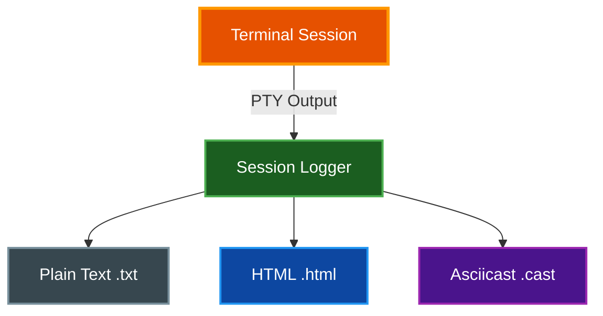

# Session Logging

par-term provides session logging to record terminal output for later review, sharing, or playback.

## Table of Contents
- [Overview](#overview)
- [Recording Formats](#recording-formats)
- [Starting a Recording](#starting-a-recording)
- [Configuration](#configuration)
- [File Locations](#file-locations)
- [Playback](#playback)
- [Related Documentation](#related-documentation)

## Overview

Session logging captures terminal output in multiple formats:



## Recording Formats

| Format | Extension | Description | Best For |
|--------|-----------|-------------|----------|
| **Plain Text** | `.txt` | Raw text, no formatting | Simple logs, grep-able output |
| **HTML** | `.html` | Styled with colors | Browser viewing, sharing |
| **Asciicast** | `.cast` | asciinema-compatible | Playback, sharing online |

### Plain Text
- Strips all ANSI escape sequences
- Captures only printable text
- Smallest file size
- No color or styling information

### HTML
- Preserves colors and styling
- Viewable directly in browsers
- Dark background with monospace font
- Includes CSS styling

### Asciicast (Default)
- asciinema v2 format
- Supports timing-accurate playback
- Records output, input, and resize events
- Can be shared on asciinema.org

## Starting a Recording

### Method 1: Hotkey Toggle

Press `Cmd+Shift+R` (macOS) or `Ctrl+Shift+R` (Windows/Linux) to toggle recording.

**Visual Feedback:**
- Toast notification: "Recording Started" or "Recording Stopped"
- Recording indicator in status area (if enabled)

### Method 2: CLI Flag

Start par-term with session logging enabled:

```bash
par-term --log-session
```

### Method 3: Auto-Logging

Enable automatic logging for all sessions in your configuration:

```yaml
# ~/.config/par-term/config.yaml
auto_log_sessions: true
```

### Method 4: Settings UI

1. Press `F12` to open Settings
2. Navigate to **Advanced** tab
3. Check **Enable automatic session logging**

## Configuration

Add these options to `~/.config/par-term/config.yaml`:

```yaml
# Enable/disable automatic logging for all sessions
auto_log_sessions: false

# Log format: plain, html, or asciicast (default)
session_log_format: asciicast

# Custom log directory (default: ~/.local/share/par-term/logs/)
session_log_directory: ~/.local/share/par-term/logs/

# Finalize log file when tab closes
archive_on_close: true
```

### Settings UI Options

The Advanced tab in Settings provides:

| Option | Description |
|--------|-------------|
| **Enable automatic session logging** | Auto-start logging for new tabs |
| **Log format** | Dropdown: Plain Text, HTML, Asciicast |
| **Log directory** | Path to log storage directory |
| **Archive session on tab close** | Ensure clean file write on close |

## File Locations

**Default Directory:** `~/.local/share/par-term/logs/`

**File Naming:** `session_YYYYMMDD_HHMMSS.{extension}`

**Example:** `session_20260202_143025.cast`

The directory is automatically created if it doesn't exist.

## Playback

### Asciicast Files

Play back `.cast` files using asciinema:

```bash
# Install asciinema
brew install asciinema  # macOS
apt install asciinema   # Debian/Ubuntu

# Play a recording
asciinema play session_20260202_143025.cast

# Play at 2x speed
asciinema play -s 2 session_20260202_143025.cast
```

**Share Online:**
```bash
asciinema upload session_20260202_143025.cast
```

### HTML Files

Open directly in any web browser:
```bash
open session_20260202_143025.html  # macOS
xdg-open session_20260202_143025.html  # Linux
```

### Plain Text Files

View with any text editor or terminal:
```bash
cat session_20260202_143025.txt
less session_20260202_143025.txt
```

## Asciicast Format Details

The `.cast` files follow the asciinema v2 specification:

**Header (first line):**
```json
{
  "version": 2,
  "width": 80,
  "height": 24,
  "timestamp": 1706902800,
  "title": "Tab 1 - 2026-02-02 14:30:25",
  "env": {
    "TERM": "xterm-256color",
    "COLS": "80",
    "ROWS": "24"
  }
}
```

**Event Lines:**
```json
[0.0, "o", "$ "]
[0.5, "i", "ls"]
[0.7, "o", "\r\n"]
[1.0, "o", "file1.txt  file2.txt\r\n"]
```

**Event Types:**
- `o` - Output (terminal -> user)
- `i` - Input (user -> terminal)
- `r` - Resize (terminal dimensions changed)
- `m` - Marker (annotation)

## Related Documentation

- [README.md](../README.md) - Project overview
- [KEYBOARD_SHORTCUTS.md](KEYBOARD_SHORTCUTS.md) - Recording hotkey
