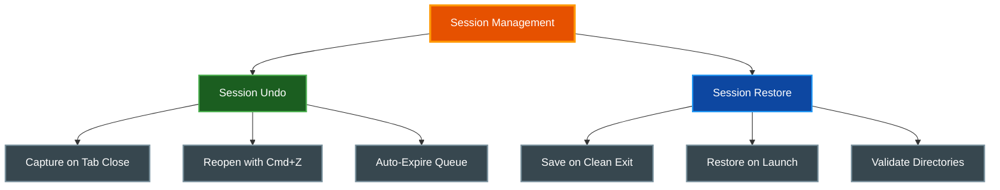

# Session Management

par-term provides session persistence features including the ability to reopen accidentally closed tabs and restore complete session state on startup.

## Table of Contents
- [Overview](#overview)
- [Session Undo — Reopen Closed Tabs](#session-undo--reopen-closed-tabs)
  - [Usage](#usage)
  - [Shell Session Preservation](#shell-session-preservation)
  - [Configuration](#configuration)
- [Session Restore on Startup](#session-restore-on-startup)
  - [What Gets Saved](#what-gets-saved)
  - [Restore Behavior](#restore-behavior)
  - [Configuration](#configuration-1)
- [Session Restore vs Window Arrangements](#session-restore-vs-window-arrangements)
- [Related Documentation](#related-documentation)

## Overview



## Session Undo — Reopen Closed Tabs

Recover accidentally closed tabs by reopening them with their original metadata.

### Usage

| Action | macOS | Linux/Windows |
|--------|-------|---------------|
| Reopen closed tab | `Cmd + Z` | `Ctrl + Shift + Z` |

When a tab closes, par-term captures its metadata (working directory, title, position, pane layout, custom color) and adds it to an undo queue. A toast notification appears showing the undo keybinding hint and a countdown timer.

**Restored tab state:**
- Original tab position in the tab bar
- Tab title and custom color
- User-set tab name (if the tab was manually renamed)
- Custom tab icon (if set via context menu)
- Working directory
- Split pane layout (if the tab had split panes)

### Shell Session Preservation

When `session_undo_preserve_shell` is enabled, closing a tab hides the shell process instead of killing it. Undoing restores the full live session including:

- Scrollback buffer content
- Running processes
- Complete pane layout

When disabled (default), undo creates a new shell session in the tab's original working directory.

Expired undo entries automatically kill hidden shell processes to prevent resource leaks.

### Configuration

```yaml
# Timeout in seconds before undo entries expire (0 = disabled)
session_undo_timeout_secs: 5

# Maximum number of undo entries in the queue
session_undo_max_entries: 10

# Preserve the shell process on tab close for full session restore
session_undo_preserve_shell: false
```

**Settings UI:** Settings > Terminal > Startup

## Session Restore on Startup

Automatically save the current session state on clean exit and restore it when par-term launches.

### What Gets Saved

- Open windows with their positions and sizes
- All tabs in each window with their working directories
- User-set tab names (`user_title`) -- when a tab has been manually renamed, the custom name is preserved and restored
- Custom tab colors -- any per-tab color set by the user is saved as an RGB value and restored
- Custom tab icons -- icons assigned via the tab context menu are persisted and restored
- Split pane trees with split ratios
- Active tab index per window

### Restore Behavior

- Session state saves automatically when par-term exits cleanly
- On next launch, the saved session restores automatically
- Working directories are validated on restore; missing directories fall back to `$HOME`
- Corrupt or missing session files result in a default window being created
- The session file clears after successful restore to prevent restoring stale state

### Configuration

```yaml
# Enable session restore on startup (default: false)
restore_session: false
```

**Settings UI:** Settings > Terminal > Startup > "Restore session on startup"

## Session Restore vs Window Arrangements

Both features restore window layouts, but they serve different purposes:

| Feature | Session Restore | Window Arrangements |
|---------|----------------|---------------------|
| **Purpose** | Resume where you left off | Named, reusable layouts |
| **Trigger** | Automatic on exit/launch | Manual save and restore |
| **Persistence** | One-time (cleared after restore) | Permanent until deleted |
| **Scope** | Entire session state | Named layout snapshots |
| **Priority** | Takes precedence when both enabled | Falls back when no session |

When both `restore_session` and `auto_restore_arrangement` are enabled, session restore takes precedence.

## Related Documentation

- [Window Management](WINDOW_MANAGEMENT.md) - Window types and arrangements
- [Arrangements](ARRANGEMENTS.md) - Named window layout management
- [Tabs](TABS.md) - Tab management
- [Keyboard Shortcuts](KEYBOARD_SHORTCUTS.md) - All keyboard shortcuts
