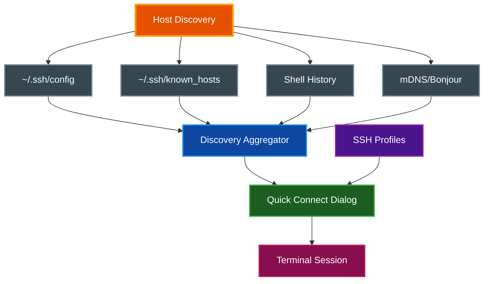

# SSH Host Management

par-term provides comprehensive SSH host management with automatic discovery, quick connect, SSH profiles, and automatic profile switching on remote connections.

## Table of Contents
- [Overview](#overview)
- [SSH Quick Connect](#ssh-quick-connect)
- [Host Discovery](#host-discovery)
  - [SSH Config](#ssh-config)
  - [Known Hosts](#known-hosts)
  - [Shell History](#shell-history)
  - [mDNS/Bonjour Discovery](#mdnsbonjour-discovery)
- [SSH Profiles](#ssh-profiles)
  - [Creating SSH Profiles](#creating-ssh-profiles)
  - [Launching SSH from Profiles](#launching-ssh-from-profiles)
- [Automatic Profile Switching](#automatic-profile-switching)
  - [Hostname-Based Switching](#hostname-based-switching)
  - [Command-Based Switching](#command-based-switching)
  - [Auto-Revert on Disconnect](#auto-revert-on-disconnect)
- [Configuration](#configuration)
- [Settings UI](#settings-ui)
- [Troubleshooting](#troubleshooting)
- [Related Documentation](#related-documentation)

## Overview

The SSH system aggregates hosts from multiple sources and provides quick access via a searchable dialog:



## SSH Quick Connect

The Quick Connect dialog provides fast access to all discovered SSH hosts.

**Opening Quick Connect:**

| Platform | Shortcut |
|----------|----------|
| macOS | `Cmd + Shift + S` |
| Linux/Windows | `Ctrl + Shift + S` |

**Features:**
- Real-time search filtering by alias, hostname, or username
- Hosts grouped by source (SSH Config, Known Hosts, History, mDNS)
- Keyboard navigation with Up/Down arrows
- Press `Enter` to connect, `Escape` to cancel

**Connection Flow:**

1. Press `Cmd+Shift+S` to open the dialog
2. Type to search and filter hosts
3. Use arrow keys to select a host
4. Press `Enter` to connect
5. The SSH command is sent to the active terminal (e.g., `ssh -p 2222 user@example.com`)
6. The SSH session begins in the current tab

## Host Discovery

par-term automatically discovers SSH hosts from four sources. Hosts are deduplicated across sources with priority: SSH Config > Known Hosts > History.

### SSH Config

**Source:** `~/.ssh/config`

Parses your SSH configuration file for host entries.

**Supported directives:**
- `Host` — Host alias (multi-host lines like `Host foo bar` create separate entries)
- `HostName` — Target hostname or IP address
- `User` — SSH username
- `Port` — SSH port number
- `IdentityFile` — Path to private key (tilde `~` expanded)
- `ProxyJump` — Bastion/jump host for tunneling

> **📝 Note:** Wildcard-only entries (e.g., `Host *` or `Host *.example.com`) are skipped since they represent defaults, not connectable targets.

### Known Hosts

**Source:** `~/.ssh/known_hosts`

Extracts hostnames from previously-connected hosts.

**Supported formats:**
- Plain hostnames: `github.com ssh-ed25519 AAAA...`
- Bracketed ports: `[myserver.example.com]:2222 ssh-rsa AAAA...`
- Comma-separated: `host1.example.com,192.168.1.1 ssh-rsa AAAA...`

> **📝 Note:** Hashed entries (lines starting with `|1|`) are skipped because the hostname cannot be extracted.

### Shell History

**Sources:**
- Bash: `~/.bash_history`
- Zsh: `~/.zsh_history`
- Fish: `~/.local/share/fish/fish_history`

Scans shell history for previous `ssh` commands and extracts connection details including user, host, port, and identity file.

### mDNS/Bonjour Discovery

Discovers SSH hosts on the local network by browsing the `_ssh._tcp.local.` service type.

**This feature is opt-in.** Enable it in Settings > SSH > mDNS/Bonjour Discovery, or in config:

```yaml
enable_mdns_discovery: true
mdns_scan_timeout_secs: 3  # Range: 1-10 seconds
```

When enabled, the Quick Connect dialog shows a spinner while scanning and displays discovered hosts in real time.

## SSH Profiles

Profiles can act as SSH bookmarks by setting SSH-specific fields.

### Creating SSH Profiles

1. Open Settings (`F12` or `Cmd/Ctrl + ,`)
2. Navigate to the **Profiles** tab
3. Click **+ New Profile**
4. Expand the **SSH Connection** section
5. Fill in the SSH fields:

| Field | Description | Example |
|-------|-------------|---------|
| **SSH Host** | Hostname or IP to connect to | `example.com` |
| **SSH User** | SSH username | `deploy` |
| **SSH Port** | Port number (blank = 22) | `2222` |
| **SSH Identity File** | Path to private key | `~/.ssh/id_work` |
| **SSH Extra Args** | Additional SSH flags | `-o StrictHostKeyChecking=no` |

6. Click **Save Profile**

> **📝 Note:** When `SSH Host` is set, opening the profile connects via SSH instead of launching a local shell.

### Launching SSH from Profiles

Profiles with `ssh_host` set can be launched in several ways:

- **Profile Drawer**: Open with `Cmd/Ctrl+Shift+P`, select the profile, click **Open**
- **New Tab Button**: Click the `▾` chevron on the tab bar and select the SSH profile
- **Quick Connect**: SSH profiles appear alongside discovered hosts

The profile builds the SSH command from its fields:

```
ssh -p 2222 -i ~/.ssh/id_work deploy@example.com
```

**Field Priority:** Profile `command` field takes precedence over SSH fields. If both `command` and `ssh_host` are set, `command` is used.

## Automatic Profile Switching

par-term can automatically switch profiles when connecting to SSH hosts, providing visual context for remote sessions.

### Hostname-Based Switching

When an SSH session is detected, par-term monitors terminal output for the remote hostname (via OSC 1337 RemoteHost sequences) and searches for a profile with matching `hostname_patterns`.

**When a match is found:**
- Profile icon appears in the tab bar
- Tab title updates to the profile's tab name
- Badge text and styling apply
- Profile command executes (if configured)

### Command-Based Switching

par-term also detects when an `ssh` process is running in the terminal and triggers profile matching based on the SSH hostname extracted from the command.

### Auto-Revert on Disconnect

When an SSH session ends, par-term automatically reverts to the previous profile:
- Tab icon, title, and badge restore to pre-SSH state
- The revert happens when the SSH process exits

This behavior is controlled by the `ssh_revert_profile_on_disconnect` config option (default: `true`).

## Configuration

```yaml
# mDNS/Bonjour discovery (opt-in)
enable_mdns_discovery: false       # default: false
mdns_scan_timeout_secs: 3          # range: 1-10, default: 3

# Automatic profile switching
ssh_auto_profile_switch: true      # default: true
ssh_revert_profile_on_disconnect: true  # default: true
```

**Profile SSH fields** (in `profiles.yaml`):

```yaml
- id: 550e8400-e29b-41d4-a716-446655440000
  name: Production Server
  icon: "🌐"
  ssh_host: prod.example.com
  ssh_user: deploy
  ssh_port: 22
  ssh_identity_file: ~/.ssh/id_prod
  ssh_extra_args: "-o ServerAliveInterval=60"
  badge_text: "🔴 PROD"
  badge_color: [255, 0, 0]
```

**Keybinding:**

```yaml
keybindings:
  - key: "CmdOrCtrl+Shift+S"
    action: "ssh_quick_connect"
```

## Settings UI

The SSH tab in Settings (`F12`) provides three sections:

**Profile Auto-Switching:**
- Toggle auto-switch on SSH connection
- Toggle revert on SSH disconnect

**mDNS/Bonjour Discovery:**
- Enable/disable mDNS host discovery
- Scan timeout slider (1-10 seconds)

**Quick Connect:**
- Shortcut reminder (`Cmd+Shift+S`)
- Info about host sources

## Troubleshooting

**Hosts not appearing in Quick Connect:**
- Verify `~/.ssh/config` exists and has valid `Host` entries (not just wildcards)
- Check that `~/.ssh/known_hosts` is readable
- For mDNS hosts, ensure `enable_mdns_discovery: true` is set and devices are on the same network

**Profile not auto-switching on SSH:**
- Ensure `ssh_auto_profile_switch: true` in config
- Verify the profile has `hostname_patterns` that match the remote hostname
- Shell integration must be installed on the remote host for OSC 1337 hostname reporting

**mDNS hosts not appearing:**
- Enable mDNS in Settings > SSH > mDNS/Bonjour Discovery
- Increase `mdns_scan_timeout_secs` for slower networks
- Ensure the remote hosts advertise `_ssh._tcp` via Bonjour/Avahi

## Related Documentation

- [Profiles](PROFILES.md) - Profile system and auto-switching
- [Integrations](INTEGRATIONS.md) - Shell integration for remote hosts
- [Keyboard Shortcuts](KEYBOARD_SHORTCUTS.md) - SSH Quick Connect shortcut
- [Tabs](TABS.md) - Tab creation and profile selection
