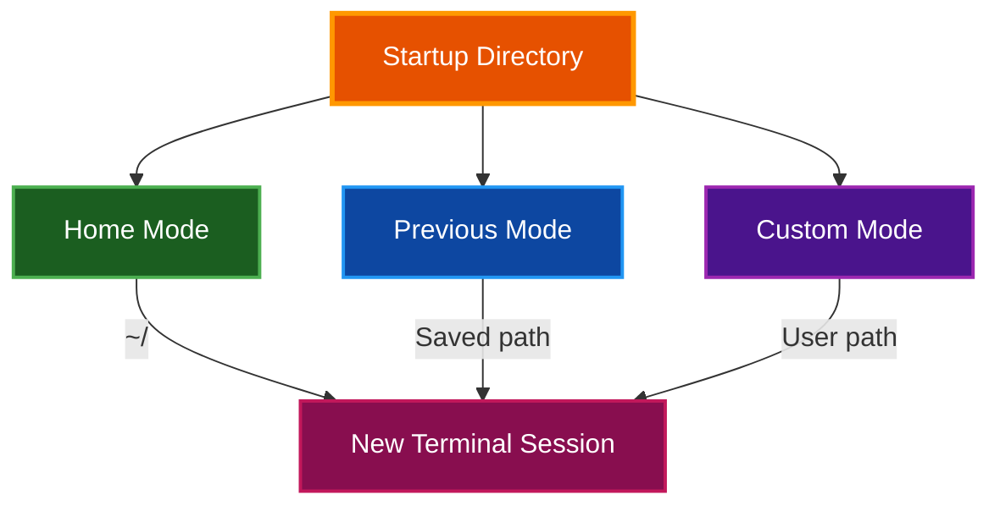
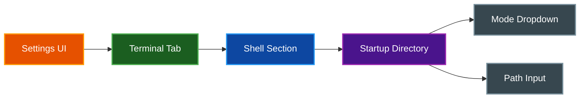

# Startup Directory

par-term provides configurable startup directory modes to control where new terminal sessions begin.

## Table of Contents
- [Overview](#overview)
- [Startup Modes](#startup-modes)
  - [Home Mode](#home-mode)
  - [Previous Mode](#previous-mode)
  - [Custom Mode](#custom-mode)
- [Configuration](#configuration)
- [Settings UI](#settings-ui)
- [Fallback Behavior](#fallback-behavior)
- [Related Documentation](#related-documentation)

## Overview

Control where new terminal sessions start:



## Startup Modes

### Home Mode

**Default mode.** New sessions start in the user's home directory.

```yaml
startup_directory_mode: "home"
```

### Previous Mode

Sessions start in the last working directory from the previous session.

**How it works:**
1. When a session closes, par-term saves the current working directory
2. The next session starts in that saved directory
3. If the saved directory no longer exists, falls back to home directory

```yaml
startup_directory_mode: "previous"
```

> **📝 Note:** This requires shell integration to track directory changes. Without it, only the initial directory is saved.

### Custom Mode

Sessions start in a user-specified directory.

```yaml
startup_directory_mode: "custom"
startup_directory: "/Users/alice/projects"
```

## Configuration

**Config File:** `~/.config/par-term/config.yaml`

```yaml
# Startup mode: "home", "previous", or "custom"
startup_directory_mode: "home"

# Custom directory (only used when mode is "custom")
startup_directory: ""

# Saved last directory (automatically managed for "previous" mode)
last_working_directory: ""
```

**Legacy Support:**

The `working_directory` setting from older versions still works and takes precedence if set:

```yaml
# Legacy setting (takes precedence over startup_directory_mode)
working_directory: "/path/to/directory"
```

## Settings UI

Configure startup directory via the Settings UI:

1. Press `F12` to open Settings
2. Navigate to **Terminal** → **Shell**
3. Find the **Startup Directory** section
4. Select mode from dropdown
5. For "Custom" mode, enter or browse for a directory path



## Fallback Behavior

If the configured startup directory doesn't exist or is inaccessible:

1. **Previous mode**: Falls back to home directory
2. **Custom mode**: Falls back to home directory
3. **Home mode**: Always uses home directory (no fallback needed)

A warning is logged when fallback occurs, but the session starts normally.

## Related Documentation

- [Profiles](PROFILES.md) - Per-profile working directories
- [Integrations](INTEGRATIONS.md) - Shell integration for directory tracking
- [Tabs](TABS.md) - New tab directory inheritance
