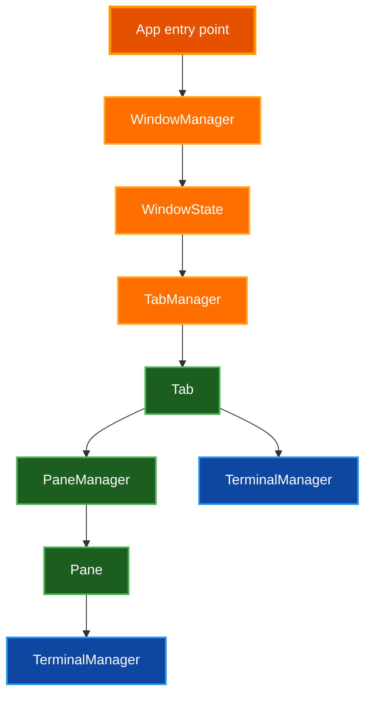
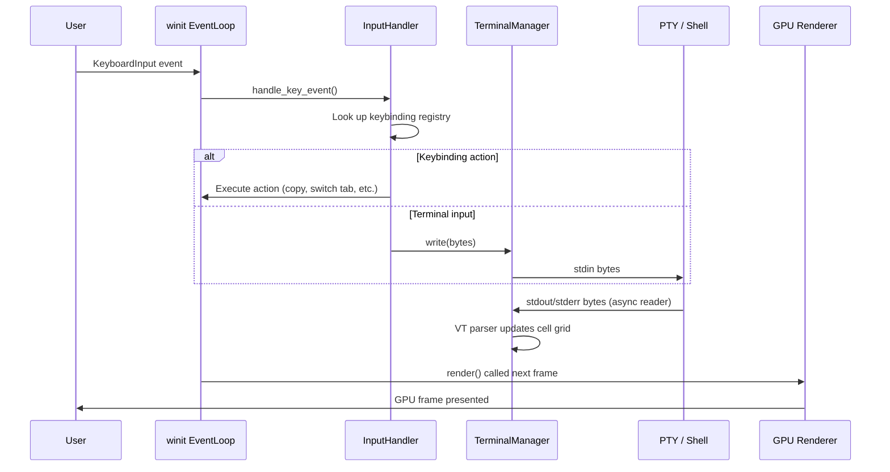
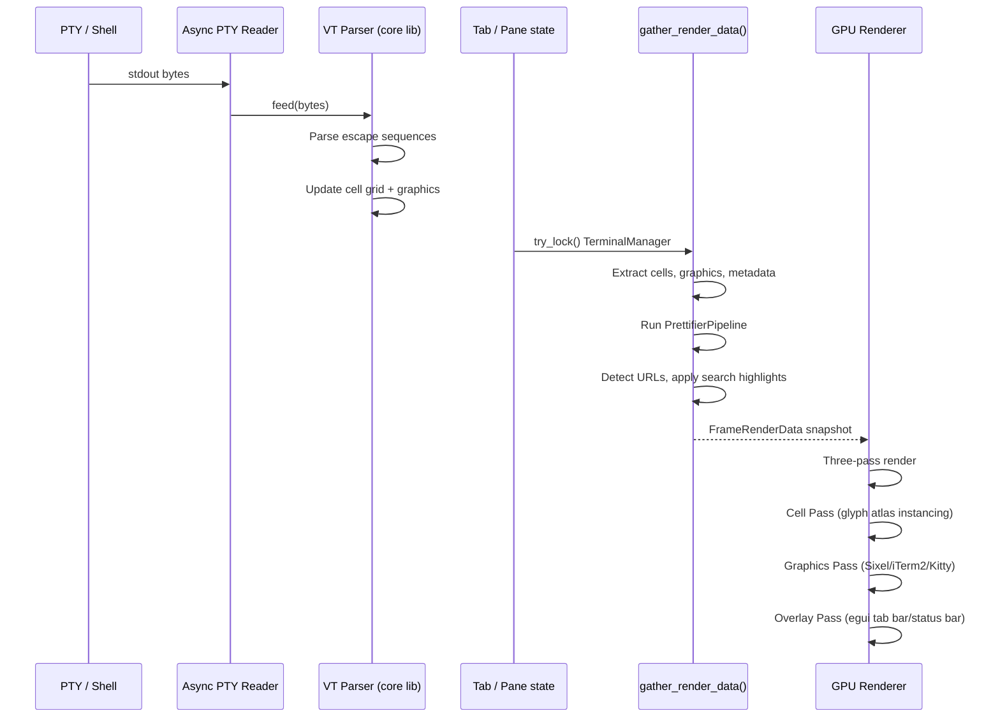

# State Lifecycle

This document describes when state objects in par-term are created, updated, and
destroyed. It covers the window, tab, and pane layers and traces the data flow from user
input through PTY processing to GPU rendering.

## Table of Contents

- [Overview](#overview)
- [State Hierarchy](#state-hierarchy)
- [Window Lifecycle](#window-lifecycle)
- [Tab Lifecycle](#tab-lifecycle)
- [Pane Lifecycle](#pane-lifecycle)
- [Data Flow: Input to Screen](#data-flow-input-to-screen)
- [Data Flow: PTY Output to Render](#data-flow-pty-output-to-render)
- [State Migration and Inheritance](#state-migration-and-inheritance)
- [Shutdown Sequence](#shutdown-sequence)
- [Related Documentation](#related-documentation)

## Overview

par-term organizes mutable state in a strict ownership hierarchy. Each layer is created
by its parent, lives as long as its parent, and is destroyed when its parent is dropped.
Only the `TerminalManager` at the leaf crosses thread boundaries and carries its own
`tokio::sync::Mutex`.

## State Hierarchy

| Type | Location | Owned by | Mutex |
|---|---|---|---|
| `WindowManager` | `src/app/window_manager.rs` | `App` | None — main thread only |
| `WindowState` | `src/app/window_state/mod.rs` | `WindowManager` | None — main thread only |
| `TabManager` | `src/tab/manager.rs` | `WindowState` | None — main thread only |
| `Tab` | `src/tab/mod.rs` | `TabManager` | None — main thread only |
| `PaneManager` | `src/pane/manager.rs` | `Tab` | None — main thread only |
| `Pane` | `src/pane/types/pane.rs` | `PaneManager` | None — main thread only |
| `TerminalManager` | `par-term-terminal` | `Tab` / `Pane` | `Arc<tokio::sync::Mutex<...>>` |

## Window Lifecycle

### Creation

A `WindowState` is created when the application starts or when a new window is opened
via the menu. Construction happens in `WindowState::new` (`src/app/window_state/impl_init.rs`):

1. Configuration is loaded from `~/.config/par-term/config.yaml`.
2. The renderer is initialized against the wgpu surface for the OS window.
3. A `TabManager` is created and the first tab is opened.
4. Input handler, keybinding registry, status bar, and tab bar UI are initialized.
5. Config file watcher and shader watcher are started.
6. ACP agents are discovered and the AI inspector is initialized.

### Updates

`WindowState` is updated every frame during the winit event loop:

- `render()` — gathers terminal data, submits GPU frame, dispatches post-render actions.
- `handle_window_event()` — processes OS keyboard, mouse, and resize events.
- `poll_config_updates()` — applies live config reloads.
- `process_agent_messages_tick()` — drains incoming ACP agent messages.

### Destruction

When the last tab in a window is closed (or the window is closed directly),
`WindowState::perform_shutdown` is called:

1. All tabs are closed via `TabManager::close_all`.
2. Session loggers are stopped.
3. The renderer is released, dropping GPU resources.
4. The OS window is destroyed.

`WindowState` implements `Drop` for fast-path cleanup when `shutdown_fast` is true,
bypassing the normal tab teardown to avoid blocking the event loop during application exit.

## Tab Lifecycle

### Creation

Tabs are created through `TabManager` via:

- **Default shell**: `Tab::new` — spawns the configured shell with optional working directory.
- **Profile**: `Tab::new_from_profile` — uses profile-specified command, shell, or SSH
  connection.

During `Tab::new`:

1. A `TerminalManager` is created with the configured column/row count and scrollback size.
2. Theme, cursor style, Unicode settings, and clipboard limits are applied from config.
3. The shell process is spawned via `terminal.spawn_custom_shell_with_dir`.
4. Configured triggers are synced into the core `TriggerRegistry`.
5. Auto-start coprocesses are started via the PTY session's built-in `CoprocessManager`.
6. A `SharedSessionLogger` is created; session logging starts immediately if `auto_log_sessions` is enabled.
7. The `PrettifierPipeline` is initialized if prettification is enabled.
8. The `TerminalManager` is wrapped in `Arc<tokio::sync::Mutex<...>>`.
9. If `initial_text` is configured, it is sent to the PTY after an optional delay via an async task.

### Activation

When a tab becomes active (user switches to it):

1. `TabManager::switch_to` updates the active tab ID.
2. The renderer's cell cache is cleared to force a full redraw.
3. The tab's `is_active` atomic flag is set, which raises the refresh task's polling rate
   from the `inactive_tab_fps` rate back to the normal frame rate.

### Refresh Loop

Each tab runs a background async task (`src/tab/refresh_task.rs`) that polls the
`TerminalManager` for new PTY output. The task uses exponential backoff (16ms → 250ms)
when idle and resets to 16ms immediately when new data arrives. Inactive tabs poll at a
reduced rate controlled by `inactive_tab_fps` in the config.

### Title Updates

Tab titles update automatically from:

- OSC 0/1/2 escape sequences emitted by the shell.
- OSC 7 (`file://` URIs) for current working directory tracking.
- SSH hostname detection from OSC sequences, which also triggers automatic profile
  switching.
- User rename via the tab bar context menu (sets `user_named = true`, which locks the
  title).

### Destruction

When a tab is closed via `TabManager::close_tab`:

1. The refresh task is aborted via `Tab::stop_refresh_task`.
2. A brief sleep allows the task to exit cleanly.
3. Session logging is stopped and the log file is finalized.
4. The `TerminalManager` is killed via `terminal.kill()`.
5. The `Tab` is removed from `TabManager`'s list and dropped.

The `Tab` `Drop` implementation handles cleanup when `shutdown_fast` is false. When
`shutdown_fast` is true (application-exit path), the Drop impl returns immediately and
cleanup is handled externally.

## Pane Lifecycle

### Creation

A `PaneManager` is created lazily on the first split operation for a tab
(`pane_manager: None` initially). The root pane wraps the tab's existing terminal.

When a split is requested:

1. A new `Pane` is created with its own `TerminalManager` (fresh PTY, own shell process).
2. The `PaneManager` adds the pane to a tree structure (`PaneNode`) for layout.
3. The split orientation (horizontal or vertical) determines the `PaneNode` variant.
4. Each `Pane` gets its own `ScrollState`, `MouseState`, `BellState`, `RenderCache`, and
   `SharedSessionLogger`.

### Focus and Bounds

The active pane within a tab is tracked by `PaneManager`. Layout bounds (`PaneBounds`)
are recalculated whenever the window is resized or a split is added or removed. Pane
bounds are stored directly on each `Pane` struct and updated by the `PaneManager`.

### Destruction

Panes are destroyed when:

- The user closes a pane explicitly (unsplit).
- The shell exits and the pane auto-closes based on config.
- The owning tab is closed (all panes are dropped with the `PaneManager`).

Each `Pane` runs the same cleanup sequence as a `Tab`: the refresh task is stopped,
session logging is finalized, and the terminal is killed.

## Data Flow: Input to Screen

This sequence describes what happens between a key press and the updated frame reaching
the display.

### Step-by-step

1. **Key event** arrives on the winit `EventLoop` (main thread).
2. **`InputHandler`** translates the OS key event into bytes using VT encoding rules.
3. If a **keybinding** matches, the action is dispatched (copy, paste, switch tab,
   open settings, etc.) before the bytes reach the PTY.
4. Otherwise, bytes are written to **`TerminalManager`** via the `write()` method, which
   forwards them to the shell's PTY stdin.
5. The shell processes the input and writes response bytes to PTY stdout.
6. The **async PTY reader task** reads those bytes and calls the core VT parser, which
   updates the in-memory cell grid, scrollback, and graphics state.
7. On the next frame, the **render pipeline** calls `gather_render_data()` which locks
   the `TerminalManager` via `try_lock()` and snapshots the current cell grid.
8. The snapshot is passed to the GPU renderer, which uploads changed cells to the glyph
   atlas and submits a wgpu command buffer.
9. The frame is presented to the display.

## Data Flow: PTY Output to Render

### Render passes

The GPU renderer executes three passes per frame:

1. **Cell Pass** — renders text cells using the glyph atlas with instanced draw calls.
   Cell backgrounds and foregrounds are separate sub-passes.
2. **Graphics Pass** — composites inline images (Sixel, iTerm2, Kitty) and prettifier
   graphics (Mermaid diagrams) as RGBA textures.
3. **Overlay Pass** — renders the egui UI: tab bar, status bar, search bar, settings
   window, and any modal dialogs.

Custom background shaders and cursor shaders are applied between the Cell Pass and the
Overlay Pass.

## State Migration and Inheritance

### New Tab Inherits CWD

When `tab_inherit_cwd` is enabled, a new tab starts in the active tab's current working
directory. The CWD is read from the OSC 7 URI stored in `Tab.detected_cwd`.

### Profile Auto-Switch

When an OSC 7 URI reveals a new hostname, `profile_tracking.rs` scans all profiles for
SSH hostname matches. If a match is found:

1. The current tab title and profile ID are saved to `pre_profile_title` and
   `pre_ssh_switch_profile`.
2. The new profile is applied to the tab (theme, title, badge override, icon).
3. On SSH disconnect (shell returns to original hostname), the pre-switch state is
   restored.

### Config Live Reload

When `~/.config/par-term/config.yaml` changes on disk, the config watcher detects the
change and publishes a `Config` update to all `WindowState` instances via an MPSC
channel. Each window applies the update without requiring a restart.

## Shutdown Sequence

When the user quits par-term (Cmd+Q / Alt+F4):

1. `WindowManager` receives the `CloseRequested` event.
2. All open windows call `perform_shutdown`.
3. Each `WindowState` closes all tabs (stopping PTY processes and session loggers).
4. The renderer releases GPU resources.
5. The Tokio runtime is shut down.
6. The process exits.

During application exit, `shutdown_fast = true` is set on all tabs and panes before
dropping them. This causes the `Drop` implementations to return immediately, deferring
actual PTY process cleanup to the OS. This avoids blocking the event loop on slow shell
teardowns during quit.

## Related Documentation

- [Architecture](ARCHITECTURE.md) — high-level component and crate structure overview
- [Concurrency Guide](CONCURRENCY.md) — mutex strategy and threading model
- [Mutex Patterns](MUTEX_PATTERNS.md) — detailed mutex usage patterns and anti-patterns
- [Session Logging](SESSION_LOGGING.md) — session log lifecycle details
- [Tabs](TABS.md) — user-facing tab management documentation
