# Status Bar

par-term provides a configurable status bar with a widget system for displaying session information, system metrics, and custom text.

## Table of Contents
- [Overview](#overview)
- [Enabling the Status Bar](#enabling-the-status-bar)
- [Built-in Widgets](#built-in-widgets)
- [Layout](#layout)
  - [Three-Section Layout](#three-section-layout)
  - [Default Widget Placement](#default-widget-placement)
- [Custom Widgets](#custom-widgets)
  - [Variable Interpolation](#variable-interpolation)
- [Auto-Hide Behavior](#auto-hide-behavior)
- [System Monitoring](#system-monitoring)
- [Git Integration](#git-integration)
- [Styling](#styling)
- [Configuration](#configuration)
- [Settings UI](#settings-ui)
- [Related Documentation](#related-documentation)

## Overview

The status bar displays contextual information at the top or bottom of the terminal window:

```mermaid
graph LR
    Left["Left Section\nUser@Host │ Directory │ Git Branch"]
    Center["Center Section\nCurrent Command"]
    Right["Right Section\nBell │ ⬆ Update │ Clock"]

    Left --- Center --- Right

    style Left fill:#1b5e20,stroke:#4caf50,stroke-width:2px,color:#ffffff
    style Center fill:#0d47a1,stroke:#2196f3,stroke-width:2px,color:#ffffff
    style Right fill:#4a148c,stroke:#9c27b0,stroke-width:2px,color:#ffffff
```



## Enabling the Status Bar

The status bar is disabled by default. Enable it in Settings or config:

```yaml
status_bar_enabled: true
```

**Settings UI:** Settings > Status Bar > General > "Enable Status Bar"

## Built-in Widgets

par-term includes 11 built-in widgets:

| Widget | Description | Default Section | Default State |
|--------|-------------|-----------------|---------------|
| **Clock** | Current time with configurable format | Right | Enabled |
| **User@Hostname** | Current user and machine name | Left | Enabled |
| **Current Directory** | Working directory of active tab | Left | Enabled |
| **Git Branch** | Branch name with ahead/behind/dirty indicators | Left | Enabled |
| **CPU Usage** | Global CPU usage percentage | Right | Disabled |
| **Memory Usage** | Used/total memory (e.g., "4.0 GB / 16.0 GB") | Right | Disabled |
| **Network Status** | Receive/transmit rates (KB/s, MB/s, GB/s) | Right | Disabled |
| **Bell Indicator** | Terminal bell count (shown when > 0) | Right | Enabled |
| **UpdateAvailable** | Yellow up-arrow with available version (e.g., "⬆ v0.20.0") | Right | Enabled |
| **Current Command** | Currently executing shell command | Center | Enabled |
| **Custom Text** | User-defined text with variable interpolation | Configurable | User-created |

### Clock

Displays the current time using a configurable strftime format string.

**Default format:** `%H:%M:%S` (24-hour time with seconds)

**Common format examples:**

| Format | Output |
|--------|--------|
| `%H:%M:%S` | `14:30:45` |
| `%I:%M %p` | `02:30 PM` |
| `%H:%M` | `14:30` |
| `%a %H:%M` | `Mon 14:30` |
| `%Y-%m-%d %H:%M` | `2026-02-13 14:30` |

**Settings UI:** Settings > Status Bar > Widget Options > "Time Format"

### Git Branch

Displays the current git branch name with optional status indicators:

- Branch name with Powerline symbol
- Ahead count (`↑3`) — commits ahead of remote
- Behind count (`↓2`) — commits behind remote
- Dirty indicator (`●`) — uncommitted changes

**Example output:** ` main ↑2 ↓1 ●`

Git status polling runs on a background thread with a configurable interval. Toggle ahead/behind/dirty display with:

```yaml
status_bar_git_show_status: true  # default: true
```

### System Widgets (CPU, Memory, Network)

System monitoring widgets are **disabled by default** to avoid unnecessary resource usage. Enable them individually in the Settings UI.

When any system widget is enabled, a background monitoring thread starts polling at the configured interval.

### UpdateAvailable

Displays a yellow up-arrow icon followed by the available version number when a newer version of par-term is detected.

**Example output:** `⬆ v0.20.0`

The widget auto-hides when no update is available, so it only appears when there is something to act on. Clicking the widget opens the update dialog overlay, which provides options to install the update or dismiss the notification.

## Layout

### Three-Section Layout

The status bar divides into three sections:

- **Left** — Left-aligned widgets, displayed in order
- **Center** — Center-aligned widgets
- **Right** — Right-aligned widgets

Widgets within each section are separated by a configurable separator character (default: ` │ `).

### Default Widget Placement

| Section | Widgets (in order) |
|---------|-------------------|
| **Left** | User@Hostname, Current Directory, Git Branch |
| **Center** | Current Command |
| **Right** | CPU (off), Memory (off), Network (off), Bell, UpdateAvailable, Clock |

Widgets can be moved between sections and reordered via the Settings UI.

## Custom Widgets

Create custom widgets with user-defined text and variable interpolation.

**Creating a Custom Widget:**

1. Open Settings > Status Bar
2. Scroll to the **Widgets** section
3. Click **+ Add Custom Text Widget**
4. Enter a format string using `\(variable)` placeholders
5. Assign to a section (Left, Center, or Right)

### Variable Interpolation

Custom widgets support these variables:

| Variable | Description | Example Output |
|----------|-------------|----------------|
| `\(session.hostname)` | Remote hostname | `prod-server` |
| `\(session.username)` | Current username | `deploy` |
| `\(session.path)` | Working directory | `/home/user/project` |
| `\(session.bell_count)` | Bell event count | `3` |
| `\(session.current_command)` | Running command | `make build` |
| `\(git.branch)` | Git branch name | `main` |
| `\(git.ahead)` | Commits ahead | `2` |
| `\(git.behind)` | Commits behind | `0` |
| `\(git.dirty)` | Dirty state | `true` |
| `\(system.cpu)` | CPU usage | `42.5` |
| `\(system.memory)` | Memory usage | `4.0 GB` |

**Example format strings:**

```
Host: \(session.hostname) CPU: \(system.cpu)%
\(git.branch) [\(session.current_command)]
```

## Auto-Hide Behavior

The status bar can automatically hide in two scenarios:

**Fullscreen Auto-Hide:**

Hide the status bar when the window enters fullscreen mode.

```yaml
status_bar_auto_hide_fullscreen: true  # default: true
```

**Mouse Inactivity Auto-Hide:**

Hide the status bar after a period of mouse inactivity. Moving the mouse makes it reappear.

```yaml
status_bar_auto_hide_mouse_inactive: false  # default: false
status_bar_mouse_inactive_timeout: 3.0      # seconds, range: 1-30
```

## System Monitoring

When CPU, Memory, or Network widgets are enabled, par-term runs a background monitoring thread.

**Polling Interval:**

```yaml
status_bar_system_poll_interval: 2.0  # seconds, range: 0.5-30.0
```

Lower values provide more responsive updates but use more CPU. The default of 2 seconds provides a good balance.

**Metrics collected:**
- **CPU**: Global usage percentage (0-100%)
- **Memory**: Used and total memory in human-readable units
- **Network**: Receive and transmit rates calculated from deltas between polls

> **📝 Note:** The first CPU and network readings after enabling show 0% as the monitor needs two samples to calculate rates.

## Git Integration

The Git Branch widget polls the active tab's working directory for git status.

**Polling Interval:**

```yaml
status_bar_git_poll_interval: 5.0  # seconds, range: 1.0-60.0
```

**Displayed Information:**
- Branch name (from `git rev-parse --abbrev-ref HEAD`)
- Ahead/behind counts (from `git rev-list`)
- Dirty indicator (from `git status`)

Toggle the extended status display:

```yaml
status_bar_git_show_status: true  # Show ahead/behind/dirty indicators
```

## Styling

Customize the status bar appearance:

```yaml
# Position
status_bar_position: bottom       # top or bottom

# Size
status_bar_height: 22.0           # pixels, range: 16-40

# Colors
status_bar_bg_color: [30, 30, 30]    # RGB background
status_bar_bg_alpha: 0.95            # opacity, 0.0-1.0
status_bar_fg_color: [200, 200, 200] # RGB text color

# Font
status_bar_font: ""               # empty = use terminal font
status_bar_font_size: 12.0        # points, range: 8-24

# Separator between widgets
status_bar_separator: " │ "
```

## Configuration

Complete status bar configuration reference:

```yaml
# General
status_bar_enabled: false
status_bar_position: bottom     # top, bottom
status_bar_height: 22.0         # 16.0-40.0 px

# Styling
status_bar_bg_color: [30, 30, 30]
status_bar_bg_alpha: 0.95
status_bar_fg_color: [200, 200, 200]
status_bar_font: ""
status_bar_font_size: 12.0
status_bar_separator: " │ "

# Auto-hide
status_bar_auto_hide_fullscreen: true
status_bar_auto_hide_mouse_inactive: false
status_bar_mouse_inactive_timeout: 3.0   # 1.0-30.0 sec

# Data
status_bar_time_format: "%H:%M:%S"
status_bar_git_show_status: true
status_bar_system_poll_interval: 2.0     # 0.5-30.0 sec
status_bar_git_poll_interval: 5.0        # 1.0-60.0 sec

# Widgets (array of widget configurations)
status_bar_widgets:
  - id: UserHost
    enabled: true
    section: left
    order: 0
  - id: Directory
    enabled: true
    section: left
    order: 1
  - id: GitBranch
    enabled: true
    section: left
    order: 2
  - id: CurrentCommand
    enabled: true
    section: center
    order: 0
  - id: Bell
    enabled: true
    section: right
    order: 3
  - id: UpdateAvailable
    enabled: true
    section: right
    order: 4
  - id: Clock
    enabled: true
    section: right
    order: 5
```

## Settings UI

The Status Bar tab in Settings (`F12`) provides six sections:

**General:**
- Enable/disable toggle
- Position dropdown (Top/Bottom)
- Height slider

**Styling:**
- Background color picker and opacity slider
- Text color picker
- Font size slider
- Separator text input

**Auto-Hide:**
- Fullscreen auto-hide toggle
- Mouse inactivity auto-hide toggle with timeout slider

**Widget Options:**
- Time format input with expandable reference table
- Git status display toggle

**Poll Intervals:**
- System monitor interval slider
- Git branch interval slider

**Widgets:**
- Three-column layout showing Left, Center, and Right sections
- Click widgets to toggle enabled/disabled
- Right-click context menu for moving widgets between sections and reordering
- "Add Custom Text Widget" button for creating custom widgets with format strings

## Related Documentation

- [Window Management](WINDOW_MANAGEMENT.md) - Status bar positioning in the window layout
- [Profiles](PROFILES.md) - Session variables used by widgets
- [Keyboard Shortcuts](KEYBOARD_SHORTCUTS.md) - Complete shortcut reference
