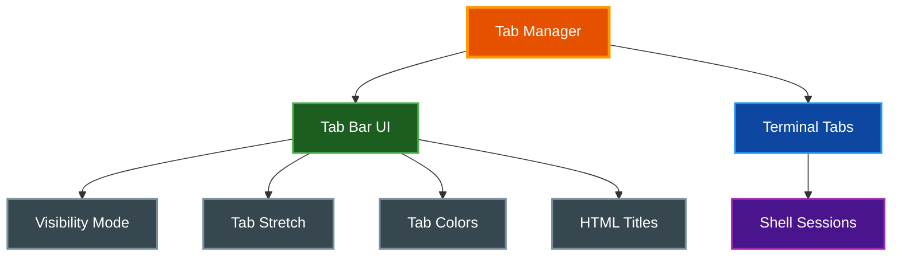

# Tabs

par-term provides a multi-tab interface for managing multiple terminal sessions within a single window.

## Table of Contents
- [Overview](#overview)
- [Creating and Closing Tabs](#creating-and-closing-tabs)
- [Switching Tabs](#switching-tabs)
- [Reordering Tabs](#reordering-tabs)
  - [Drag-and-Drop Reordering](#drag-and-drop-reordering)
  - [Keyboard Reordering](#keyboard-reordering)
- [Tab Bar](#tab-bar)
  - [Visibility Modes](#visibility-modes)
  - [Tab Stretch](#tab-stretch)
  - [HTML Titles](#html-titles)
- [Tab Appearance](#tab-appearance)
- [Configuration](#configuration)
- [Related Documentation](#related-documentation)

## Overview

The tab system manages multiple terminal sessions:



## Creating and Closing Tabs

| Action | Shortcut |
|--------|----------|
| New tab | `Cmd+T` (macOS) / `Ctrl+T` |
| Close tab | `Cmd+W` (macOS) / `Ctrl+W` |
| Close window | `Cmd+Shift+W` (macOS) / `Ctrl+Shift+W` |

New tabs inherit the working directory from the current tab (if shell integration is installed) or start in the configured startup directory.

## Switching Tabs

| Action | Shortcut |
|--------|----------|
| Next tab | `Cmd+Shift+]` or `Ctrl+Tab` |
| Previous tab | `Cmd+Shift+[` or `Ctrl+Shift+Tab` |
| Go to tab 1-9 | `Cmd+1` through `Cmd+9` (macOS) / `Ctrl+1` through `Ctrl+9` |
| Go to last tab | `Cmd+9` (macOS) / `Ctrl+9` |

## Reordering Tabs

Tabs can be reordered using drag-and-drop or keyboard shortcuts. Tab numbers update automatically after reordering to reflect the new positions.

### Drag-and-Drop Reordering

Click and drag any tab in the tab bar to move it to a new position:

1. **Press and hold** the mouse button on a tab to begin dragging
2. **Drag the tab** left or right to the desired position
3. **Release the mouse button** to drop the tab into place

**Visual Feedback:**
- A floating ghost tab follows the cursor during the drag with a semi-transparent preview of the tab being moved
- A blue insertion indicator line with a glow effect marks the drop target between tabs
- The dragged tab dims in its original position to indicate it is being moved

**Behavior Notes:**
- Press `Escape` to cancel a drag operation and return the tab to its original position
- Drag initiation is suppressed when only one tab exists in the window
- Dropping a tab on its original position has no effect

### Keyboard Reordering

| Action | Shortcut |
|--------|----------|
| Move tab left | `Cmd+Shift+Left` (macOS) / `Ctrl+Shift+Left` |
| Move tab right | `Cmd+Shift+Right` (macOS) / `Ctrl+Shift+Right` |

## Tab Bar

### Visibility Modes

Control when the tab bar appears:

| Mode | Description |
|------|-------------|
| `always` | Tab bar always visible |
| `when_multiple` | Show only when 2+ tabs exist (default) |
| `never` | Tab bar never shown |

```yaml
tab_bar_visibility: "when_multiple"
```

### Tab Stretch

By default, tabs stretch to fill the available tab bar width while respecting minimum width constraints.

**Behavior:**
- Tabs expand equally to fill the bar
- Each tab respects the `tab_min_width` setting
- When too many tabs exist, they compress to minimum width

```yaml
# Enable/disable tab stretching (default: true)
tab_stretch_to_fill: true

# Minimum tab width in pixels
tab_min_width: 100.0
```

### HTML Titles

Tab titles support limited HTML markup for styling:

**Supported Tags:**
- `<b>` - Bold text
- `<i>` - Italic text
- `<u>` - Underlined text
- `<span style="color:...">` - Colored text

**Examples:**

```bash
# Set tab title with bold text (OSC 0 or OSC 2)
printf "\033]0;<b>Important</b> Server\007"

# Colored text
printf "\033]0;<span style=\"color:red\">Production</span>\007"

# Combined formatting
printf "\033]0;<b><span style=\"color:green\">✓</span></b> Tests Passing\007"
```

**Enabling HTML Titles:**

```yaml
tab_html_titles: true
```

> **⚠️ Note:** When `tab_html_titles` is disabled, HTML tags are stripped from titles.

## Tab Appearance

Customize the visual style of tabs:

| Setting | Description | Default |
|---------|-------------|---------|
| `tab_bar_height` | Height in pixels | `28.0` |
| `tab_bar_background` | Background RGBA | `[30, 30, 30, 255]` |
| `tab_active_color` | Active tab color | `"blue"` |
| `tab_inactive_color` | Inactive tab color | `"gray"` |
| `tab_min_width` | Minimum tab width | `100.0` |
| `tab_max_tabs` | Maximum tabs allowed | `20` |

**Available Tab Colors:**

`red`, `orange`, `yellow`, `green`, `blue`, `purple`, `pink`, `teal`, `gray`, `white`, `none`

**Example Configuration:**

```yaml
tab_bar_height: 32.0
tab_bar_background: [25, 25, 25, 255]
tab_active_color: "teal"
tab_inactive_color: "gray"
tab_stretch_to_fill: true
tab_min_width: 120.0
tab_html_titles: true
```

## Configuration

Complete tab configuration reference:

```yaml
# Tab bar visibility: "always", "when_multiple", "never"
tab_bar_visibility: "when_multiple"

# Tab bar appearance
tab_bar_height: 28.0
tab_bar_background: [30, 30, 30, 255]

# Tab colors
tab_active_color: "blue"
tab_inactive_color: "gray"

# Tab sizing
tab_stretch_to_fill: true
tab_min_width: 100.0
tab_max_tabs: 20

# Tab titles
tab_html_titles: true
```

## Related Documentation

- [Keyboard Shortcuts](KEYBOARD_SHORTCUTS.md) - Tab navigation shortcuts
- [Profiles](PROFILES.md) - Open profiles in new tabs
- [Window Management](WINDOW_MANAGEMENT.md) - Window and tab interaction
- [Integrations](INTEGRATIONS.md) - Shell integration for directory inheritance
