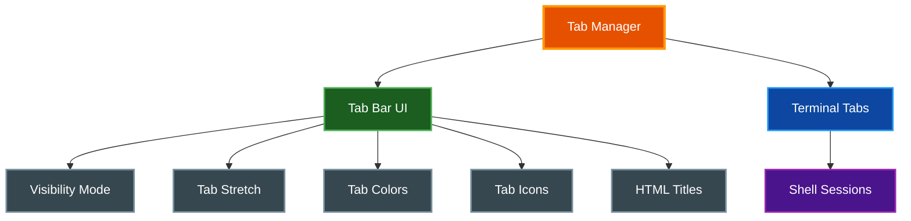
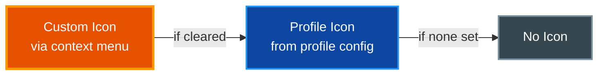
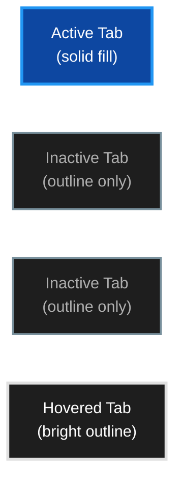

# Tabs

par-term provides a multi-tab interface for managing multiple terminal sessions within a single window.

## Table of Contents
- [Overview](#overview)
- [Creating and Closing Tabs](#creating-and-closing-tabs)
  - [Profile Selection on New Tab](#profile-selection-on-new-tab)
- [Reopening Closed Tabs](#reopening-closed-tabs)
- [Switching Tabs](#switching-tabs)
- [Reordering Tabs](#reordering-tabs)
  - [Drag-and-Drop Reordering](#drag-and-drop-reordering)
  - [Keyboard Reordering](#keyboard-reordering)
- [Duplicating Tabs](#duplicating-tabs)
- [Tab Icons](#tab-icons)
- [Tab Bar](#tab-bar)
  - [Tab Bar Position](#tab-bar-position)
  - [Visibility Modes](#visibility-modes)
  - [Tab Style Variants](#tab-style-variants)
  - [Tab Stretch](#tab-stretch)
  - [HTML Titles](#html-titles)
  - [Inactive Tab Outline-Only Mode](#inactive-tab-outline-only-mode)
- [Tab Title Mode](#tab-title-mode)
  - [Renaming Tabs](#renaming-tabs)
  - [Session Persistence for Tab Names and Colors](#session-persistence-for-tab-names-and-colors)
- [Tab Appearance](#tab-appearance)
- [Known Fixes](#known-fixes)
- [Configuration](#configuration)
- [Related Documentation](#related-documentation)

## Overview

The tab system manages multiple terminal sessions:



## Creating and Closing Tabs

| Action | Shortcut |
|--------|----------|
| New tab | `Cmd+T` (macOS) / `Ctrl+T` |
| Close tab | `Cmd+W` (macOS) / `Ctrl+W` |
| Close window | `Cmd+Shift+W` (macOS) / `Ctrl+Shift+W` |

New tabs inherit the working directory from the current tab (if shell integration is installed) or start in the configured startup directory.

### Profile Selection on New Tab

The new tab button (`+`) on the tab bar is a split button:

- **Left portion** (`+`): Creates a default tab (existing behavior)
- **Right portion** (`▾`): Opens a profile dropdown menu

The dropdown appears anchored to the top-right corner of the window and shows:
1. **Default** — creates a tab using global terminal config
2. All user profiles listed in order with their icons

Click a profile to open a new tab with that profile's settings (working directory, shell, command, tab name, etc.). Press `Escape` or click outside the dropdown to dismiss it.

> **📝 Note:** The chevron only appears when one or more profiles exist. Works in both horizontal and vertical tab bar layouts.

**Configuration:**

To make the new tab shortcut (`Cmd+T` / `Ctrl+Shift+T`) show the profile picker instead of immediately creating a default tab:

```yaml
new_tab_shortcut_shows_profiles: true  # default: false
```

**Settings UI:** Settings > Window > Tab Behavior > "New Tab Shortcut Shows Profiles"

## Reopening Closed Tabs

Accidentally closed tabs can be recovered using session undo:

| Action | macOS | Linux/Windows |
|--------|-------|---------------|
| Reopen closed tab | `Cmd + Z` | `Ctrl + Shift + Z` |

A toast notification appears after closing a tab, showing the undo keybinding and a countdown timer. Undo restores the tab at its original position with its title, custom color, and split pane layout.

For full details on session undo configuration and shell session preservation, see [Session Management](SESSION_MANAGEMENT.md).

## Switching Tabs

| Action | Shortcut |
|--------|----------|
| Next tab | `Cmd+Shift+]` or `Ctrl+Tab` |
| Previous tab | `Cmd+Shift+[` or `Ctrl+Shift+Tab` |
| Go to tab 1-9 | `Cmd+1` through `Cmd+9` (macOS) / `Ctrl+1` through `Ctrl+9` |
| Go to last tab | `Cmd+9` (macOS) / `Ctrl+9` |

## Reordering Tabs

Tabs can be reordered using drag-and-drop or keyboard shortcuts. Tab numbers update automatically after reordering to reflect the new positions.

### Drag-and-Drop Reordering

Click and drag any tab in the tab bar to move it to a new position:

1. **Press and hold** the mouse button on a tab to begin dragging
2. **Drag the tab** left or right to the desired position
3. **Release the mouse button** to drop the tab into place

**Visual Feedback:**
- A floating ghost tab follows the cursor during the drag with a semi-transparent preview of the tab being moved
- A blue insertion indicator line with a glow effect marks the drop target between tabs
- The dragged tab dims in its original position to indicate it is being moved

**Behavior Notes:**
- Press `Escape` to cancel a drag operation and return the tab to its original position
- Drag initiation is suppressed when only one tab exists in the window
- Dropping a tab on its original position has no effect

### Keyboard Reordering

| Action | Shortcut |
|--------|----------|
| Move tab left | `Cmd+Shift+Left` (macOS) / `Ctrl+Shift+Left` |
| Move tab right | `Cmd+Shift+Right` (macOS) / `Ctrl+Shift+Right` |

## Duplicating Tabs

Any tab can be duplicated via the context menu:

1. **Right-click** on any tab in the tab bar to open the context menu
2. Select **Duplicate Tab**
3. A new tab opens immediately adjacent to the source tab

**Behavior:**
- The duplicated tab inherits the working directory of the source tab
- Any custom tab color set on the source tab carries over to the new tab
- Any custom tab icon set on the source tab carries over to the new tab
- Duplication works on any tab, not just the currently active tab
- The new tab starts a fresh shell session in the inherited directory

> **📝 Note:** The duplicated tab launches a new shell process. Running commands or session state from the original tab are not carried over.

## Tab Icons

Custom icons can be assigned to individual tabs for quick visual identification.

**Setting an Icon:**

1. **Right-click** on any tab in the tab bar to open the context menu
2. Select **Set Icon**
3. Choose an icon from the Nerd Font grid, or type any character or emoji into the text field

**Clearing an Icon:**

Right-click the tab and select **Clear Icon** to remove the custom icon and revert to the profile-assigned icon (if any) or no icon.

**Icon Precedence:**



A custom icon set via the context menu takes precedence over any profile-assigned icon. When the custom icon is cleared, the tab falls back to the profile icon or displays no icon.

**Persistence:**
- Custom icons persist across session save/restore
- Custom icons are preserved in saved window arrangements (layouts)
- Custom icons carry over when duplicating a tab

## Tab Bar

### Tab Bar Position

The tab bar can be placed in three positions:

| Position | Description |
|----------|-------------|
| **Top** | Horizontal tab bar at the top of the window (default) |
| **Bottom** | Horizontal tab bar below terminal content |
| **Left** | Vertical sidebar with scrollable tab list |

The **Left** position renders a vertical sidebar with:
- Scrollable tab list with active indicator
- Drag-and-drop reordering support
- Configurable sidebar width (default 160px, range 100–300px)

```yaml
# Tab bar position: "top", "bottom", or "left"
tab_bar_position: top

# Sidebar width for left position (pixels)
tab_bar_width: 160.0
```

**Settings UI:** Settings > Window > Tab Bar > "Tab Bar Position"

Switching between positions takes effect immediately without restart.

### Visibility Modes

Control when the tab bar appears:

| Mode | Description |
|------|-------------|
| `always` | Tab bar always visible (default) |
| `when_multiple` | Show only when 2+ tabs exist |
| `never` | Tab bar never shown |

```yaml
tab_bar_mode: "always"
```

### Tab Style Variants

par-term includes 5 built-in tab style presets that apply coordinated color, size, and spacing adjustments:

| Style | Description |
|-------|-------------|
| **Dark** | Default dark theme with subtle contrast (default) |
| **Light** | Light background with darker text |
| **Compact** | Reduced height and spacing for minimal footprint |
| **Minimal** | Understated design with muted colors |
| **High Contrast** | Bold colors for maximum readability |

```yaml
# Tab style preset
tab_style: dark  # dark, light, compact, minimal, high_contrast
```

**Settings UI:** Settings > Window > Tab Bar > "Tab Style"

Each preset adjusts the tab bar background, active/inactive colors, height, and spacing as a coordinated set. Individual settings can still be overridden after selecting a preset.

### Tab Stretch

By default, tabs stretch to fill the available tab bar width while respecting minimum width constraints.

**Behavior:**
- Tabs expand equally to fill the bar
- Each tab respects the `tab_min_width` setting
- When too many tabs exist, they compress to minimum width

```yaml
# Enable/disable tab stretching (default: true)
tab_stretch_to_fill: true

# Minimum tab width in pixels
tab_min_width: 100.0
```

### HTML Titles

Tab titles support limited HTML markup for styling:

**Supported Tags:**
- `<b>` - Bold text
- `<i>` - Italic text
- `<u>` - Underlined text
- `<span style="color:...">` - Colored text

**Examples:**

```bash
# Set tab title with bold text (OSC 0 or OSC 2)
printf "\033]0;<b>Important</b> Server\007"

# Colored text
printf "\033]0;<span style=\"color:red\">Production</span>\007"

# Combined formatting
printf "\033]0;<b><span style=\"color:green\">✓</span></b> Tests Passing\007"
```

**Enabling HTML Titles:**

```yaml
tab_html_titles: true
```

> **⚠️ Note:** When `tab_html_titles` is disabled, HTML tags are stripped from titles.

### Inactive Tab Outline-Only Mode

The `tab_inactive_outline_only` option renders inactive tabs with just a border stroke and no background fill. This produces a cleaner, more minimal look where only the active tab has a solid background. Hovered inactive tabs brighten the outline for visual feedback.

```yaml
tab_inactive_outline_only: true  # default: false
```

**Settings UI:** Settings > Window > Tab Bar > "Inactive tabs outline only"



When disabled (the default), inactive tabs render with a dimmed background fill matching their assigned tab color. When enabled, inactive tabs show only the border stroke, and hovered inactive tabs increase the outline brightness instead of adding a fill.

## Tab Title Mode

Control how tab titles are automatically updated:

| Mode | Description |
|------|-------------|
| `auto` | OSC title first, then working directory from shell integration, then keep default "Tab N" (default) |
| `osc_only` | Only update from explicit OSC escape sequences; never auto-set from CWD |

```yaml
tab_title_mode: auto
```

**Settings UI:** Settings > Window > Tab Bar > "Tab title mode"

### Renaming Tabs

Right-click any tab and select **Rename Tab** to set a custom name. Manually named tabs are static — they are never auto-updated regardless of the title mode setting.

To revert a renamed tab to automatic title updates, right-click and rename with a blank name.

### Session Persistence for Tab Names and Colors

User-set tab names and custom tab colors are preserved across:

- **Session save/restore** -- closing and reopening par-term restores custom names and colors
- **Window arrangements** -- saved layouts retain per-tab names and colors
- **Tab duplication** -- duplicated tabs inherit the source tab's custom name and color

This persistence also applies to custom tab icons (see [Tab Icons](#tab-icons)).

## Tab Appearance

Customize the visual style of tabs:

| Setting | Description | Default |
|---------|-------------|---------|
| `tab_bar_height` | Height in pixels | `28.0` |
| `tab_bar_background` | Background RGBA | `[30, 30, 30, 255]` |
| `tab_active_color` | Active tab color | `"blue"` |
| `tab_inactive_color` | Inactive tab color | `"gray"` |
| `tab_min_width` | Minimum tab width | `100.0` |
| `tab_max_tabs` | Maximum tabs allowed | `20` |

**Available Tab Colors:**

`red`, `orange`, `yellow`, `green`, `blue`, `purple`, `pink`, `teal`, `gray`, `white`, `none`

**Example Configuration:**

```yaml
tab_bar_height: 32.0
tab_bar_background: [25, 25, 25, 255]
tab_active_color: "teal"
tab_inactive_color: "gray"
tab_stretch_to_fill: true
tab_min_width: 120.0
tab_html_titles: true
```

## Known Fixes

The following tab bar rendering issues have been resolved:

- **Rounded Corner Stroke Thickness** -- Tab bar rounded corners now render with consistent stroke thickness, eliminating visual artifacts at corner boundaries
- **First Tab Border Clipping** -- The leftmost tab no longer clips its left border against the tab bar edge
- **Progress Bar Overlapping Tab Bar** -- Terminal progress bars no longer visually overlap or bleed into the tab bar region
- **New Tab Button Clipped Off Right Edge** -- A width budget miscalculation caused the new-tab button (and chevron) to be clipped past the right edge of the tab bar; the layout now correctly accounts for padding in its width budget
- **Assistant Panel Overlapping Tab Bar** -- When the assistant panel was open, tab bar content could render underneath the overlay; the tab bar now reserves the assistant panel width so tabs and buttons shrink to fit
- **Rounded Tab Border Consistency** -- Tab pill draw rects are snapped to pixel boundaries with a centered stroke so rounded and straight border segments render with uniform thickness

## Configuration

Complete tab configuration reference:

```yaml
# Tab bar position: "top", "bottom", "left"
tab_bar_position: top

# Tab bar visibility: "always", "when_multiple", "never"
tab_bar_mode: "always"

# Tab title mode: "auto", "osc_only"
tab_title_mode: auto

# Tab style preset: "dark", "light", "compact", "minimal", "high_contrast"
tab_style: dark

# Tab bar appearance
tab_bar_height: 28.0
tab_bar_background: [30, 30, 30, 255]
tab_bar_width: 160.0  # Sidebar width for left position

# Tab colors
tab_active_color: "blue"
tab_inactive_color: "gray"

# Inactive tab outline-only rendering (no background fill)
tab_inactive_outline_only: false

# Tab sizing
tab_stretch_to_fill: true
tab_min_width: 100.0
tab_max_tabs: 20

# Tab titles
tab_html_titles: true

# Profile selection
new_tab_shortcut_shows_profiles: false  # Show profile picker on Cmd+T
```

## Related Documentation

- [Keyboard Shortcuts](KEYBOARD_SHORTCUTS.md) - Tab navigation shortcuts
- [Session Management](SESSION_MANAGEMENT.md) - Reopen closed tabs and session restore
- [Profiles](PROFILES.md) - Open profiles in new tabs
- [SSH Host Management](SSH.md) - SSH profile-based tab creation
- [Window Management](WINDOW_MANAGEMENT.md) - Window and tab interaction
- [Integrations](INTEGRATIONS.md) - Shell integration for directory inheritance
