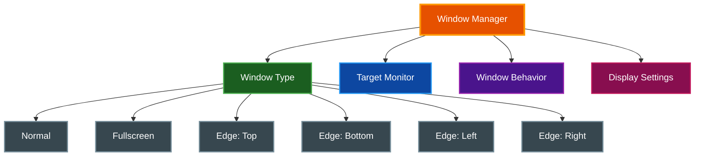

# Window Management

par-term provides extensive window management features including edge-anchored windows, multi-monitor support, and customizable behavior.

## Table of Contents
- [Overview](#overview)
- [Window Types](#window-types)
- [Multi-Monitor Support](#multi-monitor-support)
- [Window Behavior](#window-behavior)
- [Window Title](#window-title)
- [Prompt on Quit](#prompt-on-quit)
- [Pane Title Bars](#pane-title-bars)
- [Pane Divider Styles](#pane-divider-styles)
- [Window Padding](#window-padding)
- [Transparency](#transparency)
- [Fullscreen](#fullscreen)
- [Window Arrangements](#window-arrangements)
- [Session Restore on Startup](#session-restore-on-startup)
- [Status Bar](#status-bar)
- [Auto Dark Mode](#auto-dark-mode)
- [Automatic Tab Style](#automatic-tab-style)
- [macOS Target Space](#macos-target-space)
- [Configuration](#configuration)
- [Related Documentation](#related-documentation)

## Overview

Window management features in par-term:



## Window Types

| Type | Description |
|------|-------------|
| **Normal** | Standard window (default) |
| **Fullscreen** | Start in fullscreen mode |
| **EdgeTop** | Anchored to top, spans full width |
| **EdgeBottom** | Anchored to bottom, spans full width |
| **EdgeLeft** | Anchored to left, spans full height |
| **EdgeRight** | Anchored to right, spans full height |

### Edge-Anchored Windows (Quake-Style)

Edge windows provide dropdown/sidebar terminal experiences:

```
┌────────────────────────────────────┐
│         EdgeTop Window             │  ← Spans full width
│         (dropdown style)           │
└────────────────────────────────────┘

┌─────────┬──────────────────────────┐
│ EdgeLeft│                          │
│ Window  │      Desktop Area        │  ← EdgeLeft spans full height
│ (sidebar│                          │
│  style) │                          │
└─────────┴──────────────────────────┘
```

**Use Cases:**
- **EdgeTop:** Quake-style dropdown terminal
- **EdgeBottom:** Status/log terminal
- **EdgeLeft/Right:** Sidebar terminals for monitoring

Configure in `config.yaml`:
```yaml
window_type: edge_top  # normal, fullscreen, edge_top, edge_bottom, edge_left, edge_right
```

## Multi-Monitor Support

### Target Monitor

Specify which monitor windows open on:

```yaml
target_monitor: 0      # Monitor index (0 = primary)
# or
target_monitor: null   # Auto (OS decides)
```

### Settings UI

The Window tab provides:
- **Auto** checkbox for automatic monitor selection
- Slider for monitor index (0-7)

### Monitor Detection

par-term uses the system's monitor list and falls back to the primary monitor if the specified index is out of bounds.

## Window Behavior

### Always On Top

Keep the window above other windows:
```yaml
window_always_on_top: true
```

### Window Decorations

Show or hide title bar and borders:
```yaml
window_decorations: true
```

### Lock Window Size

Prevent resizing:
```yaml
lock_window_size: true
```

### Show Window Number

Display window index in title bar (useful for multiple windows):
```yaml
show_window_number: true
```

Example title: `par-term [2]`

### Maximize Vertically

Use the View menu or keybinding to maximize height while keeping current width and X position.

## Window Title

The window title updates dynamically based on terminal state:

- **Default**: Shows "par-term" or the OSC-set title from the shell
- **Running Command**: When shell integration (OSC 133;C) detects a running command, the title shows `[command_name]` — e.g., `par-term [cargo build]`
- **Window Number**: When `show_window_number` is enabled and multiple windows are open, the title includes `[N]` suffix

The command name automatically reverts when the command finishes.

```yaml
allow_title_change: true    # Let apps change title via OSC sequences
show_window_number: false   # Show [N] suffix with multiple windows
```

## Prompt on Quit

A confirmation dialog can be shown before closing the window when active terminal sessions are running:

```yaml
prompt_on_quit: true  # Show confirmation before closing (default: false)
```

**Settings UI:** Settings > Terminal > Behavior > "Confirm before quitting with open sessions"

The dialog shows the number of active sessions and requires explicit confirmation.

## Pane Title Bars

Split panes can display GPU-rendered title bars showing the pane's OSC title, current working directory path, or a fallback pane name.

```yaml
show_pane_titles: true                    # Enable pane title bars
pane_title_position: top                  # top or bottom
pane_title_color: [200, 200, 200]         # Title text color (RGB)
pane_title_bg_color: [40, 40, 40]         # Title background color (RGB)
pane_title_font: "JetBrains Mono"         # Title font family
```

**Features:**
- Titles auto-truncate with ellipsis when the pane is too narrow
- Focused pane title renders at full opacity; unfocused panes are slightly dimmed
- Configurable height (14-30px) via Settings UI

**Settings UI:** Settings > Window > Split Panes > "Show pane titles"

## Pane Divider Styles

Four visual styles for split pane dividers:

| Style | Description |
|-------|-------------|
| **Solid** | Standard single-line divider (default) |
| **Double** | Two thin parallel lines with a gap between them |
| **Dashed** | Segmented dashed line effect |
| **Shadow** | Beveled/embossed effect with highlight and shadow edges |

```yaml
pane_divider_style: solid  # solid, double, dashed, shadow
```

**Settings UI:** Settings > Window > Split Panes > "Divider Style"

> **📝 Note:** The Double style renders proper double lines when divider width >= 4px. At smaller widths, it renders a centered thin line to visually differentiate from Solid.

## Window Padding

Window padding adds space between the terminal content and the window edges.

```yaml
window_padding: 0.0  # Padding in pixels (default: 0.0)
```

Changes to window padding in the Settings UI take effect immediately without requiring an app restart. The terminal grid recalculates to fit the new padding, and pane sizes adjust accordingly.

### Hide Window Padding on Split

When panes are split, each pane maintains its own internal padding. The outer window padding becomes redundant and wastes screen space. The `hide_window_padding_on_split` option automatically sets the effective window padding to zero whenever the active tab contains multiple panes.

```yaml
hide_window_padding_on_split: true  # default: enabled
```

When the last split is closed and only a single pane remains, the configured window padding is restored.

**Settings UI:** Settings > Window > Display > "Hide padding on split"

## Transparency

### Window Opacity

```yaml
window_opacity: 0.9  # 0.1 (mostly transparent) to 1.0 (fully opaque)
```

### Selective Transparency

```yaml
# Only apply transparency to default background, not colored content
transparency_affects_only_default_background: true

# Keep text fully opaque regardless of window opacity
keep_text_opaque: true
```

### Window Blur (macOS)

```yaml
blur_enabled: true   # Enable background blur
blur_radius: 20      # Blur intensity (1-64)
```

## Fullscreen

### Toggle Fullscreen

Press `F11` or use the View menu.

### Start in Fullscreen

```yaml
window_type: fullscreen
```

### Borderless Fullscreen

Fullscreen mode uses borderless fullscreen on the current monitor.

## Window Arrangements

Save and restore complete window layouts as named arrangements. This provides iTerm2-style layout persistence for managing complex multi-window setups.

### Features

- **Save**: Capture all current window positions, sizes, tab working directories, and active tab indices as a named arrangement
- **Restore**: Recreate a saved layout, replacing all current windows with the saved configuration
- **Monitor-aware**: Window positions are stored relative to monitor origin for portability across display configurations
- **Monitor matching**: Restores windows to the correct monitor by name, with fallback to index and then primary monitor
- **Position clamping**: Ensures restored windows remain visible even if the monitor layout has changed
- **Auto-restore on startup**: Configure an arrangement to restore automatically when the app launches

### Settings UI

The Arrangements tab in Settings provides controls to save, restore, rename, delete, and reorder arrangements. Set any arrangement as the default to auto-restore on startup.

### Keybinding Support

Two keybinding actions are available for arrangements:

| Action | Description |
|--------|-------------|
| `save_arrangement` | Open the save arrangement dialog |
| `restore_arrangement:<name>` | Restore a specific arrangement by name |

Example keybinding configuration:

```yaml
keybindings:
  - key: "Ctrl+Shift+S"
    action: "save_arrangement"
  - key: "Ctrl+Shift+L"
    action: "restore_arrangement:my_layout"
```

### Menu Integration

The View menu includes a "Save Window Arrangement..." item for saving the current layout.

### Persistence

Arrangements are stored in `~/.config/par-term/arrangements.yaml`.

For full details, see [ARRANGEMENTS.md](ARRANGEMENTS.md).

## Session Restore on Startup

par-term can automatically save the current session state on clean exit and restore it when the app launches. This provides continuity across restarts without requiring named arrangements.

```yaml
# Enable session restore (default: false)
restore_session: false
```

**Settings UI:** Settings > Terminal > Startup > "Restore session on startup"

**What gets saved:** Open windows with positions and sizes, all tabs with working directories, split pane trees with ratios, and active tab indices.

**Behavior:** The session file saves on clean exit and clears after successful restore to prevent stale state. Missing directories fall back to `$HOME`. When both `restore_session` and `auto_restore_arrangement` are enabled, session restore takes precedence.

For full details on session persistence including session undo, see [Session Management](SESSION_MANAGEMENT.md).

## Status Bar

The status bar displays session and system information at the top or bottom of the window. It stacks with the tab bar when both are visible.

For full details on status bar configuration, widgets, and customization, see [Status Bar](STATUS_BAR.md).

**Quick Configuration:**

```yaml
status_bar_enabled: true
status_bar_position: bottom  # top or bottom
status_bar_auto_hide_fullscreen: true
status_bar_auto_hide_mouse: false
```

**Settings UI:** Settings > Status Bar

## Auto Dark Mode

par-term can automatically switch between light and dark themes based on the operating system's appearance setting.

**How it works:**
1. On startup, par-term detects the current system theme (light or dark)
2. While running, it monitors for OS theme change events
3. When the system theme changes, par-term applies the corresponding theme automatically

```yaml
# Enable automatic theme switching (default: false)
auto_dark_mode: false

# Theme to use when system is in light mode
light_theme: "Solarized Light"

# Theme to use when system is in dark mode
dark_theme: "par-dark"
```

**Settings UI:** Settings > Appearance > "Auto Dark Mode"

When `auto_dark_mode` is enabled, the `light_theme` and `dark_theme` dropdowns appear for selecting the theme to use in each mode. When disabled, the global `theme` setting controls the active theme.

## Automatic Tab Style

The tab bar style can automatically switch along with the system theme when auto dark mode is active.

```yaml
# Tab style preset: "dark", "light", "compact", "minimal", "high_contrast", "automatic"
tab_style: automatic

# Tab style to use when system is in light mode
light_tab_style: light

# Tab style to use when system is in dark mode
dark_tab_style: dark
```

When `tab_style` is set to `"automatic"`, par-term uses `light_tab_style` when the OS is in light mode and `dark_tab_style` when the OS is in dark mode. This pairs with [Auto Dark Mode](#auto-dark-mode) for a fully theme-aware interface.

**Settings UI:** Settings > Window > Tab Bar > "Tab Style" (select "Automatic" from the dropdown)

## macOS Target Space

On macOS, par-term can open windows in a specific Mission Control Space (virtual desktop).

```yaml
# Target macOS Space for new windows (1-16, or null for default behavior)
target_space: null
```

**Behavior:**
- Set `target_space` to a number between 1 and 16 to assign new windows to that Space
- Set to `null` (default) to let macOS place windows according to its standard rules
- If the specified Space is unavailable (e.g., fewer Spaces configured than the target), par-term falls back gracefully to the current Space

**Settings UI:** Settings > Window > Window Behavior (macOS only)

> **📝 Note:** This setting only appears on macOS. It has no effect on Linux or Windows.

## Configuration

### Complete Window Settings

```yaml
# Window type
window_type: normal  # normal, fullscreen, edge_top, edge_bottom, edge_left, edge_right

# Monitor selection
target_monitor: null  # null for auto, or monitor index (0-7)

# Window behavior
window_decorations: true
window_always_on_top: false
lock_window_size: false
show_window_number: false

# Display
window_opacity: 1.0
transparency_affects_only_default_background: true
keep_text_opaque: true
window_padding: 0.0  # Padding in pixels
hide_window_padding_on_split: true  # Remove window padding when panes are split

# macOS blur
blur_enabled: false
blur_radius: 20

# Initial size
cols: 80
rows: 24
```

### Settings UI

The Window tab in Settings provides sections for:

**Display:**
- Window title
- Columns and rows
- Padding

**Transparency:**
- Opacity slider
- Selective transparency options
- Blur settings (macOS)

**Performance:**
- Max FPS
- VSync mode
- Power saving options

**Window Behavior:**
- Decorations toggle
- Always on top
- Lock size
- Show window number
- Window type dropdown
- Target monitor

## Related Documentation

- [README.md](../README.md) - Project overview
- [KEYBOARD_SHORTCUTS.md](KEYBOARD_SHORTCUTS.md) - Window keyboard shortcuts
- [ARRANGEMENTS.md](ARRANGEMENTS.md) - Full window arrangements documentation
- [Status Bar](STATUS_BAR.md) - Status bar widgets and system monitoring
- [Session Management](SESSION_MANAGEMENT.md) - Session restore and undo
