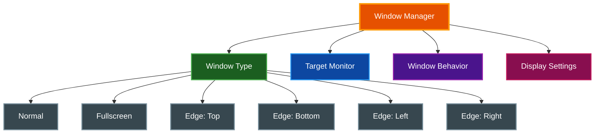

# Window Management

par-term provides extensive window management features including edge-anchored windows, multi-monitor support, and customizable behavior.

## Table of Contents
- [Overview](#overview)
- [Window Types](#window-types)
- [Multi-Monitor Support](#multi-monitor-support)
- [Window Behavior](#window-behavior)
- [Transparency](#transparency)
- [Fullscreen](#fullscreen)
- [Configuration](#configuration)
- [Related Documentation](#related-documentation)

## Overview

Window management features in par-term:



## Window Types

| Type | Description |
|------|-------------|
| **Normal** | Standard window (default) |
| **Fullscreen** | Start in fullscreen mode |
| **EdgeTop** | Anchored to top, spans full width |
| **EdgeBottom** | Anchored to bottom, spans full width |
| **EdgeLeft** | Anchored to left, spans full height |
| **EdgeRight** | Anchored to right, spans full height |

### Edge-Anchored Windows (Quake-Style)

Edge windows provide dropdown/sidebar terminal experiences:

```
┌────────────────────────────────────┐
│         EdgeTop Window             │  ← Spans full width
│         (dropdown style)           │
└────────────────────────────────────┘

┌─────────┬──────────────────────────┐
│ EdgeLeft│                          │
│ Window  │      Desktop Area        │  ← EdgeLeft spans full height
│ (sidebar│                          │
│  style) │                          │
└─────────┴──────────────────────────┘
```

**Use Cases:**
- **EdgeTop:** Quake-style dropdown terminal
- **EdgeBottom:** Status/log terminal
- **EdgeLeft/Right:** Sidebar terminals for monitoring

Configure in `config.yaml`:
```yaml
window_type: edge_top  # normal, fullscreen, edge_top, edge_bottom, edge_left, edge_right
```

## Multi-Monitor Support

### Target Monitor

Specify which monitor windows open on:

```yaml
target_monitor: 0      # Monitor index (0 = primary)
# or
target_monitor: null   # Auto (OS decides)
```

### Settings UI

The Window tab provides:
- **Auto** checkbox for automatic monitor selection
- Slider for monitor index (0-7)

### Monitor Detection

par-term uses the system's monitor list and falls back to the primary monitor if the specified index is out of bounds.

## Window Behavior

### Always On Top

Keep the window above other windows:
```yaml
window_always_on_top: true
```

### Window Decorations

Show or hide title bar and borders:
```yaml
window_decorations: true
```

### Lock Window Size

Prevent resizing:
```yaml
lock_window_size: true
```

### Show Window Number

Display window index in title bar (useful for multiple windows):
```yaml
show_window_number: true
```

Example title: `par-term [2]`

### Maximize Vertically

Use the View menu or keybinding to maximize height while keeping current width and X position.

## Transparency

### Window Opacity

```yaml
window_opacity: 0.9  # 0.1 (mostly transparent) to 1.0 (fully opaque)
```

### Selective Transparency

```yaml
# Only apply transparency to default background, not colored content
transparency_affects_only_default_background: true

# Keep text fully opaque regardless of window opacity
keep_text_opaque: true
```

### Window Blur (macOS)

```yaml
blur_enabled: true   # Enable background blur
blur_radius: 20      # Blur intensity (1-64)
```

## Fullscreen

### Toggle Fullscreen

Press `F11` or use the View menu.

### Start in Fullscreen

```yaml
window_type: fullscreen
```

### Borderless Fullscreen

Fullscreen mode uses borderless fullscreen on the current monitor.

## Configuration

### Complete Window Settings

```yaml
# Window type
window_type: normal  # normal, fullscreen, edge_top, edge_bottom, edge_left, edge_right

# Monitor selection
target_monitor: null  # null for auto, or monitor index (0-7)

# Window behavior
window_decorations: true
window_always_on_top: false
lock_window_size: false
show_window_number: false

# Display
window_opacity: 1.0
transparency_affects_only_default_background: true
keep_text_opaque: true
window_padding: 5.0  # Padding in pixels

# macOS blur
blur_enabled: false
blur_radius: 20

# Initial size
cols: 80
rows: 24
```

### Settings UI

The Window tab in Settings provides sections for:

**Display:**
- Window title
- Columns and rows
- Padding

**Transparency:**
- Opacity slider
- Selective transparency options
- Blur settings (macOS)

**Performance:**
- Max FPS
- VSync mode
- Power saving options

**Window Behavior:**
- Decorations toggle
- Always on top
- Lock size
- Show window number
- Window type dropdown
- Target monitor

## Related Documentation

- [README.md](../README.md) - Project overview
- [KEYBOARD_SHORTCUTS.md](KEYBOARD_SHORTCUTS.md) - Window keyboard shortcuts
