# Concurrency Guide

This document describes par-term's concurrency model: when to use each mutex type, how
the state hierarchy maps onto the threading model, and how to add new shared state
correctly.

For the low-level mutex API details and anti-patterns, see
[MUTEX_PATTERNS.md](MUTEX_PATTERNS.md).

## Table of Contents

- [Overview](#overview)
- [Threading Model](#threading-model)
- [State Hierarchy](#state-hierarchy)
- [Mutex Selection Rules](#mutex-selection-rules)
- [State Ownership by Layer](#state-ownership-by-layer)
- [Adding New Shared State](#adding-new-shared-state)
- [try_read/try_write Telemetry](#try_readtry_write-telemetry)
- [Related Documentation](#related-documentation)

## Overview

par-term runs two concurrent execution environments that share state:

| Environment | Driver | Mutex type |
|---|---|---|
| **Main thread** — OS event loop, rendering, UI | winit `EventLoop` | `parking_lot::Mutex` |
| **Tokio runtime** — PTY I/O, timers, clipboard sync | `Arc<tokio::runtime::Runtime>` | `tokio::sync::Mutex` |

The rule is simple: use `tokio::sync::Mutex` when a value is shared with any async task;
use `parking_lot::Mutex` when all callers are sync threads.

## Threading Model

```mermaid
graph TD
    subgraph "Main Thread"
        EventLoop[winit EventLoop]
        Render[GPU Renderer]
        Input[Input Handler]
        EguiUI[egui UI]
    end

    subgraph "Tokio Runtime Pool"
        PTYReader[PTY Reader Task]
        InputSender[Input Sender Task]
        ResizeHandler[Resize Handler Task]
        Timers[Cursor Blink / Bell Timers]
        ClipboardSync[Clipboard Sync Task]
        AgentTask[ACP Agent Task]
    end

    subgraph "Std Background Threads"
        SystemMonitor[System Monitor]
        GitCheck[Git Status Check]
        ShaderWatcher[Shader File Watcher]
        AudioBell[Audio Bell Player]
    end

    EventLoop --> Render
    EventLoop --> Input
    EventLoop --> EguiUI
    PTYReader -- "tokio::sync::RwLock" --> TerminalManager
    InputSender -- "tokio::sync::RwLock" --> TerminalManager
    EventLoop -- "try_read() / try_write() / blocking_write()" --> TerminalManager
    SystemMonitor -- "parking_lot::Mutex" --> SystemMonitorData
    EventLoop -- "parking_lot::Mutex" --> SystemMonitorData

    style EventLoop fill:#e65100,stroke:#ff9800,stroke-width:3px,color:#ffffff
    style PTYReader fill:#1b5e20,stroke:#4caf50,stroke-width:2px,color:#ffffff
    style InputSender fill:#1b5e20,stroke:#4caf50,stroke-width:2px,color:#ffffff
    style ResizeHandler fill:#1b5e20,stroke:#4caf50,stroke-width:2px,color:#ffffff
    style Timers fill:#1b5e20,stroke:#4caf50,stroke-width:2px,color:#ffffff
    style ClipboardSync fill:#1b5e20,stroke:#4caf50,stroke-width:2px,color:#ffffff
    style AgentTask fill:#4a148c,stroke:#9c27b0,stroke-width:2px,color:#ffffff
    style SystemMonitor fill:#37474f,stroke:#78909c,stroke-width:2px,color:#ffffff
    style GitCheck fill:#37474f,stroke:#78909c,stroke-width:2px,color:#ffffff
    style ShaderWatcher fill:#37474f,stroke:#78909c,stroke-width:2px,color:#ffffff
    style AudioBell fill:#37474f,stroke:#78909c,stroke-width:2px,color:#ffffff
    style Render fill:#0d47a1,stroke:#2196f3,stroke-width:2px,color:#ffffff
    style Input fill:#0d47a1,stroke:#2196f3,stroke-width:2px,color:#ffffff
    style EguiUI fill:#0d47a1,stroke:#2196f3,stroke-width:2px,color:#ffffff
```



## State Hierarchy

The per-window state follows a strict ownership hierarchy. Each layer is owned directly
(not behind a mutex) by its parent; only the leaf types that cross into async tasks carry
their own mutex.

```
WindowManager                   ← owns all WindowState instances
  └─ WindowState                ← per-window state (sync main thread only)
       ├─ TabManager            ← owns all Tab instances (sync only)
       │    └─ Tab              ← per-tab state
       │         ├─ terminal: Arc<tokio::sync::RwLock<TerminalManager>>
       │         │             ← shared with async PTY/input tasks; RwLock for concurrent reads. Most mutating methods (write, paste, mouse encoding) take &self — inner parking_lot::Mutex serializes PTY writes
       │         └─ PaneManager ← sync only, owns all Pane instances
       │              └─ Pane
       │                   └─ terminal: Arc<tokio::sync::RwLock<TerminalManager>>
       │                                ← shared with async PTY/input tasks
       └─ AgentState
            └─ agent: Option<Arc<tokio::sync::Mutex<Agent>>>
                      ← shared with async ACP prompt tasks
```

**Key rules from this hierarchy:**

1. `WindowManager`, `WindowState`, `TabManager`, and `PaneManager` are only ever accessed
   from the main thread's sync event loop. They carry no mutex.

2. `Tab.terminal` and `Pane.terminal` are `Arc<tokio::sync::RwLock<TerminalManager>>`
   because the PTY reader task and input sender task share the same `TerminalManager`.
   `RwLock` allows concurrent reads from multiple async tasks.

3. `AgentState.agent` is `tokio::sync::Mutex<Agent>` because ACP prompt processing runs
   in a spawned async task.

## Mutex Selection Rules

| Question | Answer |
|---|---|
| Is the value ever accessed from `runtime.spawn(async { ... })`? | Use `tokio::sync::Mutex` or `tokio::sync::RwLock` |
| Is the value held across an `.await` point? | Use `tokio::sync::Mutex` |
| Async shared with mostly reads? | Use `tokio::sync::RwLock` (allows concurrent readers) |
| All callers are sync threads or `std::thread::spawn`? | Use `parking_lot::Mutex` |
| High-frequency reads, infrequent writes, all sync? | Consider `parking_lot::RwLock` |

## State Ownership by Layer

### tokio::sync::Mutex / RwLock — async-shared state

| Location | Type | Reason |
|---|---|---|
| `Tab.terminal` | `Arc<tokio::sync::RwLock<TerminalManager>>` | PTY reader + input sender tasks; RwLock allows concurrent reads. Most mutating methods (`write`, `paste`, `encode_mouse_event`) take `&self` — inner `parking_lot::Mutex` serializes PTY writes, so use read locks even for these |
| `Pane.terminal` | `Arc<tokio::sync::RwLock<TerminalManager>>` | Same — each pane has its own PTY |
| `AgentState.agent` | `Option<Arc<tokio::sync::Mutex<Agent>>>` | ACP prompt tasks |

### parking_lot::Mutex / RwLock — sync-only shared state

| Location | Type | Reason |
|---|---|---|
| `SharedSessionLogger` (type alias) | `Arc<parking_lot::Mutex<Option<SessionLogger>>>` | Sync event loop + std output callback thread |
| `SystemMonitor.data` | `Arc<parking_lot::Mutex<SystemMonitorData>>` | Background std thread writes, render thread reads |
| `GitBranchPoller.status` | `Arc<parking_lot::Mutex<GitStatus>>` | Git-check std thread + render thread |
| `DebugLogger` (static) | `OnceLock<parking_lot::Mutex<DebugLogger>>` | Any-thread log writes |
| `AudioBell.sink` | `Option<Arc<parking_lot::Mutex<Player>>>` | Rodio std thread |
| `BadgeState.variables` | `Arc<parking_lot::RwLock<SessionVariables>>` | Frequent reads, infrequent writes, all sync |
| `ActiveUpload.error` | `Arc<parking_lot::Mutex<Option<String>>>` | Upload std thread writes, event loop reads |

## Adding New Shared State

When introducing a new value that must be shared across threads:

1. **Determine callers.** List every place that reads or writes the value and whether
   each caller is sync (main thread, std thread) or async (Tokio task).

2. **Select mutex type.** If any caller is async or the lock must be held across
   `.await`, use `tokio::sync::Mutex`. Otherwise use `parking_lot::Mutex`.

3. **Wrap in `Arc`.** Both mutex types should be wrapped in `Arc` for shared ownership:
   `Arc<tokio::sync::Mutex<T>>` or `Arc<parking_lot::Mutex<T>>`.

4. **Use the correct access pattern** from sync contexts:

```rust
// For tokio::sync::RwLock from the winit event loop:

// Non-blocking read (use for MOST operations, including write/paste/mouse encoding):
if let Ok(guard) = terminal.try_read() {
    guard.write(data);  // &self method — inner Mutex handles PTY serialization
} else {
    crate::debug::record_try_lock_failure("my_site");
}

// Non-blocking write (only for true &mut self methods like resize):
if let Ok(mut guard) = terminal.try_write() {
    guard.resize(cols, rows);  // &mut self method
} else {
    crate::debug::record_try_lock_failure("my_site_write");
}

// Blocking read (for user-initiated operations that call &self methods):
let guard = terminal.blocking_read();
guard.paste(text);  // &self method

// Blocking write (only for true &mut self operations):
let mut guard = terminal.blocking_write();
```

**Important**: `TerminalManager::write()`, `paste()`, `update_generation()`, and all mouse
encoding methods take `&self`. The inner `parking_lot::Mutex<PtySession>` serializes PTY
writes. Using `try_write()` / `write().await` for these operations is an anti-pattern that
causes lock contention (see v0.30.11 keyboard stall and click-drop fixes).

5. **Document the mutex choice** with an inline comment explaining which tasks share
   the value, following the pattern in `Tab` and `Pane`.

## try_read/try_write Telemetry

`try_read()` and `try_write()` misses are tracked globally via `crate::debug::record_try_lock_failure(site)`.
This call increments an atomic counter and emits a `CONCURRENCY` category debug log entry
at `DEBUG_LEVEL >= 3`. Periodic summaries appear in the `about_to_wait` handler.

A high miss rate at a specific site means an async task is holding the lock longer than
a single frame, which warrants investigation.

```rust
if let Ok(term) = tab.terminal.try_read() {
    // use term for reading
} else {
    crate::debug::record_try_lock_failure("resize_propagation");
}
```

See [LOGGING.md](../LOGGING.md) for how to enable `DEBUG_LEVEL` logging.

## Related Documentation

- [Mutex Patterns](MUTEX_PATTERNS.md) — full mutex API reference, access patterns, and anti-patterns
- [Architecture](ARCHITECTURE.md) — high-level component and threading model overview
- [Logging](../LOGGING.md) — enabling debug logging including CONCURRENCY category entries
