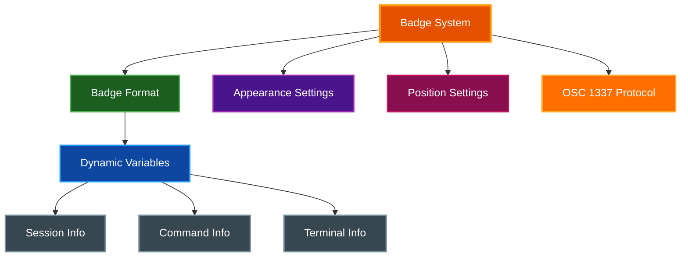
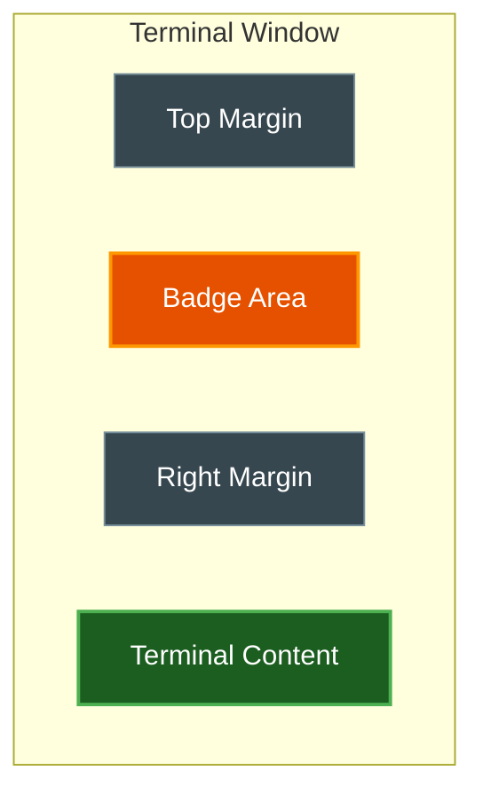

# Badges

par-term provides an iTerm2-style badge system for displaying dynamic session information as semi-transparent text overlays in the terminal corner.

## Table of Contents
- [Overview](#overview)
- [Enabling Badges](#enabling-badges)
- [Badge Format](#badge-format)
  - [Static Text](#static-text)
  - [Dynamic Variables](#dynamic-variables)
- [Appearance](#appearance)
- [Position](#position)
- [OSC 1337 Support](#osc-1337-support)
- [Configuration](#configuration)
- [Per-Profile Badge Overrides](#per-profile-badge-overrides)
- [Related Documentation](#related-documentation)

## Overview

Badges display contextual information about your terminal session without interfering with terminal content:



## Enabling Badges

**Method 1: Settings UI**

1. Press `F12` to open Settings
2. Navigate to the **Appearance** tab
3. Scroll to the **Badge** sections at the bottom
4. Enable "Enable badge"
5. Configure format, appearance, and position

**Method 2: Configuration File**

Add to `~/.config/par-term/config.yaml`:

```yaml
badge_enabled: true
badge_format: "\\(session.username)@\\(session.hostname)"
```

## Badge Format

### Static Text

Use any static text in the badge format:

```yaml
badge_format: "Production Server"
```

### Dynamic Variables

Insert dynamic values using the `\(session.*)` syntax:

| Variable | Description | Example Output |
|----------|-------------|----------------|
| `\(session.hostname)` | System hostname | `macbook-pro` |
| `\(session.username)` | Current username | `alice` |
| `\(session.path)` | Current working directory | `/Users/alice/project` |
| `\(session.job)` | Current foreground job | `vim` |
| `\(session.last_command)` | Last executed command | `git status` |
| `\(session.profile_name)` | Active profile name | `Development` |
| `\(session.tty)` | TTY device name | `/dev/ttys001` |
| `\(session.columns)` | Terminal width in columns | `120` |
| `\(session.rows)` | Terminal height in rows | `40` |
| `\(session.bell_count)` | Number of bells received | `3` |
| `\(session.selection)` | Currently selected text | `hello world` |
| `\(session.tmux_pane_title)` | tmux pane title (if connected) | `main:0` |
| `\(session.exit_code)` | Exit code of last command (via shell integration) | `0` |
| `\(session.current_command)` | Currently running command name (via shell integration) | `cargo build` |

> **📝 Note:** `session.exit_code` and `session.current_command` require shell integration (OSC 133) to be installed. See [Integrations](INTEGRATIONS.md) for setup instructions.

**Example Formats:**

```yaml
# User and host
badge_format: "\\(session.username)@\\(session.hostname)"

# Current directory
badge_format: "📁 \\(session.path)"

# Multiple lines
badge_format: "\\(session.hostname)\n\\(session.path)"

# With static text
badge_format: "🖥️ \\(session.columns)x\\(session.rows)"
```

## Appearance

Configure the visual style of badges:

| Setting | Description | Default |
|---------|-------------|---------|
| `badge_color` | RGB color array | `[255, 0, 0]` (red) |
| `badge_color_alpha` | Opacity (0.0-1.0) | `0.5` |
| `badge_font` | Font family | `Helvetica` |
| `badge_font_bold` | Use bold weight | `true` |

**Example Configuration:**

```yaml
badge_color: [100, 200, 255]  # Light blue
badge_color_alpha: 0.15        # 15% opacity
badge_font: "JetBrains Mono"
badge_font_bold: true
```

## Position

Control badge placement within the terminal:

| Setting | Description | Default |
|---------|-------------|---------|
| `badge_top_margin` | Distance from top in pixels | `0.0` |
| `badge_right_margin` | Distance from right in pixels | `16.0` |
| `badge_max_width` | Maximum width fraction | `0.5` |
| `badge_max_height` | Maximum height fraction | `0.2` |



**Example:**

```yaml
badge_top_margin: 10.0      # 10 pixels from top
badge_right_margin: 24.0    # 24 pixels from right
badge_max_width: 0.4        # Max 40% of terminal width
badge_max_height: 0.15      # Max 15% of terminal height
```

## OSC 1337 Support

par-term supports iTerm2's OSC 1337 escape sequences for programmatic badge and session management:

### SetBadgeFormat

Set the badge format from the command line:

```bash
# Set badge format from command line
printf "\033]1337;SetBadgeFormat=%s\007" "$(echo -n "My Badge" | base64)"
```

**Security:** Badge format changes via OSC 1337 are validated to prevent injection attacks. Only safe variable references are allowed.

### RemoteHost

par-term supports the OSC 1337 RemoteHost sequence for syncing remote session information:

```bash
# Set remote host information (typically done by shell integration scripts)
printf "\033]1337;RemoteHost=%s@%s\007" "$USER" "$HOSTNAME"
```

When received, the hostname and username are synced to the `session.hostname` and `session.username` badge variables. This works alongside OSC 7 `file://` URLs for CWD tracking — both sequence types update the same session variables.

**Use Cases:**
- SSH sessions that set RemoteHost on connect
- Shell integration scripts that emit RemoteHost on prompt
- Automatic profile switching based on detected hostname

## Configuration

Complete configuration reference:

```yaml
# Enable/disable badges
badge_enabled: true

# Badge format with variables
badge_format: "\\(session.username)@\\(session.hostname)"

# Appearance
badge_color: [255, 100, 100]
badge_color_alpha: 0.2
badge_font: "SF Mono"
badge_font_bold: true

# Position (margins in pixels, max dimensions as fractions)
badge_top_margin: 0.0
badge_right_margin: 16.0
badge_max_width: 0.5
badge_max_height: 0.2
```

## Per-Profile Badge Overrides

Profiles can override global badge settings for visual differentiation per environment.

### Override Options

All global badge settings can be overridden per profile:

| Profile Setting | Overrides |
|-----------------|-----------|
| `badge_text` | `badge_format` |
| `badge_color` | `badge_color` |
| `badge_color_alpha` | `badge_color_alpha` |
| `badge_font` | `badge_font` |
| `badge_font_bold` | `badge_font_bold` |
| `badge_top_margin` | `badge_top_margin` |
| `badge_right_margin` | `badge_right_margin` |
| `badge_max_width` | `badge_max_width` |
| `badge_max_height` | `badge_max_height` |

### Example Use Cases

**Environment indicators:**
- Production: Red badge with "PROD" text
- Development: Green badge with "DEV" text
- Staging: Yellow badge with "STAGING" text

**Server identification:**
- Different badge colors per server group
- Hostname in badge text with profile-specific formatting

### Settings UI

1. Open profile editor (double-click profile or edit button)
2. Expand "Badge Appearance" section
3. Enable individual overrides with checkboxes
4. Configure values (color picker, font input, sliders)

See [Profiles documentation](PROFILES.md#per-profile-badge-configuration) for detailed examples.

## Related Documentation

- [Profiles](PROFILES.md) - Terminal profiles with per-profile badge configuration
- [Window Management](WINDOW_MANAGEMENT.md) - Window display options
- [Keyboard Shortcuts](../guides/KEYBOARD_SHORTCUTS.md) - Access Settings UI with F12
